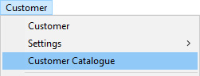
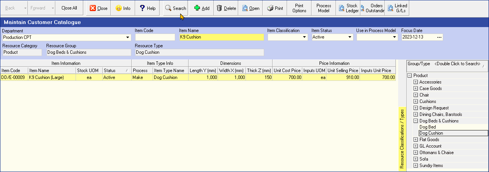
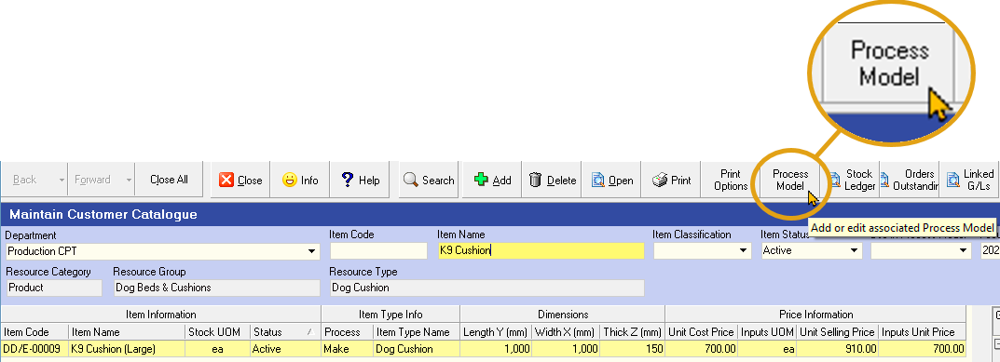
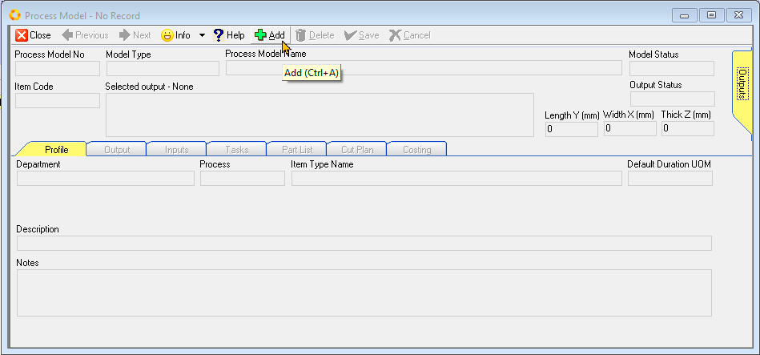
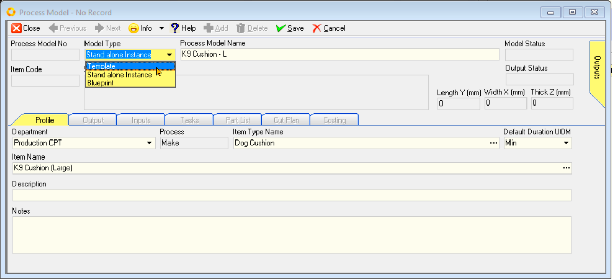
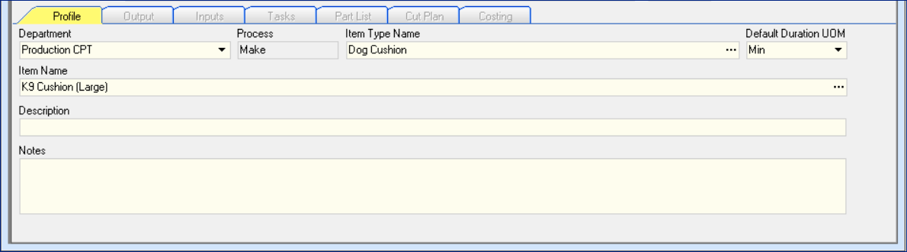
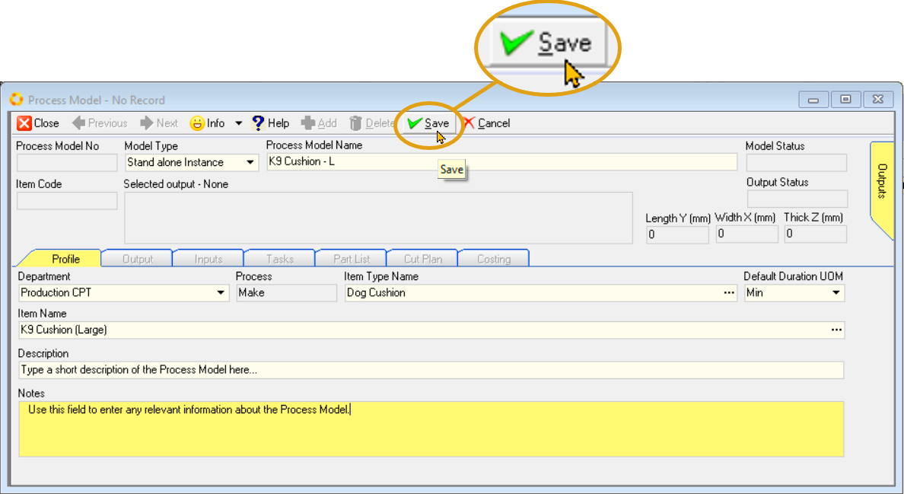
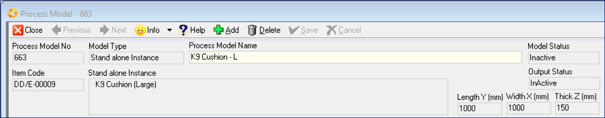
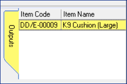

## Procedure Guideline  
___

### Navigate to Customer Catalogue  

1. Click the **Customer** option on the Main Menu.  

2. Then click **Customer Catalogue** in the drop-down menu.  
	
  

3. The system will open a screen titled **"Maintain Customer Catalogue".**  
This screen lists all of the Products that have been captured in the system.  
_For more detailed information on using this function, view the procedure titled **[Product Catalogue (Product Costing Process)](https://sense-i.co/docs/PCPCAT)**_ 
	
  

### Product Search  

4. To search for the Product for which you want to create a Process Model, **enter information** to search for the specific product in the **Search Criteria Panel**.  

5. Click the **Search** button on the Form Bar.  

6. The system will display all Products that match the Search Criteria you have entered in the Product Catalogue.  

7. Click on the row that displays the name of the Product for which you wish to create a Process Model.  

### Create Process Model  

8. Click the Process Model button on the Action Bar.  	

  

9. If no Process Model has been previously defined for the selected Product, the system will display a screen titled **Process Model - No Record**.  

  

:::note  
The Process Model screen consists of a form header, with the **Outputs** side-TAB, and set of **8 tabbed worksheets**.  

All data fields (and TABs) on this form are greyed out, and will only become accessible once a new process Model is created.  
:::  

10. Click the **Add** button on the Action bar to create a new Process Model.  
The data fields **Model Type** and **Process Model Name** now become accessible.

  

11. Click the drop-down arrow in the field under **Model Type** to selct the desired option.  

12. You need to define the Model Type for the Process Model by selecting one of the options:
    -   Template
    -   Stand alone Instance  
    -   Blueprint  

:::Important Model Type Options explained  
Use the **Template** option when the Process Model...  

The **Stand alone Instance** Model Type is used when...  

Choose the **Blueprint** option when...  
:::  

13. Enter the Process Model Name in the data field under **Process Model Name**.    

### Profile Information  

14. The **Profile** TAB worksheet displays general information about a Process Model such as its Name and the Department that is responsible for running the Process.  

  

Whenever you enter the Process Model module from the Product Catalogue, the system will automatically display the **Department** managing the process, **Item Type Name**,  assign the **Default Duration UOM _(Unit Of Measure)_**, and display the product **Item Name**.  

15. If you need to enter a description or notes, you can type these in directly in the **Description** and **Notes** fields.  

16. Once you have completed the **Profile** section, click the **Save** button on the Action bar.  

  

:::note  
Once saved, a sequential **Process Model No** is generated, the Product **Item Code**, **Model Status**, **Output Status** and Product **Dimensions** are displayed,  

  

Click the **Outputs** side-TAB to reveal the Product **Item Code** & **Item Name**.

  

The other TABs will be accessible, enabling you to define specific information needed to calculate the cost of the Product and to plan Labour and Materials requirements once Orders are received from Customers.  

  

:::  

17.  You will then need to enter information about the Materials Required on the **Inputs** Screen, the Tasks that need to be performed when running the Process on the **Tasks** Screen and the Parts which make up the Product in the **Part List** Screen.  

Please refer to the other documents in the Product Costing Process section for information on how to enter this information.  

**This is the end of this procedure.**
