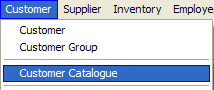
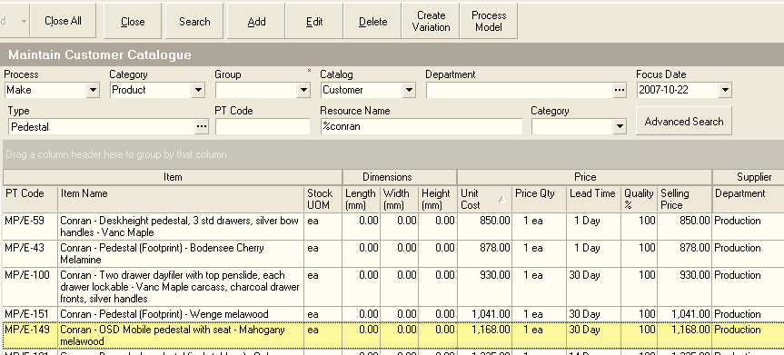
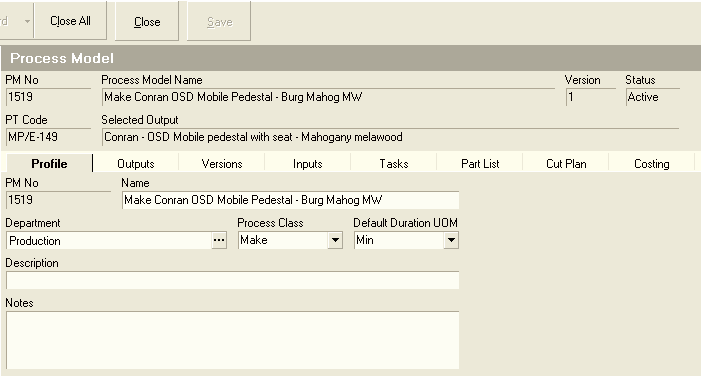

## Procedure Guideline  
___

1. Click on the Customer function on the Main Menu.  

2. Then click the Customer Catalogue function from the drop-down list.  
	
  

3. The system will open a screen titled "Maintain Customer Catalogue." This screen lists all of the Products that have been captured in the system. *For more detailed information on using this function, view the procedure titled "PRC-008 -- View Product Catalogue."*  
	
  

4. Search for the Product for which you want to create a Process Model. Enter information to search for the specific product in the Search Criteria Panel.  

5. Click the Search button on the Form Bar.  

6. The system will display all Products that match the Search Criteria you have entered in the Product Catalogue.  

7. Click on the row that displays the name of the Product for which you wish to create a Process Model.  

8. Then click the Process Model button on the Form Bar.  

9. If no Process Model has been previously defined for the selected Product, the system will display a screen titled Process Model.  
	
  

10. You will immediately notice that the Process Model Module consists of a set of 8 tabbed worksheets. Each of these worksheets enable you to define specific information needed to calculate the cost of the Product and to plan Labour and Materials Requirements once Orders are received from Customers.  

11. The Profile Worksheet enables you to enter general information about a Process Module such as its Name and the Department that is responsible for running the Process. Whenever you enter the Process Model Module from the Product Catalogue, the system will automatically create a Name, assign a Department and complete the other fields on the screen.  

12. If you need to enter a description or notes, you can type these in directly in the Description and Notes fields.  

13. Once you have completed the Profile Screen for a Process Model you will then need to enter information about the Materials Required on the Inputs Screen, the Tasks that need to be performed when running the Process on the Tasks Screen and the Parts which make up the Product in the Part List Screen.  

Please refer to the other Standard Operating Procedures in the Process Model Module documentation for information on how to enter this information.  

**This is the end of this procedure.**
