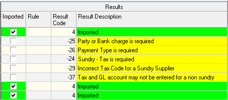

## Introduction
___

Once Bank Statements have been downloaded in Excel format, and preprocessing has been completed, the next steps include **Loading** and **Importing** the bank transactions into the SEMS application.  

Once the bank transactions have been loaded, the SEMS application enables you to assign payments, credits and debits, to the relevant parties.  This, in turn, will make it possible to generate accurate financial reports using the functions and features in the SEMS application.  

## Load Bank Statement  

### Navigate to IMPORT Screen  

The first step in this guideline is to navigate to the **Import Bank Transactions** utility.  

  

1.  Click **Utilities** in the Main Navigation Menu.  

2.  Click **Import Bank Transactions** in the drop-down menu.  

The system will display the **Import** screen.  

  

### Import Search  

To search for Bank Transactions previously loaded / imported:  

1.  Type in / select options in any of the search criteria fields in the search panel, then 

2.  Click the **Search** button on the Action bar.  

The Import screen will list the relevant records of Bank Transaction records that match the search criteria entered.  

To view the details of a spesific record,

3.  Click on the record row, then  

4.  Click the **Open** button in the Action bar.  

The record details will be displayed in the **Import - ###** screen.  

  

5.  Click on the **TABs**:
-   **Profile**  
-   **Column Mapping**  
-   **Imported Data**  
to view the detail information pages.  

6.  Click the **Close** button to return to the Import List screen.  

### Add New Import  

1.  Click the **Add** button on the **Import** list screen.  

The **Add New Import** screen is displayed. 

  

2.  Type in a descriptive reference in the **Import Reference** field.  

3.  Click on the three-dot button in the **Company Account** field.  

The **Company Bank Account** screen will be displayed, listing the bank accounts.  

  

4.  Click on the appropriate bank account record row, then  

5.  Click the **Select** button on the form Action bar.  

#### Profile TAB  

  

6.  Ensure the **Heading Row Number** and **Data Row Number** fields are accurate.  

:::important  
The **Heading Row Number** and **Data Row Number** information MUST correctly correspond to those on the Excel file to be imported.  
:::  

7.  Click on the three-dot button in the **Import File** field.  

8.  In the File Manager pop-up window - navigate to, Select and Open the relevant Excel file.  

9.  Click the **Save** button on the form Action bar.  

:::note  
The **Column Mapping** and **Imported Data** TABs are now accessible.  
:::  

#### Column Mapping TAB  

10. Click the **Column Mapping** TAB to **view** the default Column Mapping **Import Information** details.  

  

:::important  
The **Import Heading Name** should directly correspond with the heading information row on the **Template** sheet of the Excel file.  
:::  

#### Imported Data TAB  

11. Click the **Open File** button on the form Action bar.  

  

The Information dialogue confirms the number of rows successfully pre-loaded.  

  

12. Click the **OK** button to continue.  

13. Click the **Upload** button on the form Action bar.  

  

The information is now Loaded in the database.  The **Import Status** is changed from **Captured** to **Loaded**.  

  

##  Assign Transaction Attributes  

Once the bank transactions have been loaded, the next steps include:  
-   Designate **Payment Type** for each transaction  
-   Allot Transactions (credits and debits), to the relevant **Party**  
-   Specify those transactions that are **Bank Charges**  
-   **Link General Ledger** account to each transaction  
-   **Link Tax** type to each transaction  

### Payment Type  

Ensure you are on the **Imported Data** TAB of the Import-### list screen.  

1.  Click on the record row you you would like to assign a Payment Type to.  

2.  Click the **Payment Type** button in the form Action bar.  

  

3.  Select the relevant option from the drop-down list.  

  

An Information Dialogue window is displayed, confirming the transaction has been updated.  

4.  Click the **OK** button.  

:::tip  
Select multiple record rows, **_[CTRL] click_**, to assign the same payment type to the applicable transactions.  

  

:::  

Repeat the steps above to assign Payment Type for all relevant transactions.  

  

### Assign Party  

1.  Click on the record row you you would like to assign a Party to.  

2.  Click the **Party** button in the form Action bar.  

  

3.  Select the relevant option from the drop-down list.  

  

An Information Dialogue window is displayed, confirming the transaction has been updated.  

4.  Click the **OK** button.  

:::tip  
Select multiple record rows, **_[CTRL] click_**, to assign the same party to the applicable transactions.  

  
:::  

Repeat the steps above to assign Parties for all relevant transactions.  

### Bank Charges  

1.  Identify and click on the record row that needs to be allocated as a Bank Charge.  

2.  Click the **Bank Charge** button in the form Action bar.  

  

The Bank Charge List screen is displayed.  

  

3.  Click on the relevant record row in the list, then  

4.  Click the **Select** button in the form Action bar.  

An Information Dialogue window is displayed, confirming the transaction has been updated.  

5.  Click the **OK** button.  

6.  Click the **Close** button to close the Bank Charge List screen.  

:::tip  
Select multiple record rows, **_[CTRL] click_**, to allocate Bank Charges to the applicable transactions.  

  
:::  

Repeat the steps above to allocate the relevant records as Bank Charges.  

### Link General Ledger  

1.  Click on the record row you would like to link to a General Ledger account.  

2.  Click the **Link GL** button in the form Action bar.  

  

The **Select** _(GL)_ **Account** list screen is displayed.  

  

:::important  
The **Select Account** screen may well list an extensive number of General Ledger accounts.  

3.  Use the fields in the Search Panel and/or Column Heading filter options to narrow down the list accordingly.  

  
:::  

4.  Click on the relevant record row in the list, then  

5.  Click the **Select** button in the form Action bar.  

An Information Dialogue window is displayed, confirming the transaction has been updated.  

6.  Click the **OK** button.  

7.  Click the **Close** button to close the Select Account list screen.  

:::tip  
Select multiple record rows, **_[CTRL] click_**, to link General Ledger accounts to the applicable transactions.  

  
:::  

### Link Tax  

1.  Click on the record row that you want to link Tax type to.  

2.  Click the **Link Tax** button in the form Action bar.  

  

The Tax List screen is displayed.  

  

3.  Click on the relevant record row in the list, then  

4.  Click the **Select** button in the form Action bar.  

An Information Dialogue window is displayed, confirming the transaction has been updated.  

5.  Click the **OK** button.  

6.  Click the **Close** button to close the Tax List screen.  

:::tip  
Select multiple record rows, **_[CTRL] click_**, to link Tax to the applicable transactions.  

  
:::  

Repeat the steps above to link Tax to all the relevant records.  

###  Check Transaction, GL and Tax Information  

Once the above attributes have been assigned to all bank transactions, you can check the Transaction Information, General Ledger Information & Tax Information for accuracy and completeness.  

Drag the slider bar(s) to view all the columns and record rows under **Transaction Information**, **Tax Information** & **GL Information**.  

  

:::important  
If you come across a transaction that is incorrectly assigned, use the **Clear** function to remove the attribute(s).  

To do this:
1.  Click the **Clear** button on the form Action bar, then  

  

2.  Click on the relevant option in the drop-down menu.  

3.  Rectify and/or assign new attributes to individual transactions as neccessary.  
:::  

## Import Bank Transactions to Database  

Once all the attributes have been assigned to the bank transactions, the next step is to **Import** the transactions to the database.  

1.  Click the **Import** button in the form Action bar. 

  

The <u>updated</u> **Import-###** screen is displayed.  

:::note  
The Import Status changes from Loaded to **Imported**.  

The Imported column (under the **Results** information band) displays check-boxes for each transaction that was successfully imported, as does the **Results Description** column.  Transaction records that have been successfully imported are colour-coded green.  
:::  

  

:::important  
Transactions that have not been successfully imported are colour-coded yellow.  

The **Results Description** column displays the reason why the transaction could not be imported.  
:::  

To rectify the import errors:

2.  Click on the transaction record row, then  

3.  Assign the correct transaction attribute, using the Result Description information as a guide.  

Repeat the steps above for each transaction as required.  

Once all transaction attributes have been assigned / rectified;

4.  Click the **Import** button on the form Action bar.  

The <u>updated</u> **Import-###** screen is displayed.  

  

