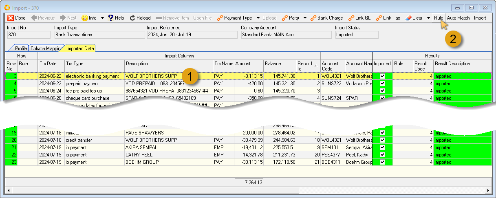
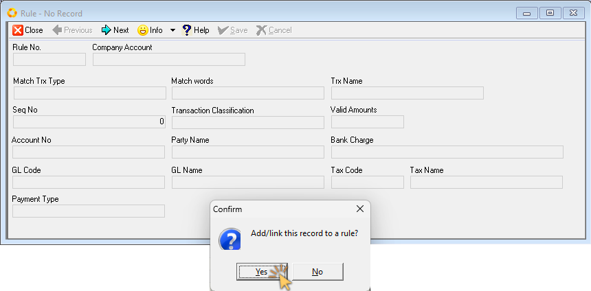
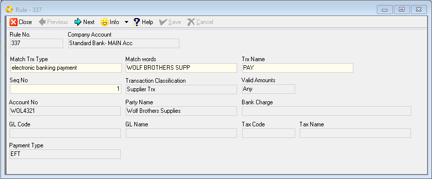
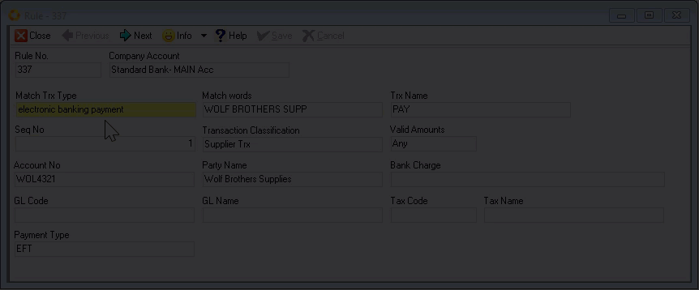
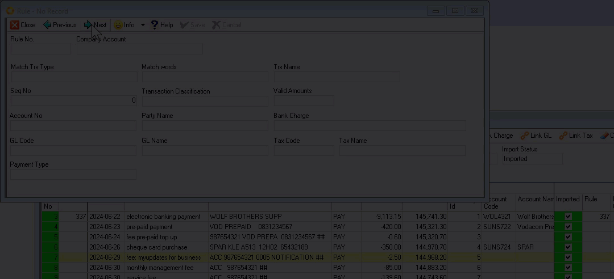
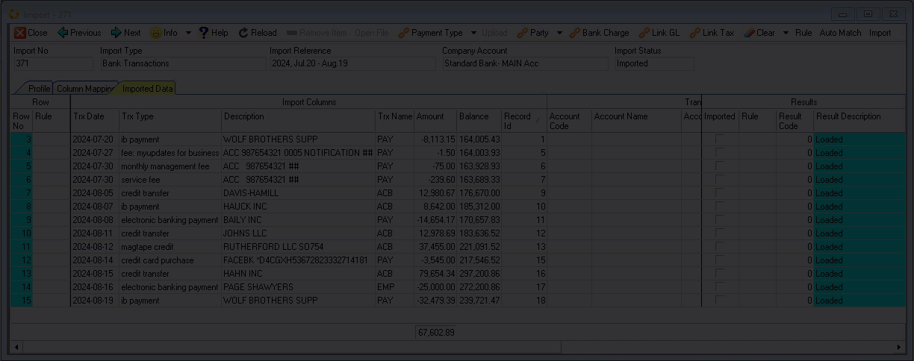
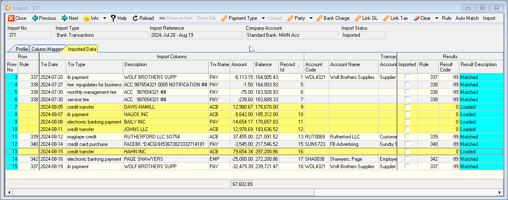
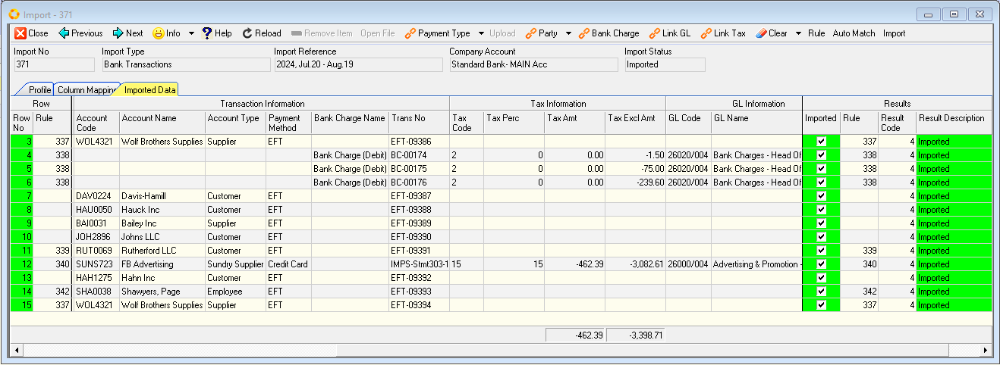

## Introduction
___

The SEMS software streamlines data extraction and data processing for businesses by handling repetitive manual tasks.  

With the **Rules** feature, you can create **custom rules** to automate the process of transaction classification.  

Once the rule has been defined using unique criteria, subsequent / recurring transactions will automatically be classified, and transaction attributes assigned, when using the **Auto Match** function.  

## Define Bank Transaction Rule  

1.  Click on an **Imported** transaction record row for which you want to define a Rule.  

2.  Click the **Rule** button on the form Action bar.

  

The **Rule - No Record** screen is displayed, with a Confirmation dialogue window - **Add/Link this record to a rule?**.  

  

3.  Click the **Yes** option.  

The **Rule - ###** screen is automatically updated with transaction attributes displayed in the various fields.  

  

4.  Identify which fields need to be **Matched** in subsequent bank transaction statements.  

5.  Edit the **Match** fields as neccessary.  

  

:::tip  
In this specific example, we can <u>replace</u> the information in the **Match Trx Type** and **Trx Name** fields, with the **wildcard** symbol **"%"**, as these may change in future transactions.   

In this example, we would only use the most important and unique words to match the supplier name in the **Match words** field.  

It is recommended practice to to insert the **"%"** symbol before and after the specific words you want to match.  The **"%" _(wildcard)_** symbol will ensure that any other words/characters are included when running a subsequent match.  
:::  

6.  Click the **Save** button on the form Action bar.  

Repeat the steps above for all transactions that require Rules.  

  

:::note  
In the example above, we specified the word **fee** in the **Match Trx Type** field, together with the Account number, **987654321** in the **Match words** field.  

This rule will now be applied to all subsequent transactions that match the above criteria when the **Auto Match** function is used.  
:::  

7.  Click the **Close** button on the form Action bar.  

Repeat the steps above for every transaction that you regard to be recurring transactions in subsequent bank statements.  

## Auto Match transactions  

1.  **Load** a new batch of bank transactions as decribed in the **["Add New Import"](https://sense-i.co/docs/BNKTRNSIMPRT04#add-new-import)** section of the **["Load & Import Bank Transactions"](https://sense-i.co/docs/BNKTRNSIMPRT04)** document.  

2.  Click the **Auto Match** button on the form Action bar.  

  

An Information dialogue window displays the number of records matched.  

3.  Click the **OK** button to close the Information dialogue box.  

All transactions that had **Rules** defined previously will automatically be matched & updated with the relevant transaction attributes.  

4.  Drag the slider bar(s) to view all the columns and record rows under **Transaction Information**, **Tax Information** & **GL Information**.  

  

5.  Assign attributes to those transactions that were not matched - refer to the section titled **["Assign Transaction Attributes"](https://sense-i.co/docs/BNKTRNSIMPRT04#assign-transaction-attributes)** in the **["Load & Import Bank Transactions"](https://sense-i.co/docs/BNKTRNSIMPRT04)** document.  

  

6.  Once the relevant attributes have been assigned, click the **Import** button on the form Action bar.  

  

7.  You can now choose to **define, or edit existing Rules** for relevant transactions/parties as necessary. In this regard, repeat the steps in the **["Define Bank Transaction Rule"](https://sense-i.co/docs/BNKTRNSIMPRT05#define-bank-transaction-rule)** section above.  
_

**This is the end of the SEMS Bank Transactions procedure.**  
