## Introduction
___

The purpose of this procedure is to reconcile all financial transactions generated in SEMS with those on the related bank statements.  

In this guideline we will demonstrate the steps needed to import Bank Statements into the SEMS application.

:::important  
It is recommended that this procedure be executed on a regular basis to ensure records are kept up to date.  

Bank reconciliation is crucial for boosting business financial accuracy. By regularly reconciling your bank statements with your SEMS accounting records, you can detect errors, identify fraudulent activities, monitor cash flow, and ensure accurate financial reporting.  
:::  

Once the bank transactions have been imported, the SEMS application enables you to assign payments, credits and debits, to the relevant parties.  This, in turn, will make it possible to generate accurate financial reports using the functions and features in the SEMS application.  

The SEMS software streamlines data extraction and data processing for businesses by handling repetitive manual tasks.  

## Covert Bank Statement to Excel format  

:::tip  
Most major Financial Institutions offer you the option to download bank statements in Excel format from their respective online platforms.  

This is the **recommended practice**, and would negate the need to convert bank statements from PDF to Excel format.  

If this option is used, skip to the section titled **["Excel Bank Statement Preprocessing"](https://sense-i.co/docs/BNKTRNSIMPRT#excel-bank-statement-preprocessing)**.  
:::  

Typically your company receives periodic bank statements in .PDF format.  

The first step in the Import Bank Transactions procedure, is to convert bank statements to Excel format.  

Converting your bank statements to Excel format will allow you to sort and filter the data so that the information can be imported into the SEMS application.  

Converting a PDF bank statement into an Excel file can be accomplished using several methods. The approach you choose depends on the complexity and format of your bank statement. Here are three common methods:

### 1. Manual Copy-Paste _(for Simple PDFs)_:

- Open the PDF bank statement using a PDF viewer like Adobe Acrobat Reader or a web browser.  
- Select the table or text in the PDF that you want to convert.  
- Right-click and choose "Copy" or press Ctrl+C (Windows).  
- Open Microsoft Excel.  
- Create a new worksheet.  
- Click on a cell where you want to paste the data.  
- Right-click and choose "Paste" or press Ctrl+V.  
- The data should now be in your Excel sheet.  

:::important  
You will need to adjust formatting as needed.  

Refer to the section **["Excel Bank Statement Preprocessing"](https://sense-i.co/docs/BNKTRNSIMPRT#excel-bank-statement-preprocessing)**.  
:::  

### 2. PDF to Excel Converter Software:

There are specialized PDF to Excel conversion tools that can automate the process. Some popular ones include **Adobe Acrobat** _(Paid)_, **Nitro Pro** (Paid), and online services like **Smallpdf**, **ILovePDF**, or **PDF2Go**.  

Here's how to use one of these tools:  
- Install or access the PDF to Excel conversion software or website.  
- Upload your PDF bank statement.  
- Select the conversion format (Excel).  
- Start the conversion process.  
- Once the conversion is complete, download the Excel file.  

### 3. Adobe Acrobat (Text Recognition):  

If your bank statement is a scanned image or has non-selectable text, **Adobe Acrobat Pro** provides OCR _(Optical Character Recognition)_ functionality to recognize text and convert it to Excel.  

Here's how:  
- Open the PDF in **Adobe Acrobat Pro** _(requires a subscription or trial)_.  
- Go to "File" > "Save As" > "Spreadsheet" > "Microsoft Excel Workbook".  
- Follow the prompts to adjust settings and save the converted file.  

Please note that the success of PDF to Excel conversion depends on the quality of the PDF, the accuracy of OCR, and the formatting of the original PDF document.  

:::important  
Regardless of the method used to convert the PDF to excel format, you will need to clean up and format the data in the resulting Excel after conversion.  

This is described in the following section.  
:::  

## Excel Bank Statement Preprocessing  

Once the Bank Statement has been downloaded as an Excel file directly from your Financial Institution, OR coverted to Excel format from PDF, some preliminary preparation of the information is required before the bank transactions can be imported into SEMS.  

This includes moving the information from one place to another, fixing formats, truncating extraneous spaces, creating new metrics, recoding missing variables etc.  

### Copy Template Sheet to Excel Bank Statement  

1.  Open the **Excel Bank Statement spreadsheet**, then  

2.  **Download** the relevant **SEMS Bank Statement Import Template** spreadsheet.  

:::important Download Links  
[Download Standard Bank Template](https://elfworks.co.za/docs/STB-Import-Template.xlsx "download")  

[Download FNB Template](https://elfworks.co.za/docs/FNB-Import-Template.xlsx "download")  

Request a relevant **Bank Statement Import Template** spreadsheet from the **Sense-i Team** by email.  
<info@sense-i.co>  
:::  

:::note  
In this example, we will be using the **Standard Bank Import Template**.  
:::  

2.  **Open** the **SEMS Bank Statement Import Template** spreadsheet.  

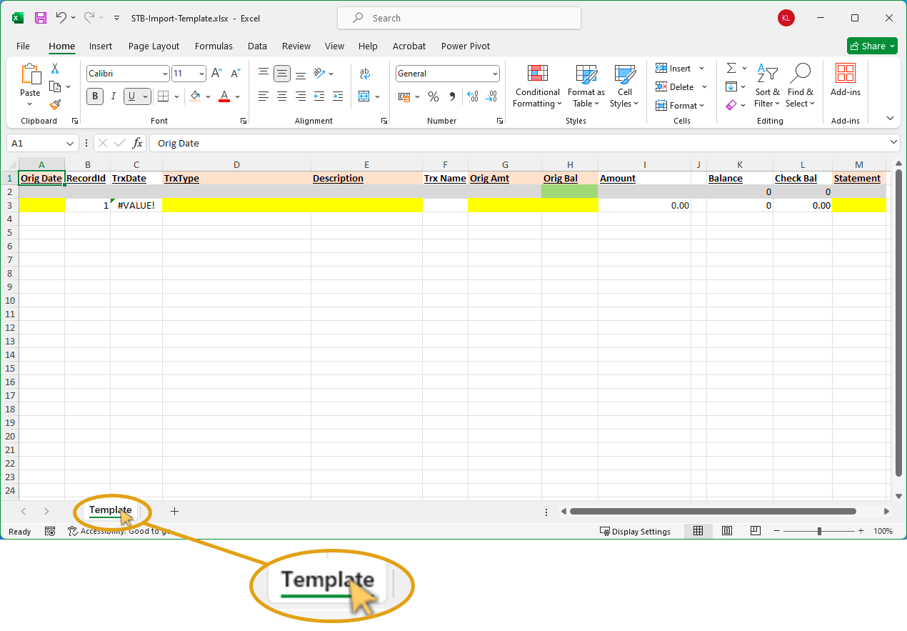  

3.  Right-click on the bottom TAB named **Template**.  

4.  Click on **Move or Copy...** in the pop-up menu.  

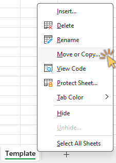  

The **Move or Copy** dialogue is displayed.  

5.  Click the drop-down arrow in the **To book:** field, then  

6.  Click on the Excel Bank Statement as opened in step 1 above.  

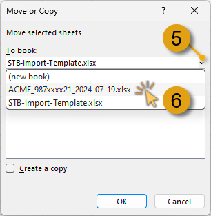  

7.  In the **Before sheet:** list, click on the **first item** in the list.  

8.  Click on the **Create a copy** check-box, then  

9.  Click on the **OK** button.  

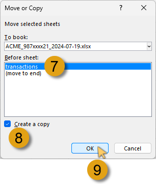  

10. **Close** the **SEMS Bank Statement Import Template** spreadsheet.  

11. **Save** the **Excel Bank Statement** (with the **Template** and **transactions** TABs) as a new Excel file.  

###  Identify Essential Data  

In this section we will be working in the newly saved **Excel Bank Statement** spreadsheet.  

If you have followed the steps above, the **Excel Bank Statement** spreadsheet should resemble the following:  

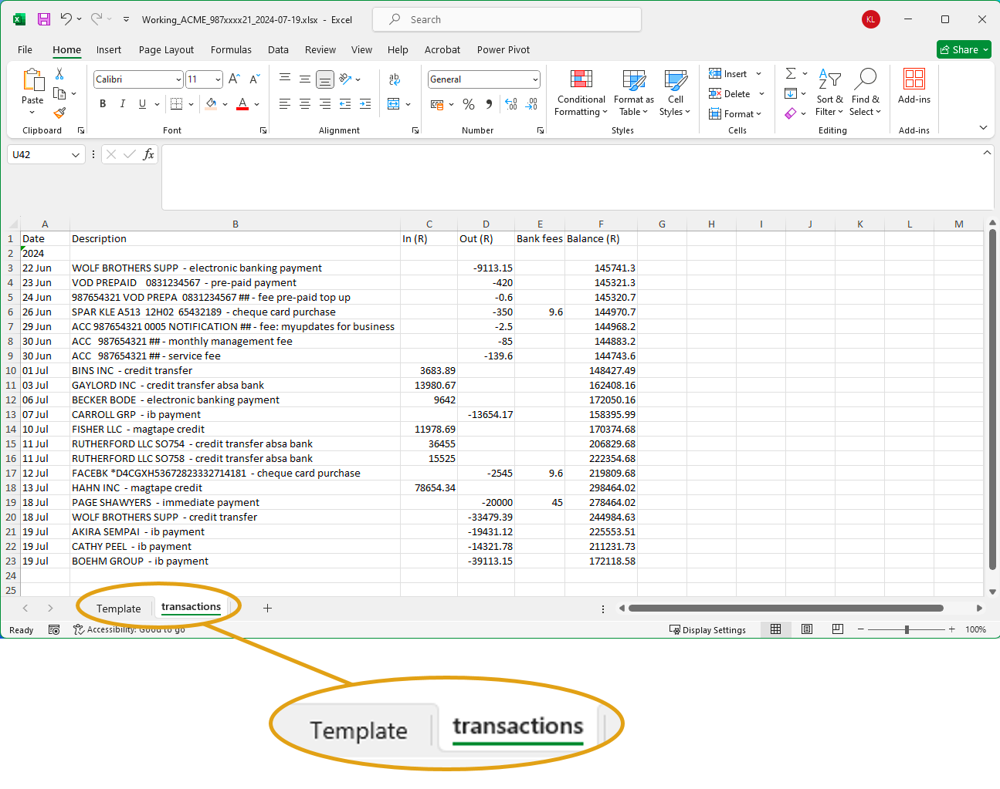  

1.  Click on the **transactions** TAB to display the Bank Transactions table.  

:::important  
The Bank Transaction table TAB may well be named differently, depending on the download source.  
:::

We will now explain and demonstrate how to identify and copy the **essential data** from the bank statement transaction table to the **SEMS Bank Statement Import Template** sheet.  

2.  Identify the essential data in the sheet.  

:::important  
The **essential data** is the **Transactions Table(s)** with the **column headings** and **associated transaction record rows**.  

The column headings may differ depending on the Financial Institution / Bank.  

This is an example of the **First National Bank transaction column headings**:  

| Date          |      Description      |   Amount |   Balance |   Accrued Bank Charges |
| ------------- | :-------------------: | -------: | --------: | ---------------------: |  

While this is an example of the **Standard Bank transaction column headings**:  

| Date   | Description  | In (R) | Out (R) | Bank Fees | Balance |
| :----- | :----------- | :----- | :------ | --------: | ------: | 

While the specific column headings may differ from bank to bank, they are essentially similar, e.g.  
-   Date
-   Description  
-   Amount = Credits / Debits  
-   Balance  
-   Accrued Bank Charges = Bank Fees  
:::  

### Copy & Paste Date / Update Record ID Rows

1.  In the **"transactions"** sheet, select and copy ALL the records in the **Date** column.  

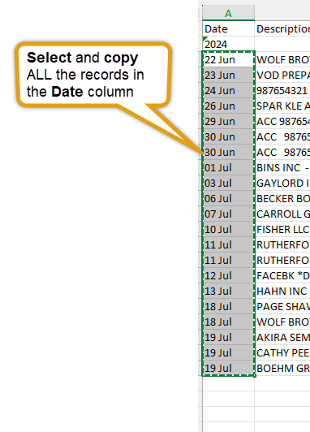  

2.  Click on the **Template** TAB, then  

3.  Right-click on the Yellow highlighted cell under the **Orig. Date** column, and click **Paste** / **[CTRL] V**.  

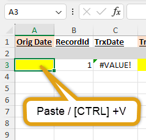  

4.  Select the relevant cells under the **RecordID** column, starting with the cell containing the number **"1"**.  

5.  Click the **Fill** button in the **Editing** section of the Ribbon.  

6.  Click the **Series...** option.  

7.  In the **Series** dialogue window, ensure the following options are selected:
- Series in: **Columns**  
- Type: **Linear**  
- Step Value: **1**  

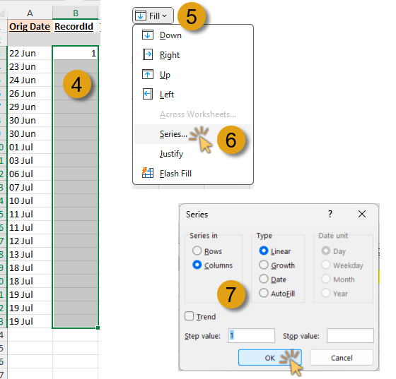  

8.  Click the **OK** button.  

The **RecordID** column is updated with sequential record numbers.  

### Convert Origin Date to Correct Format  

The next step is to update the **TrxDate** column in the **Template** sheet with the formula, **=DATEVALUE(A#)** to convert the Orig Date to the correct format.  

:::note  
The first record under the **TrxDate** is displayed using the correct date format.  
::: 

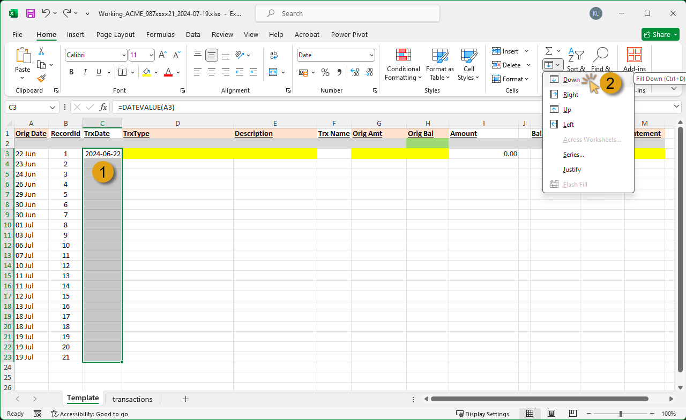  

1. Select the relevant cells under the **TrxDate** column, starting with the first record, then  

2. Use the **Fill Down** / **[CTRL] D** function.  

The **TrxDate** column is updated with the formula, displaying the correct date format.  

### Split Transaction Type & Description  

The next steps entail splitting the **Description** column in the **transactions** TAB into 2 separate columns.  

1. Click on the **"transactions"** TAB.  

2. Insert a new column to the right of the **Description** column.  

3. Give the new column a heading name in the header row... in this instance we will use **Transaction Type**.    

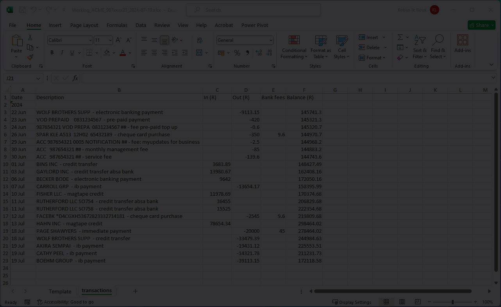  

4. Select the records under the **Description** column.  

5. Replace all characters where the split is required with a unique character - in this example we will replace the **" - "** (space dash space) characters with the **"|"** (vertical slash) character.  

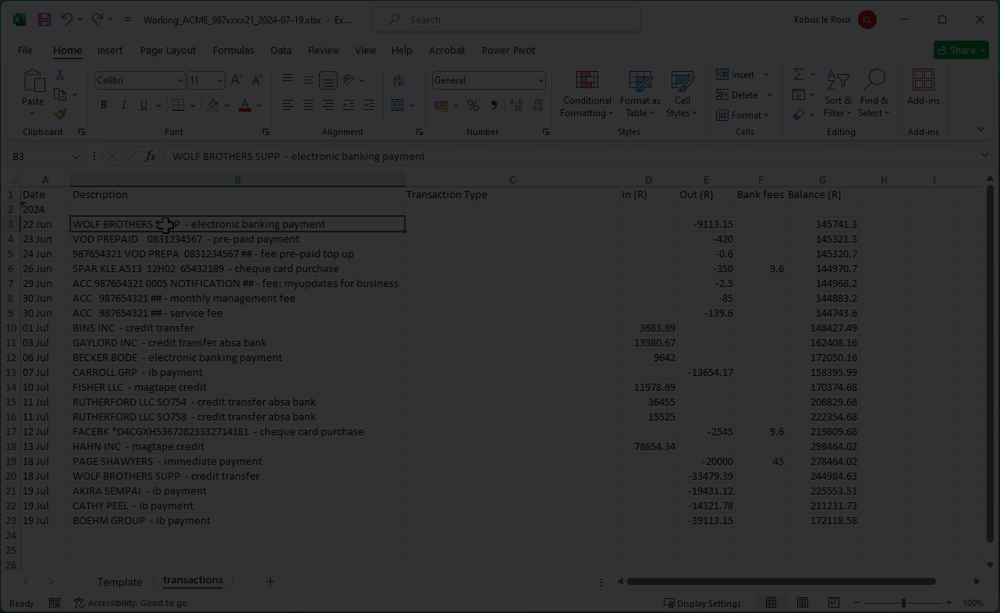  

:::tip  
If all the records under the Description column have an identical pattern, you can select all cells and replace the relevant characters with a unique character that will be used as a delimiter.  

Alternatively, you can work through each individual cell to insert the unique character.  
:::  

6. Select the records that you want to split into the new column.  

7. Click on the **Data** menu option, then  

8. Click on the **Text to Columns** icon in the **Data Tools** section of the Ribbon.  

The **Covert Text to Columns Wizard** is displayed.  

  

9. Ensure the **Delimited** option is selected in **Step 1 of 3**.  

10. Click **Next**.  

11. In the **Delimiters** section, click on the check-box adjacent to **Other**, then  

12. Type in the **|** _(vertical slash)_ character.  

13. Click **Next** to continue.  

14. Click on the action button in the Destination field to choose the intial cell.  

15. In this example we choose the 1st cell record under the Description column, then press [Enter] / [Return].  

16. Click **Finish** to run the **Text to Columns Wizard**.  

The updated sheet is displayed with records split into the **Description** and **Transaction Type** columns.  

### Copy Transaction Type & Description to Template Sheet  

1.  In the **transactions** sheet, select all the records in the **Transaction Type** column.  

2.  Right-click, and select **Copy** / **[CTRL] C**.  

3.  Click on the **Template** TAB.  

4.  Click on the first record cell under the **TrxType** column, then click **Paste** / **[CTRL] V**.  

  

5.  Click on the **transactions** TAB.  

6.  Select all the records in the **Description** column.  

7.  Right-click, and select **Copy** / **[CTRL] C**.  

8.  Click on the **Template** TAB.  

9.  Click on the first record cell under the **Description** column, then click **Paste** / **[CTRL] V**.  

### Format Currency Records  

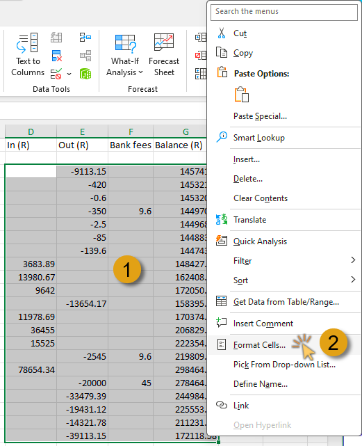  

1.  Select all cells that contain currency records.  

2.  Right-click, and then click on **Format Cells**.  

The **Format Cells** window displays.  

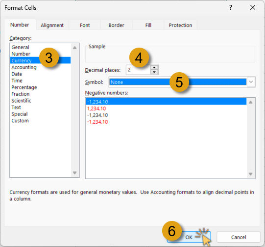  

3.  Click on **Currency** in the Category section.  

4.  Ensure the **Decimal places** value is set to **2**.  

5.  In the **Symbol** field, click on the drop-down arrow, and select **None**.  

6.  Click the **OK** button to close the Format Cells window.  

The selected cells are updated with the format applied.  

### Add Transaction Amounts  

The next steps entail combining the **Credit** and **Debit** amount columns into a single column. 

1. Click on the **"transactions"** TAB.  

2. Insert a new column to the right of the **Out (R)** _(Debit)_ column.  

3. Give the new column a heading name in the header row... in this instance we will use the name **Amount (R)**.   

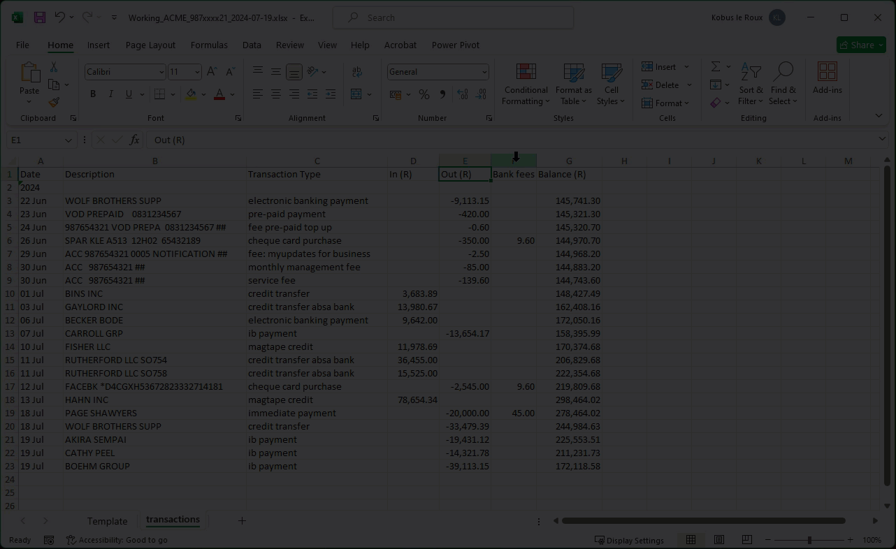  

4.  Click on the first relevant record cell under the newly created **Amount (R)** column.  

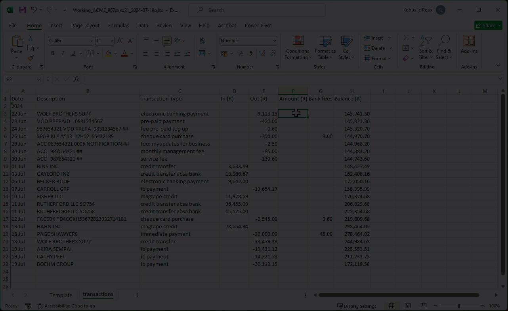  

5.  In the Formula field, type the formula "**=SUM(**", then

6.  Select the relevant cells in the **In (R)** and **Out (R)** columns.  

7.  Press **Enter** to apply the function.  

8.  Use **Fill-Down** to copy the formula to all cells in the column.  

:::tip  
Hover the cursor over the bottom-right corner of the cell, and then double-click to copy the formula down to the relevant cells.  
:::  

The **Amounts (R)** column is updated.  

9.  Select and **Copy** the updated record cells in the **Amounts (R)** column.  

10. Click on the **Template** TAB.  

11. Right-click on the first record cell in the **Orig Amt** column, then  

12. Select the **Paste Values & Source Formatting** option.  

The **Orig Amt** column is updated.  

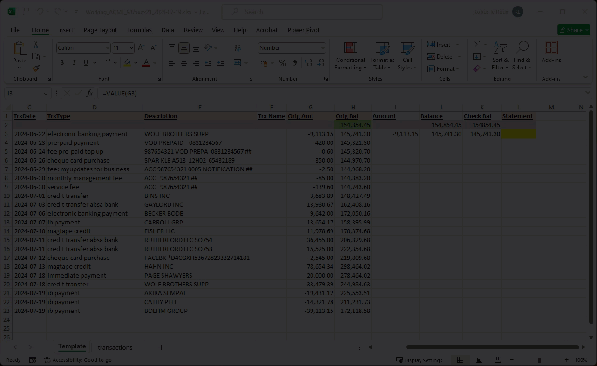  

13. Select the first record cell under the **Amount** column.  

14. Use **Fill-Down** to copy the formula to all cells in the column.  

The **Amount** column is updated.  

### Copy Balance Records to Template  

In this section, we will **Copy** the Bank Balance records from the **transactions** sheet to the **Template** sheet.  

:::important  
1.  It is recommended that you add the **Balance brought Forward** amount in the 1st cell (highted in green) under the **Orig Bal** heading column.  

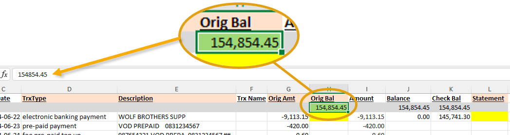  

Although optional, this step will enable you to **check the running balance**, as copied from the "**transactions**" sheet, against the calculated balance on the **Template** sheet.  
:::  

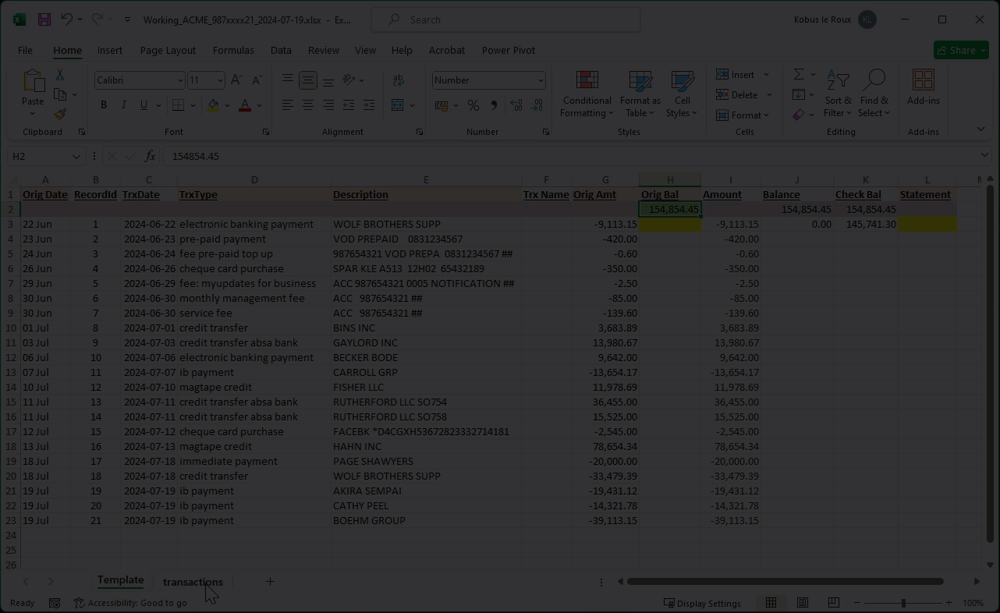  

2.  In the "**transactions**" sheet, select and **Copy** the record cells in the **Balance (R)** column.  

3. Click on the **Template** TAB.  

4. Right-click on the first record cell (highlighted in yellow) in the **Orig Bal** column, then select the **Paste Values & Source Formatting** option.  

The **Orig Bal** column is updated.  

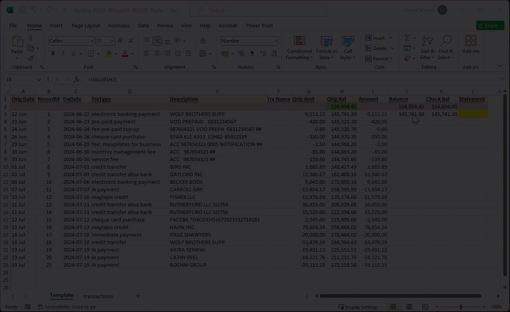  

5.  Select the first record cell under the **Balance** column.  

6.  Use **Fill-Down** to copy the formula to all cells in the column.  

The **Balance** column is updated.  

7.  Select the first record cell under the **Check Bal** column.  

6.  Use **Fill-Down** to copy the formula to all cells in the column.  

The **Check Bal** column is updated.  

### Add Statement Number  

In this section we will add the Bank **Statement Number** in the **Template** sheet.  

:::important  
Adding the Bank Statement number is **important**, as the SEMS import function uses this value to differentiate between the records in the various imports performed.  
:::  

1.  In the **Template** sheet, click on the first record cell (highlighted yellow) in the **Statement** column.  

2.  Type in the periodic statement number.  

3.  Use **Fill-Down** to copy the number to all cells in the column.  

The **Statement** column is updated.  

This completes the **Excel Bank Statement Preprocessing** process.  

### Add TRX Name Details _(Optional)_  

As an option, you can add **Transaction Name** details in the **Template** sheet under the **Trx Name** column.  

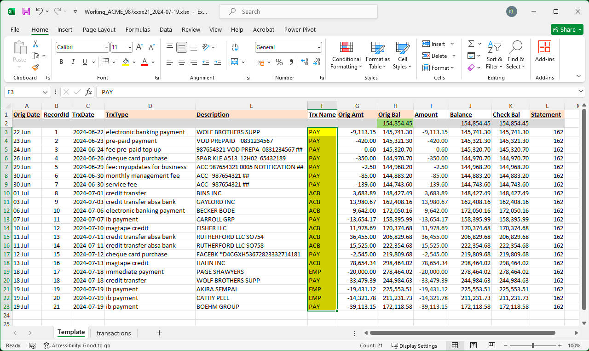  

### Save the Excel Bank Statement Spreadsheet  

:::tip  
It is recommended that the Excel file is saved after each section detailed above.  
:::  

Once you are satisfied that the information in the **Template** sheet is accurate, the updated Excel Bank Statement can be saved.  The spreadsheet is now ready to be imported using the **Import Bank Transactions** function in the SEMS application.  

Refer to the document titled **["SEMS - Bank Transaction Import"](https://sense-i.co/docs/BNKTRNSIMPRT-03)**.  

