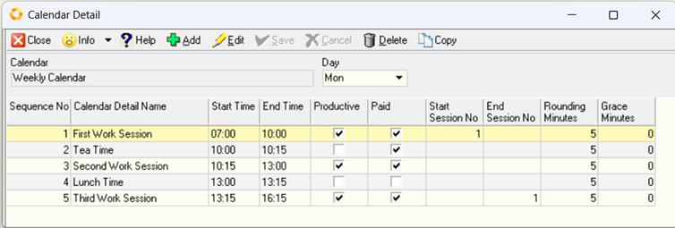
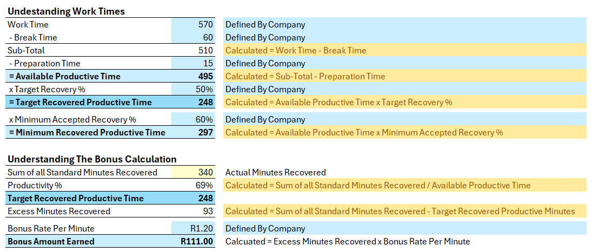
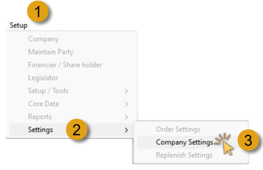
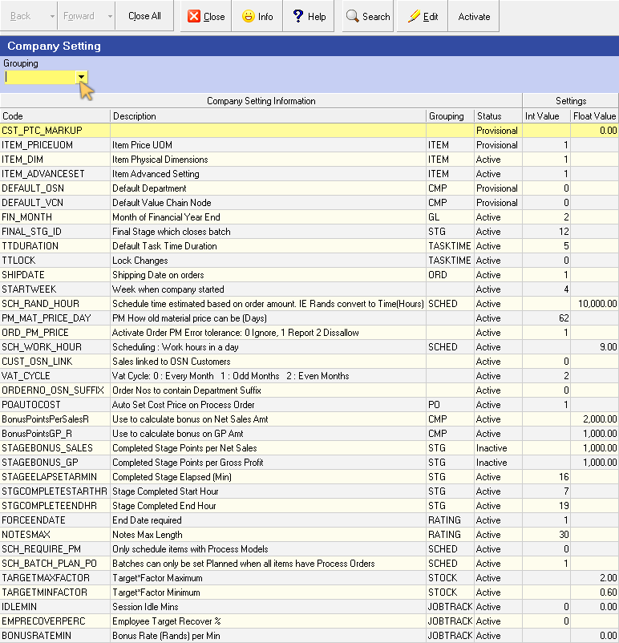
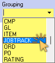
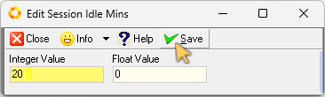
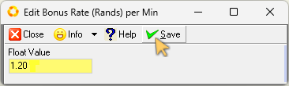
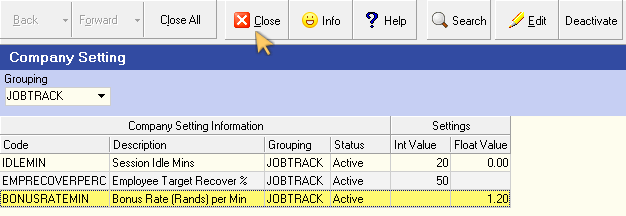

## Introduction  
___

In order to implement the **Task Tracking** and **Bonus Management** functionality of the Sense-i System, you will need to enter some information at the company level about the target minutes to recover the default bonus rates.  

In the **["Maintain Calendar"](https://sense-i.co/docs/117)** function you will have defined the details of the Working Calendars for a specific team.  

These calendars determine when the people in the team are supposed to arrive at work, what the various periods in the day are, for example, morning meeting, production periods and break periods.  

The calendars also determine what periods people in the team are paid for and what periods are productive (in other words, work is scheduled to be completed during these periods) and what periods maintenance and preparation work is done, that is work that people would be paid for doing but would not be spent on producing products for an order.

  

## Definition - Types of Time Periods

It is important to understand the following terms:  

**Work Time** – This is the time that employees are expected to be at work.  But it does not mean they will be performing work.  For example, if an employee is expected to start at 7am and work until 4.30 pm, their work time for that day would be 9.5 hours, or 570 minutes.  

**Break Time** – This is the time during which the employee would be entitled to take breaks from work.  For example, a morning tea break, or a lunch period would be considered Break Time.  As an example, a 15-minute morning tea break, a half-hour lunch break and a 15 minute afternoon break would mean the total break time for the employee would be 60 minutes.  

**Productive Time** – This is the time an employee is expected to be engaged in tasks that relate to actual production.  And this is the time that is used by scheduling to decide when orders can be completed.  

**Paid Time** – This is the time for which an employee will be paid.  Paid time will typically include all the productive time plus some of the break periods (for example morning and afternoon breaks) but no others (for example Lunch breaks.)  

  

## Set Bonus Rules  

To access the screen in which you can enter the Bonus Rules information:

1.  Click **Setup** on the main navigation menu, then  

2.  Click **Settings** from the drop-down menu, and then  

3.  Click **Company Settings** from the side menu.

  

The system will open the Maintain **Company Settings** screen.  

  

4.  Click on the drop-down arrow in the **Grouping** field of the search panel.  

5.  Click on the **JOBTRACK** option in the Grouping list.  

  

6.  Click the **Search** button on the Action bar.  

The screen is updated, displaying the three settings related to setting Bonus rules.  

### Session Idle Minutes  

This determines how many minutes are allowed for an operator to be idle before the system automatically logs them out for not being active.  

Once they have been logged out they will need to log in again.  

To change the number of Session Idle Minutes:  

1.  Click on the **Session Idle Mins** record row, then  

2.  Click the **Edit** button on the Action bar.  

The **Edit Session Ilde Mins** screen is displayed.  

  

3.  Click on the **Integer Value** field, and change the number of minutes to the desired value.  

4.  Click the **Save** button on the form Action bar.  

### Employee Target Recovery %  

The next step is to set the **Target Recovery Percentage**, as explained above.  

To do this:  
1.  Click on the **Target Recovery %** record row, then  

2.  Click the **Edit** button.  

The **Edit Target Recovery %** screen is displayed.  

  

3.  Click on the **Integer Value** field, and enter the target % you wish to set. 

4.  Click the **Save** button on the form Action bar.  

### Default Bonus Rate Per Minute  

The next step is to set the **Bonus Rate Per Minute** - that is the amount of money the company will pay each employee for every Standard Minute they recover above the target at the EMPLOYEE LEVEL.  

:::important  
You can also set a default Bonus Rate Per Minute at the **company level**.  If a rate has not been set for a specific employee, the system will use the default rate you set here.  

Be careful!  Rather keep this company default rate low, so that employees don’t think they are earning a bonus much bigger than the one they should actually earn.  
:::  

To set the default **Bonus Rate Per Minute**…

1.  Click on **Bonus Rate per Min** record row, then  

2.  Click the **Edit** button.  

The **Edit Bonus Rate (Rands) per Min** screen is displayed.  

  

3.  Click on the **Float Value** field, and enter the amount of money the company will pay for each minute recovered above the Target Recovered Productive Time.  

4.  Click the **Save** button on the form Action bar.  

The Company Settings, _(JOBTRACK Group)_ screen displays the three updated settings related to Bonus rules.  

  

Now that you have set the default company settings, close the Company Settings screen and move on to defining **["Working Calendars"](https://sense-i.co/docs/117)** and **["Loading your Employees"](https://sense-i.co/docs/SAF1204)**.  

___
**This is the end of this procedure.**
