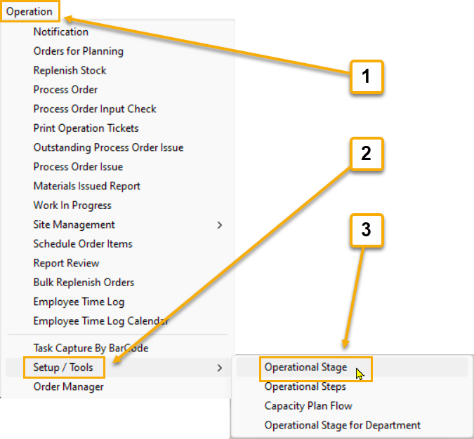
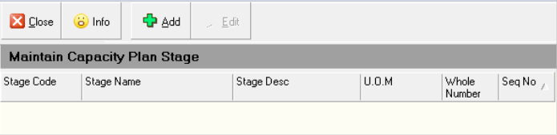
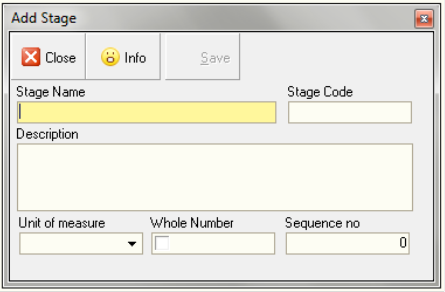

## Step-By-Step Guideline
___ 

The purpose of this procedure is to set-up the major stages through
which an order flows in your company so that you can use the Capacity
Planning function to estimate when orders can be completed and decide
what changes you need to make to the capacity that is available for
each stage.  

:::note  
A Stage does not represent an activity but rather one or
more RESOURCES or WORKSTATIONS.  
:::

1.  Select the **Operation** menu item on the main menu.

2.  Then click **Setup / Tools** at the bottom of the drop down menu.  
	
  

3.  Click **Operational Stage** from the side menu.

The system will open a screen titled
**"Maintain Capacity Planning Stage"**.  
This screen lists all of the Production Stages that you have
defined in the system.  
	
  

4.  When you initially enter the Maintain Capacity Planning Stage
    screen the list will be empty. To define the stages for your
    company, click the **Add** button at the top of the form.  

The system will display the **Add _(Capacity Planning)_ Stage** screen.  
	
  

The **Add Capacity Planning Stage** screen allows you to enter information
about the Stages that exist within your company.  

5.  Enter the Name of the first stage you wish to define in the
    **Stage Name** field.  

6.  Enter a Code that you can use to identify the stage on labels and
    other printed documents in the **Stage Code** field. Use any format that makes sense in your business.  

7.  Enter a Description for the stage (if this is necessary) in the
    **Description** field.  

8.  Select an appropriate Unit of Measure used to measure the Available
    Capacity in this stage in the **Unit of Measure** field.  
    
    This could be a **time** unit of measure or it could be a
    **physical dimension** such as linear meters or square meters or it could simply be **descriptive text** such as "Board" or "Component" or "Part".  

9.  If you have entered a logical unit of measure such as **each**, then
    you should tick the **Whole Number field** to set it to **ON**. This will then force you to define the **Capacity Required** for individual steps and the tracking of progress to use whole numbers.  
    
    If you have selected a **physical unit of measure** such as time, square meters, linear meters and so on, then you should probably set the **Whole Number** setting to **OFF**.  

10. You can control the sequence in which the Stages are displayed and
    used for scheduling.  
    
    To set a sequence number enter this in the
    **Sequence Number** field. You should define the Sequence for the Stages according to the flow that orders typically take through your
    factory.  
    
    So cutting should be first, edging second, cnc third and so
    on.  

11. Once you have completed defining all the fields on the Stage screen,
    click the **Save** button.  

12. Click the **Close** button.

Then repeat the above steps until you have defined all the stages in
your company.  

**This is the end of the procedure.**  

