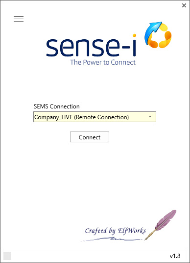
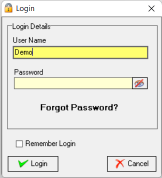
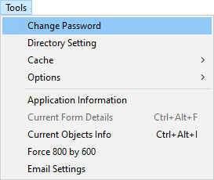
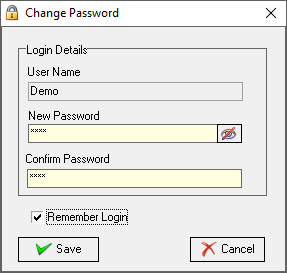

## Procedure Guideline
___  

This procedure describes how to change your Password the Sense-i Enterprise Management System (SEMS).  

1.  Double-click the **Sense-i Launcher** icon on your desktop to open the Sense-i Launcher program.

  

The program will display the **Sense-i Launcher**.

   

2.  Select the connection to the relevant database from the **drop-down field** under **SEMS Connection**.  

3.  Click the [ Connect ] button.

The **Login** screen is displayed.  

 

4.  Enter your **User Name** and CURRENT **Password**.  

5.  Click the [ Login ] button.

### Change Password

This section describes how you would change your password.

Log in as per steps 1 - 5 above.

 

1.  Select **Tools** from the main navigation bar.

2.  Select **Change Password** in the drop-down menu.

The **Change Password** screen is displayed.

 
 
3.  Type your new password in the **New Password** field,

4.  Then press the tab key and re-type the new password in the **Confirm Password** field.

5.  Select **[ Save ]**.

:::important  

If you opted not to select the **Remember Login** checkbox, it is essential to memorise your new password.

:::  

:::warning Forgot Password  
Refer to the section **["Forgot Password"](https://sense-i.co/docs/SUI001#forgot-password)** in the document titled **["Log in & Maintain Password"](https://sense-i.co/docs/SUI001)**.  
:::  

**This is the end of this procedure.**

