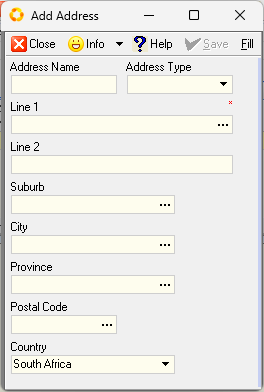

## Introduction and Overview  

This **step-by-step guide** will show you **how to Define and Configure** the **Company Profile** within the **SEMS** application.  

This task is typically done by the SEMS System Administrator in your Orginisation.

The Setup and Configuration of your Company in the SEMS application is of paramount importance.   

The information captured in this process will be included on Transactional documents and reports, including **Client-facing documents** such as Sales Quotes, Sales Orders and Sales Invoices, as well as those documents pertaining to **Suppliers** such as Purchase Orders & Supplier Claim forms.  

## Navigate to Company Setup  

1. Click the **Setup** option on the Main Menu.  

2. Then click **Company** in the drop-down menu.  
	
  

3. The system will open a screen titled **"Company List"**, with the Company listed in the first row of the grid.  

  

4.  Select the row, then click the **Open** button on the Action Bar.  

:::tip  
You can also **double-click** the row to open the **Company Profile** screen.  
:::  

:::warning Work In Progress  
This section is currently being attended to.  
:::  

## Company Profile  

The Company Profile screen, **Company - Name of the Company**, is displayed.  

This screen consists of:  
- The form Action Bar, with varius buttons, at the top.
- The Header section with the Company **Account Number**, **Common Name** and **Registered Name** fields.  The **Status** field displays the current status of the Company Profile.
- The _**TAB**_ sheets: 
    - Name & Details  
    - _Address_  
    - _Contacts_<!-- - _Employee Info_   -->
    - _Bank Accounts_  
    - _Certificates_, and
    - _Email Settings_  

You enter information about the Company in the fields on each of these TAB sheets.  
The _Header information_ fields are automatically pre-populated.  This from information received by the Sense-i team on initial setup of the Company Database.

### Name & Details  

  

### Address  

  

Address information is used on transactional documents, as well as Department Profiles when defining the Company / Organisation Structure.  

  

### Contacts  

  

Company Contacts are automatically displayed in the Contacts list grid once Employee Profiles have been captured and tagged as **Representative(s)** in the SEMS application.  

Refer to the document titled **["Capture Employee Information"](https://sense-i.co/docs/SAF1204)**.  

  

### Bank Accounts  

  
 

  

###  Certificates  

This TAB is available if your company subscribes to the Certificates Module.  

  

  

### Email Settings  

  

