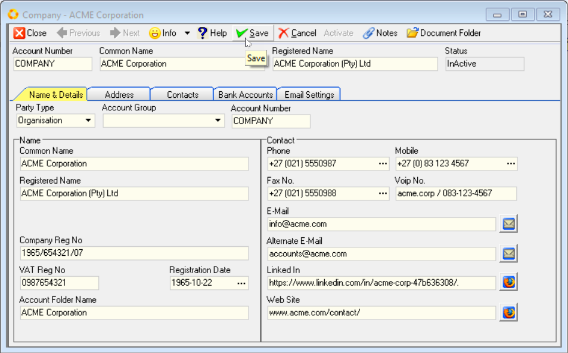
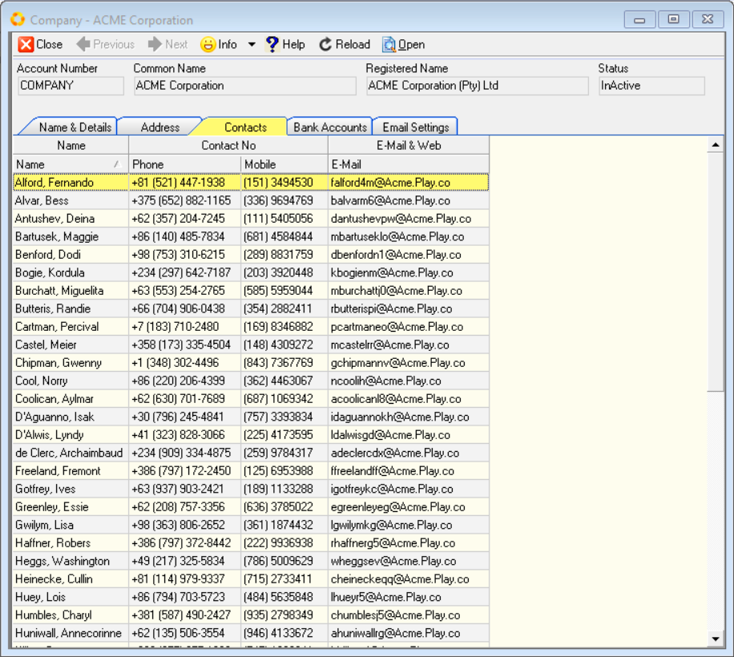
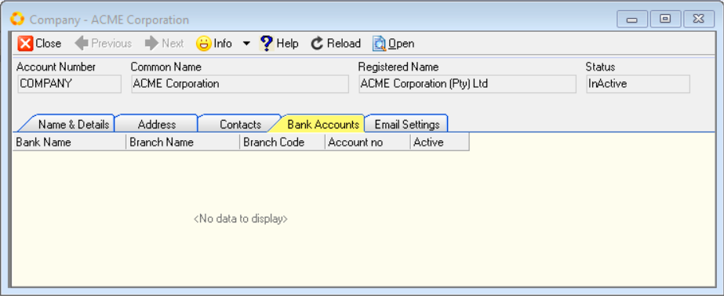

## Introduction and Overview  

This **step-by-step guide** will show you **how to Define and Configure** the **Company Profile** within the **SEMS** application.  

This task is typically done by the SEMS System Administrator in your Organisation.  

The Setup and Configuration of your Company in the SEMS application is of paramount importance.  

The information captured in this process will be included on Transactional documents and reports, including **Client-facing documents** such as Sales Quotes, Sales Orders and Sales Invoices, as well as those documents pertaining to **Suppliers** such as Purchase Orders & Supplier Claim forms.  

## Navigate to Company Setup  

1. Click the **Setup** option on the Main Menu.  

2. Then click **Company** in the drop-down menu.  
	
  

3. The system will open a screen titled **"Company List"**, with the Company listed in the first row of the grid.  

  

4.  Select the row, then click the **Open** button on the Action Bar.  

:::tip  
You can also **double-click** the row to open the **Company Profile** screen.  
:::  

## Company Profile  

The Company Profile screen, **Company - _"Name of the Company"_**, is displayed.  

This screen consists of:  
- The form Action Bar, with various buttons, at the top.
- The Header section with the Company **Account Number**, **Common Name** and **Registered Name** fields.  The **Status** field displays the current status of the Company Profile.
- The _**TAB**_ sheets: 
    - Name & Details  
    - _Address_  
    - _Contacts (Employees)_
    - _Bank Accounts_, and  
    - _Email Settings_  

You enter information about the Company in the fields on these TAB sheets.  
The _Header information_ fields are automatically pre-populated.  This from information received by the Sense-i team on initial setup of the Company Database.  

:::note  
If the **Status** of the Company Profile screen is **Active**, the various fields will be greyed out and won't be accessible.  

  

To enter information and/or make changes to the Company Profile screen, click the **Deactivate** button on the form Action Bar.  
:::  

### Name & Details  

  

Under the **Name** section, the **Common Name** & **Registered Name** fields are automatically pre-populated from information received by the Sense-i team on initial setup of the Company Database.  

1.  Enter the Company Registration Number in the **Company Reg No** field.  

2.	Enter the VAT Registration Number in the **VAT Reg No** field.  

3.	Click the three-dot button in the **Registration Date** field to capture or set the Registration Date - that is the date on which the company was registered.  

The **Account Folder Name** field contains the folder/sub-directory name that will be used by the system to store various documents relevant to the Company.  

:::important Company Directory  
The **Company Directory** needs to be established under **Party Document Folders**.  

If your Company utilises the **SEMS Certificates Module**, the **Company Certificate Directory** needs to be established under **Party Certificate Folder** section.

These directories can be setup by selecting **Tools / Directory Setting** from the Main Navigation Menu.  

  

These directories should be created as **shared folders** on your company's Local Area Network OR shared Cloud-based drive.  

Refer to the document titled **["Directory Settings"](https://sense-i.co/docs/CNF002)**.  
:::	 

4.	Enter a custom Account Folder Name, of your choice, in the **Account Folder Name** field.  

### Primary Contact Information  

The _Primary_ Contact Information fields are displayed under the **Contact** section of the **Name & Details** TAB.  

1.	Enter the main phone number for the Company in the **Phone** _(number)_ field.

2.	Enter the mobile number of the Company in the **Mobile** _(number)_ field.  

3.	Enter the Fax Number in the **Fax No.** field.  

4.	If you use the internet to communicate using an application like Skype / WhatApp / Telegram, enter the Company's **VOIP** _(number / name)_ in this field.  

5.  Enter the Company's Primary Email address in the **E-Mail** field.  

6.  Type the Alternate Email address in the **Alternate E-Mail** field.  

:::tip  
To send a test email, click on the **Mail Icon** on the right of any of these two fields.  

  

Your default **email client application** will open, enabling you to compose a new email and send it to the relevant address.  
:::  

7.  Enter the Company's **LinkedIn** URL address.

8.  Enter the **Website Address** for the Company in the **Web Site** address field.  

9.  Once you have entered the necessary and available information, you should click on the **Save** button to save this information to the database.  

  

:::tip Document Folder  
Once the Company Information has been saved, click on the  button (top-right of the form) and confirm the relevant folder to be created and shared across the network.  

  

  

This folder is typically used to store relevant & important Company documents, such as Company Registration documents, VAT Registration documents, Bank Account Confirmation letters etc.  
:::  

### Address  

Address information is used on Company letterheads, Transaction Documents and Reports, as well as Department Profiles when defining the Company / Organisation Structure.  

1.  Click the **Address** Tab to add Addresses for the Company.  

  

2.  To add an address for the Company to the database, click the **Add** button on the Action Bar.  

3.  The system will display a window titled **Add Address** that enables you to store various Physical, Postal and Shipping Addresses.  

  

4.	You can enter an **Address Name** for the address you are capturing.  

5.  Choose the **Address Type** from the drop-down List.  

6.  Enter the Street / P.O. Box address. You can do this over **two lines**.  

7.  Enter the **Suburb**.  

8.  Enter the **City**.  

9.  Enter the **Province** _(State)_ in which the Company is located.  

10. Enter the **Postal Code** _(Zip Code)_.  

11. Select the **Country**.  

:::note  
The system maintains a list of all suburbs, cities, provinces and postal codes for the country. When you have entered sufficient information for the system to find a unique match, you can click the **Fill** button and the system will complete the address with the correct information.  
:::  

12. Click the **Save** button once you have completely entered the address and then click the **Close** button.  

If you need to create additional addresses for the Company then repeat the steps above for each address you need to load.  

The system will display each address you have added in a list of addresses on the **Address** Tab.  

  

### Contacts  

1.  Click on the **Contacts** TAB to view the Company's Employee grid list.  

  
	
:::important  
**Company Employee's** are automatically displayed in the Contacts list grid once Employee Profiles have been captured in the SEMS application.  

To Add Employee Contacts to the grid list, refer to the document titled **["Capture Employee Information"](https://sense-i.co/docs/SAF1204)**.  

2.  Once the **Add Employee** procedure has been followed, click the **Reload** button.  
    The **Contacts** TAB sheet will display the updated Employee details.  

  

:::  

### Bank Accounts  

1.  To view Bank Account details for the Company, click the **Bank Accounts** TAB.

    The Bank Accounts grid list screen will be displayed.  

  

:::important  
To **Add** Bank Accounts to the grid list, refer to the document titled **["Bank Account(s) (SAF-4001)"](https://sense-i.co/docs/4001)**.  

2.  Once the **Add Bank Accounts** procedure has been followed, click the **Reload** button.  
    The **Bank Accounts** TAB sheet will display the updated Bank Account details.  

  

:::  

### Email settings - _Outgoing_  

1.  Click the **Email Settings** TAB to access the sheet with **Outgoing Mail** settings fields.  

  

The primary and alternate email addresses will be displayed in the **Email** fields, as captured previously.  

:::important  
Email configuration details will be required for the next steps in the process, and can be obtained from your **Email Service Provider**.  

For detailed guidelines on configuring **Outgoing Email Settings**, refer to the document titled **["Configure Outgoing Email Settings"](https://sense-i.co/docs/CNFE002)**  
:::  

<!-- 2.  Click on the **Mail Host** field (under the _Outgoing Mail_ section), and enter the email host information.  

3.  Click on the **Mail Port** field and enter the email port number(s).  

4.  Click the drop-down arrow in the **Connection Type** field, and then select the relevant option from the list.  

  

5.  Click on the **Password** field to enter the associated password for the email account.  

6.  Repeat the steps above to enter the details in the fields under the **Outgoing Alternative Mail** section.  

7.  Once you have entered the necessary and available information, you should click the **Save** button on the form Action Bar.  

8.  The **Test Email** button now becomes accessible.  

### Test Email  

1. To test that the outgoing email settings have been correctly captured, click the **Test Mail** icon on the form Action Bar.  

2.  The program will display the Email window.  

  

3.  Click the drop-down arrow in the **Email From** field.  Then select the _Primary_ outgoing email address option.  

4. Type in the email address you would like to send to in the **To** field.  

5. You can add additional email addresses as required in either the **To** or _Copy_ **(CC)** fields.  

6. The program will automatically populate the **Subject** line with _"Test Email"_.  Alter this if needed.

7. You can add any text for the email you are sending in the **Comment** field.  

8. And you can add any addition attachments to the email by clicking the  button at the top of the form.  

9. When you have completed your email, click the  button at the top of the form.  

  

The **Information** dialog will display **"email was sent successfully!"**.  

10. Click **[ Ok ]** to continue.

11. Repeat the above steps to test the _Alternate Outgoing Email_ address.  

  

12. To close the Email screen, click the **X** icon button at the top-right of the screen.  

The system will close this screen and return you to the Company Profile screen.   -->

2.  Once you have entered the necessary information, you should click on the **Save** button on the form Action Bar to save this information to the database.  

## Save & Activate  

Once you have reveiwed all the information in the different TABs on the Company Profile screen, and you are satisfied that the information is correct, the Company Profile is complete.  

1.  Ensure you are on the **Name & Details** TAB.  

2.  Click the **Save** button, then click the **Activate** button on the form Action bar.  

3.  Click the **Close** button to close and exit the Company Profile screen, and return to the Company grid List screen.  

The information you have entered will be included on Reports and Transaction documents, including **Customer-facing documents** such as Sales Quotes, Sales Orders and Sales Invoices, as well as those documents pertaining to **Suppliers** such as Purchase Orders & Supplier Claim forms.  

___
**This is the end of the procedure.**
