## Introduction  

This **step-by-step guide** will show you **how to Define and Configure** the **Email Settings** for your **Company** and **Employees** within the **SEMS** application.  

This task of setting up **Company Email Settings** is typically done by the SEMS System Administrator in your Organisation.  

Email Setup in the SEMS application is important for two reasons:  
1.  These details will be printed on Transaction documents created in the SEMS application _(e.g. Customer documents including Quotes, Sales Orders & Invoices, as well as Supplier documents such as Purchase Orders and Supplier Claim Forms)_  
2.  One-Time-Pins (OTP) can be emailed to, and received by SEMS users _("Forgot Password" & related Login / System accessibility issues)_.

Email configuration details will be required for this process, and can be obtained from your **Email Service Provider**.  

## Company Profile  

### Primary & Alternate Email

1.  Navigate to the **Company Profile** screen in the SEMS system.  

:::important  
Refer to the document titled **["Company Profile & Settings"](https://sense-i.co/docs/CMP001)**.  
:::	

:::note  
To make changes to the Company Profile screen, click the **Deactivate** button on the form Action Bar.  
:::  

Your Company's **Primary Email** and **Alternate Email** addresses are captured in the **Name & Details** TAB sheet, under the **Contact** section.  

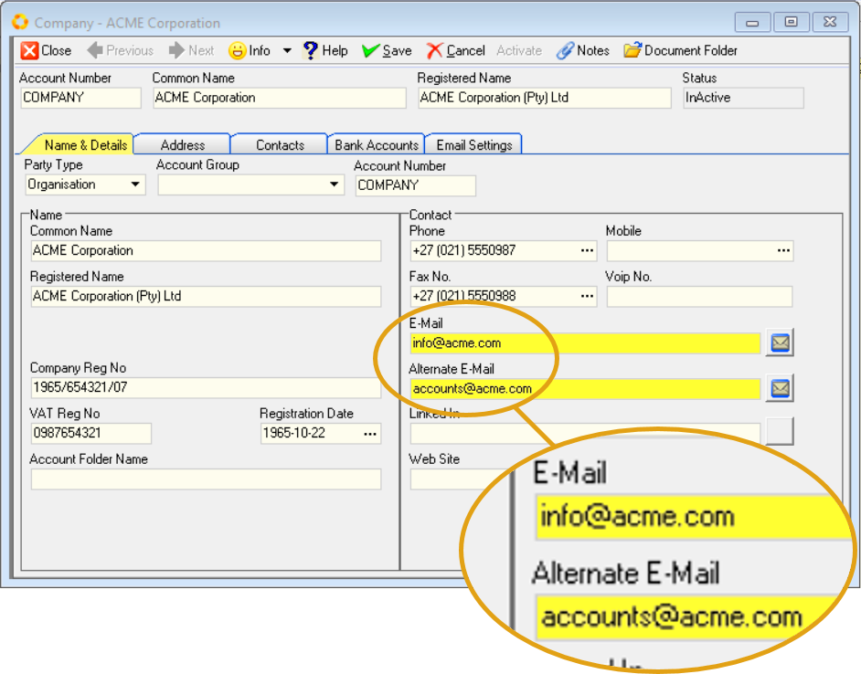  

2.  Enter the Company's Primary Email address in the **E-Mail** field.  

3.  Type the Alternate Email address in the **Alternate E-Mail** field.  

:::tip  
To send a test email, click on the **Mail Icon** on the right of any of these two fields.  

  

Your default **email client application** will open, enabling you to compose a new email and send it to the relevant address.  
:::  

4.  Click the **Save** button on the form Action Bar.  

### Email settings - Outgoing  

1.  Click the **Email Settings** TAB to access the sheet with **Outgoing Mail** settings fields.  

  

The primary and alternate email addresses will be displayed in the **Email** fields, as captured previously.  

:::important  
Email configuration details will be required for the next steps in the process, and can be obtained from your **Email Service Provider**.  
:::  

2.  Click on the **Mail Host** field (under the _Outgoing Mail_ section), and enter the email host information.  

3.  Click on the **Mail Port** field and enter the email port number(s).  

4.  Click the drop-down arrow in the **Connection Type** field, and then select the relevant option from the list.  

  

5.  Click on the **Password** field to enter the associated password for the email account.  

6.  Repeat the steps above to enter the details in the fields under the **Outgoing Alternative Mail** section.  

7.  Click the **Save** button on the form Action Bar.  
___
## Test Email  

1. To test that the outgoing email settings have been correctly captured, click the **Test Mail** icon on the form Action Bar.  

2.  The program will display the Email window.  

  

3.  Click the drop-down arrow in the **Email From** field.  Then select the _Primary_ outgoing email address option.  

4. Type in the email address you would like to send to in the **To** field.  

5. You can add additional email addresses as required in either the **To** or _Copy_ **(CC)** fields.  

6. The program will automatically populate the **Subject** line with _"Test Email"_.  Alter this if needed.

7. You can add any text for the email you are sending in the **Comment** field.  

8. And you can add any addition attachments to the email by clicking the  button at the top of the form.  

9. When you have completed your email, click the  button at the top of the form.  

  

The **Information** dialog will display **"email was sent successfully!"**.  

10. Click **[ Ok ]** to continue.

11. Repeat the above steps to test the _Alternate Outgoing Email_ address.  

  

12. To close the Email screen, click the **X** icon button at the top-right of the screen.  

The system will close this screen and return you to the Company Profile screen.  

___

## Employee Profile  

The Setup and Configuration of Employee Emails in the SEMS application is of significant importance, especially for those Employees that are **Company Representatives**.   

The information captured in this process will be included on Transactional documents and reports, including **Customer documents** such as Sales Quotes, Sales Orders and Sales Invoices, as well as those documents pertaining to **Suppliers** such as Purchase Orders & Supplier Claim Forms.  

:::important  
Refer to the document titled **["Capture Employee Information"](https://sense-i.co/docs/SAF1204)**.  
:::	 

Employee's **Primary Email** and **Alternate Email** addresses are captured in the **Name & Details** TAB sheet, under the **Contact** section.  

:::note  
To make changes to the Employee Profile, click the **Deactivate** button on the form Action Bar.  
:::  

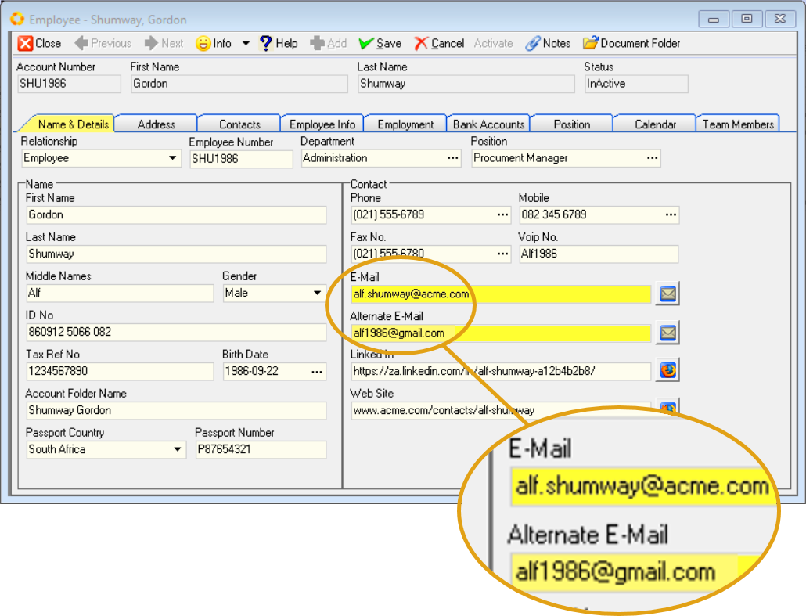  

2.  Enter the Employee's Primary Email address in the **E-Mail** field.  

3.  Type the Alternate Email address in the **Alternate E-Mail** field.  

:::tip  
To send a test email, click on the **Mail Icon** on the right of any of these two fields.  

  

Your default **email client application** will open, enabling you to compose a new email and send it to the relevant address.  
:::  

4.  Click the **Save** button on the form Action Bar.  

### SEMS Logon User Code  

:::important  
This procedure is relevant where the Employee will be using the SEMS system as a **Company Representative**, and will use the **Outgoing Email** function to send Transaction documents to Customers / Suppliers.  

The SEMS System Administrator must first add the Employee to the **Login User** list.  

Refer to the document titled **[Add SEMS Users](https://sense-i.co/docs/CNF003)**.  
:::  

1.  Click the **Employment** TAB.  

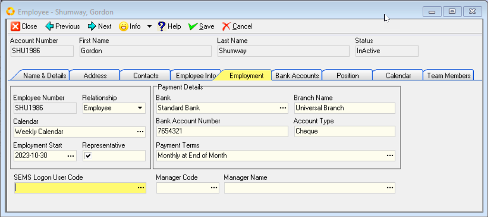  

The Employment worksheet is displayed.  

2.  Click on the three-dot button in the **SEMS Logon User Code** field.  

The **Select Logon User** screen is displayed.  

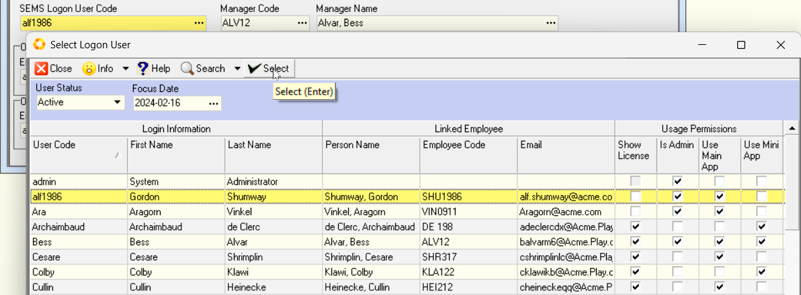  

3.  Click on the relevant record row, and then click the **Select** button on the list Action Bar.  

The system will return to the Employee Profile screen.  

:::note  
The **Outgoing Mail** and **Outgoing Alternative Mail** sections now become available and accessible.  

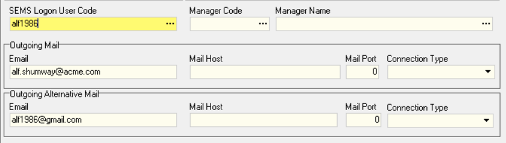  
:::  

4.  Click the three-dot button in the **Manager Code** field to select the manager to whom the Employee reports to.  

### Employee Email settings - Outgoing  

The primary and alternate email addresses will be displayed in the **Email** fields, as captured previously in the **Name & Details** TAB.  

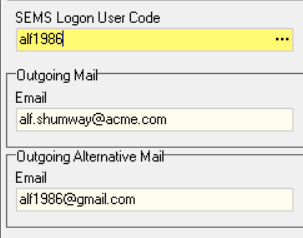  

:::important  
Email configuration details will be required for the next steps in the process, and can be obtained from your **Email Service Provider**.  
:::  

2.  Click on the **Mail Host** field (under the _Outgoing Mail_ section), and enter the email host information.  

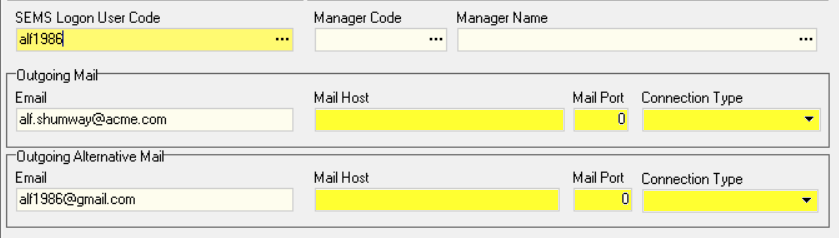  

3.  Click on the **Mail Port** field and enter the email port number(s).  

4.  Click the drop-down arrow in the **Connection Type** field, and then select the relevant option from the list.  

  

5.  Repeat the steps above to enter the details in the fields under the **Outgoing Alternative Mail** section.  

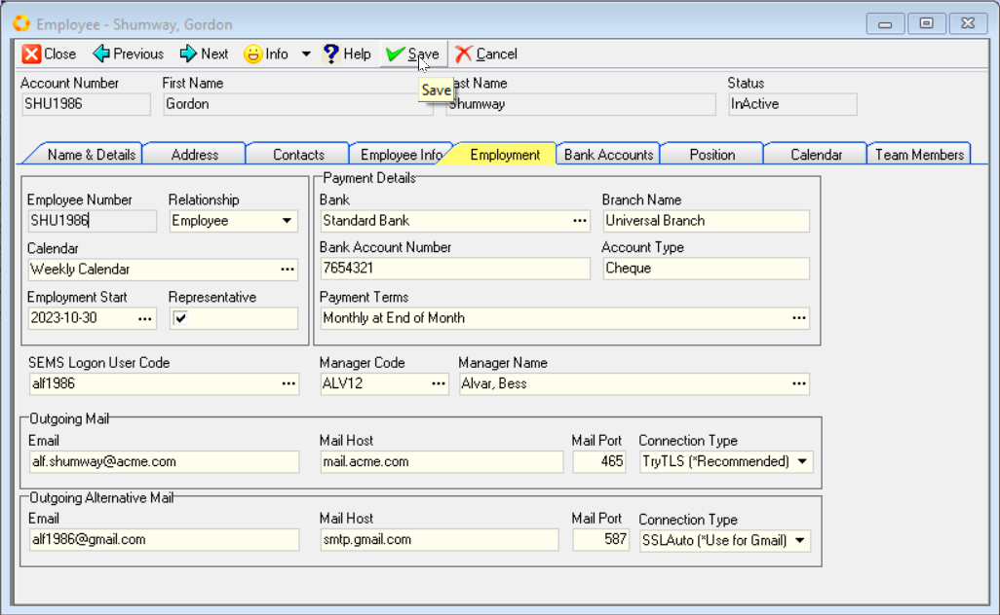  

6.  Once you have entered the necessary information, you should click on the **Save** button on the form Action Bar to save this information to the database.  

7.  To Activate the Employee Profile, select the **Name & Details** TAB, then click on the **Activate** button.  
___

## SEMS Log in & Email Password Setup  

Once the Email settings have been captured, the next step would be for the **Employee / SEMS User** to Log in to the SEMS application.  

Then the **Employee / SEMS User** will be able to set his/her Email password and **test** the outgoing Email function.   

### Employee SEMS Log in  

:::important  
Refer to the document titled **[Log in & Maintain Password](https://sense-i.co/docs/SUI001)**.  
:::  

1.  Log in to the SEMS application with **SEMS Logon User Code** as received from the SEMS System Administrator.  

### Setup Email Password  

1.  Click the **Tools** button on the Main Navigation bar.  

2.  Then click **Email Settings** in the drop-down menu.  

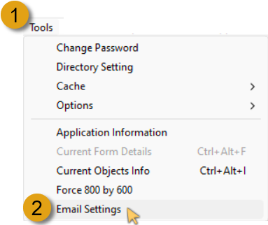  

The **Email Settings** screen is displayed, with the **Email** address, **Mail Host**, **Mail Port** and **Connection Type** fields populated with the information as previously entered by the SEMS System Administrator. 

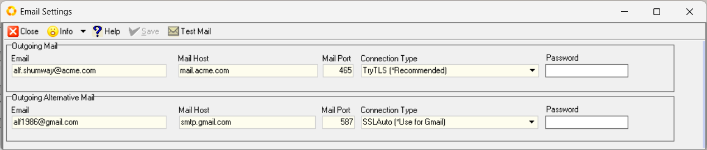  

3.  Click on the **Password** field under the Outgoing Mail section.  

4.  Enter the Password for the Email Account as received from your Email Service Provider.  

5.  Repeat the steps above to enter the password under the **Outgoing Alternative Mail** section.  

6.  Click the **Save** button on the Action Bar.  

7.  The **Test Mail** button now becomes accessible.  

### Test Outgoing Email  

1. To test that the outgoing email settings have been correctly captured, click the **Test Mail** icon on the Action Bar.  

2.  The program will display the Email window.  

  

3.  Click the drop-down arrow in the **Email From** field.  Then select the _Primary_ outgoing email address option.  

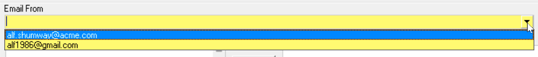  

4. Type in the email address you would like to send to in the **To** field.  

5. You can add additional email addresses as required in either the **To** or _Copy_ **(CC)** fields.  

6. The program will automatically populate the **Subject** line with _"Test Email"_.  Alter this if needed.

7. You can add any text for the email you are sending in the **Comment** field.  

8. And you can add any addition attachments to the email by clicking the  button at the top of the form.  

9. When you have completed your email, click the  button at the top of the form.  

  

The **Information** dialog will display **"email was sent successfully!"**.  

10. Click **[ Ok ]** to continue.

11. Repeat the above steps to test the _Alternate Outgoing Email_ address.  

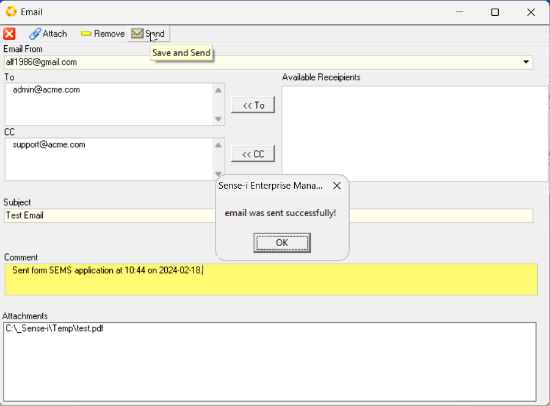  

12. To close the Email screen, click the **X** icon button at the top-right of the screen.  

The system will close this screen and return you to the Email Settings screen.  

13. Click the **Close** button on the Action Bar.  

___
**This is the end of this procedure.**
