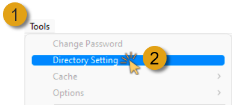
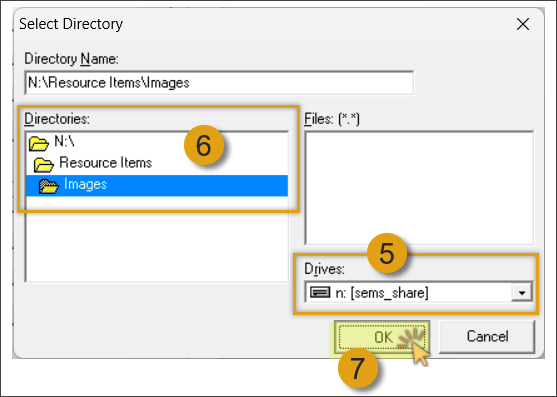

## Introduction
___ 

This guideline relates to the procedure used to define, add and maintain **Directory Path folders** relevant to product & materials ***(Resource Items)***, and specific parties, including **Customers**, **Suppliers**, **Employees**, **Departments**, and the organisation / **Company** itself.  

## Step-by-step Guideline  

### Creating Directories & Folders  

This process is usually performed by the **System Administrator** with the necessary rights and security access to create and maintain Directory Structures on a specific shared drive.  

:::important  
The directories and folders created should be shared with relevant colleagues, SEMS users and/or management of the company - this could be a shared **Local Area Network** (LAN) directory or shared **cloud-based folders** (e.g. Dropbox, Google Drive etc.).  
:::  

1.  Open the **Windows File Manager**.

2.  Navigate to the relevant _SEMS Shared_ **Network Drive** or **Cloud based folder**.  
	
  

3.  Create the following directories;
-   **Company**  
-   **Departments**
-   **Customer**  
-   **Supplier**
-   **Employee**
-   **Resource Items**  
    Under _Resource Items_ create individual folders for;
    -   **Images**
    -   **Documents**,  
    -   **Technical Documents**  

If your company utilises the Certificates & Rating system module, create the following directory and sub-directories;
-   **Certificates**  
    Under _Certificates_ create individual folders for;
    -   **Customer**  
    -   **Supplier**
    -   **Employee**
    -   **Company**  

Once created, the directory structure would resemble the following;
	
  

:::note  
The above directory structure relates directly to the Directory Settings naming convention in the SEMS application.
The naming convention for directory creation on your shared drive/folder could be structured to conform to your company specific naming/numbering conventions.  
:::  

4.  Assign the appropriate access rights and securities to the individul SEMS users and team collegues within your organisation - this for each folder.  

5. Inform your relevant collegues of the above network location and structure.  

### SEMS Configuration - Directory Settings   

In this guideline, we will focus on the process of adding and maintaining directories, sub-directories and folders for **Resource Items** in the SEMS application.  

:::note  
The same principles and procedures should be used when **defining**, **adding** and **maintaining** directories, sub-directories and folders relevant to specific parties - **Customers**, **Suppliers**, **Employees**, **Departments**, and the **Company**.  
:::  

:::important  
This procedure should be done by/for each individual and workstation using the SEMS application.  
:::  

1.  Select the **Tools** option from the Main Navigation Menu.  

2.  Then click on **Directory Setting**.  
	
  

3.  The system will open a screen titled **"Directory Setting"**.  
    This screen lists all the fields for **Directories & Folders** relevant to Resource Items and each specific party group.  
    
  

In this example we will define the **Resource Item Folder** paths.   

4.  In the **Resource Item Folders** section, click on the **three-dot button** in the **Item Image Directory** field.  
	
  

The **Select Directory** pop-up screen is displayed.  
	
  

5.  Select the shared network **Drive** _(LAN drive or cloud-based storage drive)_.

6.  Navigate to the relevant folder in the **Directories** field, and **double-click** the appropriate folder.  

7.  Click the **OK** button.

:::note  
In this instance we have selected **N:\Resource Items\Images** as displayed in the **Directory Name** field.  
:::  

8.  In the **Resource Item Folders** section, click on the **three-dot button** in the **Item Document Directory** field. 
	
  

The **Select Directory** pop-up screen is displayed.  
	
  

9.  **Repeat Steps 5 - 7** as above.  

10. Repeat the above process to add the **Technical Document Directory** path.

  

The **Directory Settings** for **Resource Item Folders** have now been defined.  

:::tip  
Follow the same procedure as detailed above to define the Directory Settings for **Customers**, **Suppliers**, **Departments** and the **Company**.  

If your company utilises the Certificates & Rating system module, create the directory paths in the same manner.  
:::  

  

11. Once you have entered all the information for **Directory Settings** click the **OK** button.  

___

**This is the end of this procedure.**
