## Introduction  

This **step-by-step guide** will show you how to **Add SEMS Users** in the Sense-i system, enabling them to log in to the **SEMS application**.  

The task of **Adding SEMS Login Users** is typically done by the SEMS System Administrator in your Organisation.  

## Login Users  

### Navigate to the Login Users Screen  

1.  Click on **Security** in the Main Navigation Menu.

2.  Then click on the **Login User** option in the drop-down menu.  

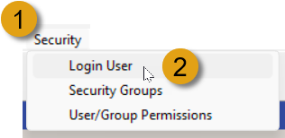  

The **Login Users** screen is displayed.  

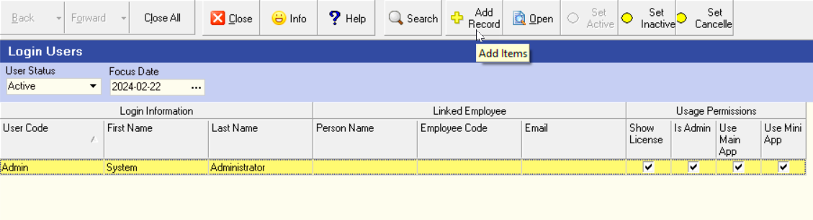  

The first time this screen is accessed by the SEMS System Administrator, only the SEMS System Administrator is displayed in the Grid List.  

Once the SEMS Login Users have been added, this screen will list the Employees, and other indivduals that have login access to the SEMS system.  

### Add New Login User  

1.  Click on the **Add Record** button on the Action Bar.  

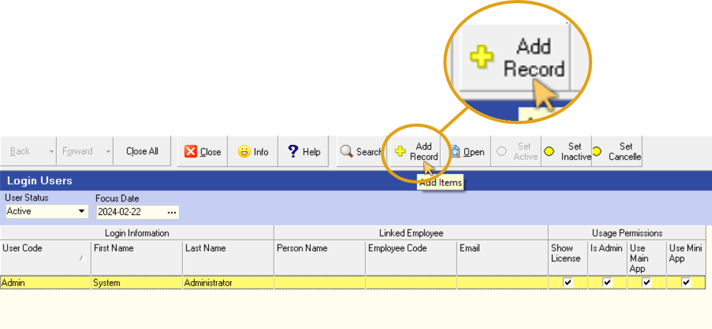  

The **Add New Login User** screen is displayed.  

:::note  
All fields that have a little **red Asterisk** sign next to the name MUST be completed.  

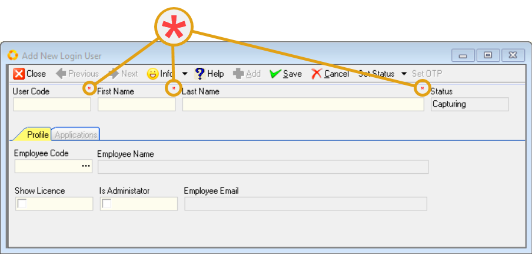  

To add a Login User it is necessary to complete these fields.  
:::  

2.  Enter the User Code in the **User Code** field.  

:::note  
This is the **_User Name_** that the employee would use to login to the SEMS system.  

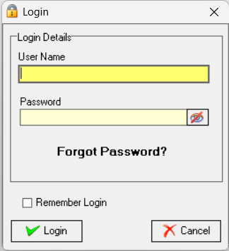  

Refer to the document titled **["Log in & Maintain Password"](https://sense-i.co/docs/SUI001)**.  
:::	

3.  Enter the employee's first name in the **First Name** field.  

4.  Enter the employee's surname in the **Last Name** field.  

:::tip  
It is recommended that one of the first Login Users to be added should be an employee (typically in the Human Resources department) responsible for adding and capturing the relevant Employee Profile information for other employee's in the company.  

Refer to the document titled **["Capture Employee Information"](https://sense-i.co/docs/SAF1204)**.  

Once this process has been completed, New Login Users can be added efficiently.  
Employee Codes can be linked to employees listed under the **Employee Code** field in the **_Profile_** TAB of the **Add New Login User** screen.  
:::  

5.  Click the three-dot button in the **Employee Code** field.  
 
 The **Select Employee** screen is displayed.  
 
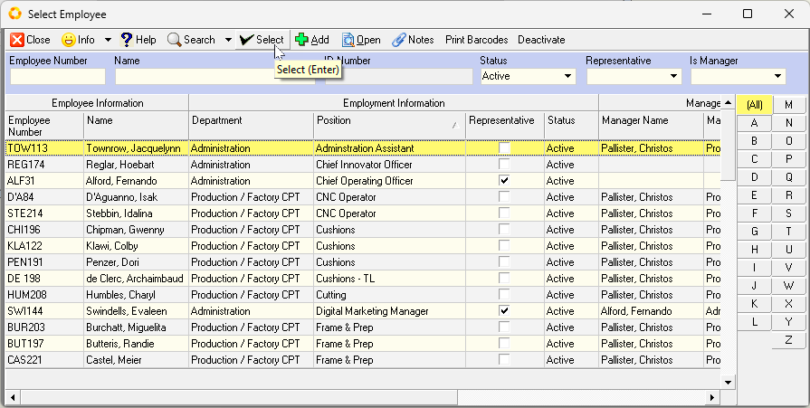  

6.  Search for, and select the relevant employee by clicking on the applicable row, and then click the **Select** button on the form Action Bar.  

The system will return to the **Add New Login User** screen.  

:::note  
The system automatically displays the **Employee Code**, **Employee Name** and **Employee Email** details as captured in the **["Capture Employee Information"](https://sense-i.co/docs/SAF1204)** process.

Make a note of the **User Code** that you've assigned to this employee - this needs to be communicated to the relevant employee for SEMS login purposes.  
:::  

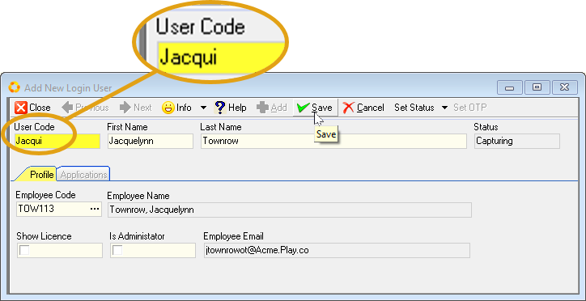  

7.  Click on the **Show Licence** checkbox if the employee needs to see the SEMS Licence Expiry messages.  

    This would be relevant for those employees (Finance Department) responsible for Supplier payments, and in particular, the Sense-i monthly Licence fees.  

8.  Click on the **Is Administrator** checkbox <u>only if</u> the employee is granted full security rights and access to the SEMS application.  

:::warning Administrator Access  
Employees that have been granted Administrator privileges have the highest security clearance and have full access to the entire SEMS application.  
:::  

9.  Click the **Save** button on the Action Bar.  

The screen is updated with the title **Login User - _User Name_**.

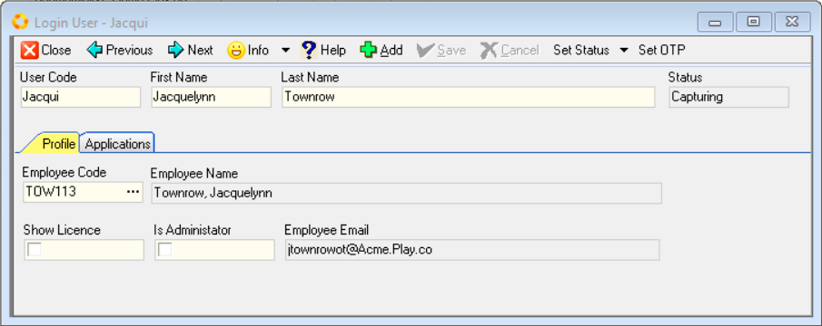  

The **Applications** TAB is now accessible.  

### Login User Applications  

1.  Click on the **Applications** TAB.  

2.  Then click the **Add Items** button on the Action Bar.  

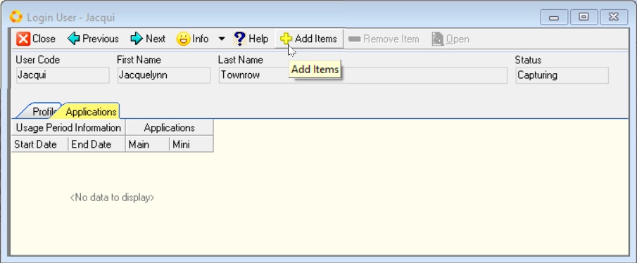  

The **Add New Application Usage** screen is displayed.  

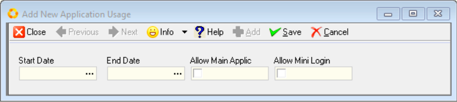  

3.  Click on the three-dot button in the **Start Date** field.  

4.  Select the Start Date using the pop-up Calendar.  

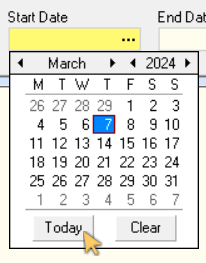  

:::note  
Leave the **End Date** field blank - this can be set, if required, in the future.  
:::  

5.  Click the checkbox in the **Allow Main Applic** field to grant the Login User access to the Main SEMS application.  

6.  Click the checkbox in the **Allow Mini Login** field to grant the Login User access to the Sense-i Maestro application, as used in the Manufacturing / Factory floor environment. 

:::important  
Either one, or both of these applications can be used by the Login User, depending on his/her job function and responsibilities.  
:::  

7.  Click the **Save** button on the form Action Bar.  

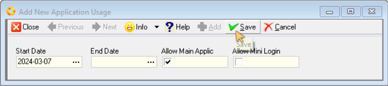  

8.  Then click the **Close** button.  

The **Applications** TAB will be updated with the information captured.  

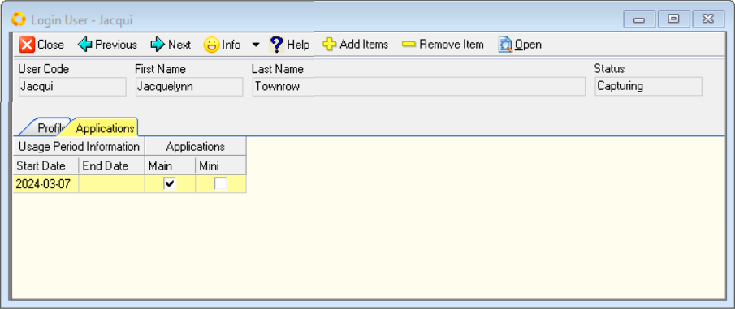  

### Save & Activate Login User  

1.  Click on the **Profile** TAB.  

2.  Click the **Save** button on the Action Bar.  

3.  Then click the **Set Status** drop-down arrow.  

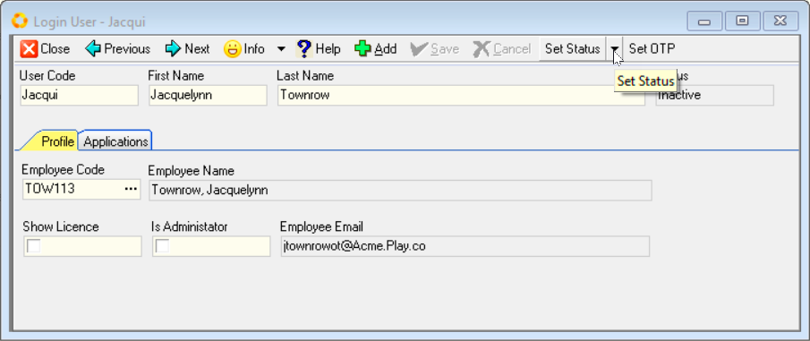  

4.  Click the **Set Active** option in the drop-down menu.  

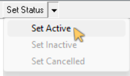  

5.  Click the **Close** button on the form Action Bar.  

:::warning Assign Login User Permissions  
The Login User must now be assigned the related system Securities & Permissions.  

Refer to the document titled **["Assign User/Group Permissions"](https://sense-i.co/docs/CNF004)**.  
:::  

:::important  
Once the above process has been completed, the new Login User can be provided with his/her **User Name**.  

The following links should also be included in the communication with the Login User / Employee:  

-    **["Download & Install Sense-i Launcher"](https://sense-i.co/docs/DOWNLOAD)**.  

-    **["Using the Sense-i Launcher Application"](https://sense-i.co/docs/LAUNCH)**.  

-    **["Log in & Maintain Password"](https://sense-i.co/docs/SUI001)**.  

:::	

___
