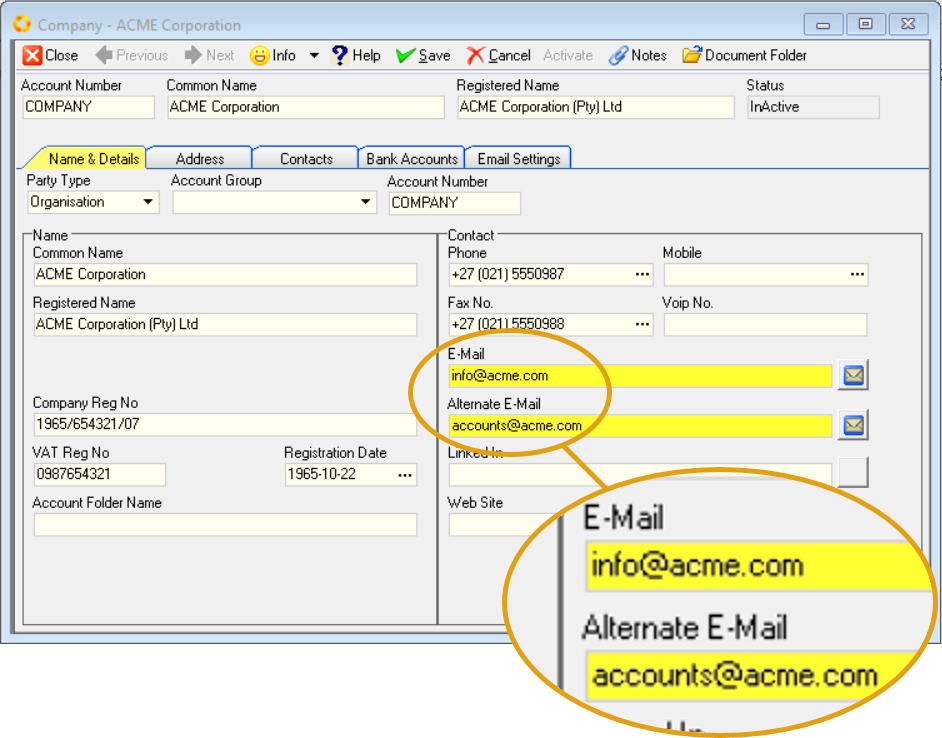
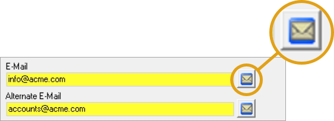
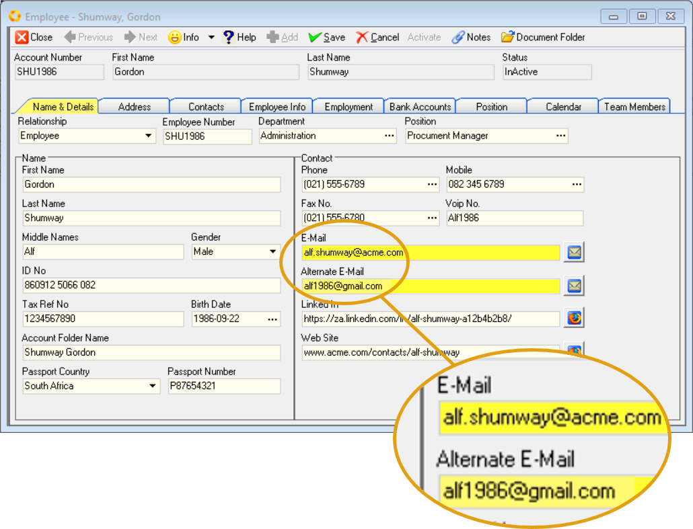

## Introduction  

This **step-by-step guide** will show you **how to capture** the **Email Addresses** for your **Company**, **Employees**, **Customers** and **Suppliers** within the **SEMS** application.  

Entering Email Addresses of Parties in the SEMS application is important for the following reasons:  
1.  These details will be referenced in Reports & Transaction documents created in the SEMS application.  
-   Company email address on letterheads.  
-   Employee (Company Representative) email address appear as _Sender_ on **Customer documents** including Quotes, Sales Orders & Invoices, as well as **Supplier documents** such as Purchase Orders and Supplier Claim Forms.  

2.  Customer / Supplier email details should be captured in order to contact them.  

3.  One-Time-Pins (OTP) can be requested by SEMS users _("Forgot Password" & related Login / System accessibility issues)_.

## Primary & Alternate Email  

### Company Profile  

1.  Navigate to the **Company Profile** screen in the SEMS system.  

:::important  
Refer to the document titled **["Company Profile & Settings"](https://sense-i.co/docs/CMP001)**.  
:::	

:::note  
If the **Status** of the Company Profile screen is **Active**, the various fields will be greyed out and won't be accessible.  

To enter information and/or make changes to the Company Profile screen, click the **Deactivate** button on the form Action Bar.  
:::  

Your Company's **Primary Email** and **Alternate Email** addresses are captured in the **Name & Details** TAB sheet, under the **Contact** section.  

  

2.  Enter the Company's Primary Email address in the **E-Mail** field.  

3.  Type the Alternate Email address in the **Alternate E-Mail** field.  

:::tip  
To send a test email, click on the **Mail Icon** on the right of any of these two fields.  

  

Your default **email client application** will open, enabling you to compose a new email and send it to the relevant address.  
:::  

4.  Once you have entered the necessary information, you should click on the **Save** button on the form Action Bar to save this information to the database.  

5.  To Activate the Company Profile, click the **Activate** button.  
___

### Employee Profile  

:::important  
Refer to the document titled **["Capture Employee Information"](https://sense-i.co/docs/SAF1204)**.  
:::	 

Employee's **Primary Email** and **Alternate Email** addresses are captured in the **Name & Details** TAB sheet, under the **Contact** section.  

:::note  
If the **Status** of the Employee Profile screen is **Active**, the various fields will be greyed out and won't be accessible.  

To enter information and/or make changes to the Employee Profile screen, click the **Deactivate** button on the form Action Bar.  
:::  

  

2.  Enter the Employee's Primary Email address in the **E-Mail** field.  

3.  Type the Alternate Email address in the **Alternate E-Mail** field.  

:::tip  
To send a test email, click on the **Mail Icon** on the right of any of these two fields.  

  

Your default **email client application** will open, enabling you to compose a new email and send it to the relevant address.  
:::  

4.  Once you have entered the necessary information, you should click on the **Save** button on the form Action Bar to save this information to the database.  

6.  To Activate the Employee Profile, click the **Activate** button.  

7.  Click the **Close** button.  

8.  Repeat the steps above to capture email addresses for other Employees.  
___

### Customer Profile  

:::important  
Refer to the document titled **["Capture Customer Profile"](https://sense-i.co/docs/1202)**.  
:::	 

Customer **Primary Email** and **Alternate Email** addresses are captured in the **Name & Details** TAB sheet, under the **Contact** section.  

:::note  
If the **Status** of the Customer Profile screen is **Active**, the various fields will be greyed out and won't be accessible.  

To enter information and/or make changes to the Customer Profile screen, click the **Deactivate** button on the form Action Bar.  
:::  

  

2.  Enter the Customer's Primary Email address in the **E-Mail** field.  

3.  Type the Alternate Email address in the **Alternate E-Mail** field.  

:::tip  
To send a test email, click on the **Mail Icon** on the right of any of these two fields.  

Your default **email client application** will open, enabling you to compose a new email and send it to the relevant address.  
:::  

4.  Once you have entered the necessary information, you should click on the **Save** button on the form Action Bar to save this information to the database.  

6.  To Activate the Customer Profile, click the **Activate** button.  

7.  Click the **Close** button.  

8.  Repeat the steps above to capture email addresses for other Customers.  
___

### Supplier Profile  

:::important  
Refer to the document titled **["Supplier Information"](https://sense-i.co/docs/1203)**.  
:::	 

Supplier **Primary Email** and **Alternate Email** addresses are captured in the **Name & Details** TAB sheet, under the **Contact** section.  

:::note  
If the **Status** of the Supplier Profile screen is **Active**, the various fields will be greyed out and won't be accessible.  

To enter information and/or make changes to the Supplier Profile screen, click the **Deactivate** button on the form Action Bar.  
:::  

  

2.  Enter the Supplier's Primary Email address in the **E-Mail** field.  

3.  Type the Alternate Email address in the **Alternate E-Mail** field.  

:::tip  
To send a test email, click on the **Mail Icon** on the right of any of these two fields.  

Your default **email client application** will open, enabling you to compose a new email and send it to the relevant address.  
:::  

4.  Once you have entered the necessary information, you should click on the **Save** button on the form Action Bar to save this information to the database.  

6.  To Activate the Supplier Profile, click the **Activate** button.  

7.  Click the **Close** button.  

8.  Repeat the steps above to capture email addresses for other Suppliers.  

<!-- ___

## SEMS Log in & Email Password Setup  

Once the Email settings have been captured, the next step would be for the **Employee / SEMS User** to Log in to the SEMS application.  

Then the **Employee / SEMS User** will be able to set his/her Email password and **test** the outgoing Email function.    -->

<!-- ### Employee SEMS Log in  

:::important  
Refer to the document titled **[Log in & Maintain Password](https://sense-i.co/docs/SUI001)**.  
:::  

1.  Log in to the SEMS application with **SEMS Logon User Code** as received from the SEMS System Administrator.   -->
___
**This is the end of this procedure.**
