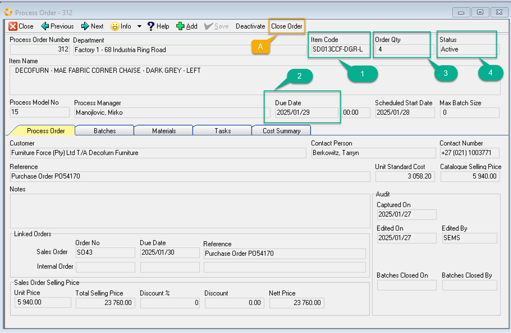
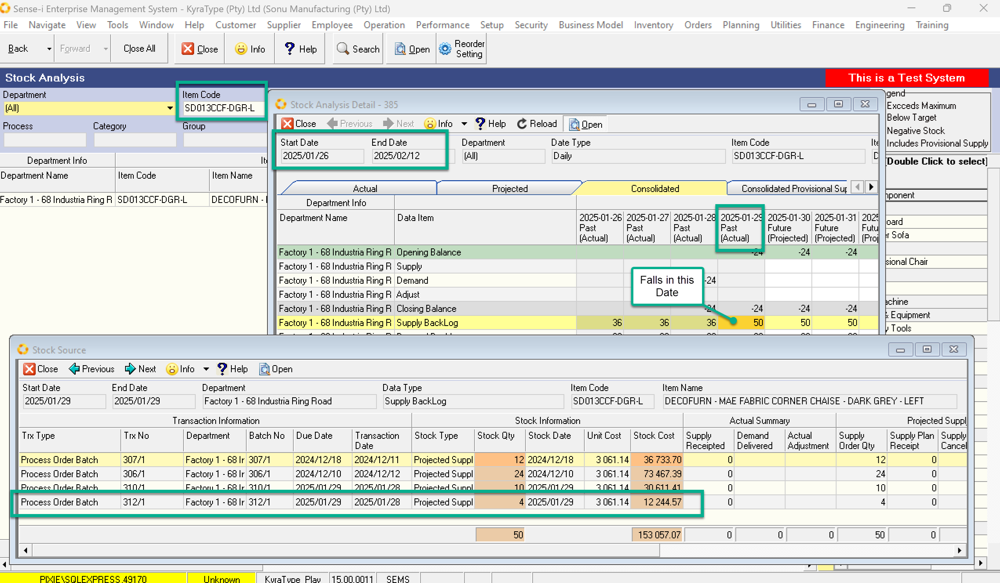
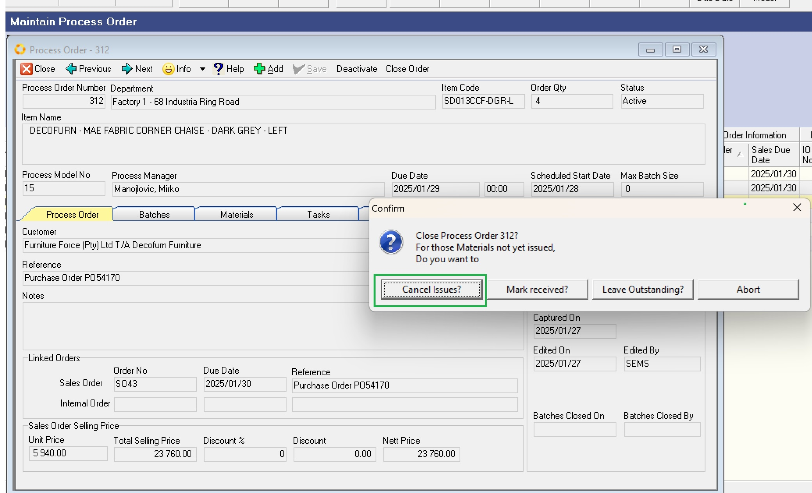
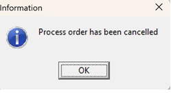
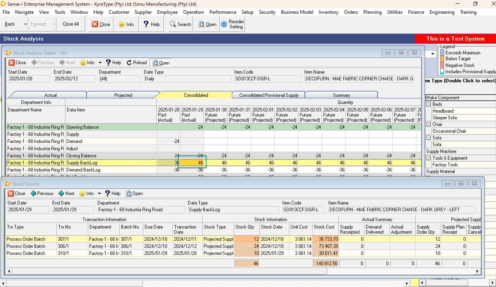

## Procedure Guideline  
___  
From the Main menu navigate to Operation / Process Order.  

Select the required Process Order Number. Here I choose 312.  

  

Before we Cancel we are going to confirm that the expected /Projected Supply is showing in the Stock Analysis.  

In order to see the projected stock we will need the Process Tracking Code (1) and the Due Date (2).  

Note the quantity ordered is 4. We could have looked at the batches to see how many of the 4 are outstanding. In this example all 4 are outstanding as we can see in the Stock Analysis.  

  

1. We choose the Process Tracking Code SD013CCF-DGR-L and a date range inclusive of the Due Date of the Process Order and Search.  
2. Select the 1 row returned and Drill Through. Open.  
3. Click on the Projected or Consolidated Tab. (This example I picked Consolidated)  
4. I see that 60 items are due on the 29th.  
5. I now Click IN THIS CELL and drill down. OPEN.  
6. The projected Supply transactions for this Tracking code and this date are shown.  
7. Here I can see the Stock Qty is 4.  

Now we will Cancel/Close the Process Order.  
Back on the Process Order Screen...  
We Click Close Order.  

  

In addition to Closing the batch, which will CANCEL ALL outstanding Items you must choose what to do with the projected demand on the materials. In this case, I choose to Cancel the outstanding issues.  

  

The Process order is now cancelled.  

We return to the stock analysis to confirm that the outstanding projected supply has been removed.  

  

We can see that the 60 due for the 29th has been updated to 56 as the 4 are cancelled.
and the drill through no longer shows our process order.  
___

**This is the end of this procedure.**