## Introduction
___ 

This module relates to the workflow used to define, add, view and maintain **certificates** and **documents** relevant to specific parties.  
The term **Certificates** will be used broadly throughout this guideline and includes relevant and associated **Documents**. 

In this guideline, we will focus on the process of adding and maintaining certificates for **Employees** / Contractors.  

:::note  
The same principles and procedures should be used when **defining**, **adding**, **viewing** and **maintaining** certificates relevant to other parties - **Customers**, **Suppliers**, **Financiers**, and **Legislators**.  
:::  

Before adding certificates & documents relevant to employees, there are a few settings (prerequisites) that need to be in place.  

These include;
-   **Directory Settings for Employee Document folders**  

-   **Employee Certificate Folder**  
    The directories and folders above should preferrably shared with relevant colleagues, SEMS users and/or management of the company - this could be a shared **Local Area Network** (LAN) directory or shared **cloud based folders** (e.g. Dropbox, Google Drive etc.)  

-   **Certificate Definition and Rules**  
    By default the SEMS system lists 3 Certificate Definitions under the **Personal Group**;
    - Curriculum Vitae (CV)  
    - Identity Documnet (ID)  
    - Passport  
    In the subsequent step-by-step guidelines, the procedures for adding further Certificate Definitions and associated rules are described.  

Once the pre-requisite settings are in place, Certificate records and associated documents can be added for individual employees.

## Step-by-step Guideline

### Prerequisites - Directory Settings   

1.  Select the **Tools** option from the Main Navigation Menu.  

2.  Then click on **Directory Setting**.  
	
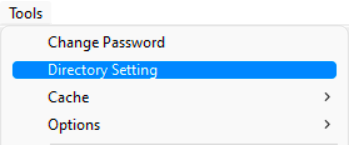  

3.  The system will open a screen titled **"Directory Setting"**.  
    This screen **lists all the Directories & Folders** relevant to each party.  
    
    Here we will define the Employee Document & Certificate Folder Directory paths.   
	
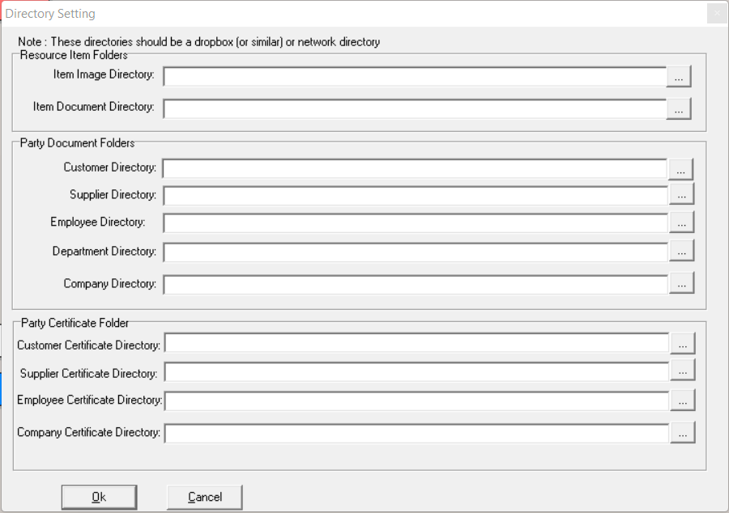  

4.  In the **Party Document Folder** section, click on the **three-dot button** in the **Employee Directory** field.  
	
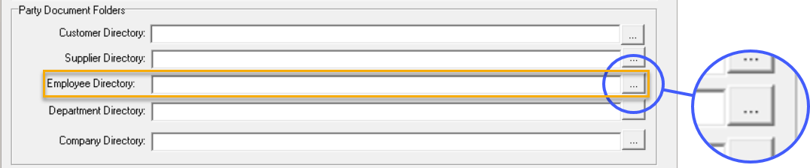  

The **Select Directory** pop-up screen is displayed.  
	
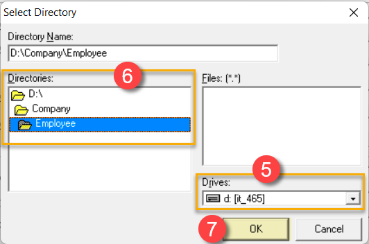  

5.  Select the shared network **Drive** _(LAN drive or cloud based storage drive)_.

6.  Navigate to the relevant folder in the **Directories** field.  

:::note  
In this instance we have selected **D:\Company\Employee** as displayed in the **Directory Name** field.  
:::  

7.  Click the **OK** button.

8.  In the **Party Certificate Folder** section, click on the **three-dot button** in the **Employee Certificate Directory** field.  
	
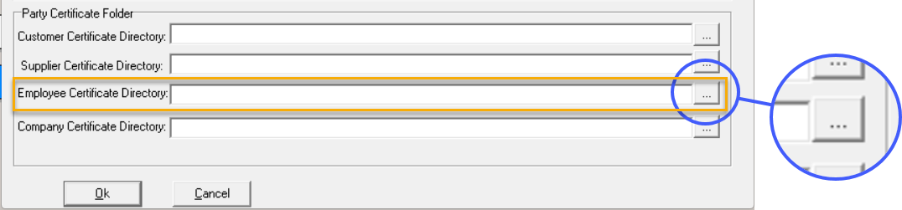  

The **Select Directory** pop-up screen is displayed.  
	
  

9.  **Repeat Steps 5 - 7** as above.  

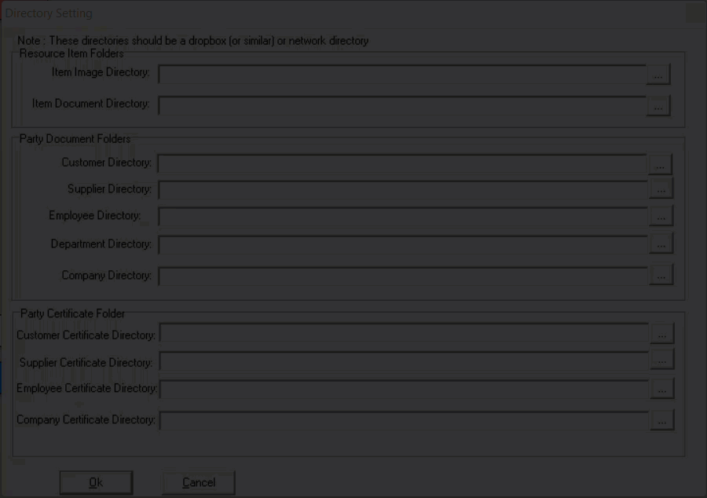  

**The Directory Settings for Employee Documents and Certificates have now been completed**.  

:::tip  
Follow the same procedure as detailed above to define the Directory Settings for **Resource Items**, **Customers**, **Suppliers**, **Departments** and the **Company**.  
:::  

10. Once you have entered all the information for **Directory Settings** click the
    **OK** button.  

___
### Certificate Definition and Rules  

The following Step-by-step guideline describes the process of **viewing**, **adding** and **maintaining** **Certificate Definitions** for all parties in the SEMS system.  

1.  Select the **Setup** option from the Main Navigation menu.  

2.  Click on **Certificate Definition** from the Drop-down menu.  
	
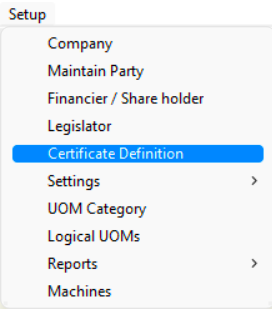  

The **Certificate Definition List** screen is displayed.
	
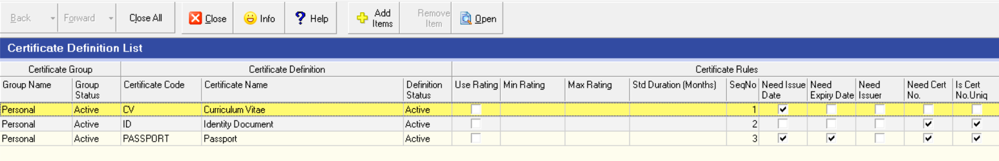  

Initially the SEMS system lists 3 Certificate Definitions under the **Personal Group**;
- Curriculum Vitae (CV)  
- Identity Documnet (ID)  
- Passport  

In this exercise we will be adding another Certificate Definition and apply the appropriate rules.  

:::info   
We will be adding a **Matric Certificate** record for a specific employee in the next stage.  
Thus the reason for definining an additional Certificate with relevant rules.  
:::

3.  Click the **Add Items** button on the Form bar.
	
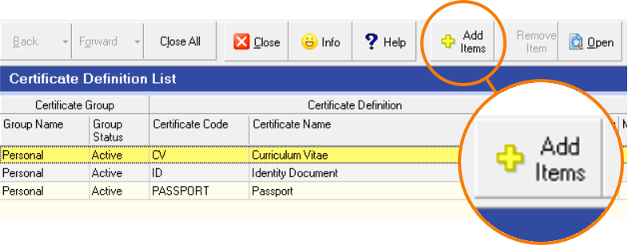  

The **Add New Certificate** screen is displayed.
	
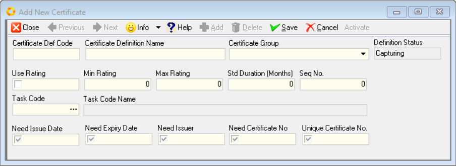  

4. Capture an appropriate Certificate Definition Code in the **Certificate Def Code** field.  

:::note Assigning an Appropriate Certificate Definition Code  
In this instance the code **EDU-NQF4-NSC** is used...  
**EDU**, an abbrviation for **Education**  
**NQF4** - **National Qualification Framework, Level 4**  
**NSC** - **National Senior Certificate**  
:::  

5.  Complete the **Certificate Definition Name** field.  

6.  Choose the relevant option from the **Certificate Group** drop-down menu.  

:::info Optional Fields  
The **Use Rating** checkbox, together with the **Min Rating** and **Max Rating** fields are used when you need to apply different values / weights to the same type of certificates.   
In the case of Matric Certificates, some candidates will have different results and / or subjects when compared to others.  This can be useful from a management perspective when deciding which employees are better suited for a specific **task** or **project**.  
:::  

7.  Once the primary Certificate Definition fields have been completed, click the **Save** button.
	
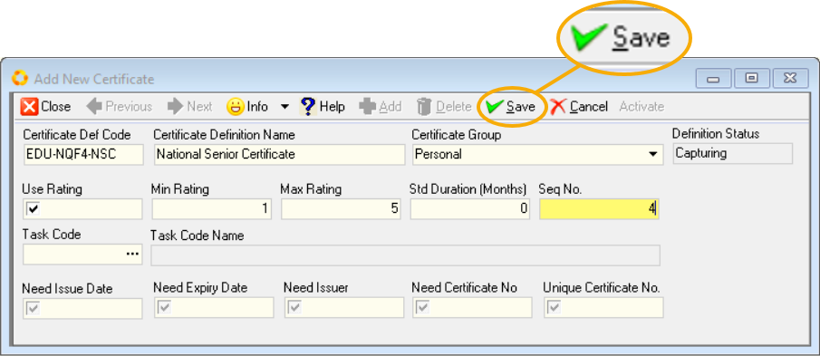  

8.  Once saved, the Certificate Definition **Rules** can be applied by selecting / de-selecting the relevant checkboxes;
-   Need Issue Date
-   Need Expiry Date (in those cases where a certificate is only valid for a certain period of time, _e.g. drivers license_.)  
-   Need Issuer (where more than one authority supplies the same type of certificate)  
-   Need Certificate Number
-   Unique Certificate No.  
	
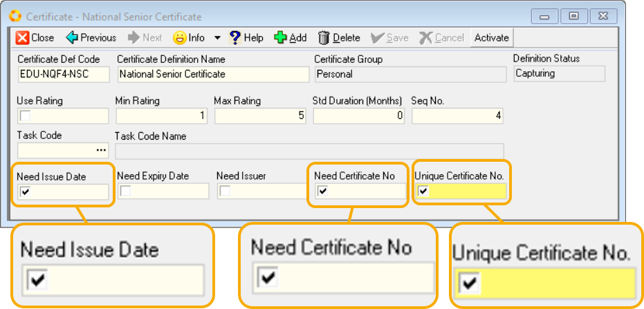  

In the example above, those rules relevant to a Matric Certificate were selected.  

9.  Once you are satisfied that all the information is correct, click on the **Save** button and then **Activate** the record.  

10. The Certificate Definition & Rules screen can now be **Closed**.

The Certificate Definition List screen now displayes the newly added Definition.

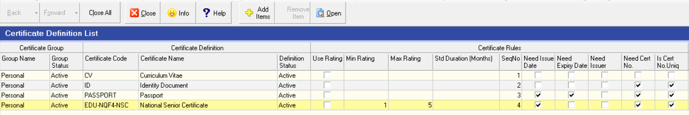  

Repeat the above procedure to add further Certificate Definitions.  

:::important  
The Certificate Definition needs to be **Deactivated** before amendments can be made.  This is also true for those definitions that need to be deleted / removed.  
:::  

___

## Add / Maintain Certificate records and associated documents for individual employees  

1.  Select the **Employee** option on the Main Navigation Menu.  

2.  Click on **Employee List** in the Drop-down Menu.  

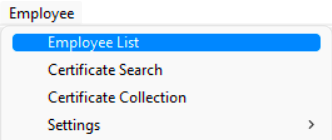  

The **Employee List** grid is displayed.  

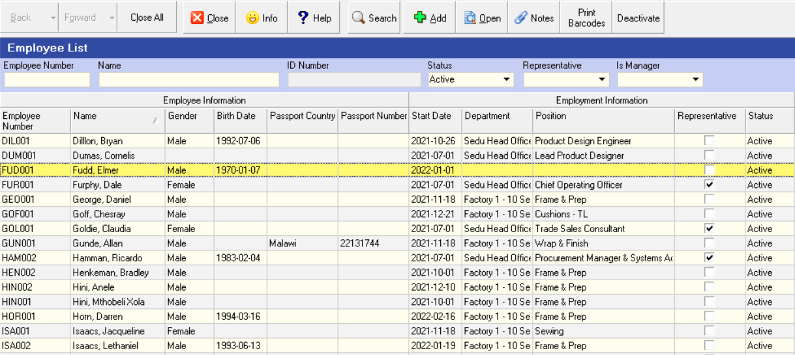  

3.  Select the employee record row and the click the **Open** button on the Form Bar _(alternatively, double-click the record row to Open_.)  

The specific **Employee** screen is displayed.  

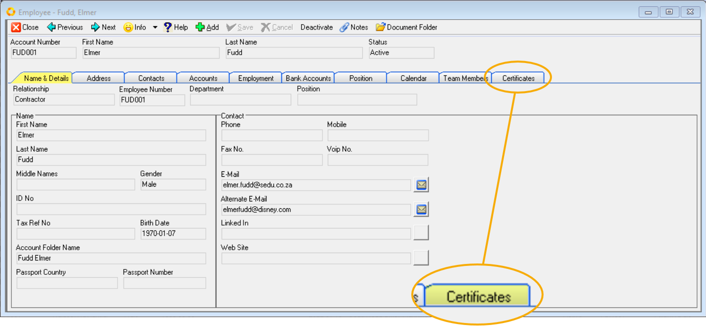  

4.  Click the **Certificates** tab.  

The Certificates Tab grid is is displayed.  Intially there will be no Certificate / Document records.  

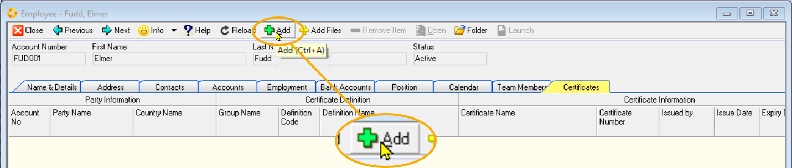  

5.  Select the **Add** button on the Form Bar.  

A Confirmation dialogue box is displayed.  

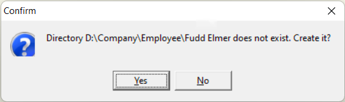  

6.  Click **Yes** to confirm the creation of the relevant employee sub-directory.  

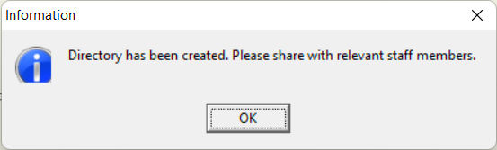  

7.  Click the **OK** button on the Information dialogue box.  

:::impotant  
At this satge of the procedure, it is neccessary to **copy** or **move** and/or **save** the employee document files to the newly created sub-directory.  

This is achieved by using **Windows File Manager**.  
:::  

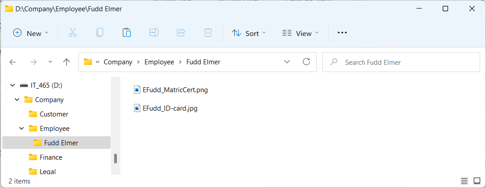  

8.  Select and **Open** the certificate / document file from Windows File Manager using the associated application.  

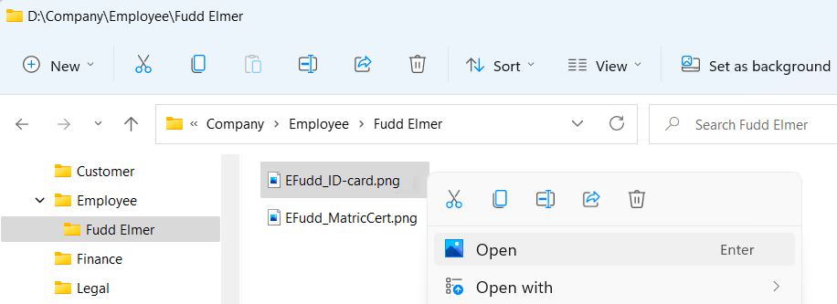  

9.  Use this for reference to enable the capture of information to the SEMS system.  

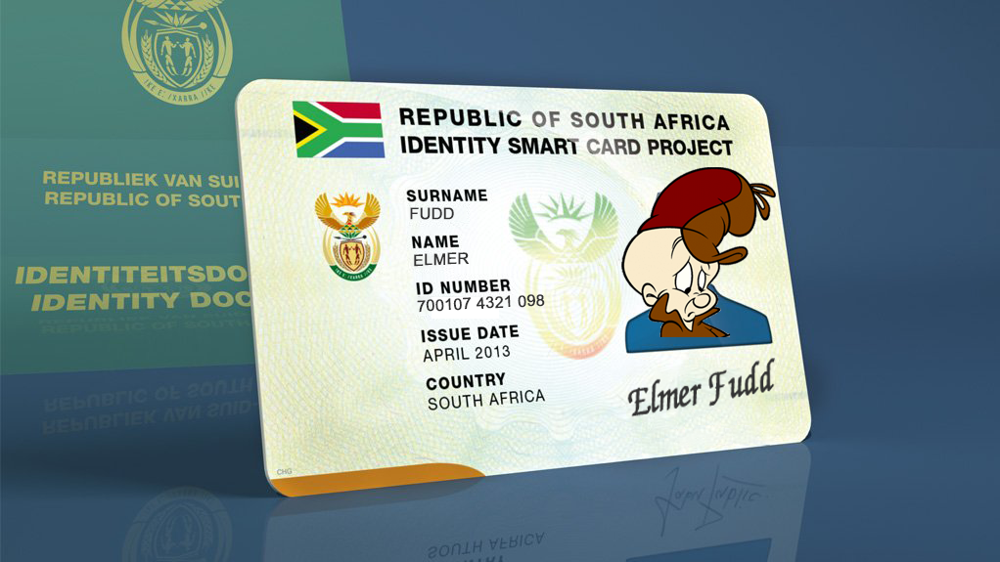  

:::tip  
If your computer system has a dual screen setup, it is recommended that the certificate/document file is displayed on one screen, while the SEMS application is active on the other screen.  

Alternatively, the two applications could be displayed side-by-side on a single screen setup.  

Another option would be to **"ALT + TAB"** between the two applications.  
:::  

10. In the SEMS application, click on the **Add** button on the Form Bar of the Certificates Tab in the Employee screen.  

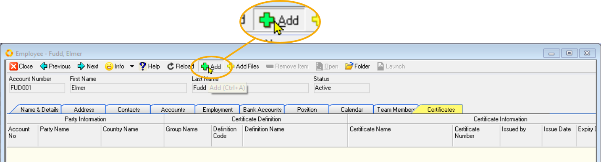  

The **Add New Certificate** screen is displayed.  

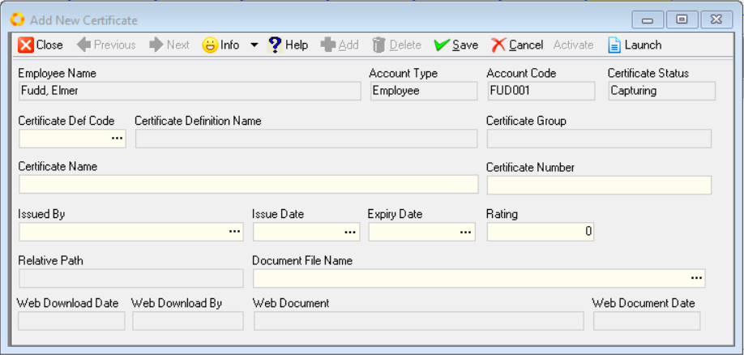  

11. Select the **three-dot button** in the **Certificate Def Code** field.  

The **Certificate Definition** grid screen is displayed.  

12. Click on the relevant Certificate Definition record, in this instance, the **ID | Identity Document** row...

13. Then click the **Select button** on the Form Bar.  

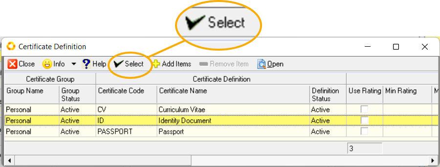  

The Definition Name and Certificate Group is automatically populated by the system.  

14.  Enter the relevant information in the **Certificate Name** field.  

15. Capture the **Certificate Number** - in this instane, the identity number.  

16. Select the **Issue Date** from the calender, accessed by clicking on the **three-dot button** and navigating to the correct date of issue.  

:::note  
The **Issued By**, **Expiry Date** and **Rating** fields don't need to be captured in this case, as this information is extraneous in this particular representative exemplar.  
:::  

17. Select the **three-dot button** in the **Document File Name** field...  

18.  Navigate to, select and **Open** the relevant document file.  

19. Once all the the neccessary information has been captured, click the **Save** button.  

20. The **Launch** option on the form bar opens the document file.

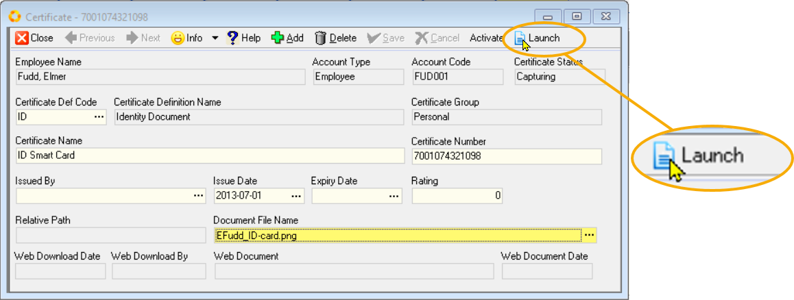  

21. Check and compare the information to ensure all details have been captured accurately.  

22. Once any neccessary amendments have been made and you are satisfied that the information is correct, click the **Save** button on the Form Bar.  

23. The Certificate Detail record can now be **Activated** and **Closed**.  

The Certificates Tab grid is displayed, with the newly added record listed.  

To capture additional Certificates & Document records, repeat steps 10-23 as detailed above.  
___

**This is the end of this procedure.**
