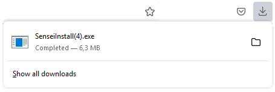
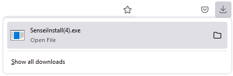
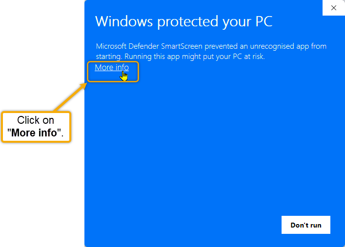
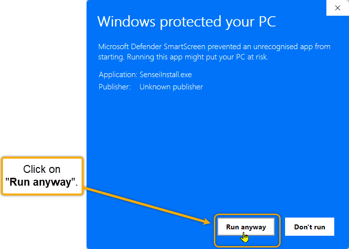
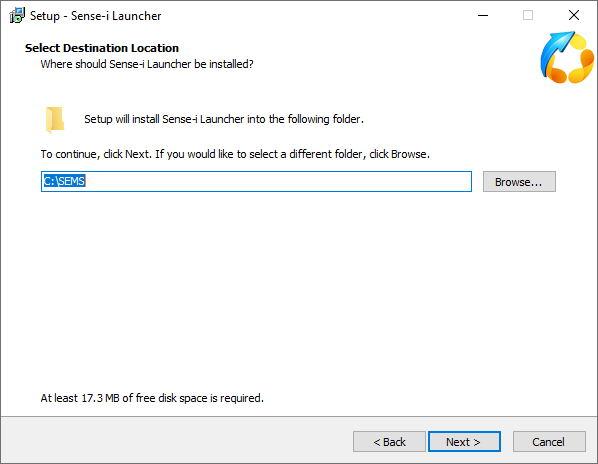

## Introduction  

This **step-by-step guide** will show you **how to download and install** the **Sense-i Launcher** application.  

:::note  
The buttons & links displayed on the images in this guide are **NOT ACTIVE** and soley used for **reference purposes**.  
:::  

## Download and Install  

Access the latest version of the [Sense-i Launcher Installation files **here.**](https://elfworks.co.za/subdomains/sense-i/Install/download.html)  

Once you have linked to the download site, perform the steps as outlined below to install the necessary software on your device.  

  

1.  Click the **Download Sense-i Launcher** button.  

The browser will download the install file, and once complete will display some form of confirmation.  
The exact format will depend on which browser you are using but will result in something similar to the following:  

  

2.  As you move the mouse cursor over the download file, the display may change to the following:  

  

3.  Click the **Open File** option.  

Depending on your Windows security settings, a warning dialogue box couldpossibly display, titled **Windows protected your PC**.  

:::note  
The colour of this dialogue box may vary depending on your chosen Windows theme settings.  
:::  

  

4.	**NB!** Select the **More info** link.  

----

  

5.	Click on the [ **"Run anyway"** ] button.  

----

:::note User Account control  
The **User Account control** dialogue box will display the message:  

"Do you want to allow this app from an unknown publisher to make changes on your device?"  

SenseiInstall.exe  

Publisher: Unknown  

File origin: Hard drive on this computer  
:::  

6.	Select [  **Yes**  ].  

----

## Setup - Sense-i Launcher  

The **Setup - Sense-i Launcher** dialogue screen is displayed.  

  

1.	Click the [ **Next >** ] button.  

----

The **License Agreement** screen is displayed.  

  

2.	Select the "**I accept the agreement**" radio-button option.  

3.	Click the [ **Next >** ] button.   

----

The **Select Destination Location** screen is displayed.  

  

:::tip  
The **recommended default location** is **C:\SEMS**  
:::  

4.	Click the [ **Next >** ] button.  

----

The **Select Additional Tasks** screen is displayed.  

  

It is advisable to keep the **Create a desktop shortcut** option checked.  
This for quick access to the application in the future.  

5.	Click the [ **Next >** ] button.  

----

The **Ready to install** screen is displayed.  

  

6.	 Click the [ **Install** ] button.  

The relevant files are then extracted to the chosen location on your machine.  

----

  

The **Launch Application** option is checked by default.  

7.	Click the [ **Finish** ] button to complete the installation.  

----

Click on the link, **[Using the Sense-i Launcher](https://sense-i.co/docs/LAUNCH)**, for instructions on how to proceed with the process.  

----

