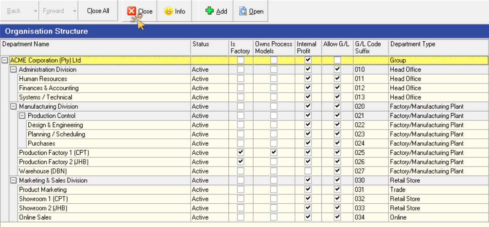

## Introduction and Overview  

This **step-by-step guide** will show you **how to Define and Configure** the various **Departments** within your Company.  

Once the **Orginisation Structure** for your Company is in place, it is important to enter this information in the **SEMS** application.  

This task is typically performed by the SEMS System Administrator in your orginisation.  

The transactional relationships between the Departments in the Company are of utmost importance in the Product Costing Process.  

:::important Company Profile  
Before proceeding with the setup of Departments in your company, ensure that the **Company Profile** and related information has been captured in the SEMS application.  

Refer to the document titled **["Company Profile & Settings"](https://sense-i.co/docs/CMP001)**.  
:::	 

In this guide, we will, as an example, describe the process of defining Departments for a prototypical company operating in the Furniture Manufacturing industry.  

  

We will use the above Organisation Tree diagram (also referred to as **Organisation Structure Nodes** _(OSN)_) as reference when defining the Departments in the SEMS application.  

## Add Department  

1.  Click on the **Business Model** button in the Main Navigation Menu.  

2.  Then click **Organisation Design** in the drop-down menu.  

3.  Then click **Organisation Structure** in the side menu.  

  

The system will display a screen titled **Organisation Structure**.  

The first time this screen is accessed, only the name of the Group Company is displayed in the Department List Grid.  

Once the Departments have been added, this screen will list all the main Divisions & Departments that have been defined in the system.  

  

4.  Click the **Add** button on the Action Bar.  

A **Confirmation dialogue** box is displayed.  

  

5.  Click the **Yes** button to add the new department under the Company.  

The **Add New Department Profile** screen is displayed.  

  

6.  Enter the name of the department in the **Department Name** field.  

:::note  
The **Parent Department** field displays the name of the Company.  
:::  

7.  Click on the drop-down arrow in the **Department Type** field to select the relevant department type.  

In this example we will select the **Head Office** option.  

  

### Description & Address  

1.  Enter a short description of the new department in the **Department Description** field.  

2.  Click on the three-dot button in the **Department Manager Name** field.  
The **Select Manager** screen is displayed.  

:::important  
A list of Managers will be dispayed if Employee details have been captured AND the relevant **Position(s)** have been assigned to those employees that hold management positions.  

Refer to the documents titled **["Employee Positions"](https://sense-i.co/docs/POS001)** and **["Capture Employee Information"](https://sense-i.co/docs/SAF1204)**.  
:::	 

3. Search for, and **select** the relevant Department Manager from the list.  

  

4. Enter an order Suffix in the **Order Suffix** field.  

:::tip  
This is relevant where, for example, different departments generate similar orders (Sales Orders and/or Purchase Orders).  The Order Suffix is an efficient method to differentiate which department generated and managed orders and is especially useful in the reporting process.  
:::  

5.  Click on the three-dot button in the **Department Address** field.  

:::info  
The **Select Address** screen is displayed with a list of Company addresses as defined in the Company Profile process.  

Refer to the document titled **["Company Profile & Settings"](https://sense-i.co/docs/CMP001)**.  
:::	 

  

6.  Click on the address row that is applicable to the department, and then click the **Select** button on the form Action Bar.  

:::info Add Address  
The Select Address screen enables you to **Add** a new address for the department you are defining.  
:::  

### Contact _(Department)_  

Next we will capture the Department contact information in the fields under the **Contact** section.  

  

1.  Enter the main phone number for the Department in the **Phone** _(number)_ field.  

2.	Enter the mobile number in the **Mobile** _(number)_ field.  

3.	Enter the Fax Number in the **Fax No.** field.  

4.	If the department uses the internet to communicate (using an application like Skype, WhatsApp or Telegram), enter the departments's **VOIP** _(number / name)_ in this field.  

5.	Enter the Primary **Email** address.  

6.	Enter any **Alternate Email** address.  

7.  Enter the Website Address for the department in the **Website** address field.  

8.  Once you have entered the necessary and available information, you should click on the **Save** button on the form Action Bar to save this information.  

  

9. Click the **OK** button on the Information dialogue box.  

:::important  
It is neccessary to log out of the SEMS application in order to save the department information to the database.  

In practice, this only needs to be done once all the primary department information has been captured.  
:::  

Once saved, the Company **Common Name**, **Registered Name** and **Company Reg No** fields are automatically populated from the information as captured in the **["Company Profile & Settings"](https://sense-i.co/docs/CMP001)** process.  

  

### Settings  

The previously greyed out fields in the form header section now become accessible.  

1. Click the check-box in the **Allow G/L Accounts** field to permit General Ledger accounts for this department.  

2. Enter the General Ledger suffix code in the **G/L Suffix** field.  

:::note  
The General Ledger account information can be obtained from the company Financial Manager.  
:::  

3. Click the check-box in the **Allow Internal Profit** field if the department is permitted to generate internal profit when transacting with other departments in the company.  

4. Click the check-box in the **Is Factory** field only if the department is a **Manufacturing** and/or **Production** department.  

:::tip Factory and Process Models  
It is typically the **Factory** _(as a department under the Manufacturing Division)_ that define and **own the Process Models** (also known as Bills-of-Material).  

As this is the Administration department information we are working with, we will leave the **Is Factory**, and the **Owns Process Models** fields un-checked.  

  

We can check these fields when we capture the information for the **Production / Factory** sub-department under the **Manufacturing Division**.  
:::

5.  Now that the Department Settings information has been captured, click on the **Save** button on the form Action Bar.  

  

6. Click the **OK** button on the Information dialogue box.  

:::important  
Before proceding to the **OSN Positions (Department Positions)** TAB, ensure that Company Employee **Position** information has been captured in the system.  

Refer to the document titled **["Employee Positions"](https://sense-i.co/docs/POS001)**.  
:::	 

### Department Positions _(OSN Positions)_  

1.  Click on the **Department Positions** TAB.  

  

The Department Position grid is displayed, with the columns **Position Name** and **Seq No** _(Sequence Number)_.  

2.  Click on the **Link** button on the form Action Bar.  

The **Position** screen is displayed listing all the positions defined for the company.  

  

3.  Click on the relevant row and then click the **Select** button on the form Action Bar.  

The Department Postion TAB now lists the Position chosen above.  

  

4.  Click the **Link** button to add another record to the Postion List.  

5.  Again, click on the relevant row and then click the **Select** button on the form Action Bar.  

The Confirmation dialogue box will be displayed with the message **Create a new root Position?**  

6.  Click **Yes** if the position is on the same _hierarchial / reporting_ level as the previous position selected.  

    Click **No** if the selected employee postion reports to the previous position.  

    In this example we will choose the **No** option, as the HR Manager reports to the Chief Operating Officer.  

:::tip  
This is extremely useful when structuring teams in a reporting hierarchy.  The SEMS system supports multiple levels in the position hierarchy.  
:::  

7.  Repeat steps 1 through 6 above to link additional Department Positions.  

  

8.  Change the Sequence number by clicking on the relevant row under the **Seq No** column, and then type in the desired value.  

9.  Once you have linked all the relevant Department Positions, click on the **Department Profile** TAB.  

10. If you are satisfied with the information captured, click the **Save** button, and then the **Activate** button.  

11. Click the **Close** button to return to the Organisation Structure screen.  

  

## Add a Sub-department  

To add a sub-department, ensure the row with the main Department / Division, as previously is selected / highlighted.  

1.  Click the **Add** button on the Action Bar.  

A **Confirmation dialogue** box is displayed.  

  

2.  Click the **Yes** button to add the new sub-department.  

The **Add New Department Profile** screen is displayed.  

  

3.  Repeat the process from step 6 in the **Add Department** section above.  

4.  Use this method to add all the relevant Divisions / Departments and sub-departments in your organisation.  

  

5.  Once you have completed the process of adding Departments, click the **Close** button on the Action Bar.  

:::important  
It is neccessary to log out of the SEMS application in order to save the department information to the database.  
:::  
___

**This is the end of this procedure.**  

