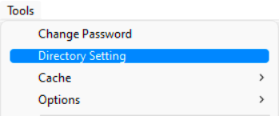

## Introduction
___ 

This module relates to the workflow used to define **Directory / Folder Settings** relevant to resource items and specific parties.  

In this guideline, we will focus on the process of adding Directory Settings for **Employee Documents** and **Employee Certificates**.  

:::note  
The same procedures should be used when **defining Directory Settings** relevant to other parties - **Customers**, **Suppliers**, **Departments**, and the **Company**.  
:::  

Before adding certificates & documents relevant to employees, there are a few settings (prerequisites) that need to be in place.  

These include;
-   **Directory Settings for Employee Document folders**  

-   **Employee Certificate Folder**  
    The directories and folders above should preferrably shared with relevant colleagues, SEMS users and/or management of the company - this could be a shared **Local Area Network** (LAN) directory or shared **cloud based folders** (e.g. Dropbox, Google Drive etc.)  

Once the pre-requisite settings are in place, Certificate records and associated documents can be added for individual employees.

## Step-by-step Guideline

### Prerequisites - Directory Settings   

1.  Select the **Tools** option from the Main Navigation Menu.  

2.  Then click on **Directory Setting**.  
	
  

3.  The system will open a screen titled **"Directory Setting"**.  
    This screen **lists all the Directories & Folders** relevant to each party.  
    
    Here we will define the Employee Document & Certificate Folder Directory paths.   
	
  

4.  In the **Party Document Folder** section, click on the **three-dot button** in the **Employee Directory** field.  
	
  

The **Select Directory** pop-up screen is displayed.  
	
  

5.  Select the shared network **Drive** _(LAN drive or cloud based storage drive)_.

6.  Navigate to the relevant folder in the **Directories** field, and **Double-click** the folder of your choice.  

:::note  
In this instance we have selected **D:\Company\Employee** as displayed in the **Directory Name** field.  
:::  

7.  Click the **OK** button.

8.  In the **Party Certificate Folder** section, click on the **three-dot button** in the **Employee Certificate Directory** field.  
	
  

The **Select Directory** pop-up screen is displayed.  
	
  

9.  **Repeat Steps 5 - 7** as above.  

  

**The Directory Settings for Employee Documents and Certificates have now been completed**.  

:::tip  
Follow the same procedure as detailed above to define the Directory Settings for **Resource Items**, **Customers**, **Suppliers**, **Departments** and the **Company**.  
:::  

10. Once you have entered all the information for **Directory Settings** click the
    **OK** button.  
___
**This is the end of this procedure.**
