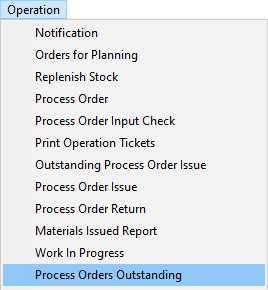
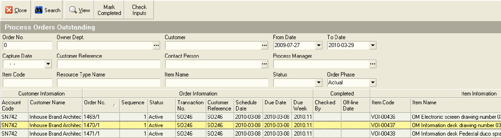
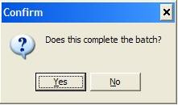
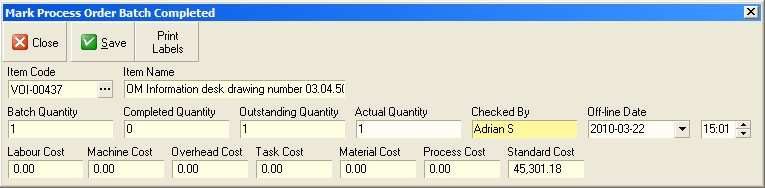
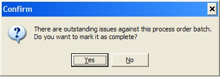

## Procedure Guideline
___  
### INTRODUCTION

#### What does this procedure do?  

This procedure enables a person in the Production or Finished Goods
function to record which Process Orders (aka Job Cards) have been
completed. The system will change the status of a Process Order from
Active to Closed once the Process Orders has been marked as complete.
In addition, the value of the items made will be transferred from
Work-InProgress stock into Finished Goods stock.  

#### Why would you use this procedure?  

To mark Process Orders as complete or finished and to move the value
of goods from Work-In-Progress into Finished Goods.  

Ideally a terminal should be placed at the end of each Production Line
or at the entrance to the Finished Goods Stock area and as goods are
moved from the Production Line into the Finished Goods Stock area they
should be counted and the completed quantity should be entered into
the SEM System using this procedure.  

1.  Select **Operation** from the Main Navigation Menu.

2.  Click **Process Orders Outstanding** on the drop down menu.
	
  

The system will display the Process Orders Outstanding screen. This
screen lists all of the Process Orders currently in progress in the
selected department and that have not been completed.  
	
  	

3.  You can search for specific Process Orders by entering the Process
    Order Number in the Order Number field and then clicking the Search
    button on the Form Bar.  

You should find the **Process Order Number** printed in the top right hand
corner of the Job Card that is attached to the item you are booking
into your finished goods store.  

4.  You can search for a range of Process Orders by setting a **From Date**
    and a **To Date**. The system will then display all Process Orders Due
    to be completed within these two dates.  

5.  You can also enter other information such as a **Customer Name** or a
    **Customer Reference** information in the appropriate fields and then
    pressing the **Search** button on the form bar.  

6.  Once you find the Process Order in the list that you wish to mark as
    completed, click on the row in the grid containing the **Process Order**.  

7.  Then click the **Mark as Complete** button on the Form Bar.  
	
  	

The system will display a screen titled **Mark Process Order Batch Completed**.  
This screen allows you to enter information about the Quantity and Date on which the Process Order Batch was completed.  
	
  	

10. Select the date on which the Process Order was completed in the
    **Off Line Date** field.  

11. Click the **Save** button on the Form Bar.  

The system will display a confirmation screen. If the batch has only
been partially completed (i.e. if the Actual Quantity you have entered
is less than the Outstanding Quantity) and you expect the remaining
quantity to still be made, then click **No**.  
If the batch has been fully completed then click **Yes**.  

The system will then check that all materials that should have been
issued to the Process Order have been recorded on the system. If it
finds that some materials hav not been booked to the Process Order the
system will display a warning dialog You should choose **No**, then go the
procedure for issuing Materials to Jobs, book the materials to the
Process Order and then return to this procedure.  
	
  	

12. You can print Labels to attach to each item as it is completed by
    clicking the **Print Labels** button.  

The system will print labels according the format and layout that has
been specified for the company.  

Repeat steps 6 to 12 for each Process Order as it is completed.  

13. Once you have marked all the Process Orders that have been finished
    as complete, click the **Close** button.  

**This is the end of this procedure.**
