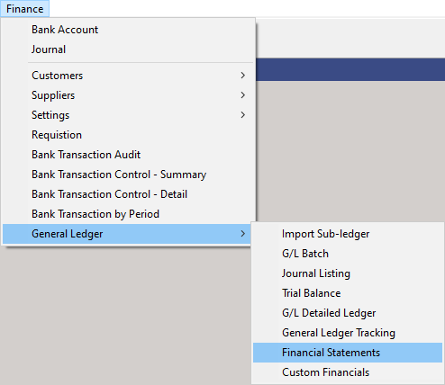
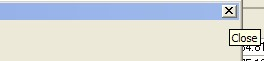

## Step-by-step Guideline  
___ 
1.  Click on the **Finance** option on the Main Menu.

2.  Then click the **General Ledger** menu item on the drop down menu.

3.  Then click **Financial Statements**.  

  

The system will open a screen titled "**Review Financial Statements**."  
This screen lists a series of three tabs, one for each of the standard
Financial Statement Types. Each of the Financial Statements provide
you with a picture of the Financial Position and Activity in your
business to enable you to make informed decisions about what is
working and what needs to be improved.

  

In order to view the Financial Statements for the company, you first
need to define the Start and End Accounting Period that the system
will use for retrieving the information needed to generate the
Financial Statements.

4.  To select a Starting Accounting Period, click the three dot button
    in the From Period field.

The system will open a Select Accounting Periods window.

  

5.  Click on the Accounting Period you wish the system to use as the
    STARTING DATE for the Financial Statements it will generate.

6.  Then click the Select button.

The system will close the Select Accounting Periods window and display
the Accounting Period you have selected in the From Period field.

7.  To select a Ending Accounting Period, in other words the last period
    used for generating the Financial Statements, click the three dot
    button in the To Period field.

The system will again open a Select Accounting Periods window.

8.  Repeat the steps 5 to 7 above to select an Ending Accounting Period
    for the Financial Statements you wish to view.

9.  Then click the Search button.

The system will then retrieve the information from the General Ledger
required to create the Financial Statements.

You will notice three tabs at the top of the screen...

  

Each of these tabs will display a different Financial Statement Type.

10. To view each of the financial statements created by the system,
    click on the tab to view each statement. Note how the Active or
    Selected Tab is displayed in a slightly darker colour that those
    that are not the one in focus.

11. The tab not in focus is displayed in a lighter colour. To switch to
    a non-active tab and a different Financial Statement Type, simply
    click on the Tab you wish to use.

## The Balance Sheet 

  

12. Note how each of the Accounting Periods you have selected is
    represented in a Band at the top of the Financial Statements.

13. Note how the system displays the SUM TOTAL of the amounts in each of
    the different statements at the **ACCOUNT GROUP** level.

14. Select an Account Group and then click the + sign on the left of the
    Account Group name and the system will...

15. Display an additional row for each of the Accounts in the Chart of
    Accounts that is linked to the selected Account Group.

16. On each row the system will display the Total Value of all the
    Transactions posted to the selected Account in the period.

17. You can choose to display rows containing any Accounts that have a
    Zero Balance (and therefore no posted transactions) by checking the
    Show Zero Balance option at the top of the screen. The default is to
    hide all Accounts that have no transactions posted to them.

  

If you wish to see how the system has calculated the amount displayed
for any account you can drill into a detailed breakdown called the
General Ledger Detailed Ledger report.

18. Click on the cell that contains the value you wish to analyse.

19. Then click the Drill Thru button on the Form Bar.

The system will open a window on top of the Financial Statement you
are viewing and in this window will display the details of every
transaction posted to the account you have selected to drill into.

  

20. You can print the transactions listed in the Detailed Ledger by
    clicking the Print button.

The system will display the General Ledger Detailed Listing for the
selected account in a Print Preview window. You can save and email
this report as a PDF or Print the Report directly from this screen.

21. To print the report, click the Printer Icon displayed at the top
    left of the screen and then select the appropriate print settings.

  

22. When you have completed printing the report, click the Close button.

23. When you want to close the Detailed Ledger Drill Through screen,
    click the Close icon on the top right of the window.

  

The system will then close the General Ledger Detailed Listing Drill
Through screen and return you to the Financial Statement in which you
are working.

You can now view Financial Information for the Income Statement and
Cash Statement in the same way you have viewed the Balance Sheet and
also drill through to view the detail of the transactions posted to
each account.

## The Income Statement 

  

## The Cash Statement 

  

24. When you have completed Reviewing Financial Statements for your
    company, click the Close button.

  

25. The system will close the Review Financial Statements screen.

**This is the end of the procedure.**
