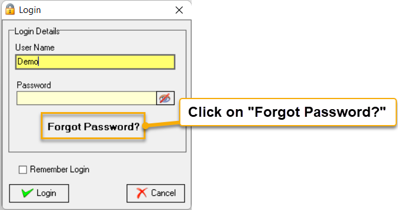
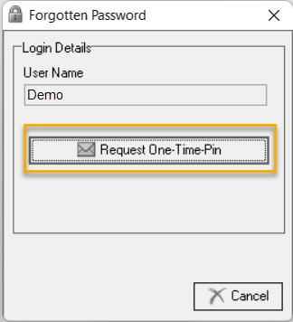
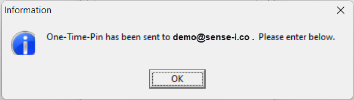
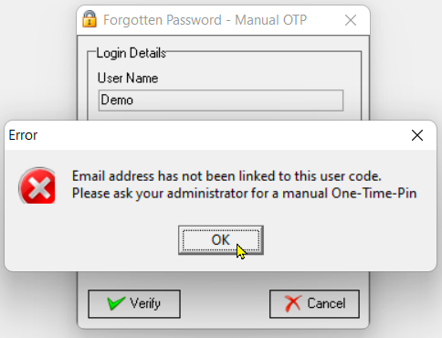
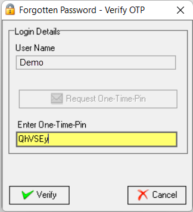
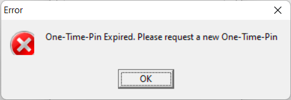
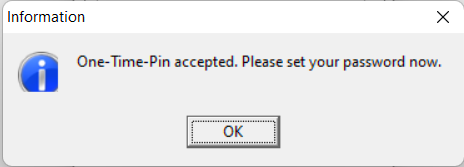
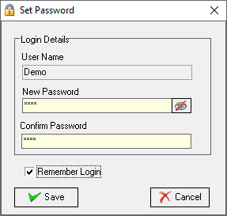
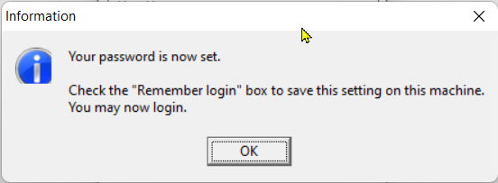
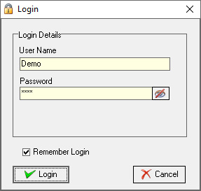

## Procedure Guideline
___  

### Forgot Password  

These are the steps to follow if you've forgotten your Login Password;

1.  Click on **Forgot Password?"**  
 
  

The **Forgotten Password** dialogue box is displayed.  

  

2.  Click on the [ Request One-Time-Pin ] button.  

  

The SEMS system will send you an email with your OTP.  This to the email address as captured in the SEMS application - in this example **\demo@sense-i.co** as displayed in the information dialogue box.

:::note  
If your User Name has not been linked to an email address in the SEMS application, the system will generate a dialogue box asking you to contact your **SEMS System Administrator**, who will then supply you with a manual **One-Time-Pin** (OTP).  

  

Click the [ OK ] button to close the dialogue box.  
:::

3. Copy and paste the OTP from the email / or type it directly into the **Enter One-Time-Pin** field. 

  

4.  Then select the **[ Verify ]** button option.  

:::important  
The OTP is valid for a certain time only.

If the One-Time-Pin has expired, you would need to request a new OTP.  

  

:::

Once verified, the system will display an Information dialogue box stating that the OTP is accepted.  

  

5.  Click on the **[ OK ]** button.

The **Set Password** screen is displayed.

 
 
6.  Enter and Confirm your new password.

7. Select **[ Save ]**.

 

8.  Click the **[ Ok ]** button on the Information box confirming your password has been set. 

:::tip  

Activate the Remember Login check box (optional).

This option is recommended if you are the only one using a specific computer which only you have access to.
This option automatically saves your User Name and Password allowing you to simply select [ Login ] on subsequent SEMS application access.

:::

9. Click the [ Login ] button.  

**This is the end of this procedure.**
