## Introduction  

In order to configure your SEMS outgoing email using a **Gmail address**, you need to enable 2-step Verification on your Google account, and use an **App password** instead of your Google account’s normal password.

An _App password_ is a 16-digit code that gives an external App (in this instance, the SEMS Application) or device permission to access your Google Account.

We recommend turning **2-step Verification ON** due to the fact that Google is constantly restricting access to non-Google products.  

**How to set up SMTP with 2-Step Verification ON**  

Follow the steps below to learn how to send emails through your Gmail SMTP server:
1.	Open your Gmail account and click on the **gear icon** to access its settings.  

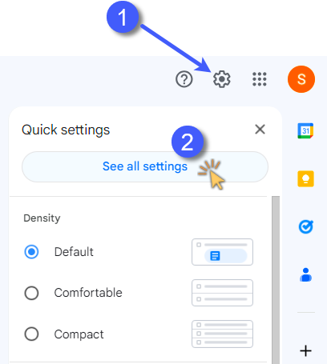  

2.	Then click on **See all settings**.  

3.	Click on the “**Forwarding and POP/IMAP**” option.  

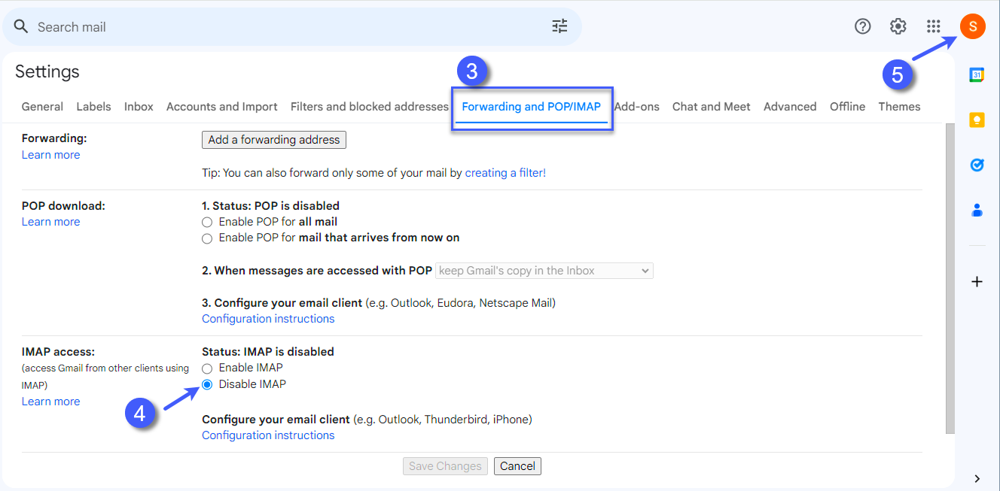  

4.	Look for the section called **IMAP access** and ensure **Disable IMAP** is checked.
 
5.	Now click on your account’s icon and select **Manage your Google Account**. 

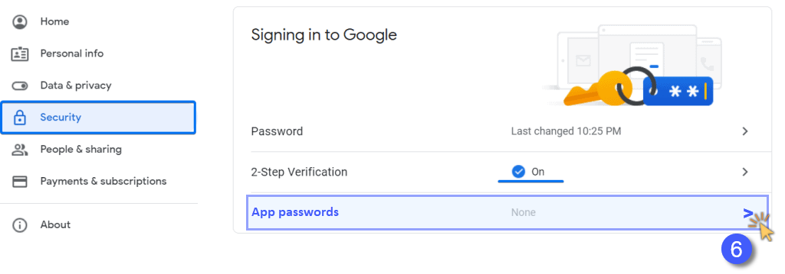  

6.	Open the **Security** section and select **App passwords**.

 

:::note  
If “App passwords” does not appear in the **How to Sign in to Google** section, use the search function to search for **App passwords**.  

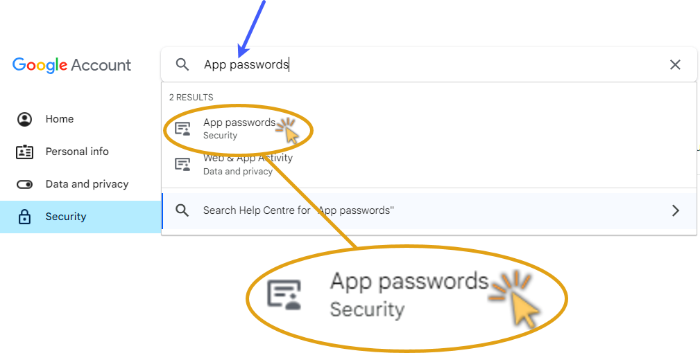  

Click on the **App passwords / Security** option.  
:::  

6. On the **App passwords** screen, type a name and click **Create**.  

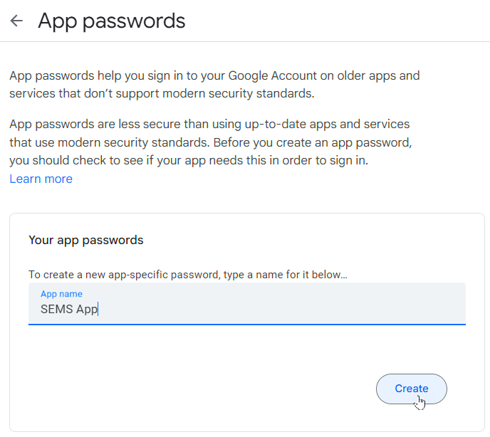  

The name can be **SEMS App**. This way you know that the password is related to your SEMS Application.
 
7. It will give you a 16-digit code. **Copy** and save the password.
 
:::important  
Once you click on **Done**, the password can no longer be retrieved.  
Ensure you are copying and saving it somewhere safe before clicking on Done.  
:::  

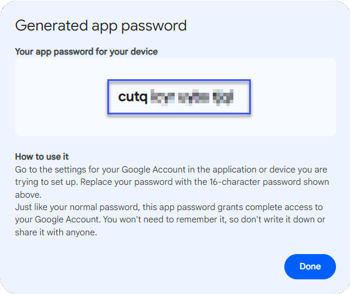  

## SEMS Outgoing Email Settings  

Now that you have the password, you can launch your SEMS Application and navigate to the **Email Settings** screen.  

Refer to the document titled **[Configure Outgoing Email Settings](https://sense-i.co/docs/CNFE002)**.  

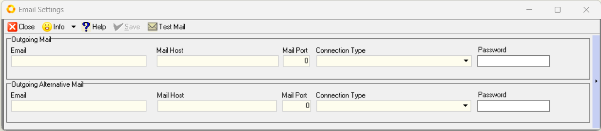  

1. Insert your Outgoing Email details using the following settings:

•	Email: **_your Gmail email address_**  
•	Mail Host: **smtp.gmail.com**  
•	Mail Port: **587**  
•	Connection Type: Select **SSLAuto** from the drop-down Connection Protocol options.

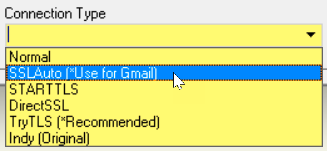  

•	**Paste** the **App password** copied earlier into the **Password** field.

2. Click the **Save** button on the Action Bar.  

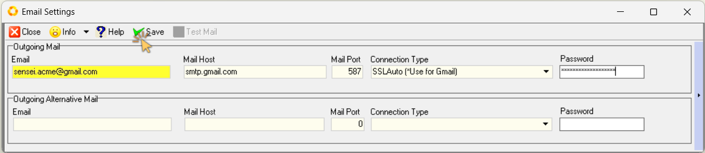  

3.  The **Test Mail** button is now accessible.  

## Test Outgoing Email  

1. To test that the outgoing email settings have been correctly captured, click the **Test Mail** icon on the Action Bar.  

2.  The program will display the Email window.  

  

3.  Click the drop-down arrow in the **Email From** field.  Then select the **Gmail** address.  

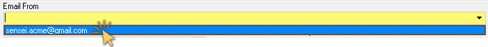  

4. Type in the email address you would like to send to in the **To** field.  

5. You can add additional email addresses as required in either the **To** or _Copy_ **(CC)** fields.  

6. The program will automatically populate the **Subject** line with _"Test Email"_.  Alter this if needed.

7. You can add any text for the email you are sending in the **Comment** field.  

8. And you can add any additional attachments to the email by clicking the  button at the top of the form.  

9. When you have completed your email, click the 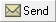
 button at the top of the form.  

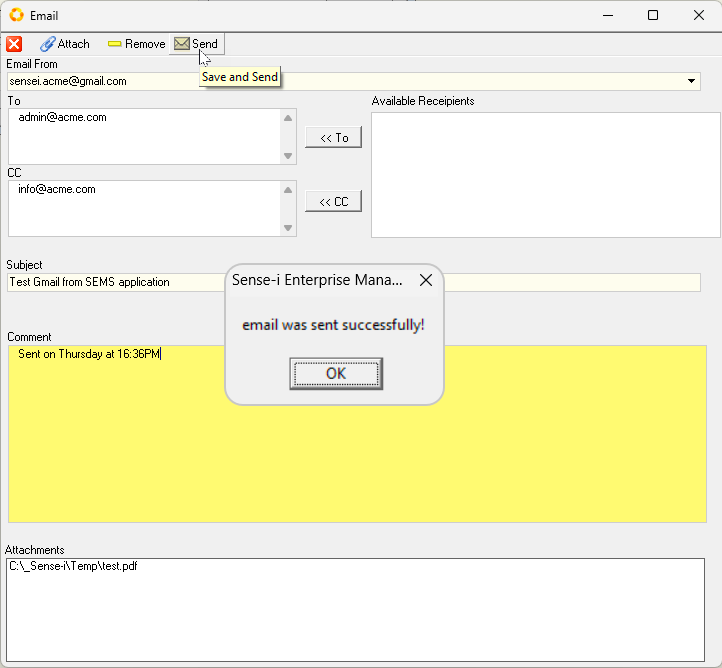  

The **Information** dialog will display **"email was sent successfully!"**.  

10. Click **[ Ok ]** to continue.

12. To close the Email screen, click the 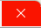 icon button at the **top-right** of the screen.  

The system will close this screen and return you to the Email Settings screen.  

From now on, all emails sent from this Gmail address in the SEMS application will be sent through your Gmail SMTP server.
___
