___  
## Introduction  

You would use this procedure whenever you wanted to create a new
Internal Order from one Department for products or services provided by
another Department.  

:::note  
There are two ways Internal Orders can be created between the
departments in a company.  

The one is a **Manual Internal Order** (which is covered by this document), the other is via the **Replenish Function**, which is covered by
**[Create Finished Goods Plan](REP001)**.  
:::

1.  Click on the **Orders** bar on the Main Navigation Menu at the top
    of the screen.

2.  Then select **Internal Order** option from the Drop-down Menu.
	
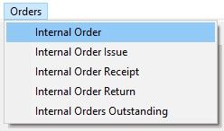  

3.  The system will open a screen titled **"Maintain Internal Order".**

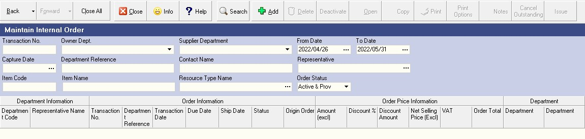  

## Search  

This screen lists all the Internal Orders that have already been
captured in the system within the ***From Date*** and ***To Date***
specified in the Search Criteria Panel.  
	
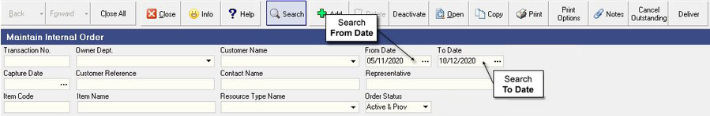  

## Add New Internal Order 

1.  Click on the **Add** button on the Form Bar to open an Add New Internal
    Order form.

You will first need to decide which department is placing the order for
the products or services that you want to include in the Internal Order
you are preparing.

This is the department or branch for whom you are capturing the Internal
Order, the **Customer Department**.

2.  Use the drop-down button in the **"Owner Dept."** field.

3.  The system will open a screen just below the department field called
    **Select Department**. This screen enables you to select a specific
    department or branch from a list of all the departments / branches
    defined for the company.
	
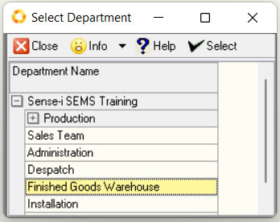  

Click on the **name of the department** you wish to use as the Customer
Department.

4.  Click the **Select** button on the form menu bar.

5.  The system will return to the **Add New Internal Order** screen and
    display the name of the department you have chosen on the screen.

Next you will need to select the **Supplier Department** that will be
providing the products or services on the Internal Order you are
capturing.

6.  Use the **three-dot button** in the **Supplier Department** field.
	
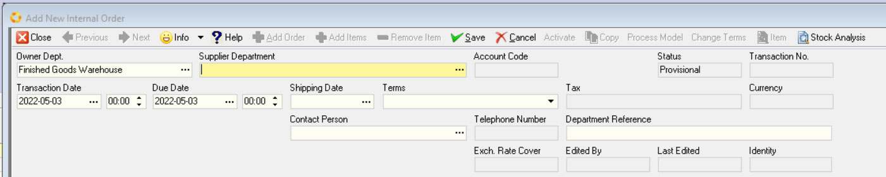  

7.  The system will open a screen just below the department field called
    Select Department. This screen enables you to select a specific
    department or branch from a list of all the departments / branches
    defined for the company.
	
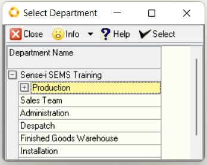  

Click on the **name of the department** you wish to use as the Supplier
Department.

8.  Click the **Select** button on the form menu bar.

The system will return to the **Add New Internal Order** screen and
display the name of the department you have chosen on the screen.

Next you need to press the **[TAB]** key on the keyboard to enter the
remaining information about the Internal Order before you select the
specific products or services that you wish to include on the order.

You need to enter information such as the;

### Due Date 

The due date is the date (and optionally time, depending on how the
departments in your company arrange deliveries) by which the products
for which you have quoted need to arrive at the specified department's
location.  

9.  To set the Due Date, simply click on the required date from
the pop-up date control displayed under the **Due Date** field.
	
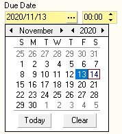  

:::note

You can adjust this at any stage with the **Adjust Due Date** function
if this changes.

:::

### Shipping date 

The Shipping Date is the date by which the items for which you have
quoted must be despatched.

This is normally calculated by deducting the Shipping Duration and any
buffer times allowed as a safety margin, from the Due Date above.

10. To set the **Shipping Date**, simply click on the required date from the pop-up date control displayed under the **Due Date** field.

:::note

This too can be changed at any time with the
**Adjust Shipping Date** function.  

:::

### Payment Terms 

The Payment Terms will determine how the customer department will need
to pay for the products or services for which you have orders.

As a default, each Department is assigned a payment term which is
applied to their account.

11. To change the payment terms for a specific transaction, click the
**down arrow** in the **Terms** field.

The system will display a list of available payment terms from which you
can select the appropriate payment terms you wish to apply to the
transaction you are creating.
	
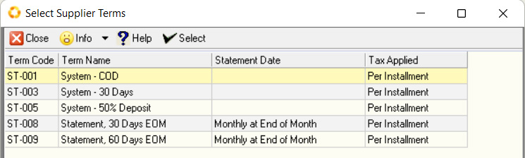  

### Contact Person 

To make it easy to provide follow-up service and communicate with the
correct person at the company, you should make sure that you link the
correct contact details for the person representing the customer in the
**Contact Person** field.

12. Click on the **drop-down button** on the right of the
**Contact Person** field.

The program will display a list of all the contacts that have been
defined for the Department.
	
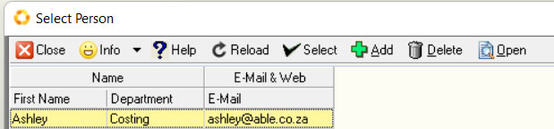  

13. You can click on the row that contains the details for the appropriate
contact person in the list if this already exists and click the **Select**
button at the top of the form.

If the contact person for whom you are preparing this transaction does
not exist, you can add the details of a new contact by clicking on the
**Add** button at the top of the form.

For more instructions on how to create details for a new contact person
read through the **Creating Contacts** procedure.

14. Enter an **Internal Order Reference** or Order Number (in the Department Reference) field.

Once you have entered the **"Header"** information about the transaction
you need to save this and then begin selecting products from the
company\'s Product Catalogue.

15. Click the **Save** button on the form Menu bar. The system will save the information about the Internal Order and enable the
**Add Items** button.

## Add Items to the Internal Order / *Select Products from Catalogue* 

1. Click the  button to open the company's product catalogue.  

1. The system will display a screen titled **Item List**.

3. You can search the Item List for specific items by typing in the **%** symbol and part of the product name in the 
**Item Name** field.

1. Click the  button on the form bar.

1. You can narrow the list of Items displayed on the screen by clicking
    one of the **Product Types** on the right of the screen.

    The program will then filter the list of Items displayed in the grid and show only those items or products that match 
	the one you have clicked on in the **Product Type Panel** on the right of the screen.  

1. You can click in the **Item Name** column and simply begin typing the name of the item and the program will find the 
row that matches the letters you have typed on your keyboard.  

1. Click on the name of the product you wish to include in the Internal Order.

1. You can hold down the **[SHIFT]** key and select a group of adjacent products from the list or,

1. you can hold down the control key **[CTRL]** on the keyboard and then select various products from the list that are 
not grouped together.  

:::important
If you are unable to find the product you are looking for, or if the customer wants you
to initiate a change to an existing product, use the relevant procedure to
capture this information as a new item request. You can then continue with the next step.
:::

10. Then click the  button on the form Menu bar.

1. The program will display a dialog informing you of how many products you have added to the Internal Order you are creating.  

12. Click **[OK]**.

1. The program will leave the **Item List** screen open so that you can continue searching for and selecting other 
products you wish to add to the Internal Order you are creating.  

1. Once you have selected all the products you need for your Internal Order, click 
the  button at the top left of the screen.

1. The program will return you to the **Internal Order** screen and display the products you have selected in the detail 
of the Internal Order.

16. Enter the Quantity of the item that you are quoting to the Owner Department in the **Trx Quantity** field. You can press the 
up and down arrow keys to enter the quantities for each item.  

1. The system will display the Selling Price for the item in the **Unit Price** column.
    The price is based on the Price set by the company that applies for the due date you entered above.  
    If you have permission, you can change the Selling Price for the item in the relevant **Unit Price** box.

1. You can enter a discount percentage that you wish to give to the customer on this item in the **Discount %** column.

1. The system will display the default tax rate applicable to the item being ordered in the **Tax Rate** 
column. You can override this if you need to change it.  

1. You can enter any specific notes about the item in the **Notes** column.

1. You can press the **[TAB]** key on the keyboard to create space for another product to be included on the order or 
you can click the  button to view and select from the Catalogue.  

The program automatically saves each of the changes to the order as you make them without you having to click any buttons.  

1. Repeat the above steps until you have captured all the items you need to include on the Internal Order.  

1. Once you have completed entering all the details on the Order, click the  
button on the Form Menu Bar to save the information you have entered to the database.  

---
## Activate Internal Order  

1. To confirm and post the Internal Order to the database and prevent any further changes, click the **Activate** button at 
the top of the form.  

1. You will then notice that the status of the Internal Order has been updated to show
    that has changed from **Provisional** to **Active**. This means that the
    Internal Order is now finalised and can be sent to the Owner Department. Other
    users can now rely on the information in this quote as firm and know
    that it will not change.  
	
1. The program will return you to the **Maintain Internal Order** screen.  

:::tip
You can also simply right click the mouse on the Internal Order in the list and select **Activate**.
:::

Once you have Activated the Internal Order you can choose to Print or Email it.  

---
## Print

Click the **Print** Button  on the Form Bar.  

1. The system enables you to alter the format of Internal Orders to suit the specific
requirements of each of your company departments.  

   When you click the Print button, the system displays a list of the different Internal Order Layouts that have been
defined.  

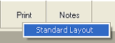 

2. If you do not have any customized layouts defined for your Internal Orders, then the
system will only show the Standard Layout. If custom layouts have been defined, they
will be listed underneath the Standard Layout.  

3. Once you select the appropriate layout or format you wish to print or email, the system
will display this in a Print Preview window.  

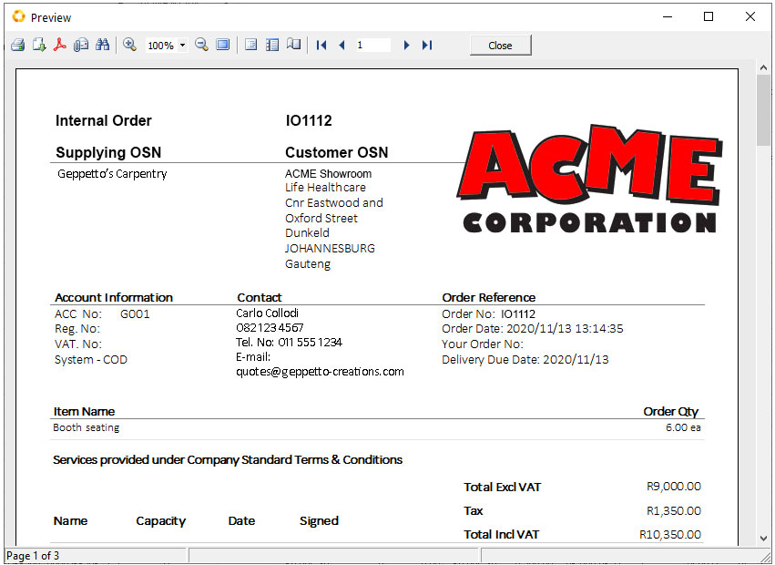 

4. To simply Print the Internal Order, click the **Printer** Icon 

1. To close this screen, click the **[Close]** button at the top of the screen.  

The system will close this screen and return you to the **Maintain Internal Order** screen to
view a list of all the Internal Orders in the system that match the Search Criteria you have
entered.

---  
## Save as PDF  

1. If you decide that you wish to save the Internal Order as a PDF document then click on 
the **PDF** icon  at the top of the preview form.  
The system will display the **Export to PDF** settings dialog.  

  

2. Click the **[Ok]** button once you have selected the desired options.  

3.  The standard File Manager **Save As** dialog window opens allowing you to save the **_.pdf_** to a specific location. 
This location could be to a relevant folder on your computer or a shared folder on your Local Area Network.

  

4.  Once you have selected the folder and named the file click the **[ Save ]** button.  

To close the Print Preview screen, click the **[ Close ]** button at the top of the screen.
The system will close this screen and return you to the Maintain Internal Order screen.

---
## Email

1. If you decide that you wish to email the Internal Order to the Owner Department, the click the **Send by E-mail** 
icon  at the top of the Preview window.

  

2.  The program will display the Email window.  

  

3. If your email details have been setup on the system, they will appear in the Email From field at the top of the screen. 
For more information on setting up your email in the system, refer to the document titled **Configure Email Settings**.

4. If you have defined a contact for the Internal Order as described above, then the program will display the email address 
for the selected contact in the **To** field.  

5. You can add additional email addresses as required in either the **To** or _Copy_ **(CC)** fields.  

6. The program will automatically populate the Subject line.  Alter this if needed.

7. You can add the text for the email you are sending in the **Comment** field.  

8. And you can add any addition attachments to the email by clicking the  
button at the top of the form.  

9. When you have completed your email, click the  button at the top of the form.  

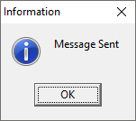 

10. The **Information** dialog will display **"Message Sent"**.  
Click **[ Ok ]** to continue.

:::note 
The system will automatically send the e-mail to your own e-mail address - this for your records.  
Check the **Inbox** in your Email Client application (e.g. MS Outlook).
:::

To close the Print Preview screen, click the **[ Close ]** button at the top of the screen.
The system will close this screen and return you to the Maintain Internal Order screen to
view a list of all the Internal Orders in the system that match the Search Criteria you have
entered.

---
## Final Search  

1. This is the screen that lists all of the Internal Orders in the database that match you're the criteria you have entered 
in the Search Panel at the top of the screen.  

1. Click the  button and make sure that the End Date (**To Date**) in the screen is later than the **Due Date** 
of the order you have just entered.  

1. Once you have completed entering all the Internal Orders you need to capture in the system, click the  button 
on the Form Menu Bar.  

---
## Status - Activate / Deactivate

For more information on how transaction Statuses work in the Sense-I program please refer to the document titled 
**Understanding Status in Sense-i**.  

All information that is captured by users in the Sense-i has a status and the first time a record is captured this 
Status is set as Provisional.  

A Provisional record means it is still being entered and not complete, in effect, in _draft_ mode and as a result 
"Provisional" records can be modified at any time.  

Once the details of any piece of information (whether this is a **party** such a customer, supplier, employee, a 
**resource** such as a material, component, machine or product, or a **transaction** of any sort), the details can be 
protected from change by setting the status of the record to “Active”.  

Active records mean that they are considered as reliable information that anyone else in the company can use. 
Active records cannot be changed and this prevents mistakes from being introduced to information that is considered to 
be complete, accurate and reliable.  

However, there is a need in some cases to be able to change a record that has been marked as Active.  
This could be either because the record was activated by mistake before being finally checked, or because 
reality has changed and information needs to be updated.  

When a record in Sense-i is still in “provisional” state, the button to control the status of the read has the 
caption **"Activate"**.

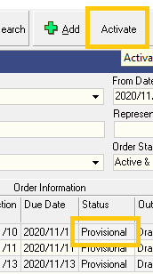  

:::note
You can see in the image above, when the record is in Provisional status, the Status button at the top of the screen will 
allow you to mark is as finalised by changing it to Active.
:::

To change the status of a provisional record to active, click on the record in the list and click the **Activate** button 
at the top of the screen.  

When a record has been Activated (but only if no subsequent transactions have been captured against it), it is 
possible to change the status to Inactive so that you can edit the record as necessary.

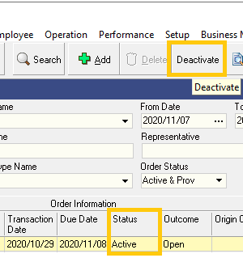  

You can see in the image above, when the record is in Active status, the Status button at the top of the screen will 
allow you to Deactivate the record so that you can change it, but only if no subsequent transaction has been created.  

To change the status of a active record to provisional or inactive so that you can edit the record, click on the 
record in the list and click the **Deactivate** button at the top of the screen.  
The program will change the status of the record and you can then make the necessary changes.  

Once you have edited a record, you can set its status to Active again by clicking the **Activate** button at the top of 
the form.

:::note
Remember that the status of a record can only be changed from **Active**, **Cancelled** or **Closed** if no subsequent 
documents were created from it.
:::

---
## Open  

You can view the details of any record or transaction in the system if you have security permission to do so.  

To open or view a record, simply click on the row in the grid that contains the name or number of the record you 
wish to view and then click the  button at the top of the form.

---
## Copy  

With some records and transactions you can use an existing record to create a new record though the copy function.  

To copy one Internal Order and create a new Internal Order from it, you should find the Internal Order you wish to use as the 
source document, click on the record for this Internal Order in the grid and the click the  button at the top of 
the form.

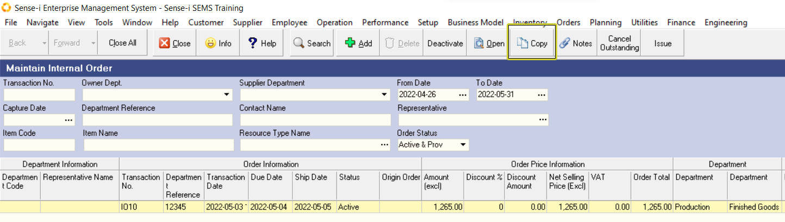  

The program will display a form that will allow you to enter certain key information that is required for a copy, 
for example the **Due Date**.

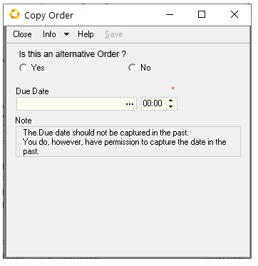  

Once you have completed this form, click the  button at the top of the form.  

The program will then create the copy of the original document you selected and it will set the status of the 
copied document to Provisional so that you can edit the transaction as required.  

---
## Cancel Outstanding  

Remember from the introductory training to Sense-i that all transactions (except the final transaction in a sequence, 
or _**Transaction Stream**_) follows in a set sequence.  

So for example a Sales Opportunity becomes a Quote, which can in turn becomes an Internal Order, which in turn becomes 
a Internal Order Delivery Note and finally a Internal Order Invoice.  

Because each transaction represents either the request for some work to be done (such as make or deliver a product) 
or records the actual work being done (for example an actual delivery), it is possible that the quantity on one document 
is not completely fulfilled by the subsequent transaction.  

So a department may order 10 chairs, but the first delivery might only be for 8 chairs because 10 chairs are not available.  

When this happens, it is possible to either leave the original order open (meaning that the shortfall must still be 
delivered), or if the outstanding balance is no longer required, then you can change the status of the transaction 
by clicking the **Cancel Outstanding** button at the top of the form.  

This will set the status of the selected transaction you have cancelled to "Closed" or "Cancelled".  

If a transaction has been partially fulfilled and you choose to Cancel Outstanding, then the status of the transaction 
will be set to Closed.  

If a transaction has not been fulfilled at all and you choose to Cancel Outstanding, then the status of the transaction 
will be set to Cancelled.  

---
## Notes  
You can add notes to any party, any item or any transaction in the Sense-i program and share these notes with users in the 
company.  

:::tip Using Notes
For more information on working with notes in Sense-i refer to the document titled **[Using Notes In Sense-i](1218)**.  
:::

**This is the end of this procedure.**  
___
