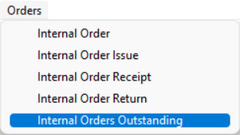
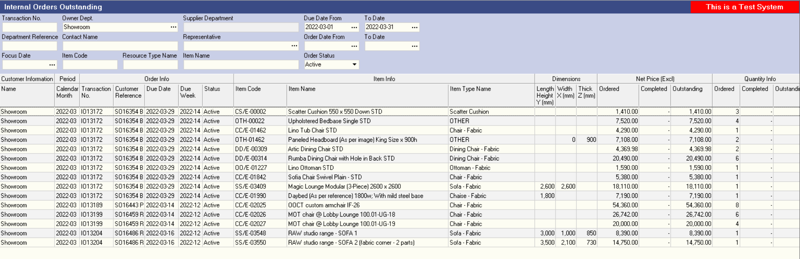
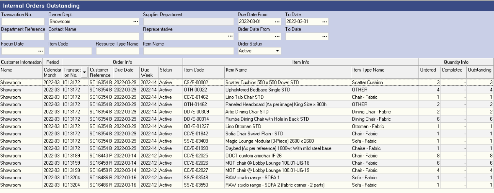
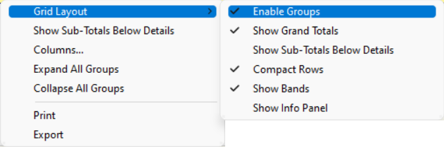
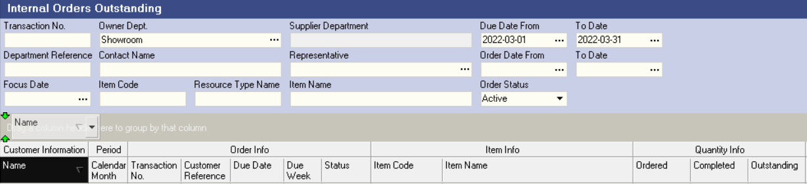
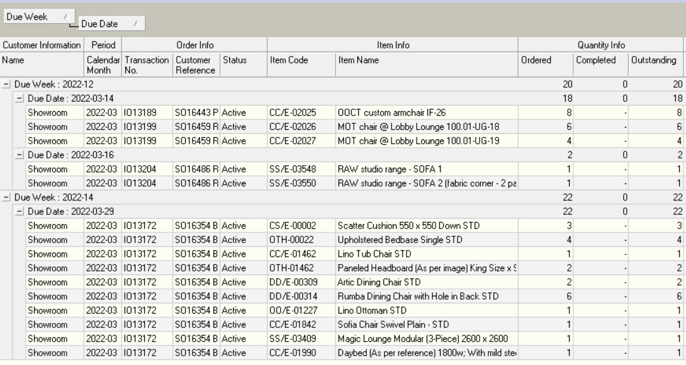
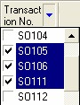

## Step-By-Step Guideline
___ 

1.  Select **Orders** on the Main Navigation Menu.  

2.  Then click **Internal Orders Outstanding** in the drop-down menu.  
	
  

3.  The system will open a screen titled "**Internal Orders Outstanding**".  

   This screen lists all of the Products that have been ordered by Customer Departments that have **not yet been Delivered**.  

The screen provides a quick and powerful way to keep track of what items must still be made and delivered to your Customer Department.  
	
  

4.  You can click on any column heading and while holding down the mouse
    key, move the column to the left or the right.  

It is a good idea to move the **Order Quantity**, **Outstanding** and
**Completed** columns to the right of the **Item Info** columns as this then shows you immediately how much of each product must still be delivered.  
	
  

5.  As you capture Delivery Notes against Internal Orders using the Capture
    Delivery Note procedure, you will notice that the **Quantity** displayed in the **Completed** Column **increases** and the Quantity in the **Outstanding** Column **decreases** by the amount delivered.  

6.  If you **right click** anywhere on the grid an option titled **Grid Layout** with a side menu option, "**Enable Groups**" is displayed.  

  

If you click on this option the system
will display a dark grey bar above the grid. You can then drag any
column heading into this bar and the system will then arrange the
information in the grid in sections according to the column
selected.  

The image below illustrates the Grey Bar for Grouping and how a
selected column, in this case the Customer Name column is Dark Blue.  

Once the column heading has been selected, simply drag it up into the
grey Grouping Bar using the mouse and then let go the left mouse
button.  

  

7.  For example, you could enable groups and then drag the **Due Week**
    Column into the grey bar. The system will then arrange and group all
    the Outstanding Products To be delivered by Due Week.  

8.  It is possible to "nest" headings underneath each other. You could
    for example drag the **Due Week** Column into the grey bar and then drag
    the **Due Date** Column underneath the Due Week Column. The system
    will then arrange and group items in the grid by Due Week and then
    by **Date**.  

  

9.  If you click the **+ sign** next to any row, the system will expand the
    number of rows underneath the heading to reveal more detailed
    information.  

10. You should use the Internal Order Outstanding report at least once
    every day. An effective Time Management practice is to set aside a
    regular time slot in your diary every day to review the Internal Orders
    Outstanding List and follow-up on items that are due within the next
    few days to ensure all orders are delivered on time.  

11. An additional mechanism exists on the screen to allow you to quickly
    filter information in more detail.  
    
    At the top of each column, you
    will notice a small downward facing arrow in each column heading. If
    you click on the this arrow, the system displays a list of values.
    
    The values may exist many times in the report, but in this short
    list each value is only displayed once. By clicking on one or more
    of the values in this short list you mark the records containing
    these values as the records to display and any record that has not
    been marked is removed from the view.  
    
    This is a very rapid and
    effective way to select only those records that you wish to see.  

To return to viewing all the records, simply click on (**All**) at the top
of the short list.  
	
  

12. You can also Print the list by choosing the **Print** option from the
    **Right-click Mouse Menu**.

This is useful if you wish to provide the Finished Goods Store
personnel with a list of items that need to be picked and packed so
that they can be delivered to the Customer Department.  

13. When you have finished with the report you can click the **Close**
    button to return to the previous screen.  

**This is the end of this procedure.**
