## Introduction  
___

This document details the procedures needed to access the different **Sense-i software applications**, and step-by-step guidelines to **configure specific database connections**.  

Once the Sense-i Launcher is open, access the **Menu** by selecting the menu icon near the top-left corner of the application.

  

The **Menu** options screen slides into display.

:::info  
To close the Menu options screen, select the **Home** option... or click on the underlying screen.  
:::  

----

## Menu Options

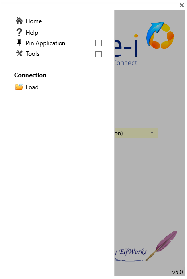  

The **Home** button will take you back to the initial landing screen.  

  

----

The **Help** button will open the **Online Help** document in your internet browser.

  

----
### Pin Application  

Click the **Pin Application** button to display the **Application** field on the Home screen.  

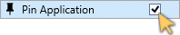  

:::important  
On the **Home** screen, the drop-down arrow in the **Application** field will allow you to choose the appropriate **Sense-i Software Application** required to access the associated Database.  

In this example, we will choose the newly released **Phoenix** application, and then click the **Connect** button to open this exciting new Sense-i product.  

  

:::  

----
### Tools  

The **Tools** button will open **additional options** on the Menu.

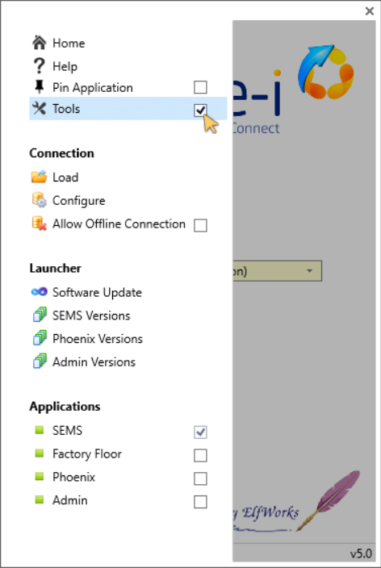  

----

### Manage Connections

  

The **Load** button will open the **Load Connection** screen.  

  

Refer to the **[Load Connection](https://sense-i.co/docs/LAUNCH#load-connection---open-config-file-ini)** section, in **[Using the Sense-i Launcher](https://sense-i.co/docs/LAUNCH)** document.  

----

### Tools - Configure  

  

The **Configure** button will open the **Configure Connections** screen.  

  

:::warning Configure Connections - SQL Database Adminstrators  
The **Configure Connections** screen is for SQL Database Adminstrators that have access to the specific configuration settings.  
:::  

The [ **Add** ] button activates the connection settings fields to enable and add 
a new connection.

1.	**Connection Name** - Capture the desired name (description).
	It is recommended practice to use a consistent format that includes **Company name**, 
	database type **(LIVE / TEST)** and the connection method (**Remote / LAN**),  
	e.g. **Acme_LIVE (Remote Connect)**.
	
2.	**Server Name** - This field includes the server **IP**, the **SQL Server Instance** and 
	the incoming **SQL port** used.  
	The syntax is important and needs to be accurate.  
	
3.	**Database Name** - This needs to reflect the **exact name** of the database.  

4.	**SQL Login Name** - This is the general login setting used by all SEMS users that access the specific database.  

5.	**SQL Password** - The password associated with the SQL Login Name.  

6.	**SA Password** - This password field is **optional** and only known and used by Database System Administrators.  

:::note  
The SQL Login Name and Passwords are defined, captured and maintained by **Database System Administrators** using SQL Server Management software.  
:::  

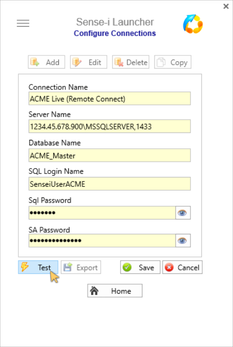  

Click on the [ **Test** ] button to ensure the connection settings have been configured correctly.  

Once the connection setting(s) have been captured and saved using the [ **Save** ] button,  
the [ **Edit** ], [ **Delete** ] and [ **Copy** ] button options are enabled for 
further amendments and to configure additional connections as necessary.  

Click on the [ **Export** ] button to create the relevant **.ini** file that can be distributed to SEMS users.  

:::note  
The **Export** button will append additional connection settings to an existing **.ini** file if selected.  
:::  

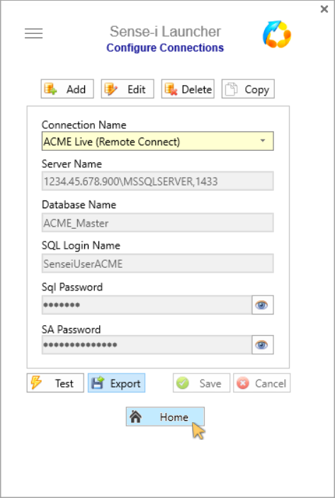  

Click on the **Home** button to return to the Sense-i Launcher Home screen.  

The newly configured connection is now available and is displayed in the **Connection** field.

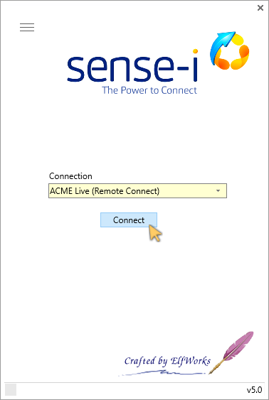  

----
### Update Launcher

The following steps will upgrade the Sense-i Launcher software to the latest version;  

Access the **Menu** by selecting the menu icon near the top-left corner of the Sense-i Launcher application.

  

1.	Ensure the **Tools** option is selected.  

2.	Select [ **Software Update** ].  

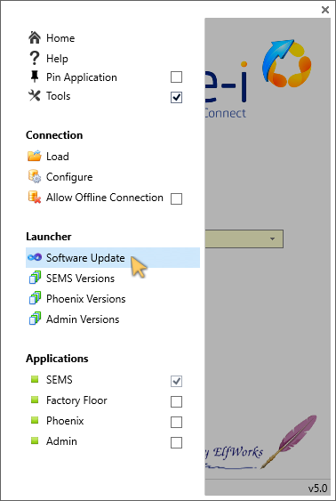  

The **Software Update** screen is displayed.

3.	Click on the [ **Check for updates** ] button.

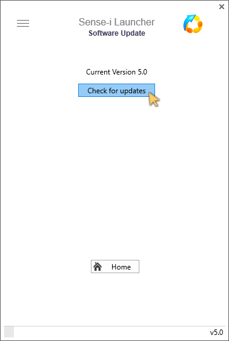  

4.  Click on [ **Upgrade Software** ].

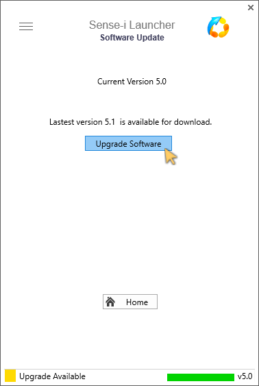  

The **Launcher Upgrade** dialogue box is displayed.

5.	Click on the [ **Continue** ] button.  

  

6.	The system will download the relevant **_.ZIP_** file, automatically extract the necessary files and install the latest version of the Launcher.

When the upgrade has completed, click the **Open** button.  

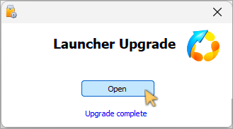  

The Sense-i Launcher home screen is displayed, with the Launcher version number in the bottom-right corner.  

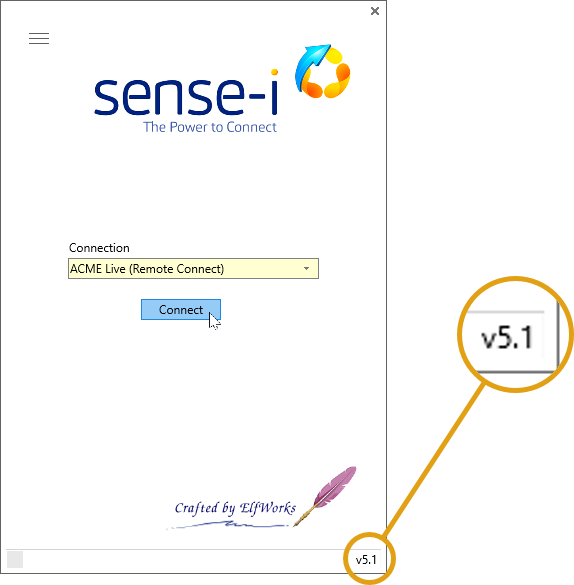  

From the **Home** screen connect to the SEMS application & relevant database.

----
### Launch (specific) Application  

Access the **Menu** by selecting the menu icon near the top-left corner of the Sense-i Launcher application.

  

1.	Ensure the **Tools** option is selected.  

The **SEMS toggle button** is set to active by default.  

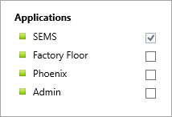  

1.	When the **SEMS toggle button** is active, clicking on the [ **Connect** ] button _(underlying **Home Page**)_ will launch the SEMS application.  

2.	Click on the [ **Factory Floor** ] toggle button to use the **Sphere_Mini** _(also known as **Maestro**)_ application.  

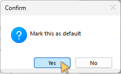  

Click [ **Yes** ] to set **Factory Floor** _(**Sphere_Mini**)_ as the default application.  

Click [ **No**]  to keep **SEMS** as the default application.  

:::note  
Selecting the **No** option will enable you to connect using the **Factory Floor** during the current session - and will revert back to the **SEMS** application on a subsequent _Connect_.  
:::  

3.	Click on the [ **Phoenix** ] toggle button to use the newly released **Phoenix** application.  

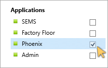  

The confirmation dialogue box is displayed.  

Select [ **Yes** ] to set **Phoenix** as the default application.  

  

4.	Click on the [ **Admin** ] toggle button to use the **Admin** application.  

:::important  
The default application, **SEMS** / **Factory Floor** / **Phoenix** or **Admin** (as confirmed above) will now always run when selecting the **Connect** button on the **Home** screen.  

In addition, selecting the **Pin Application** option will ensure efficient connection to the relevant database using the  
desired Sense-i Application on a subsequent Launch!  

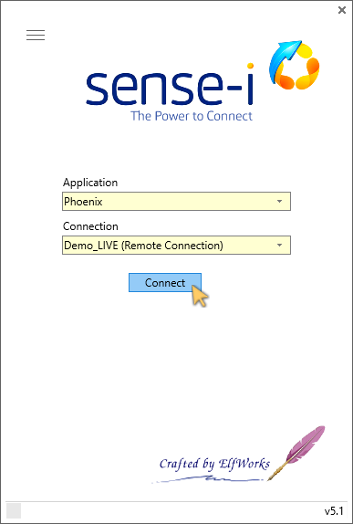  

:::

----

**This is the end of the _Sense-i Launcher_ procedure.**

