## Introduction  

This **step-by-step guide** will show you **how to download and install** the **Sense-i Job Tracker** application on an **Android device**.  

:::note  
The buttons & links displayed on the images in this guide are **NOT ACTIVE** and soley used for **reference purposes**.  
:::  

## Download and Install  

Access the latest version of the [Sense-i Job Tracker Installation files **here.**](https://elfworks.co.za/subdomains/sense-i/Install/jobtracker.html)  

The webpage will display the following page:  

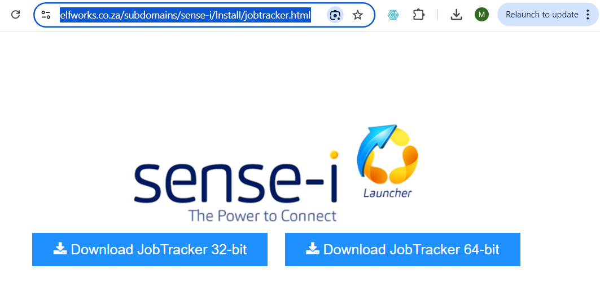  

1.  Tap either the **Download Job Tracker 32-Bit** or **...64-Bit** buttons, depending on whether your Android tablet is running a 32-bit or 64-bit operating system.  

You will receive a dialog screen with the message **_“Elfwords.co.za wants to download multiple files”_**.  

2.  Tap **Allow**.  

Once the files have been downloaded:  

3.  Tap the **Downloads** icon.  

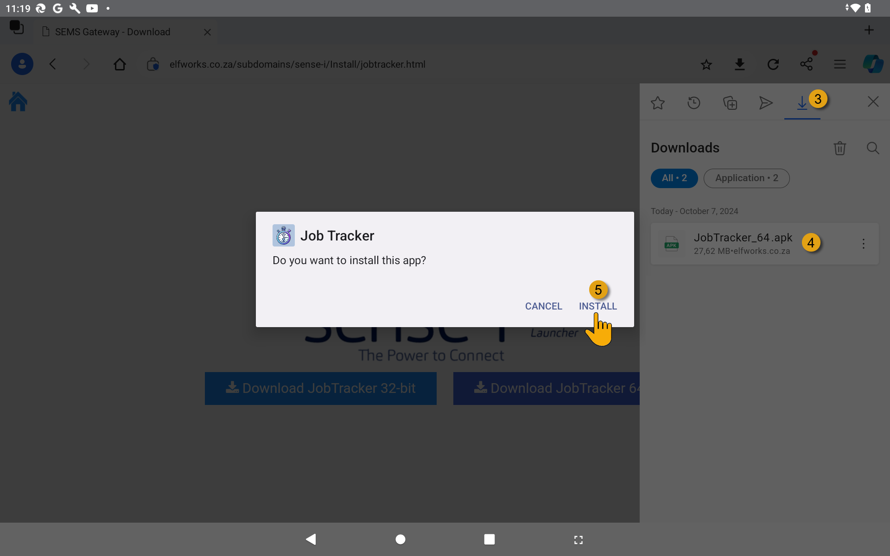  

4.  Tap on the file you wish to install, then  

5.  Tap the **Install** button.  

:::note  
If you have previously installed the Job Tracker application, and now updating the application with the latest version, the system will display the following dialog:  

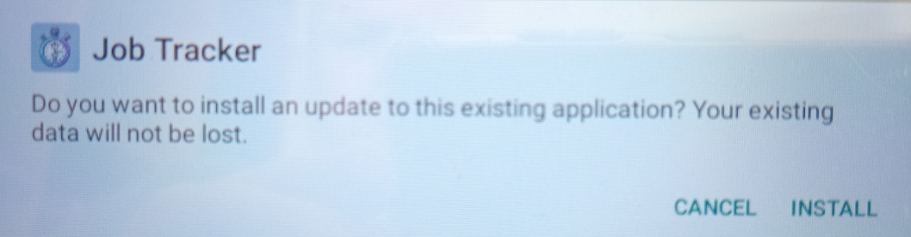  

Tap the **Install** button.  
:::  

Google Play Protect may ask you if want to Scan the install file.  

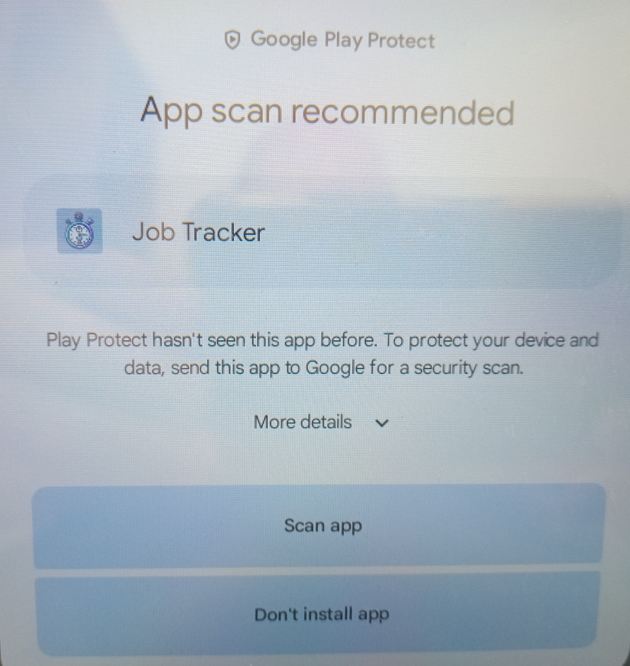  

6.  Tap the **Scan app** button.  

GooglePlay will scan the application install file.

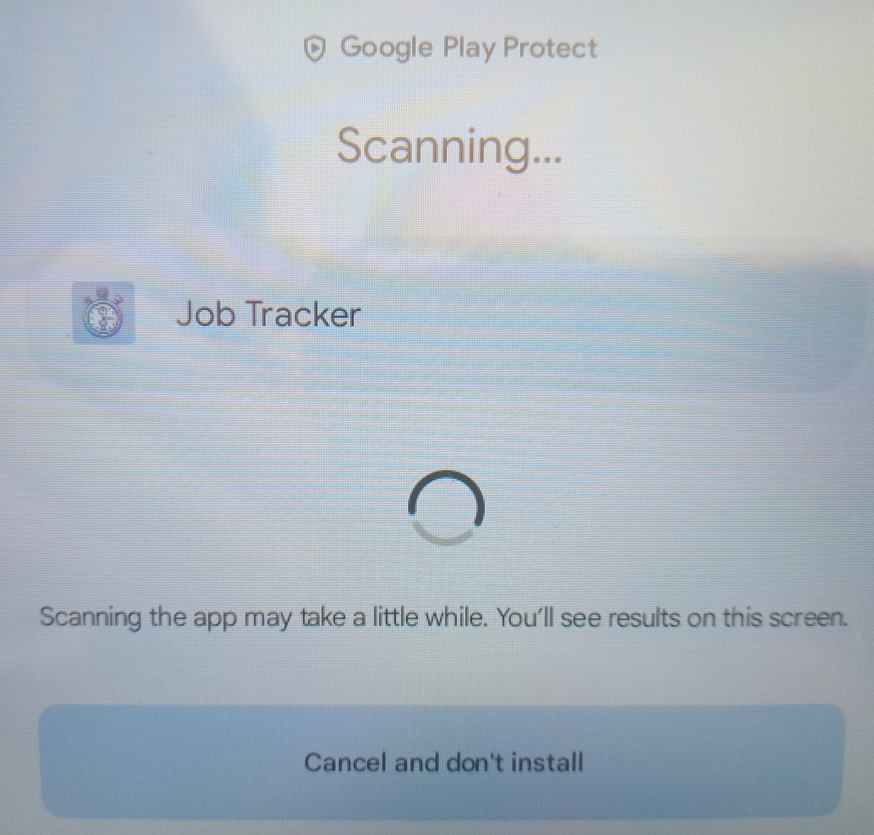  

Once the scan is complete, GooglePlay will display a message indicating that it is safe to proceed with the install.  

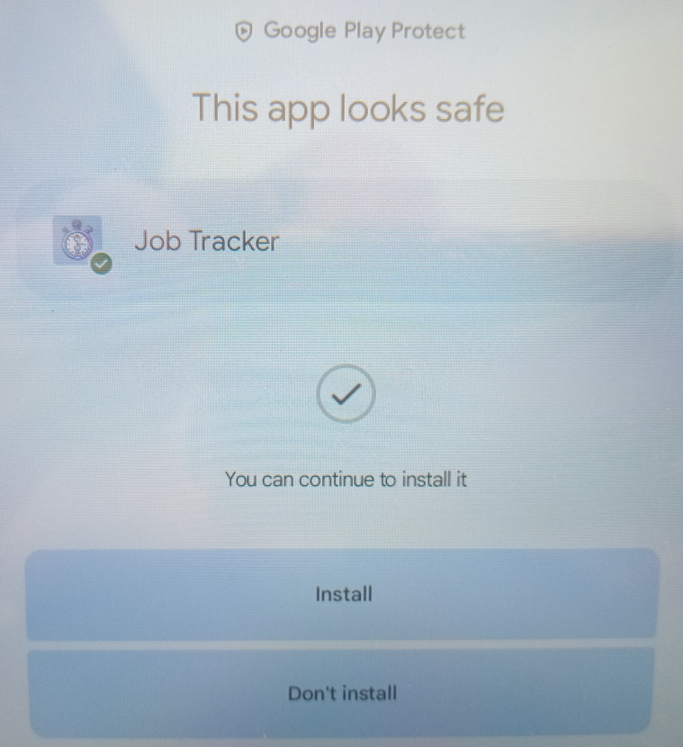  

7.  Tap the **Install** button.  

The Job Tracker application will be installed, and once the installation is complete the system will display the following dialog:  

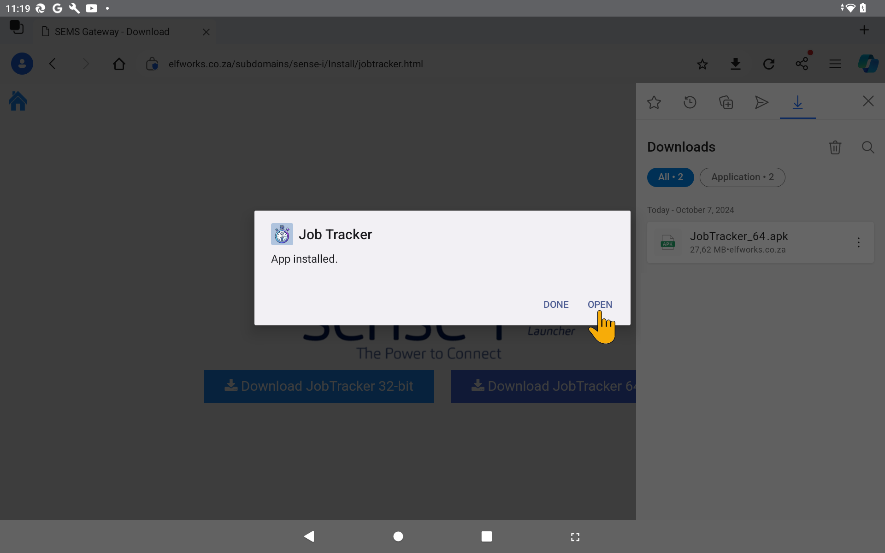  

8.  Tap the **Open** button.  

:::important  
If your operating system does not support the version you have downloaded and is not compatible, the system will display the following message:  

  

If this is the case then you need to install the other version _(32 bit OR 64 bit, depending on what you chose previously)_. See **Step 1** above.   
:::  

Once the application has been successfully installed _(and opened)_ the following screen is displayed:  

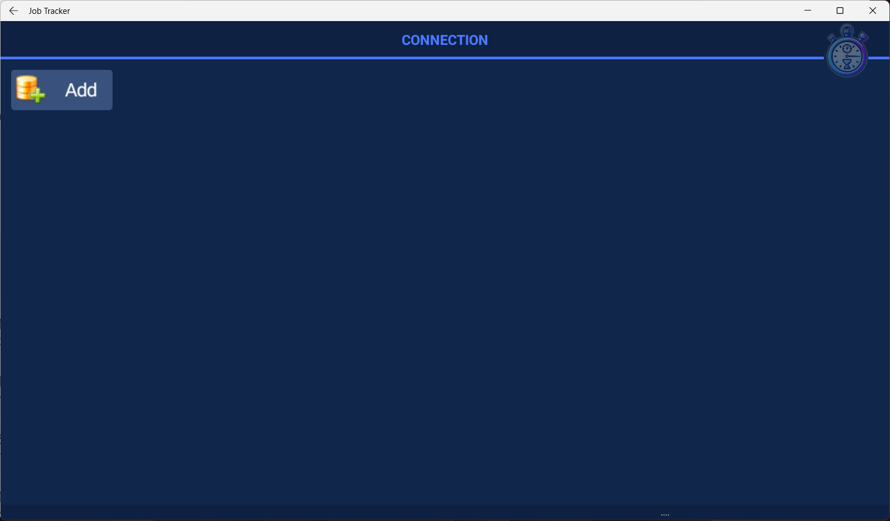  

9.  Tap the **Add** button.  

The system will display the **Connection Add** screen.  

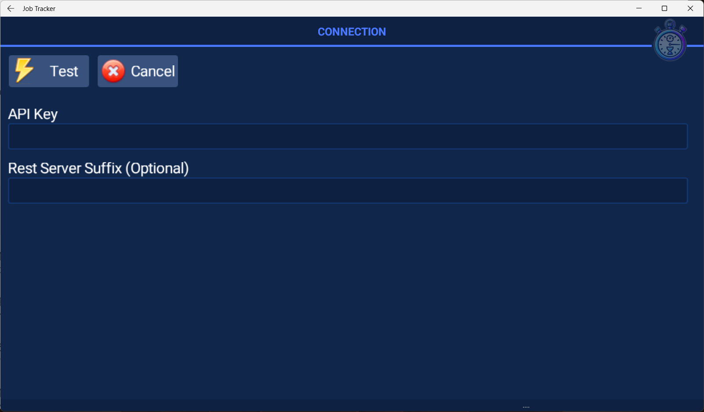  

:::important  
Your system administrator will have sent you a unique key called an **API Key**.  

This **alpha-numeric key** _(e.g. AB1C2D34-E5FG-678H-9I01-J2K34L5M6NOPQ7)_ is needed in the connection settings in order to connect your device to the relevant database.  
:::  

10. Enter the alpha-numeric key in the **API Key** field.  

:::important  
Leave the **Rest Server Suffix** field blank.  
:::

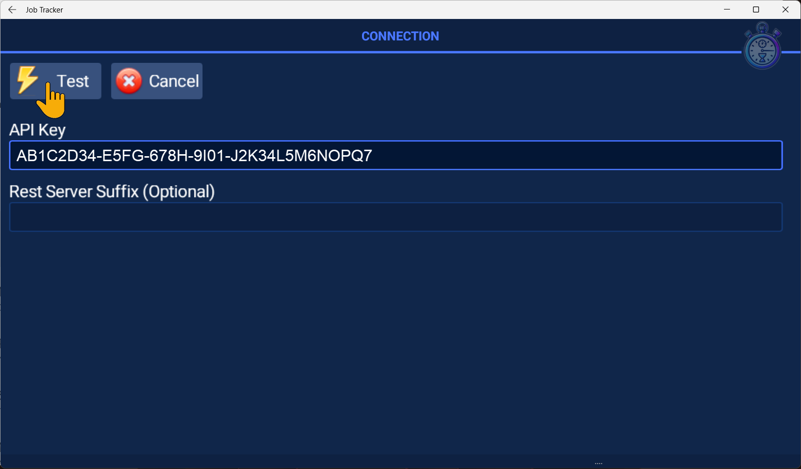  

11. Tap the **Test** button.  

The system will display the successful connection details in the **API Details** section.  

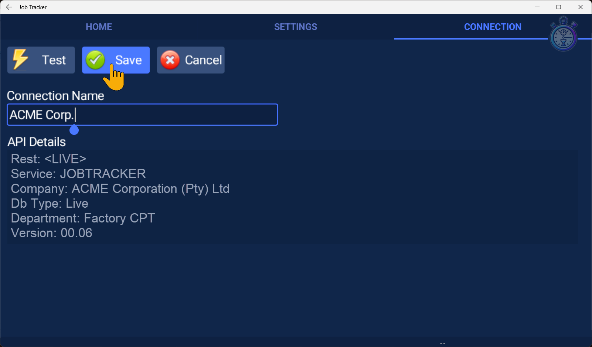  

12. Enter a name for the connection in the **Connection Name** field.  
    _This is useful if you are connecting to more than one database from the same device._  

:::tip  
Enter a name that best describes the connection, ideally this should be either the Company name, or an abbreviation of the company name.  
:::  

13. Tap the **Save** button.  

The system will display the **Saved** successful message.  

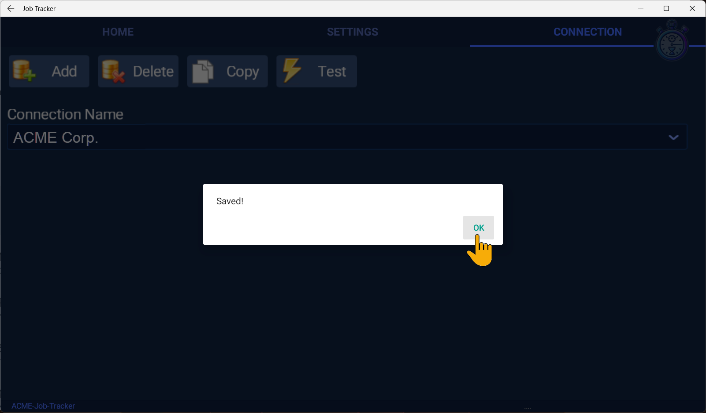  

14. Tap the OK button.  

Once the Job Tracker application has been installed, and the connection to the database has been succcessfully setup, the **HOME**, **SETTINGS**, and **CONNECTION** buttons are displayed at the top of the screen.  

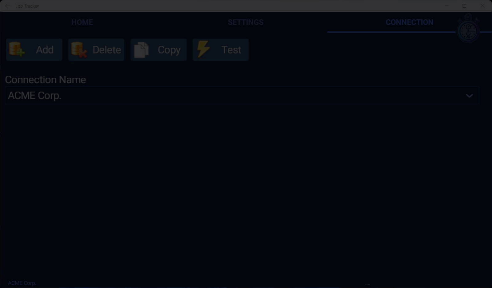  

15. Tap the **SETTINGS** button, and then toggle the display to switch **Dark Mode** off.  

:::tip  
Toggle Dark Mode **On** or **Off** to suit your personal preference and or environment.  
:::  

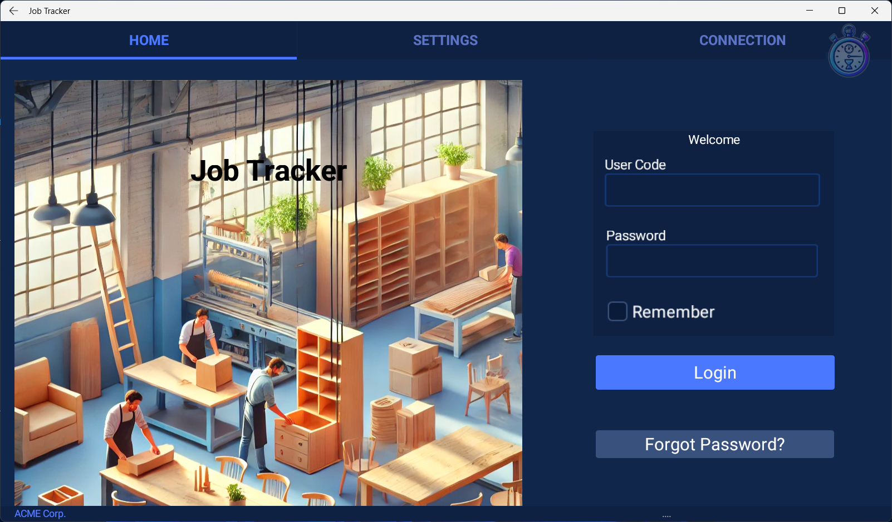  

You can now proceed to the document titled **["Logging Tasks in Job Tracker"](https://sense-i.co/docs/JOBTRCK02)** to log into the Job Tracker application on the device.  
___

**End of procedure.**

