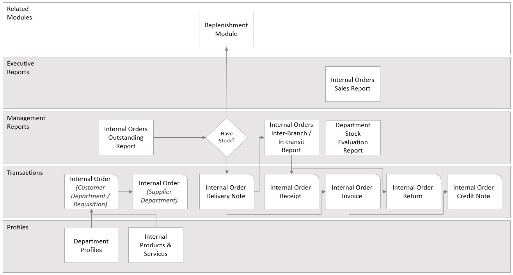

## Introduction & Overview
___

The Internal Order Management Process contains all the functions you
need to process all the internal orders that occur between the various
branches and departments within the company.  

It allows one department to order products or services from another, and where physical goods are involved, will track the movement of those goods from one branch to another.  

The process also includes all the reports you need to review
the performance and to-do actions required to keep on top of all the
transactions that occur between the branches or departments in your
company.  

The functions in the Internal Order Management module can be best
described in the following flowchart.

  

You can access the step-by-step guides and video demonstrations for each function from the list below.  

:::note Terms: Process & Module  

We use the term "**Process**" to describe the work that must be done in a specific area of your business and the term "**Module**" to refer to the set of functions in the Sense-i software that allows you to perform
that work.  

:::

:::note Background Information
To better understand the flowchart please read the **Business PowerPoint, Levels of Work,** and **Understanding Function Types** documents.  

These documents provide essential background information to understanding how the work and information in your business and the Sense-i system is structured.

:::  

:::note

There are several variations of this process, and within each, also several different ways a function or step in the process can be performed. Each industry has a unique set of rules and procedures that implement the best way to achieve a result.  

While the process flowchart above might look simple, the unique requirements for the industry and for each company are implemented in each of the functions in the Sense-i system.

:::
___
## Functions in the module  

The Internal Order Management module contains the following functions;

### Profile Functions 

The profile functions enable you to store information about the
company's people, departments, products, materials, machines, and so on,
that are used in transactions.  

This information changes more frequently than setup information as new departments, internal services and products and employees are added to the database.

The profile functions are:

- **[Employees _(as Sales Reps)_ (SAF-1204)](1204)**  

-   Employee Email Information (EMP-002)

-   Company Departments (OSN-001)

- **[Product / Services Profiles (SAF-441)](441)**  

### Transactions 

The transactions enable you to capture details about the various
transactions that occur between the different departments and branches
that exist in your company.

The transactions in this module are:

-   Internal Order _(As Customer Requisition)_ - (SAF-160 **?**)  

-   Internal Order _(As Supplier)_ - (SAF-160 **?**)  

-   Internal Order Delivery Note (SAF-**XXXX?**)  

-   Internal Order Receipt (SAF-161)  

-   Internal Order Invoice (SAF-**XXXX?**)  

-   Internal Order Return (SAF-162)  

-   Internal Order Credit Note (SAF-**XXXX?**)  

### Report Functions 

The report functions in the system fall into two groups.  

Management reports help with the daily workflow and focus on what transactions are outstanding at any point in the **Order Admin and Management Process**,  
while **Executive Reports** enable you to review the financial
performance in the business.  

### Management Reports 

-   Internal Order Outstanding Report (SAF-893)  

-   Internal Order In Transit Report (SAF-**XXXX?**)  

-   **[Department Stock Evaluation Report (SAF-460)](460)**    

### Executive Reports 

• Internal Order Sales Report (SAF-**XXXX?**)
___
:::note Detailed Step-by-Step Procedures

Detailed Step-by-Step procedures and video guides exist for each of the
functions in this module that will explain every action you need to take
to successfully capture and work with the information in the system.

Simply click on any of the functions above to access the detailed
Step-by-Step instruction.

:::

___
## Setup Functions 

To use the functions in the module, key information needs to be entered
into the system. The setup functions allow you to enter this information
which changes very rarely. The setup functions are:

-   **[Employee Information](1204)**

-   **[Department Profiles](710)**  

-   Department Payment Terms

-   Internal Products & Service Profiles

-   Standard VAT Rates (FIN-001)

## Related Modules 

The Internal Order Management module works with the following modules:  

-   Product Catalogues  

-   Product Costing  

-   Replenishment  

**This is the end of the module overview.**
