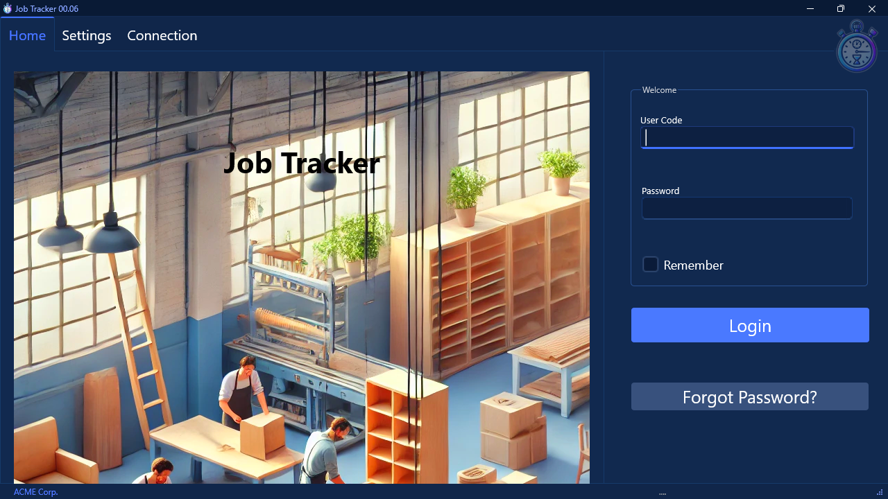
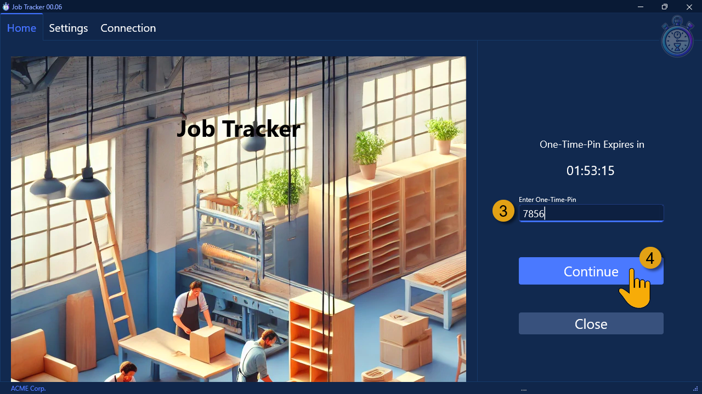
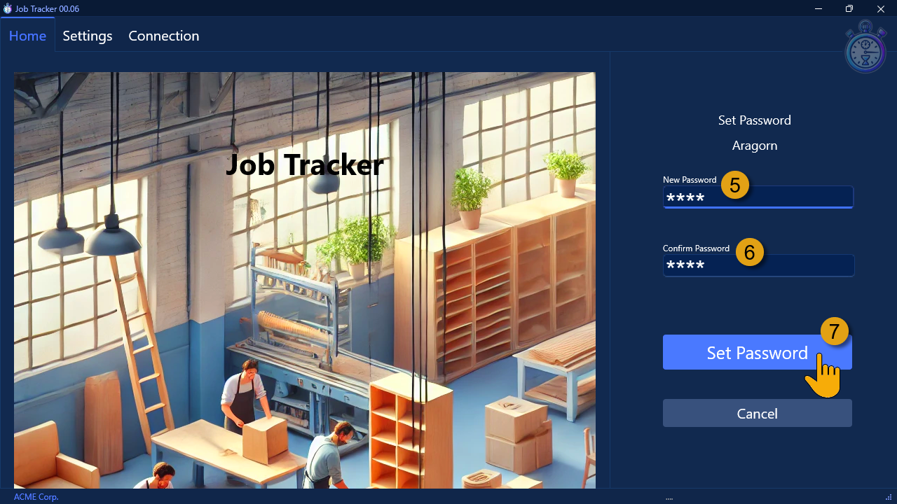

## Introduction  

This **step-by-step guide** will show you **how to Login** to the **Sense-i Job Tracker** application.  

:::important  
Before a user can log into the Job Tracker application, the Login User must be defined as an Employee and/or User in the database.  

Refer to the document titled **["Add SEMS Users"](https://sense-i.co/docs/CNF003)**.  
:::  

Once the User has been set up on the system, and the **[Job Tracker application has been installed](https://sense-i.co/docs/JOBTRCK01)** on their device, open the Job Tracker application.  

The system will display the Job Tracker Home screen.  

  
  
## Enter Login Credentials  

### First-time Log in  

1.  Type your User Name in the **User Code** field.  

:::important  
If this is the first time you are logging into the application, the System Administrator will need to generate a One-Time-Pin (OTP) in the main SEMS application.  
:::  

Once the OTP has been generated, and you have received it from the System Administrator,  

2. Click the **Forgot Password** button.  

  

The system will display the **One-Time-Pin** screen.  

  

3.  Enter the OTP into the **Enter One-Time-Pin** field, then  

4.  Click the **Continue** button.  

The system will display the **Set Password** screen.  

  

5.  Enter a password in the **New Password** field.  

:::note  
The password can be any combination of alpha-numeric characters, and must consist of at least 2 characters.  
:::  

6.  Enter your password again in the **Confirm Password** field, then  

7.  Click the **Set Password** button.  

The system will return to the **Login** screen.  

  

8.  Enter your password in the **Password** field.  

::::important[Remember Password - Optional]  
You can choose to activate the **Remember** check box.  

This option is recommended if you are the only one using a specific device which only you have access to.  
This option automatically saves your **User Name** and **Password** allowing you to simply select [ Login ] on subsequent Job Tracker application access.  
:::warning  
**Do NOT** activate the **Remember** check-box if the device is shared with other users.  
:::  
::::  

9.  Click the **Login** button.  

### Login with Existing Password  

1.  Type your User Name in the **User Code** field.  

2.  Enter your password in the **Password** field.  

:::info  
You can use the same password for all the Sense-i Applications _(SEMS Main Application, Sense-i Maestro / Mini application, the Phoenix application etc.)_ that connect to the same database.  
:::  

You can now choose to activate the **Remember** check box.  

::::important[Remember Password - Optional]  
This option is recommended if you are the only one using a specific device which only you have access to.  
This option automatically saves your **User Name** and **Password** allowing you to simply select **[ Login ]** on subsequent Job Tracker application access.  
:::warning  
**Do NOT** activate the **Remember** check-box if the device is shared with other users.  
:::  
::::  

3.  Click the **Login** button.  

### Forgot Password  

These are the steps to follow if you've forgotten your Login Password;  

1.  Type your User Name in the **User Code** field.  

:::important  
Before you can reset your password, the System Administrator will need to generate a One-Time-Pin (OTP) in the main SEMS application.  
:::  

Once the OTP has been generated, and you have received it from the System Administrator,  

2. Click the **Forgot Password** button.  

  

The system will display the **One-Time-Pin** screen.  

  

3.  Enter the OTP into the **Enter One-Time-Pin** field, then  

4.  Click the **Continue** button.  

The system will display the **Set Password** screen.  

  

5.  Enter a password in the **New Password** field.  

:::note  
The password can be any combination of alpha-numeric characters, and must consist of at least 2 characters.  
:::  

6.  Enter your password again in the **Confirm Password** field, then  

7.  Click the **Set Password** button.  

The system will return to the **Login** screen.  

  

8.  Enter your password in the **Password** field.  

You can now choose to activate the **Remember** check box.  

::::important[Remember Password - Optional]  
This option is recommended if you are the only one using a specific device which only you have access to.  
This option automatically saves your **User Name** and **Password** allowing you to simply select [ Login ] on subsequent Job Tracker application access.  
:::warning  
**Do NOT** activate the **Remember** check-box if the device is shared with other users.  
:::  
::::  

9.  Click the **Login** button.  

## Job Tracker Home screen  

Once you've successfully logged in, the system will display the Job Tracker **Home** screen.  

  

This screen shows you the performance details for the **Day**, the **Week** and a summary in the **Profile** section.  

  

You can now proceed to the document titled **["Logging Tasks in Job Tracker"](https://sense-i.co/docs/JOBTRCK03)** to start the procedure of Scanning Tasks in the Job Tracker application.  
___

**End of procedure.**

