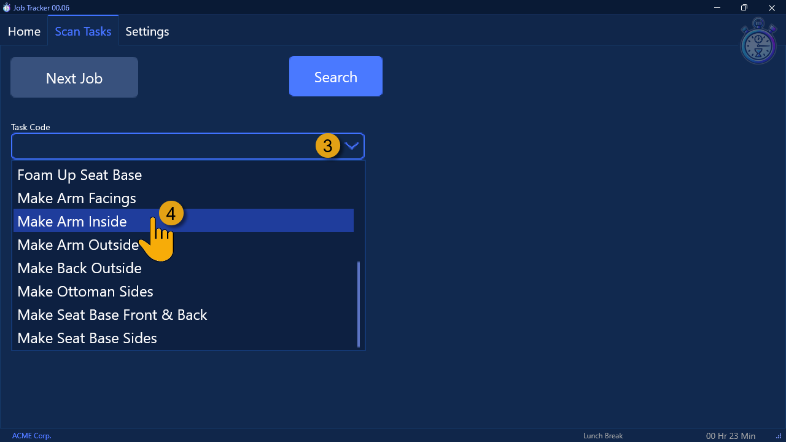
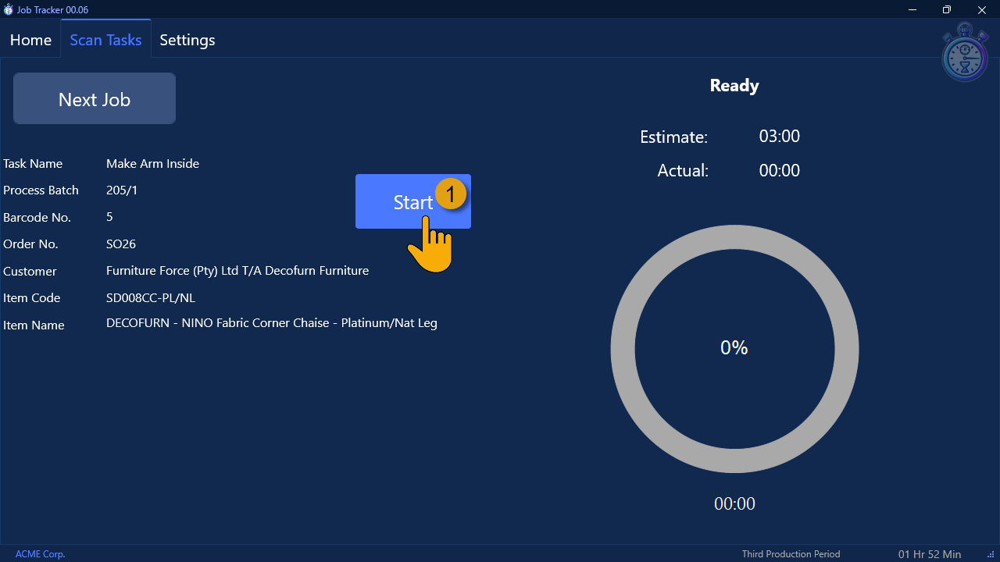

## Introduction  

This **step-by-step guide** will show you **how to log Tasks** the **Sense-i Job Tracker** application.  

Once **[Job Tracker has been installed](https://sense-i.co/docs/JOBTRCK01)**, and the user has **[Logged in to the Job Tracker application](https://sense-i.co/docs/JOBTRCK02)**:  

The system will display the Job Tracker **Home** screen.  

  

This screen shows you the performance details for the **Day**, the **Week** and a summary in the **Profile** section.  

  

## Scan Tasks  

1.  Click the **Scan Tasks** button at the top of the screen.  

The system will display the Scan Tasks screen.

  

2.  Click the **Next Job** button.  

  

3.  Click the **Task Code** field to display a list of Task Names that are linked to your profile.  

4.  Click on the **Task Name** that describes the task you are going to perform.  

:::note  
Users can only select Task Codes that have been linked to their position.  
:::  

The system will display the **name of the Task** you have selected in the **Task Code** field.  

  

5.  Scan / Enter the **Barcode** from the Job Card you are working on.  

:::info  
This would either be from a **Job Card** that has the Barcode, or a **part label** barcode attached to the part you are working on.  

  

:::  

## Start and Stop Tasks  

The system will display the details of the job for the Barcode you entered on the left of Task Scan screen.  

  

1.  Click the **Start** button.  

  

As you work to complete the task, the system will display the **Actual Time** taken in the **Actual** field, the **% complete** in the circle, and the **remaining time** at the bottom of the screen.

When the task has completed:  

  

2.  Click the **Stop** button.

The system will display the Result screen.  

If the task was completed **within the target time set**, the system will display a **successful** result screen.

  

If the task has taken **significantly longer** than the expected Target Time, then the system will display an **unsuccessful result** screen.

  

3.  To continue, click the **Next Job** button and repeat the process.  

We will now refer back to the **["Target Bonus Minute Rules"](https://sense-i.co/docs/BONUSRULE01)** procedure, in which you set the **Target Recovered Productive Time**.  

This value is used to determine the point at which **Bonuses are displayed** on the screen. 

  

The employee / login user, needs to chase the **Target Recovered Productive Time** value.  
In other words, the **sum total of all the Target Times** for the tasks they have completed for the day needs to **match** or **exceed** the **Target Recovered Productive Time** value.  

Once it does, the Task Scan screen will begin to display the value of the bonus they have earned.  

---

  

  

-   Click Actual Time Log  

  

___

**End of procedure.**

