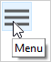
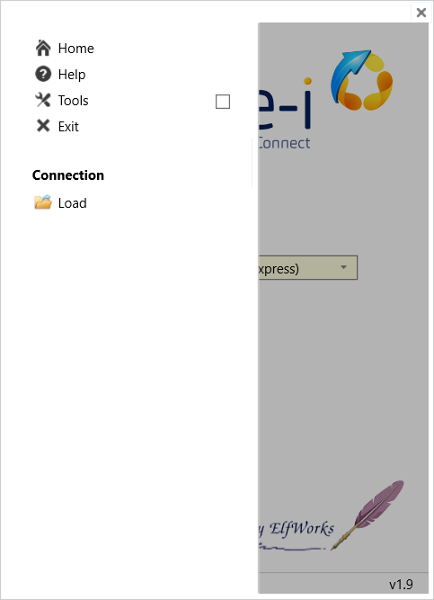
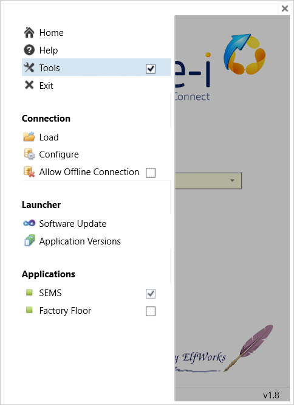
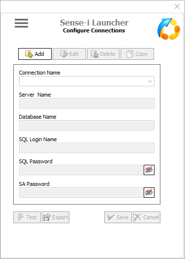

## Introduction  

The **Sense-i Launcher** allows you access the **SEMS application** and **connect to the relevant database(s)**.

This **step-by-step guide** will show you how to use the **Sense-i Launcher** application.  

:::note
The buttons & links displayed on the images in this guide are **NOT ACTIVE** and soley used for **reference purposes**.
:::  

If you are continuing directly with the process from the previous step, the program will display the Sense-i Launcher home screen.  

  

Alternatively, if you are not continuing directly from the previous step, you will need to open the Sense-i Launcher by clicking on the following shortcut icon on your desktop;  

  

## How to Set Up the Connection  

:::note
There will be no **SEMS connections** available when using the **Sense-i Launcher** for the first time.  
:::

1.	To set up a connection, select the connection string information in your welcome email...  

2.	Then click the right mouse button and choose the **Copy** option.  

  

3.	Click the [ **Connect** ] button.  

  

The program will display a pop-up dialog box as follows;  

  

2.	Click the [ **Yes** ] button.  

----  
### Copy and Paste

1.	Selecting this option will enable you to copy the relevant settings from:
	- an e-mail message, 
	- an exsisting .INI file or 
	- an appropriate text file.

  

2.	Click the [ **Paste** ] button.  

----

The **connection settings** now appear in the text box field.

  

3.  Click the [ **Load** ] button.  

----

Warning pop-up boxes confirming database and connection type appear.  

4.  Select [ **Yes** ] to load the desired connection(s).  

----

Once the relevant connection(s) have been loaded an **Information** dialogue box is displayed.  

  

5.  Click the [ **Ok** ] button.  

----

The **Load Connection** screen is now active again.  

  

6.  Click on the [ **Home** ] button to return to the main screen.  

----

## Load Connection from File  

The **Load Connection** screen will offer two options;  

  

1.	Selecting the **Open Config file (.INI)** option and then clicking the [ **Load** ] button will open the MS Windows **File Explorer**.

  

2.  **Locate** and [ **Open** ] the relevant **.ini** file.  

----

Warning pop-up boxes confirming database and connection type appear.  

3.  Select [ **Yes** ] to load the desired connection(s).  

:::note
Usually the company would have **two** databases:
- The **TEST database** (dB) which is used for training, practice and testing purposes.
- The **LIVE dB** where the actual daily work is done.  

The Database Servers can be connected to in two ways:
- Local Area Network **(LAN) connection** - this when the database server is on same LAN, e.g. Office network.
- **Remote connection** - this when the database server is accessed remotely, e.g. via the internet.

Therefore there are typically four connection options:  
- **Remote** connection to the **LIVE database**
- **Remote** connection to the **TEST database**
- **Local connection** to the **LIVE** database - same **LAN** as that of the Database Server
- **Local connection** to the **TEST** database using the local network to connect to the dB Server.
:::  

Once the relevant connection(s) have been loaded an **Information** dialogue box is displayed.  

  

4.  Click the [ **Ok** ] button.  

----

The **Load Connection** screen is now active again.  

  

5.  Click on the [ **Home** ] button to return to the main screen.  

----

## Home Page - Ready to Connect.  

Once the connections have been loaded, Sense-i Launcher is ready to connect to the **chosen database**.

  

1. Click on the [ **Connect** ] button.  

The application will now download and launch the Sense-i Enterprise Management System (**SEMS**) using the 
relevant connection options.

:::note  
**Sense-i Launcher** will automatically download the latest version of the **SEMS application**.  
This download process will only occur again when the database is been upgraded.
:::  

----

## Advanced Configuration  

This section is for **Sense-i System Administrators** and designed to **configure specific database connections**.  

Access the **Menu** by selecting the menu icon near the top left corner of the Sense-i Launcher application.

  

The **Menu** options screen slides into display.

:::info  
To close the Menu options screen, select the **Home** option... or click on the underlying screen.  
:::  

----

### Menu Options

  

The **Home** button will take you back to the initial landing screen.  

  

----

The **Help** button will open the **Online Help** document in your internet browser.

  

----

The **Exit** button will close the Sense-i Launcher application.

  

----

The **Tools** button will open **additional options** on the Menu.

  

----

### Manage Connections

  

The **Load** button will open the **Load Connection** screen.  

See the section **Load Connection** above for details on how to load connections 
from .INI files, e-mails and relevant text files.  

----
  

The **Configure** button will open the **Configure Connections** screen.  

  

:::tip Configure Connections - SQL database Adminstrators
The **Configure Connections** screen is for SQL Database Adminstrators that 
have access to the specific configuration settings.
:::  

The [ **Add** ] button activates the connection settings fields to enable and add 
a new connection.

1.	**Connection Name** - Capture the desired name (description).
	It is recommended practise to use a consistent format that includes **company name**, 
	database type **(LIVE / TEST)** and the connection method (**Remote / LAN**),  
	e.g. **Acme_LIVE (Remote Connect)**.
	
2.	**Server Name** - This field includes the server **IP**, the **SQL Server Instance** and 
	the incoming **SQL port** used.  
	The syntax is important and needs to be accurate.  
	
3.	**Database Name** - This too needs to reflect the exact name of the database.  

4.	**SQL Login Name** - This is the general login setting used by all SEMS users that 
	access the specific database.  

5.	**SQL Password** - The password associated with the SQL Login Name.  

6.	**SA Password** - This password field is **optional** and only known and used by 
	Database System Administrators.  

:::note
The SQL Login Name and Passwords are defined, captured and maintained by Database System 
Administrators using SQL Server Management software.
:::  

  

Click on the [ **Test** ] button to ensure the connection settings have been configured correctly.  

Once the connection setting(s) have been captured and saved using the [ **Save** ] button,  
the [ **Edit** ], [ **Delete** ] and [ **Copy** ] button options are activated for 
further amendments and to configure additional connections as neccessary.  

  

Click on the [ **Export** ] button to create the relevant **.ini** file that can be distributed to 
SEMS users.  

:::note
The **Export** button will append additional connection settings to an existing **.ini** 
file if selected.  
:::

Access the **Menu** by selecting the menu icon near the top left corner of the Sense-i Launcher application.

  

----
### Update Launcher

When a new version of the ElfWorks Launcher software becomes available, the system will automatically notify you of such.  

The following steps will upgrade the Sense-i Launcher software to the latest version;  

Access the **Menu** by selecting the menu icon near the top left corner of the Sense-i Launcher application.

  

  

1.	Ensure the **Tools** option is selected.  

2.	Select [ **Software Update** ].  

	The **Software Update** screen is displayed.

  

3.	Click on the [ **Check for updates** ] button.

  

4.  Click on [ **Upgrade Software** ].

  

The **Launcher Upgrade** dialogue box is displayed.

5.	Click on the [ **Continue** ] button.  

The system will download the relevant .ZIP file, automatically extract the necessary files and install the latest version of the Launcher.

From the **Home** screen connect to the SEMS application & relevant database.

----
### Launch (specific) Application  

The **SEMS toggle button** is set to active by default.  

  

1.	When the **SEMS toggle button** is active, clicking on the [ **Connect** ] button 
_(underlying **Home Page**)_ will launch the SEMS application.  

2.	Click on the [ **Factory Floor** ] toggle button to activate the **Sphere_Mini** application.  

  

Select [ **Yes** ] to set **Factory Floor** _(**Sphere_Mini**)_ as the default application.  

Select [ **No**]  to keep **SEMS** as the default application.  

:::note  
The default application, **SEMS** or **Sphere_Mini** will now always run when selecting the **Connect** button on the **Home** screen.  
:::

----

SEMS System Administrators should click on this link, **[Sense-i Launcher - Advanced Configuration](INSTCONF)**, for instructions on how to configure specific database connections.

