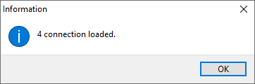

## Introduction  

The **Sense-i Launcher** allows you access the **SEMS application** and **connect to the relevant database(s)**.

This **step-by-step guide** will show you how to use the **Sense-i Launcher** application.  

:::note  
The buttons & links displayed on the images in this guide are **NOT ACTIVE** and soley used for **reference purposes**.  
:::  

If you are continuing directly with the process from the previous step, the program will display the Sense-i Launcher home screen.  

  

Alternatively, if you are not continuing directly from the previous step, you will need to open the Sense-i Launcher by clicking on the following shortcut icon on your desktop;  

  

## How to Set Up the Connection  

:::note
There will be no **SEMS connections** available when using the **Sense-i Launcher** for the first time.  
:::

1.	To set up a connection, select the connection string information in your welcome email...  

2.	Then click the right mouse button and choose the **Copy** option.  

  

3.	Click the [ **Connect** ] button.  

  

The program will display a pop-up dialog box as follows;  

  

2.	Click the [ **Yes** ] button.  

----  
### Copy and Paste

1.	Selecting this option will enable you to copy the relevant settings from:
	- an e-mail message, 
	- an exsisting .INI file or 
	- an appropriate text file.

  

2.	Click the [ **Paste** ] button.  

----

The **connection settings** now appear in the text box field.

  

3.  Click the [ **Load** ] button.  

----

Warning pop-up boxes confirming database and connection type appear.  

4.  Select [ **Yes** ] to load the desired connection(s).  

----

Once the relevant connection(s) have been loaded an **Information** dialogue box is displayed.  

  

5.  Click the [ **Ok** ] button.  

----

The **Load Connection** screen is now active again.  

  

6.  Click on the [ **Home** ] button to return to the main screen.  

----

## Load Connection from File  

The **Load Connection** screen will offer two options;  

  

1.	Selecting the **Open Config file (.INI)** option and then clicking the [ **Load** ] button will open the MS Windows **File Explorer**.

  

2.  **Locate** and [ **Open** ] the relevant **.ini** file.  

----

Warning pop-up boxes confirming database and connection type appear.  

3.  Select [ **Yes** ] to load the desired connection(s).  

:::note
Usually the company would have **two** databases:
- The **TEST database** (dB) which is used for training, practice and testing purposes.
- The **LIVE dB** where the actual daily work is done.  

The Database Servers can be connected to in two ways:
- Local Area Network **(LAN) connection** - this when the database server is on same LAN, e.g. Office network.
- **Remote connection** - this when the database server is accessed remotely, e.g. via the internet.

Therefore there are typically four connection options:  
- **Remote** connection to the **LIVE database**
- **Remote** connection to the **TEST database**
- **Local connection** to the **LIVE** database - same **LAN** as that of the Database Server
- **Local connection** to the **TEST** database using the local network to connect to the dB Server.
:::  

Once the relevant connection(s) have been loaded an **Information** dialogue box is displayed.  

  

4.  Click the [ **Ok** ] button.  

----

The **Load Connection** screen is now active again.  

  

5.  Click on the [ **Home** ] button to return to the main screen.  

----

## Home Page - Ready to Connect.  

Once the connections have been loaded, Sense-i Launcher is ready to connect to the **chosen database**.  

  

1. Click on the [ **Connect** ] button.  

The application will now download and launch the Sense-i Enterprise Management System (**SEMS**) using the relevant connection options.

:::note  
**Sense-i Launcher** will automatically download the latest version of the **SEMS application**.  
This download process will only occur again when the database is been upgraded.
:::  

----

SEMS System Administrators should click on this link,
**[Sense-i Launcher - Advanced Configuration](INSTCONF)**, for instructions on how to configure specific database connections.

