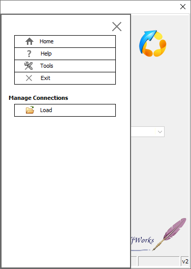

## Introduction  

This **step-by-step guide** will show you how to use the **Sense-i Launcher** application.  

Access the latest version of the [Sense-i Launcher Installation files here.](https://elfworks.co.za/subdomains/sense-i/Install/download.html)  

Once you have linked to the Sense-i Launcher Download site, these are the necessary steps to be followed.

:::note
The links displayed on the images in this guide are **NOT ACTIVE** and soley used for **reference purposes**.
:::

The **Sense-i Launcher** allows you access the **SEMS application** and **connect to the relevant database(s)**.

Access the **Sense-i Launcher** by clicking on the Sense-i Launcher **desktop shortcut**.

  

The **Sense-i Launcher application** opens.

To close the application, click on the **X** button in the top-right corner.

  

:::note
There will be no **SEMS connections** available when using the **Sense-i Launcher** for the first time.  
:::

## Quick Connect  

The quickest method to setup initial **SEMS connections** is described below.  

:::note
The necessary Connection Settings must be available to complete the **Load Connection** process.  

These settings can be obtained from your **Sense-i Systems Administrator** and/or 
the [Sense-i Help Desk](mailto:help@sense-i.co).  

These settings, in text format, can then be accessed from the **relevant location** on your computer.

**Proceed once this information is available**.  
:::

  

1.	Click the [ **Connect** ] button.  

A warning pop-up box appears with;  

  

2.	Click the [ **Yes** ] button.  

----  

## Load Connection  

The **Load Connection** screen will offer two options;  

  

- **Open Config file (.INI)**  

1.	Selecting this option and then clicking the [ **Load** ] button will open the MS Windows **File Explorer**.

  

2.  **Locate** and [ **Open** ] the relevant **.ini** file.  

Warning pop-ub boxes confirming database and connection type appear.  

3.  Select [ **Yes** ] to load the desired connection(s).  

:::note
Usually the company would have **two** databases:
- The **TEST database** (dB) which is used for training, practice and testing purposes.
- The **LIVE dB** where the actual daily work is done.  

The Database Servers can be connected to in two ways:
- Local Area Network **(LAN) connection** - this when the database server is on same LAN, e.g. Office network.
- **Remote connection** - this when the database server is accessed remotely, e.g. via the internet.

Therefore there are typically four connection options:  
- **Remote** connection to the **LIVE database**
- **Remote** connection to the **TEST database**
- **Local connection** to the **LIVE** database - same **LAN** as that of the Database Server
- **Local connection** to the **TEST** database using the local network to connect to the dB Server.
:::  

Once the relevant connection(s) have been loaded a **Information** window appears.  

  

4.  Click the [ **Ok** ] button.

The **Load Connection** screen is now active again.  

5.  Click on the [ **Home** ] button to return to the main screen.  

----

- **Copy and Paste**  

1.	Selecting this option will enable you to copy the relevant settings from:  
	- an e-mail message, 
	- exsisting .INI file or 
	- an appropriate text file.

  

2.	Copy the relevant **text** from the e-mail received.  

3.	Once copied, return to the **Sense-i Launcher** application.  

4.	Click the [ **Paste** ] button.  

  

5.  Select [ **Yes** ] to load the desired connection(s).  

Once the relevant connection(s) have been loaded a **Information** window appears.  

  

6.  Click the [ **Ok** ] button.

The **Load Connection** screen is now active again.  

  

7.  Click on the [ **Home** ] button to return to the main screen.  

## Home Page - Ready to Connect.  

Once the connections have been loaded, Sense-i Launcher is ready to connect to the **chosen database**.

  

1. Click on the [ **Connect** ] button.

:::note  
**Sense-i Launcher** will automatically download the latest version of the **SEMS application**.  
This download process will only occur when the database has been upgraded.
:::

  

The application will now launch the Sense-i Enterprise Management System (**SEMS**) using the 
relevant connection options.

## Advanced Configuration  

This section is for **Sense-i System Administrators** and designed to **configure specific database connections**.  

Access the **Menu** by selecting the menu icon near the top left corner of the Sense-i Launcher application.

  

The **Menu** options screen slides into display.

Note: To close the Menu options screen, click the **X** button... or click on the underlying screen. 

  

The **Home** button will take you back to the initial landing screen.  

  

----

The **Help** button will open the **Online Help** document in your internet browser.

  

----

The **Exit** button will close the Sense-i Launcher application.

  

----

The **Tools** button will open additional options on the Menu.

## Manage Connections

  

The **Load** button will open the **Load Connection** screen.  

See the section **Load Connection** above for details on how to load connections 
from .INI files, e-mails and relevant text files.  

----
  

The **Configure** button will open the **Configure Connections** screen.  

  

:::warning To be scribed
More to follow...
:::

