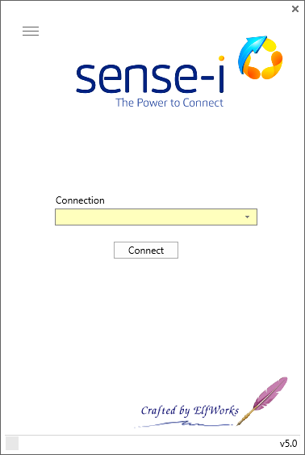
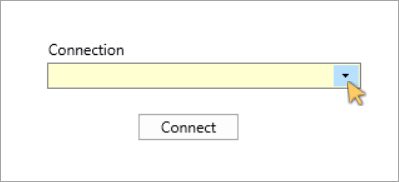
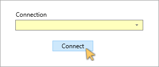
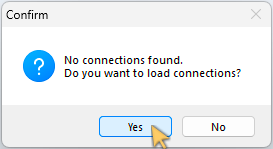
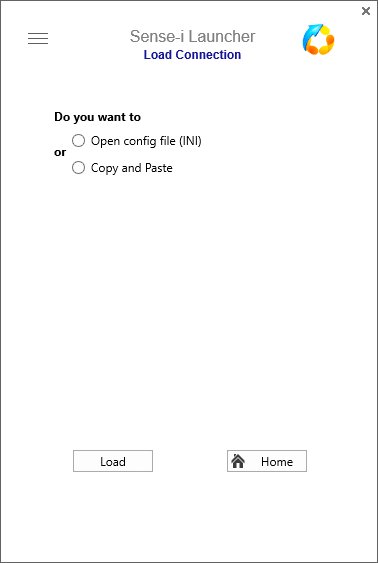
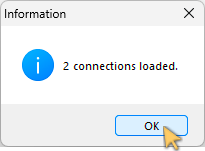
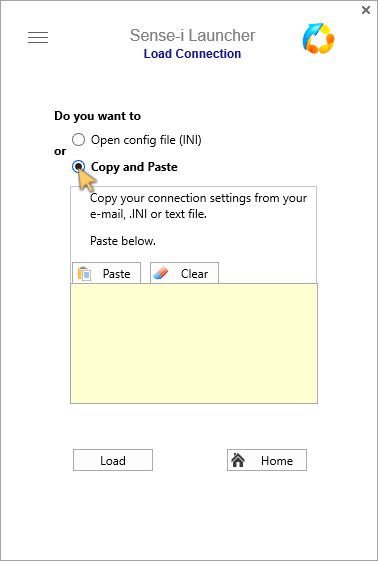
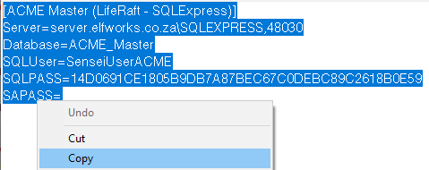
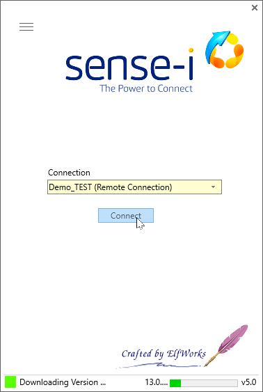

## Introduction  

The **Sense-i Launcher** allows you access the various **Sense-i applications** and **connect to the relevant database(s)**.

This **step-by-step guide** will show you how to use the **Sense-i Launcher** application.  

:::note  
The buttons & links displayed on the images in this guide are **NOT ACTIVE** and soley used for **reference purposes**.  
:::  

If you are continuing with the process directly from the previous document, the program will display the Sense-i Launcher **Home** screen.  

  

Alternatively, if you are not continuing directly from the previous step, you will need to open the Sense-i Launcher by clicking on the Sense-i Launcher shortcut icon on your desktop;  

  

## How to Set Up the Connection  

:::note  
There will be no **SEMS connections** available when using the **Sense-i Launcher** for the first time.  
:::  

  

If your company subscribes to the **Sense-i Enterprise Management System _(SEMS)_** software applications, you will receive a **SEMS Connection, welcome email** containing the **connection string information**, with the relevant **SEMSconnect.INI** file attached.  

1.	Click on the **Connect** button.  

  

A _Confirmation_ dialogue box is displayed.  

  

2.	Click on the **Yes** option.  

  

The **Load Connection** screen is displayed, with the following _radio-button_ options available:  
-	Open config file (INI)
-	Copy and Paste  

### Load Connection - Open config file (INI)  

:::important  
When using this option, it is important to know the location of the **SEMSconnect.INI** file.  

From your **SEMS Connection email**, save the attached **SEMSconnect.INI** file to the **C:\SEMS\Connection\\** sub-directory on your computer,  

Alternatively, obtain the Local Area Network location of the SEMSconnect.ini file from yor SEMS Administrator.  
:::  

  

1.	Click on the **Open Config file (.INI)** radio-button.  

2.	Then click on the [ **Load** ] button.  

The MS Windows **File Explorer** is displayed.

  

2.  **Locate** and [ **Open** ] the relevant **.ini** file.  

----

Warning pop-up boxes confirming database and connection type appear.  

3.  Select [ **Yes** ] to load the desired connection(s).  

:::note  
Usually the company would have **two** databases:  
- The **TEST Database** _(DB)_ which is used for training, practice and testing purposes.  
- The **LIVE DB** where the actual daily work is done.  

The Database Servers can be connected to in two ways:  
- Local Area Network **(LAN) connection** - this when the Database Server is on same LAN, e.g. Office network.  
- **Remote connection** - this when the database server is accessed remotely, e.g. via the internet.  

Therefore there are typically four connection options:  
- **Remote** connection to the **LIVE database**  
- **Remote** connection to the **TEST database**  
- **Local connection** to the **LIVE** database - same **LAN** as that of the Database Server  
- **Local connection** to the **TEST** database using the local network to connect to the Database Server.  
:::  

Once the relevant connection(s) have been loaded, an **Information** dialogue box is displayed.  

  

4.  Click the [ **Ok** ] button.  

----

The **Load Connection** screen is now active again.  

  

5.  Click on the [ **Home** ] button to return to the main screen.  

:::important  
If you used the above method to Load Connection(s), you can jump to the 
**[Home Page - Ready to Connect](https://sense-i.co/docs/LAUNCH#home-page---ready-to-connect)** section of this document.  
:::  

----  
### Load Connection - Copy and Paste

  

Selecting this option will enable you to copy the relevant settings from:  
- an e-mail message, 
- an exsisting .INI file or 
- an appropriate text file.  

:::note  
These connection settings can be obtained from your SEMS System Administrator.  
:::  

1.	To set up a connection, **select the connection string information** from your **SEMS Config. email**, OR an exsisting **SEMSconnect.INI file** OR an appropriate **text file**.    

  

2.	Then click the right mouse button and choose the **Copy** option.  

----

Return to the **Sense-i Launcher** application.  

  

3.	Click the [ **Paste** ] button.  

The **connection settings** now appear in the text box field.

  

4.  Click the [ **Load** ] button.  

----

Warning pop-up boxes confirming database and connection type appear.  

5.  Select [ **Yes** ] to load the desired connection(s).  

----

Once the relevant connection(s) have been loaded an **Information** dialogue box is displayed.  

  

6.  Click the [ **Ok** ] button.  

----

The **Load Connection** screen is now active again.  

  

6.  Click on the [ **Home** ] button to return to the main screen.  

----

## Home Page - Ready to Connect.  

Once the connections have been loaded, Sense-i Launcher is ready to connect to the **chosen database**.  

  

1. Click on the [ **Connect** ] button.  

The application will now download and launch the Sense-i Enterprise Management System (**SEMS**) using the relevant connection options.

:::note  
**Sense-i Launcher** will automatically download the latest version of the **SEMS application**.  

This download process will only occur again when the **SEMS application** and **Database** is upgraded.
:::  

----

Refer to the link, **[Sense-i Launcher - Advanced Configuration](https://sense-i.co/docs/INSTCONF)**, for instructions on how to access the different **Sense-i Software applications** and configure specific database connections.

