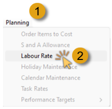
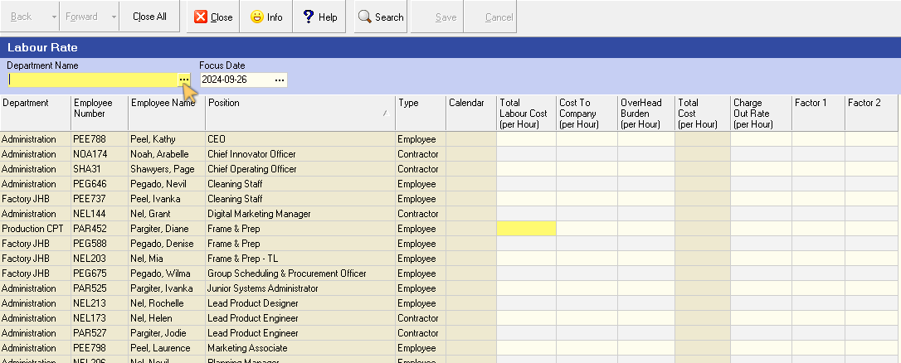
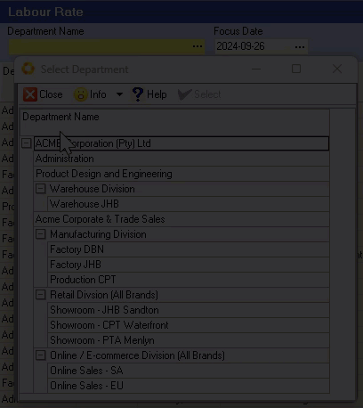
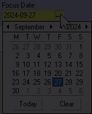
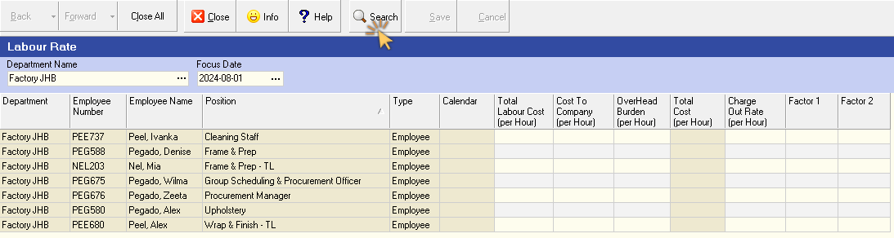
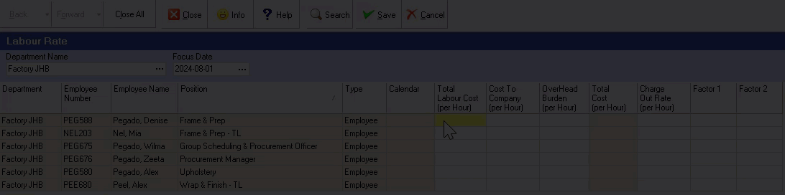
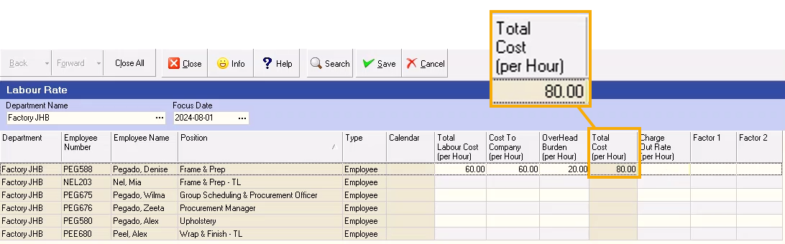
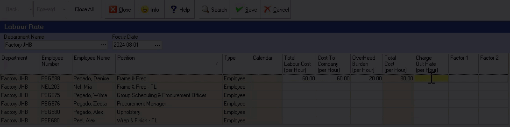

## Introduction  

In this document, we will describe and illustrate how to define **Labour Rates** for each employee.  

This information tells you what each employee is paid per hour (or minute), what the work they do will be charged out at, and how much they will be paid as a bonus.  

## Navigate to Labour Rates  

To do this:  
1.  Click **Planning** on the main navigation menu, then  

2.  Click **Labour Rate** on the drop-down menu.  

  

The system will open the Labour Rate Screen.  

  

This screen lists each of the employees in the company.  

## Filter Employee List  
  
You can filter the list by Department by selecting the name of the Department you wish to view in the **Department Name** field.  

1.  Click on the three-dot button the the **Department Name** field.  

The **Select Department** screen is displayed.  

2.  Click on the relevant Department in the list, then  

3.  Click the **Select** button on the form Action bar.  

  

You can also see the Labour Rates according to different dates by changing the **Focus Date** in the Search Panel.  

  

To refresh the information in the grid once you have changed any of the search parameters:  

4.  Click the **Search** button on the Action bar.  

  

The system will display results to match the search criteria you have entered.  

## Labour Cost, Cost to Company, and Overheads  

1.  Enter the Total Labour Cost in the **Labour Cost** column for each employee.  

::important  
This would be the **Gross Wage payable per Hour** to each employee, before any deductions.  

Remember, this is for costing and budgeting purposes and not meant to reflect accurate payroll data, which could change from one pay cycle to the next.  
:::  

2.  Enter the Total Cost to the company for each employee in the **Total Cost to Company** column.  

3.  Enter the portion of the Overheads allocated to each employee in the **Overhead Burden** column.  

  

For more information on how to calculate the Employee Labour Cost, Cost to Company and Overhead Burden Cost Per Hour, refer to the help document titled **"Calculating Your Labour, Machine and Overhead Costs Per Minute / Hour”**.  

The system will sum the Total Cost to Company and Overhead Burden and display this value in the **Total Cost (per hour)** column.  

  

## Charge Out Rate  

The next step is to set the **Charge Out Rate (per hour)** for the Employee.  

1.  Enter the Charge Out Rate per Employee Per Hour in the **Charge Out Rate** column.  

:::note  
You would use this value if you bill customers for the actual times employees spent on the tasks to complete various jobs for your customers.  

If you are using Standard Costing, then you would normally leave this field blank.  
:::  

Factor 1 and Factor 2 are available for you to set Charge Out Rates at higher prices.  

For example, if you want to bill at a higher rate for **normal overtime**, you would set this at **Factor 1**, or for **Double Overtime**, you could set this at **Factor 2**.  

Say for the purposes of this example that the Charge Out Rate is set at R 100 per hour... then the Factor 1 rate could be R 150 per hour and the Factor 2 rate could be R 200 per hour.  

  

Repeat the steps above for each employee.  

Now that you have set the Labour Rates for each Employee you need to complete the steps in the **["Target Bonus Minute Rules"](https://sense-i.co/docs/BONUSRULE01)** procedure.  

Once you have entered the relevant information on this screen, click the **Save**, and then **Close** buttons on the Action bar.
___
**This is the end of this procedure.**
