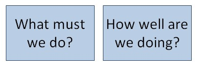

## Introduction
___  

Access to **accurate and reliable information**, and access to **a system to
keep track** of what is happening throughout the entire Order Management
Cycle **is key to managing a business effectively**.

That being said, even with access to accurate and reliable
information, **too much information** can lead to **information overload** and
this is an obstacle to being able to manage a business
effectively.  

However, with access to the right information and the right systems it
becomes possible to be extremely effective and efficient in your daily tasks.  

The key to being able to do this is to;  

a)  have **access to accurate and reliable information**, and  

b)  to be able to **arrange, group and sort the information** to help you
quickly narrow in on, and focus on the important decisions and tasks
that must be completed.  

Depending on where we are in the structure of any business and what our
core areas of responsibility are, we will be focusing on one of the seven
key areas of business.  

1.  **Product Market Validation** - Developing and launching a New Product    

2.  **Operations & Order Fulfilment** - Managing the process of fulfilling customer orders  

3.  **Business Development** - Creating relationships with new customers  

4.  **Sales** - Servicing existing customers and securing orders  

5.  **Marketing** - Generating leads for new business  

6.  **Product and Range Development** - Increasing production range  

7.  **Geographic Expansion** - Expanding to new areas  

While the details for managing each of these areas differ, the overall
**techniques for managing** is almost identical and involves using **reports and lists** to **track the activities** that need to be completed and keep the
members in your team **focused** on the day's activities and on **preparing for the activities** for the next few days.  

When working with information about the business there are **two key concepts** or ideas that we need to keep in mind simultaneously;  
1.  The first is related to the **TASK - "Who and What"**.  

2.  The second is related to **PERFORMANCE - "When and the Measure"**.    

Whenever you think about any business or organisational problem the
information you want to look at will be for one of two primary purposes.
We will either want to;  

a.  Understand what is happening and how well things are going for a
specific task, or;  

b.  Decide what to do next, and who should do it and when.  

  

While results are crucially important to any business, without
fulfilling the orders we receive from our customers reliable and on
time, the business will not have any results to measure. So we need to
make sure that we effectively complete each of the tasks for which we
are responsible in the overall chain activities that must be performed
to keep customers happy.  

So the first skill we need to develop when it come to managing our work,
the first thing we need to "know what to do", is the process of managing
the flow and progress of orders in the company.  

To this effectively using the Sense-i System becomes that much easier if
you know;  

a.  What reports to use and  

b.  How to arrange and focus on the information in each report.  

To develop an understanding of what is happening and what must be done
we have to train our minds to ask questions constantly.  

Without asking questions, our minds cannot develop any insight into or
understanding of reality. And when we take decisions without
understanding what is happening and what must be done all we do is
contribute to chaos and stress in other people's lives and cause
problems for our team, the company and our customers.  

So knowing what questions to ask is the first priority, and only once
you know what questions to ask should you be looking at the information
in the report. Also, once you know what questions to ask you will have a
sense of how to group and arrange the information in each report to give
you the answers that you need.  

This document is focused on how you use the reports in the Sense-i
Enterprise Management System to effectively manage the Operations of the
business so that all orders from customers and processed effectively and
delivered correctly and on time.  

**This is the end of the "Introduction to Lists & Grids" section.**  
