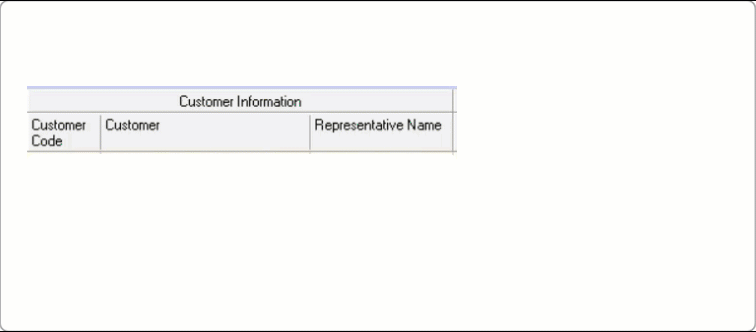
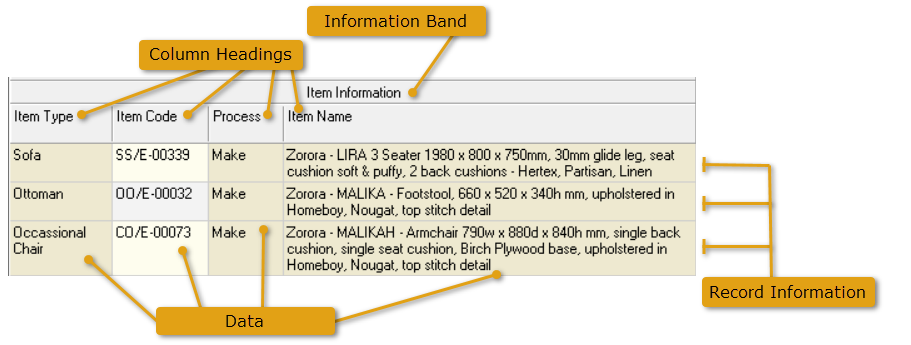
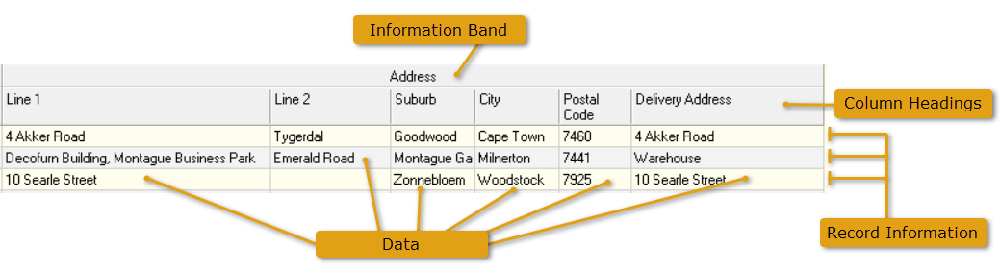

## Information Bands & Columns  

In the **Lists** or **Grids** that the system displays on each screen,
the system creates an **"Information Band"** that spans several **detail columns**.  
Each BAND has the name of the Entity displayed so that you know what the information in the columns is about.  

And then within each Band the system displays a set of columns that contain
information about the "Entity" represented by the "Band" in which the columns exist.  
For example, the **Customer Entity _(Information Band)_** has three columns, **Customer Code**, **Customer Name** and **Representative Name**.  

   

These columns help you answer questions about a customer that you might
want to know.  

You will notice that underneath the **"Customer Information Band"** there
are columns that contain information that answer each of these
questions.  

For example, the **columns display data** that relates to each
"Customer" that answer questions such as;  

-   "What is the **Customer Account Code**?",  

-   "What is the **Customer Name**?",  

-   "Who is the **Sales Rep** who handles this customer?".  

The **Record Row Information** displays all information related to each entity in the grid.  

In a similar way, information about another **"Business Object / Entity"** called
**"Item"** is also represented in a **Band** called **"Item Information"** with
**columns** containing detailed data **underneath each column**.  

   

This allows you to answer questions and find **data & information** about each Item
(Product, Material or Machine) such as;  

-   "What is the **Item Type**?".  

-   "What is the **Item Code**?"  

-   "What **Process** produces the Item?"  

-   "What is the **Item Name** _and description_?"  

In exactly the same way the system displays information about addresses
in the **Information Band** with the caption **Address**.  

   

**This is the end of the "Information Bands & Columns" section.**  
