## Procedure Guideline  

This procedure describes how you can **configure the information** in the
various list screens in the Sense-i system to suit your
**personal preferences** and the needs of each task you perform.

The screens in Sense-i provide us with information that helps us make
the decisions we need to make. There are three things we need to be able
to do in any report. These are;  

**1.  Hide Non-Relevant Information**  

**2.  Filter Information**  

**3.  Group Information**  

### Hiding Non-relevant Information 

At times **some** of the **information** on the screen is **not relevant** to the task we are performing.  

The system allows us to **hide** any **information** that is **not relevant** to what we are doing.  

To hide information that is not relevant to what we are trying to do, we
can do this in **a number of ways**;

We can **hide a specific colum** if you
don't need to see the information related to that column.  **Right-click on the Column Heading** and choose **"Hide"**.  

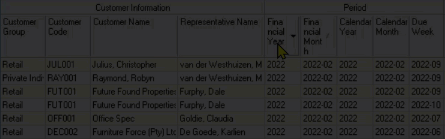   

If you don't need to see ANY OF THE INFORMATION related to the **entire band**, **right-click on the Band** itself and choose **"Hide"**.

The system will then **hide the band and all the columns** related to the
entity represented by the band. In this case, the **Customer Information** band and **all columns underneath** the band will be **hidden**.  

Another way to hide information is to keep specific bands showing and only **hide specific columns**.  

To do this, **right-click** anywhere in the **Grid** and then choose **Columns** in the pop-up menu.  

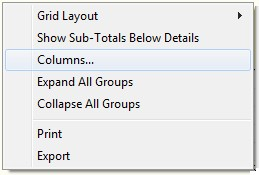   

The program will display a screen that allows you to **hide** or (if they
are already hidden) **display specific bands & columns**.  

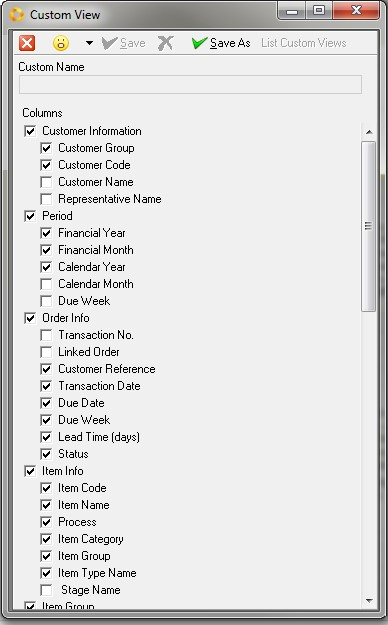   

To hide any column simply click on the **tick / checkbox** to the left of the column
name. The checkbox will be **blank** if the **column is hidden**.  

**To show a column** in the grid, **click the checkbox** so that the **tick is displayed**.  

Once you have selected the columns you wish to view, click the **Save As**
button and then enter the **name of your configured preferences** in the **Custom Name field**.  

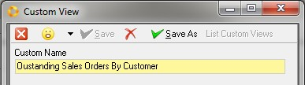   

The program will ask you if you want to **save your configured preference** as a **default**.  

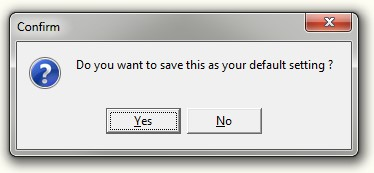   

Choose **Yes** if the layout you have created is the layout you want to see
**each time** you open that specific Grid screen.  

   

The program keeps a list of each of the custom layout configurations you have created, and you can at any time choose to swap from one layout to another.  

To swap between the different layouts, open the **Custom View**
screen, select the layout of choice and click the **List Custom Views** button.  

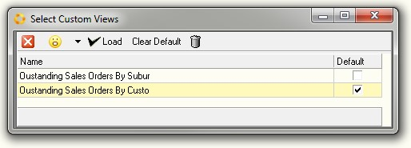   

To **change** between **layouts** simply click on the **name of the Layout Configuration** you wish to view and click the **Select / Load** button.  

   

### Filter Information  

Even after you have grouped the information in the report so that you
can view the transactions by priority, and hidden information you do not
need to see, you might still find the list contains too much
information.  

You can use the **Quick Filter option** to further filter information in the
Grid.  

Let's say that you **only want to see** orders that are **more than 2 days
late**.  

Click on the **drop-down arrow (Top Right Corner)** of the **column heading** that contains the information you wish to filter by, for example **Delivery Variance (days)**.  

The program will display a list of **unique values** that are in the grid
and you can then **check _(tick displayed in checkbox)_** the ones you wish to see.  

   

The program will **display the values** by which you have **filtered** the
information in the grid at the **bottom of the screen**.  

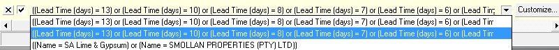   

You can click on the **drop-down arrow** to swap between any of the filtered
views you have created.  

And you can click the **Customize** button to open a screen in which you can
type **more complex search filters**.  

   

### Grouping Information  

Before we look at an example of how to group the information, we need to
look at two more **Entities or Bands**.  

The first is the entity of **Time** or in the system called **Period Information**.  

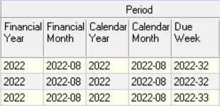   

The second is the "Entity" called "Order". The **information** and details pertaining to an "Order" are displayed in **columns underneath** the "**Order Information Band**."  

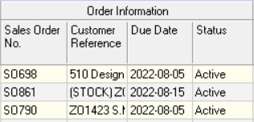   

Here you can see the system displays information such as the;  

-   "Order Number"  

-   "Customer Reference information"  

-   "Due Date"  

-   "Status", and so on.  

The **Grouping function** allows you to **effectively sort the information** in the grid so that you can concentrate and focus on dealing
with what is most important.  

Each of the **Entities** allow you to quickly and easily find and group
information using the **Enable Group** function.  

To group information in the grid, simply **_right-click_** the mouse anywhere in the
grid content area and the program will display a small **popup menu**.  

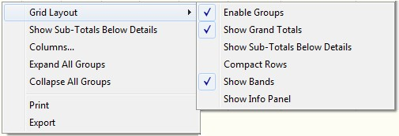   

Click the **Grid Layout** option and then click the **Enable Groups** option.  

When you do this the program will display a **grey bar** above the grid into
which you can **drag any column heading** to arrange the information on your
screen.  

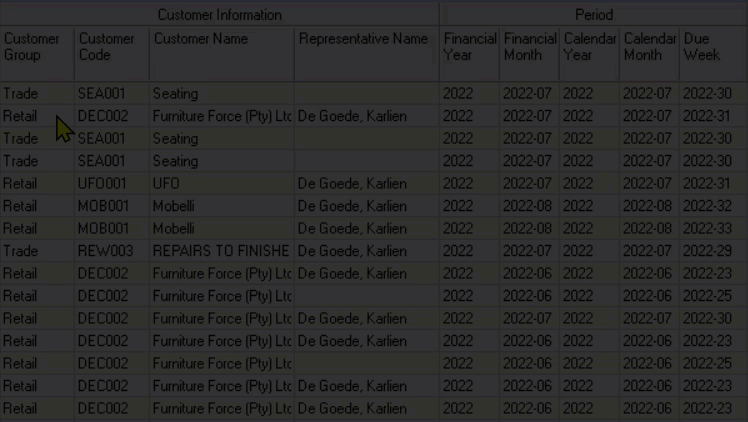   

When you are looking at reports to decide what must be processed next,
it is most useful to first group by **Calendar Month**, then by **Due Week**.  

To arrange the report in this way, simply **drag the Calendar Month column** up
into the **grey group by bar** and then **drag the Due Week underneath it**.  

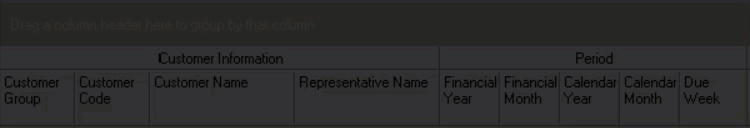   

When you have done this you should see the following on the screen;  

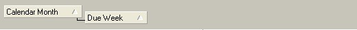   

Then, depending on how you are going to prioritize and follow-up on the
information the report, you can either group by some combination of;  

-   Sales Rep  

-   Customer _(or Supplier)_  

-   Address  

-   Department  

And then finally by  

-   Order Number.  

You might then end up with a grouping of your report as follows:

   

Such a report would tell you the following...  

What **orders** are **due** to be delivered in each **month and week**, for each
sales **representative**, in each **suburb** for each **Customer**.  

The program will collapse all the detail so that you can then focus in
on one transaction at a time.  

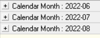   

To zoom in on the details you simply need to click the **+ sign** next to
each record **to see the details**.  

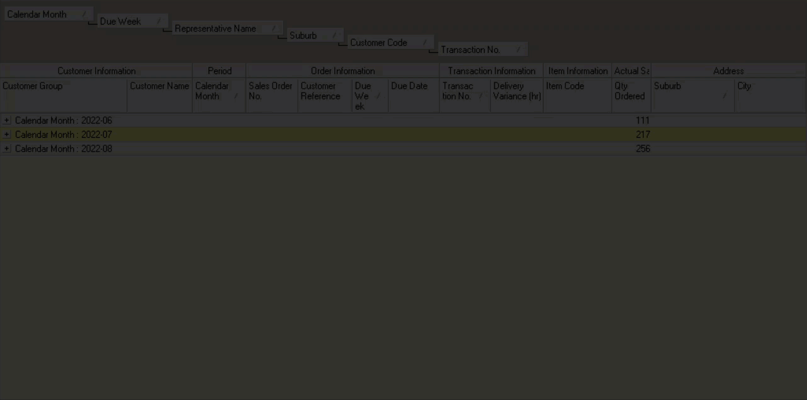   

So, as a general rule, when you are looking at reports to decide what
must be processed next, it is most useful to **first group** by **Calendar Month**, **then** by **Due Week**.  

**This is the end of the "Information Configuration" section.**  
