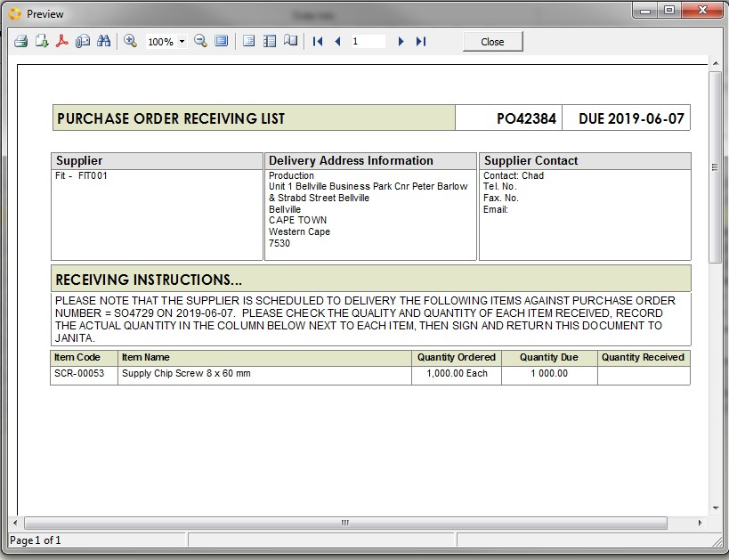

## TAKING ACTION

Once you have filtered and arranged the information in the report you
need to take **action** to move the items in the order to the **next step in the process**.  

You can do this in one of two ways.  

If you are processing the transaction without having to take any action
away from your computer, each **Outstanding Orders List** screen has a
button at the top of the screen that will automatically open and
populate the next transaction you need to create with the information
from the record you have in focus. A record in focus will appear in
yellow.  

   

Or, if you are relying on someone else in the team to take action before
you can create the next transaction in the sequence, then you can Print
a list that they can use as an instruction of what they need to do,
record what they have done and then return the list to you to capture.  

To do that click the **Print** button.  

The program will display a customised follow up list with specific
instructions that the person who is responsible for performing the task
must follow.  

   

Remember, that in order for the company to be successful, we all need to
monitor what needs to be done in our area and take the necessary steps
to ensure that each order is processed on time by the end of each
working day.  

Using the Sense-i System in the way described in this document will make
this an easy and efficient action to do.  

**This is the end of the "Lists & Grids - Taking Action" section.**  
