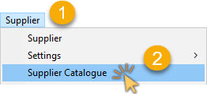
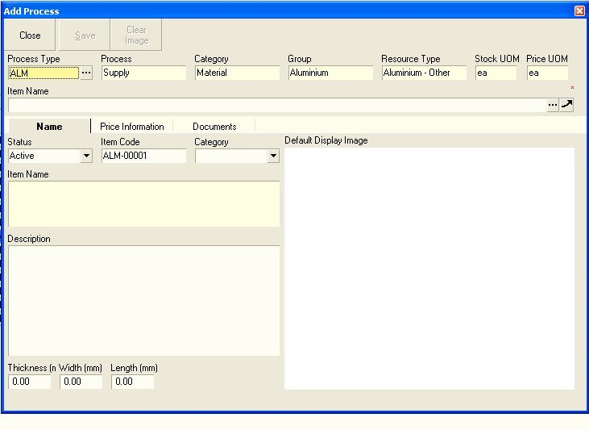

## Procedure Guideline
___  

This procedure describes how to add the names of new materials and
update prices for all the items purchased from the company's
suppliers.  

## Capture Material Details 

1.  Select **Supplier** from the main navigation menu.  

2.  Then click the **Supplier Catalogue** option.  
	
  

The system will display a screen titled **Maintain Supplier Catalogue**.
This screen consists of a panel at the top called the **Search Criteria Panel**
and a Grid at the bottom called the **Supplier Catalogue Grid**.  
	
  	

The **Search Criteria Panel** enables you to enter information to search
for specific Materials and to reduce the length of the list of
Materials you see displayed on the screen. This is useful because
Material Catalogues often contain hundreds and even thousands of
records and finding a specific Material can be time consuming.  

The **Supplier Catalogue Grid** underneath the Search Criteria Panel
consists of a set of columns that display specific information about
each product, such as its **Code, Name, Unit of Measure, physical Dimensions, Cost Price, Supplier Name** and so on.  

Information about the Materials your company purchases from Supplier
is stored at three levels of detail in the system. These levels make
it much easier for you to filter long lists of information to quickly
find the exact material you need.

At the highest level, Materials are arranged into **Groups**. Material
Groups are then broken down into **Material Types** and finally Types
consist of **specific Instances**.  

### How to Search for Material Information 
	
  	

3.  All Resources consumed and produced by a Company and its Suppliers
    is a result of a specific Process that has been performed. These
    Processes could consist of **Make, Supply, Deliver, Finish** and so on.  

    Normally, the Materials provided by Suppliers are the result of a
    Process called "**Supply**" which consists of the Supplier either Making
    and Delivering or Buying and Delivering the Materials to your
    Company.  
    
    The **Process setting defaults to Supply**. You should not
    normally need to change this setting when you are working with
    Materials in the Supplier Catalogue.  

4.  A company consumes and produces Resources. Because you are working
    in the Supplier Catalogue, the **Resource Category** the system sets
    this to **Materials**.
	
  	

5.  Press **[Tab]** and **[F4]** to move the cursor to the **Material Group** field to
    see a list of the **Material Groups** that have been set up in the
    system. Typing on the key board automatically moves the cursor to
    select the name of the Material Group that matches the letters you
    have entered.  
    
6. Leave the **Catalogue** field as **Supplier**.  

7.  If you wish to see a list of Materials provided by a specific
    Supplier, you can select the Supplier by clicking on the **Three-Dot**
    button in the **Supplier field**. If you do this you will see a list of
    all Suppliers and you can then search for a specific supplier.

8.  (You will need to have read and practiced the **Supplier Profile**
    Procedure to use this feature effectively.)  

9.  You can also filter the list to show only those records for a
    specific Material Type. To do this click the right mouse button and
    select the "**Indexed View**".  
	
  	

10. The system will display a list of all
    of the **Material Types** that have been captured in the system. You can
    click on any of the Material Types in the list to quickly and easily
    search through long and complicated **Material Catalogues** to find the
    items you wish to include in your **Purchase Orders** and **Process Models**.  

11. Once you have entered the basic Search Criteria, click on the **Search**
    button on the form bar.  
	
  	

12. The system will now display a list of all Materials that match the
    Search Criteria you have entered. To make the list of items easier
    to read, **right click** anywhere in the grid and select the option
    **Compact Rows**.  
    This will change the way the system displays
    Material Names in the grid by wrapping the names and increasing the
    height of each row so that you can read the full product name.  

## How to Add New Materials to the Catalogue 

13. To add a new item to the Material Catalogue click the **Add** button.  
	
  	

Before you can add the details of any specific Material to the system,
you need to **select the Material Type** so that the system knows which
rules to apply and what kind of product code to use.  

14. The system will display a screen titled **Select Process Type**.  
    Click on the **name of the Material Type** for which you wish to add specific
    **material price information**.  

  

15. Then click the **Select** button.  

The system will display a screen titled **Add Material**.  
This screen enables you to enter a **Code, a Name**, create a **Description** and enter
the physical **Dimensions** of the Material you want to add into the
catalogue.  

  

16. Enter the **name of the material** in the **Item Name** field.

17. If a **Name Format** has been defined for the Material Type the system
    will open a window titled **Define Item Name and Description**.  

:::note
If you need to work with **Dictionaries** you should read the document
titled "**Understanding Material Name Formats**" as this will provide you with useful
information about how the system uses **drop down dictionaries** to build
Material Names.  
:::  

If no Name Formats have been set up, then simply type
the **name of the new material** you wish to store in the database in the
**Item Name** field.

18. The system generates a **unique code** for the new material in the
    **Item Code** field.

  

19. If you want to give the item a specific code, say to match an
    existing code in your current stock system, simply place the cursor
    in the **Item Code** field, delete the existing code and type in a new
    code.

  

You need to define whether the item you are capturing is a
**Standard Item** or a **Variation** or a **Custom Item**.  
This setting makes it easier for you to search for materials in the catalogue.  
A Standard item is an item that you either purchase regularly and use in
many different products, or it could be an item that you use simply to store
a base price.  
A sheet of chipboard is normally a Standard item, as would be a
sheet of glass 1m x 1m square.  

However, you are unlikely to order a sheet of glass 1m x 1m square and
instead are more likely to purchase sheets of glass according to
specific dimensions for each customer order.  
A sheet of glass 0.46 x 0.87 could be a **Variation** of the
Standard item for a specific job.  

A **custom item**, is an item that is normally **unique and highly specific**.  
For example, a sheet of glass with a **unique sandblasted pattern** could be
a **Custom item**.  

Note that over time, items can change from being Custom and Variation to
Standard. This would happen if the company made a product that was
unique for one customer, but then found that the same product was
popular among other customers and then decided to promote that product
more extensively.  

20. If the item is a standard material, select the **Standard** category.  
    If the item is a **variation** of a Standard Material or a **Customised**
    Material, you can select these options from the **Category** drop down
    list. This makes searching for materials in the future easier.  

  

21. If the item you are entering into the database is subject to
    **specific physical dimensions**, then type these into the physical
    **Dimension fields** at the bottom of the screen.  

  

22. Once you have captured the basic information about the product,
    click on the **Save** button on the Form Bar.

  

You will now need to add details about the suppliers from whom your
company purchases the item and their lead times, quality performance
and cost price.  

You will notice a set of **tabs** on the **Add Material** screen. These tabs
make it easier to group information in different screens so that you
see only the information you need to at any time.  

### How to Add Sourcing and Cost Price Information  

23. Select the **Price Information** Tab.

  

The system will change to a new screen that enables you to enter
information about the suppliers and prices for the item.  

  

If your company buys the item from an external Supplier, you will need
to enter **Cost Price information** in the **Supplier Name** screen.  

24. To select the **Name of the Supplier** from whom the Company purchases
    the Material, click the **[ Three-Dot ]** button on the **Supplier Name** field
    or press **[F4]** once the cursor is on the Supplier Name field.  

  

The system will open a screen titled **Select Supplier**.

25. You can type the first few letters of the Supplier's Name in the
    **Registered** or **Common Name** fields, then click the **Search** button.  

26. The system will then display only those Suppliers where the Names
    match your selection.  

  

28. Then click the **Select** button.

29. The system will display the selected Supplier's Name in the
    **Supplier Name** field.  

  

30.  If your Supplier has their own unique code for the Material, you
    should enter this code in the **Supplier Item Code** field. The system
    will then print this code on all Purchase Orders which will ensure
    that Suppliers deliver the correct item.  

31.  You can also enter the Name the Supplier has given to the Material
    in the **Supplier Item Name** field.  

32.  You should enter the **Lead Time** for the Material. This is the
    shortest time normally taken by the Supplier to deliver the item. If
    you do not have this information you should contact the Supplier to
    ask them to quote you a **Standard Lead Time**. The system uses this
    information when planning Material Purchases.  

33.  You need to enter a **Quality %**. This is the number of times that a
    supplied item meets your company's quality standards.  

:::tip
The **Quality %** provides for adding the **cost of waste** onto the
**net cost** when calculating the cost price of a manufactured item.  

If for example, you know that when the company uses solid timber,
**30%** of the timber is **wasted** due to planning and cutting operations
and you want to build this waste into your product costs, then enter **70%** in this
field.  
:::

34. Enter the Cost Price charged by the Supplier in the **Unit Cost** field.  

35. Select the **Unit of Measure** for which the Cost Price is quoted.  

36. If the **Cost Price** is simply **based on the Quantity Purchased**, then
    leave this as **Stock UOM**.  
    If the Cost Price is based on a Packlot, then go to relevant step below.

37. Once you have entered the pricing information, click the Apply
    button and then the Save button to store the information in the
    database.  

  

38. If your company purchases the item from more than one supplier, then
    simply click the drop down arrow next to the **Supplier Name** field and
    select the **[Select New Supplier]** option, then repeat steps 25
    to 37 above.  

  

39. Select **Packlot** from the list and enter the **Packlot Price** and
    **Packlot Quantity**.  

40. For example, the Supplier might sell 24 Brackets in a Box and charge
    R 72 per Box. This would then equate to R 3-00 per bracket. You
    would enter the **R 72** in the **Total Price** field, the packlot quantity
    and UOM in the **Packlot Price Data** field and then enter the
    **Conversion** formula so that the system understood that there were 24
    items in a box.  

  

Once you have entered and saved all the information about the supply
sources for the item, you can then add documents and images to this
record.  

  

41. Click on the **Documents Tab**.

The system will display a list of all documents that have been linked
to the item previously.  

  

42. To add a new document to the item, click the **Add** button on the Form
    Bar.  

The system will open a screen titled **Add Documents**. This screen allows
you to browse the folder structure on your network to find one or more
images or documents to link to the **Material Profile** you are capturing
in the SEMS System.  

:::tip  
It is a good idea to store all images on a separate
shared drive on the network that has the same drive letter for each
user. This enables every user in the company to access the same
images, documents and technical details for each Material.  
:::

  

43. Browse the network to find the file or files you wish to link to the
    record you are capturing. Once you have found the correct file,
    click on the file name or image.  

44. Once you have clicked on the correct file name, click the **Open**
    button.  

The system will return you to the Documents tab and show the name of
the file and it's location on the network (also called a **File Path**) in
the **Folder** column.  

  

You can link multiple images and documents to a Material Profile by
repeating steps 40 to 44 for each file you wish to link.  

45. The system also allows you to set one image file as the **default image**
    that is used when printing specification sheets and can be
    printed on order forms. To set a file as the default image, click
    the **Set Image** button.  

46. Click the **Name tab** and the system will return to this screen and
    display the linked image.  

  

### How to Add Selling Price Information  

If your company sells the item to its customers, you will need to
enter Selling Prices.

  

47. Click on the **three dot** button to select the name of the **Department**
    that sells the Product you are adding.  

48. Click on the name of the Department to which you wish to link the
    Selling Price. The department you select will be the **Department**
    against which the **Sales Quote** and **Sales Order** must be captured.  

49. Then click the **Select** button.  

50. The system will display the name of the department you have chosen
    in the **Department Name** field.  

  

You can press the **[Tab]** key on your keyboard to quickly move from one
field to the next.  

51. Enter the **number of days** it takes from when the customer orders the
    product until it can be delivered.  

52. Select **"Days"** from the drop down list.  

53. Enter the quality as **"100%"**.  

54. Enter the **actual** or **target cost price** in the **Unit Price** field.  

55. Select a **selling rule**. This is either **"Do Not Sell"**, **"Fixed Price"**
    or **"Dynamic Price"**.  

    A **Fixed Price Rule** means that the Selling Price
    you enter is remains fixed until you change it. Any changes in the
    Cost Price do not ripple through to the Selling Price, but rather
    change your Markup.  

    A **Dynamic Price** means that your Markup
    Percentage remains constant and changes in the Cost Price
    automatically ripple through to change the Selling Price.  

56. Enter the **Markup Type** as either a **"Percentage"** or an **"Amount"**.

57. If you set the Selling Rule to be **Dynamic Price** you will need to
    enter the **Markup Amount**.  

    If you set the Selling Rule to be **Fixed** you
    need to enter the **Selling Price**.  

    The system works out the variable you have not entered.  

58. When you have completed entering price information, click the **Apply**
    button.  

59. Then click the **Save** button.  

60. Then click the **Close** button and the system will return you to the
    Material Catalogue.  

## Understanding Cost Price and Selling Price Information  

The SEMS System is focused on helping companies improve their
productivity and profitability.  

The system stores price information
about any **resource** (that is any **Material, Component, Machine** and
**Product**) in two ways. The first is the COST PRICE and the second is
the SELLING PRICE.  

The COST PRICE is the price that a company pays to **buy an item** from a
Supplier or to **make an item** in one of its Departments.  

The SELLING PRICE is the price that a company **charges its Customers**
for the item.  

  

There are several scenarios for capturing PRICE INFORMATION in the SEM
System. And these scenarios are dependent on two aspects.

-   Buy or Make

-   Use and / or Sell

### Buy or Make  

If the company BUYS an item from another company or person, then the
item needs to be given a SUPPLIER COST PRICE. This is stored in the
SUPPLIER PRICE section of the PRICE INFORMATION screen.  

If the company MAKES an item in one of its own Departments, then the
item needs to be given a DEPARTMENT COST PRICE. This is stored in the
DEPARTMENT PRICE section of the PRICE NFORMATION screen.  

### Use and / or Sell

If the company only USES an item as part of its OVERHEADS or uses an
item in its MANUFACTURING or INSTALLATION PROCESS then the item DOES
NOT NEED A SELLING PRICE.  

If the company SELLS an item to its Customers, regardless of whether
it Buys it or Makes it, then you must capture a SELLING PRICE for the
item.  

The following diagram illustrates the relationship between the price
information of an item.  

  

This structure is then mirrored in the **Price Information** screen in the
SEMS System.

The PRICE INFORMATION screen provides you with a single screen on
which you can view all of the information. The screen consists of
several components.  

### The Item Information section.  

This contains the **Item Name**, its **Units of Measure** and the **Accounts** and **Sub-Accounts** to which it is linked in the **Accounting Modules**.  

### The Supplier Price Information section.  

This contains the **Supplier's Cost Price** information for the selected item.  

### The Department Price Information section.  

This contains the name of the **Department** that either makes or sells the item, its
**Cost Price**, the **Mark-up** and the **Selling Price**.

  

## Summary - Price Information  

So then to recap...  

If your company **purchases** the item **from** one of its **Suppliers**,
then the **cost price** could be the **Purchased Cost** as supplied by a Supplier.  
The **Cost Price** must then be captured in the **Supplier Price Information**
section of the screen.  

If you company **makes the item** in one of its **Departments** you will need
to calculate and specify the **COST PRICE** of the item using the
**Process Model Module**.  
This is either the **combined cost** of all of the **Inputs**
(that is the **Materials and Components** used in the item) AND the
**Manufacture Cost** (that is the **time** it takes to make multiplied by the
**Labour, Machine** and **Overhead Cost** per minute).  

If the **item is sold** to a **Customer**, then the **Selling Price** is the price
that you will **charge the Customer for the item** and must be captured in the
**Department Selling Price** section of the screen.  
The **Selling Price** record displays this price and shows the **Gross Profit**
the company makes on this Selling Price.  

Remember that this Gross Profit is used
to pay for the rental of the company's premises, the machinery and
vehicles, the salaries of all people working in the company and the
interest charged on the loans and leases that the company has. In
addition, the Gross Profit is used to pay for all running costs such
as Telephones, Computers, Software, Stationery, Insurance and Taxes to
name just a few.  

In some cases a company will make an item in one of its departments
and at the same time buy the item from an external supplier. In this
scenario the system will show two cost price records.  
One the cost
price of the item based on its **internal manufacture cost** and the
second for the **cost price paid to the supplier** for providing the item.  

Please keep in mind that it is ABSOLUTELY ESSENTIAL that PRICE
INFORMATION for all items in the system is COMPLETE, ACCURATE and
UP-TO-DATE.  

All the reports and the management decisions that are made
from the information presented in these reports relies on accurate
information.  

Inaccurate price information leads to spending too much
money, incorrect prices being charged, lost profits and sometimes lost
sales. These are mistakes that few companies can afford to make.  

**This is the end of this procedure.**
