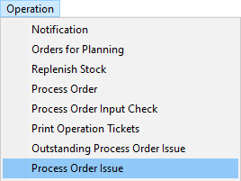
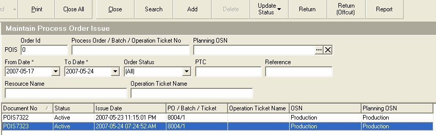

## Procedure Guideline
___  

1.  Select the **Operation** option on the main menu.  

2.  Then click on **Process Order Issue** in the drop-down menu.
	
  

The system will open a screen titled **Maintain Process Order Issue**.
This screen lists all the transactions you have created to record what
materials have been issued from the store.  

These transactions are
called Process Order Issues because they record what Materials have
been ISSUED to which PROCESS ORDERS.  

The top three rows of the screen
contain **Search** fields into which you can enter information to search
for specific transactions.  

You could enter a Process Order Issue number in the **POIS** field.
You could set the **From Date** and **To Date** and
list all the transactions recording materials issued that occurred
between these dates. You could enter the **Customer Reference** number in
the Reference field.  

You could also enter a **% symbol** and then type in
a few letters of the material you want to return into the store. For
example, if the material was a Drawer Runner, Model O8818, Matt Black
you would type **"%O8818"** and the system would list all Process Order
Issues that contained this item.  
	
  

3.  Once you have entered the values to search for a specific record
    (you can also leave them blank to have the system list all records
    between the default dates) click the **Search** button on the form bar.  

4.  The system will display a list of all Process Orders Issues that
    have previously been captured.  

5.  To record materials that are being issued from the store to a
    specific Process Order, click **Add** button on the form bar.  
	
  

The system will open a screen titled **Select Process Order Batch**. This
screen will lists all the batches that have been created in the system
for a specific Process Order.  
	
  

When you issue materials you need to book them to a specific Job (in
the Sense-i System Jobs are known as Process Orders) and **Batch Number**.  

Ideally, the materials you issue should be planned and included in the
costing. The **Input Requirement Totals** report lists all the materials
needed to complete a specific Process Order. The Input Requirement
Totals report also lists the Process Order Numbers to which the
materials need to be issued at the top of the report.  

6.  To select a Process Order number you can either click on the   
    **three-dot** button in the **Process Order Number field** and then
    search for and select a specific Process Order OR you can type the
    **Process Order number** against which you wish to issues materials in the
    **Process Order field** and then press the **Tab** key.  

If you decide to select a Process Order from the list by using the
three-dot button, then the system will open a screen titled
**Select Process Order**.  

This screen will lists all the Process Orders that have
been created in the system. Search for the specific Process Order to
which you wish to issue materials.  
	
  

7.  Click on the correct Process Order in the list screen.  

8.  Click the **Select** button on the form bar.  

The system will return to the **Select Process Order Batch** screen.  

Sometimes, particularly if the number of items that need to made is
large, Process Orders are broken down into batches. An order for 100
chairs for example could be broken down into 5 batches of 20 chairs
each. You can now choose to issue materials to one batch only or if
you hold down the control key on your keyboard and click on more than
one batch you can choose to issue materials to more than one batch.  
	
  

9.  Click on the Process Order Batch or Batches to which you wish to
    issue the specific materials.  

10. Click on the **Select** button on the form bar.  

The system will open the **Add Process Order Issue** screen.  

11. Note the **name of the product** being manufactured in the **Output** field.  
	
  

12. This screen lists all of the materials that have been defined in the
    Bill-of-Materials or Cutting List for the item in the grid. The
    system also displays the Quantity Required.  
    
13. The system also displays the Quantity Previously Issued and  

14. The Quantity Outstanding.  

15. Enter the **Quantity** for each material that you are issuing from the
    store in the **Issue Quantity** field.  

  Make sure here that you type in the Actual Quantity you are issuing from the store and that you have checked and counted that the quantity you are entering is correct. If the quantity you enter in the system is not correct, then this will be detected when conducting an Actual Stock Take and an Adjustment will need to be entered to correct the balances.  
  
  Stock Adjustments always raise an alarm within any company because they only need to be captured when the system has broken down and can often be indications of theft of materials. As such they require management time and effort to investigate and resolve and this distracts the company from the work it needs to do and should be avoided as much as possible.  
	
  

16. Once you have recorded correctly the quantities for all of the
    materials that you are issuing from the store, click the **Save** button
    on the form bar.  

17. The system will print a copy of the Process Order Issue so that you
    can ask the person to whom you are issuing the materials to sign to
    acknowledge that they have received the correct items. You should
    store this signed copy in a file titled Process Order Issues and
    arrange these in date sequence from oldest at the back to most
    recent at the front.  

After printing the Process Order Issue document, the system will
return you to the Select Process Order Batch screen.  
	
  

18. You can View the details of the materials you have issued or...  

19. You can choose to either issue materials to another batch, if more
    than one batch exists or...  

20. You can choose to click **Close** to return to the previous screen.  

If you choose to view the details of the materials you have issued to
a batch, the system will open the View Process Order Batch screen. You
will notice that the quantity of each material that was issued to the
batch is displayed in the **Qty Issued** column.
	
  

21. The Process Order (Job Card) number is displayed in the
    **Process Order Number** field.  

22. The Batch Number is displayed in the **Batch Number** field.  

23. The **Issue Status** tells you whether No Materials have been issued to
    the Batch, only some materials have been issued (in which case the
    status becomes Partial) or whether all the required materials have
    been issued, (in which case the status becomes Completed).  

24. The screen also lists the **Due Date** on which the Process Order Must
    be completed AND  

25. it lists the Date on which the Materials on this Batch are required.  

26. The system lists the number of items that must be made in the batch.  

27. To close the View Process Order Batch screen, click the **Close** button
    on the form bar.  

If you select Close in step 27 above the system returns to the
Maintain Process Order Issue screen and displays the Process Order
Issue you have just completed in the list.  

28. Once you have completed capturing all the materials you have issued,
    click the **Close** button on the form bar.
	
  

**This is the end of this procedure.**

You should now proceed to the **Monitor Materials Issued Report** to see how the system has updated the list of Materials Issued.
