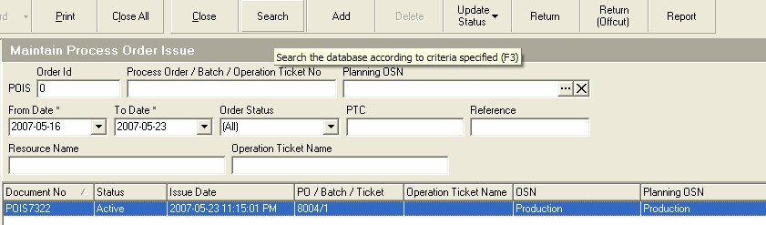
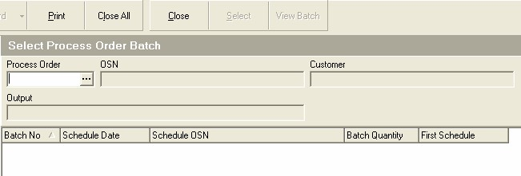
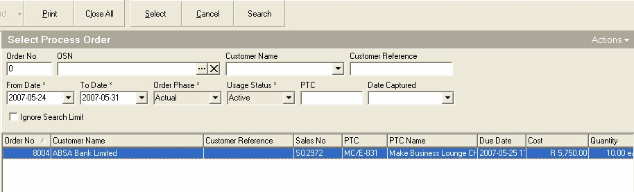
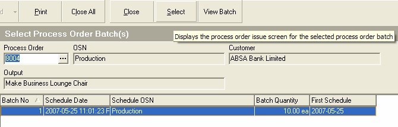
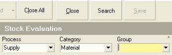

## Procedure Guideline
___  

In many companies, situations occur where materials need to be issued
to Process Orders that have not been planned for.  

This happens when
Process Orders are created without Material Plans being created or
when mistakes have been made in the costing process.  

The procedure for
issuing unplanned materials to Process Orders is very similar to
issuing planned materials.

1.  Select the **Operation** option on the main menu.  

2.  Then click on **Process Order Issue** in the drop-down menu.  
	
  

The system will open a screen titled **Maintain Process Order Issue**.
This screen lists all the transactions you have created to record what
materials have been issued from the store.  

These transactions are
called Process Order Issues because they record what Materials have
been ISSUED to which PROCESS ORDERS.  

The top three rows of the screen
contain **Search** fields into which you can enter information to search
for specific transactions.  

You could enter a Process Order Issue number in the **POIS** field.
You could set the **From Date** and **To Date** and
list all the transactions recording materials issued that occurred
between these dates. You could enter the **Customer Reference** number in
the Reference field.  

You could also enter a **% symbol** and then type in
a few letters of the material you want to return into the store. For
example, if the material was a Drawer Runner, Model O8818, Matt Black
you would type **"%O8818"** and the system would list all Process Order
Issues that contained this item.  
	
  

3.  Once you have entered the values to search for a specific record
    (you can also leave them blank to have the system list all records
    between the default dates) click the **Search** button on the form bar.  

4.  The system will display a list of all Process Orders Issues that
    have previously been captured.  

5.  To record materials that are being issued from the store to a
    specific Process Order, click **Add** button on the form bar.  
	
  

The system will open a screen titled **Select Process Order Batch**. This
screen will lists all the batches that have been created in the system
for a specific Process Order.  
	
  

When you issue materials you need to book them to a specific Job (in
the Sense-i System Jobs are known as Process Orders) and **Batch Number**.  

Ideally, the materials you issue should be planned and included in the
costing. The **Input Requirement Totals** report lists all the materials
needed to complete a specific Process Order. The Input Requirement
Totals report also lists the Process Order Numbers to which the
materials need to be issued at the top of the report.  

6.  To select a Process Order number you can either click on the   
    **three-dot** button in the **Process Order Number field** and then
    search for and select a specific Process Order OR you can type the
    **Process Order number** against which you wish to issues materials in the
    **Process Order field** and then press the **Tab** key.  

If you decide to select a Process Order from the list by using the
three-dot button, then the system will open a screen titled
**Select Process Order**.  

This screen will lists all the Process Orders that have
been created in the system. Search for the specific Process Order to
which you wish to issue materials.  
	
  

7.  Click on the correct Process Order in the list screen.  

8.  Click the **Select** button on the form bar.  

The system will return to the **Select Process Order Batch** screen.  

Sometimes, particularly if the number of items that need to made is
large, Process Orders are broken down into batches. An order for 100
chairs for example could be broken down into 5 batches of 20 chairs
each. You can now choose to issue materials to one batch only or if
you hold down the control key on your keyboard and click on more than
one batch you can choose to issue materials to more than one batch.  
	
  

9.  Click on the Process Order Batch or Batches to which you wish to
    issue the specific materials.  

10. Click on the **Select** button on the form bar.  

The system will open the **Add Process Order Issue** screen.  

11. Note the **name of the product** being manufactured in the **Output** field.  
	
  

12. This screen lists all of the materials that have been defined in the
    Bill-of-Materials or Cutting List for the item in the grid. The
    system also displays the Quantity Required.  
    
13. The system also displays the Quantity Previously Issued and  

14. The Quantity Outstanding.  

15. If you cannot find the material that is being requested by the
    Production Supervisor or person requesting the material on the list
    it means that a problem has occurred and someone has made a mistake.  

    Either the Bill-of-Materials is incorrect and the Design Team failed
    to include a Material that should have been included, or the
    Production Team is requesting an item that should in fact not be
    used to make the product.  

16. You should contact the design team, inform them of the Process Order
    Number and the Item and ask them why the Material item being
    requested was not included in the bill. This will ensure that a
    mistake is not made through using an item that should not be used.  

17. Once you know that it is necessary to issue the material that was
    not on the plan you must click the **Add** button on the form bar.  

The system will open the **Select Item** screen. This allows you to select
any material from the Material Catalogue and to issue it to the
Process Order.
	
  

The list of materials in most companies' databases is long. It is
important to ensure that you are issuing the correct material on the
system. To narrow the list of items displayed on the Stock Evaluation
screen, select a Process and a Resource Category. Usually this is
either Supply + Materials or Make + Products or any other combination
that applies in your business. In addition, to reduce the list further
you can select a Resource Group and if necessary a specific Resource
Type.  

*(Remember that all resources in the company are arranged in a
hierarchy starting with Category at the top, then Group, then Type and
then the specific product or material, known as an Instance.)*
	
  

18. If you wish to view the stock balances for the Raw Materials
    purchased by the company, change the process to **Supply**.  

19. Then change the Category to **Material**.  

20. You can also filter the list of stock items displayed in the screen
    even more by selecting a **specific Material Group**. To do this, select
    a specific Group from the drop down list in the **Group field**.  
	
  

21. In addition, you can filter the list of items displayed by the
    system through using the **Item Code** to show only those items that
    match a specific code
    OR  
    by using the **% symbol** and **part of an item name**,
    to show those items that have a similar name to the one you
    enter in the **Resource Name** field.  

22. Then click the **Search** button.  

The system will display a list of all the materials in the company's
database that match the search criteria you have entered.  
	
  

23. Click on the row containing the name of the item you wish to issue.
    Again, make certain that you are selecting the correct item.  

24. Then click the **Select** button on the form bar.  

The system will return you to the Process Order Issue screen and list
the item you have chosen at the bottom of the screen.  

You will notice a check box in the **Adhoc** column for the item you have chosen.  
This indicates that the item was not included in the original costing.
Also, you will notice that the Quantity Required is 0.  
	
  

The last step you need to perform is to enter the quantity of the
material you are issuing.  

25. Enter the **quantity for each material** that you are issuing from the
    store in the **Issue Quantity** field.  

  Make sure here that you type in the Actual Quantity you are issuing from the store and that you have checked and counted that the quantity you are entering is correct. If the quantity you enter in the system is not correct, then this will be detected when conducting an Actual Stock Take and an Adjustment will need to be entered to correct the balances.  
  
  Stock Adjustments always raise an alarm within any company because they only need to be captured when the system has broken down and can often be indications of theft of materials. As such they require management time and effort to investigate and resolve and this distracts the company from the work it needs to do and should be avoided as much as possible.  

26. Click the **Save** button on the form bar.  
	
  

27. The system will print a copy of the Process Order Issue so that you
    can ask the person to whom you are issuing the materials to sign to
    acknowledge that they have received the correct items. You should
    store this signed copy in a file titled Process Order Issues and
    arrange these in date sequence from oldest at the back to most
    recent at the front.  

After printing the Process Order Issue document, the system will
return you to the **Select Process Order Batch** screen.  
	
  

28. You can View the details of the materials you have issued OR...  

29. You can choose to either issue materials to another batch, if more
    than one batch exists OR...  

30. You can choose to click **Close** to return to the previous screen.

If you selected Close in the step above the system returns to the
**Maintain Process Order Issue** screen and displays the Process Order
Issue you have just completed in the list.  

31. Once you have completed capturing all the materials you have issued,
    click the **Close** button on the form bar.  
	
  

**This is the end of this procedure.**

You should now proceed to the **Monitor Materials Issued Report** to see
how the system has updated the list of Material Issues.
