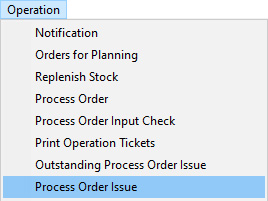
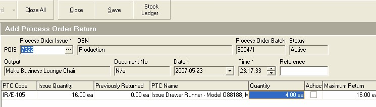
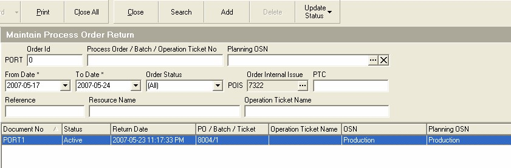

## Procedure Guideline
___  

1.  Select the **Operation** option on the main menu.  

2.  Then click on **Process Order Issue** in the drop-down menu.  
	
  

The system will open a screen titled **Process Order Issue**.
This screen lists all the transactions you have created to record what
materials have been issued from the store.  

These transactions are
called Process Order Issues because they record what Materials have
been ISSUED to which PROCESS ORDERS.  

The top three rows of the screen
contain **Search** fields into which you can enter information to search
for specific transactions.  

You could enter a Process Order Issue number in the **POIS** field.
You could set the **From Date** and **To Date** and
list all the transactions recording materials issued that occurred
between these dates. You could enter the **Customer Reference** number in
the Reference field.  

You could also enter a **% symbol** and then type in
a few letters of the material you want to return into the store. For
example, if the material was a Drawer Runner, Model O8818, Matt Black
you would type **"%O8818"** and the system would list all Process Order
Issues that contained this item.  
	
  

3.  Once you have entered the values to search for a specific record
    (you can also leave them blank to have the system list all records
    between the default dates) click the **Search** button on the form bar.  

4.  Click on the Process Order Issue that was used to issue the Material
    being returned.  

5.  Click on the **Return Issue** button on the form bar.  

The system will open a screen titled **Add Process Order Return**.  

The screen lists all of the materials that were recorded on the Process
Order Issue you selected in step 4 above.
	
  

6.  You will notice that the system displays the **total quantity** of the
    item originally issued in the **Issue Quantity** column.  

7.  You will also notice that the system records the total quantity
    **Previously Returned** next to the original Issue Quantity.  

8.  Enter the quantity of material being returned from the department to
    which it was originally issued in the **Quantity** field.  

9.  Click the **Save** button on the form bar.

10.  Click the **Close** button on this form, and then on the
    **Add Process Order Return** option.  

The system will return you to the **Process Order Return**
screen. You will now see the Process Order Return you have just
created in the list screen.
	
  

**This is the end of this procedure.**
