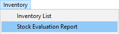
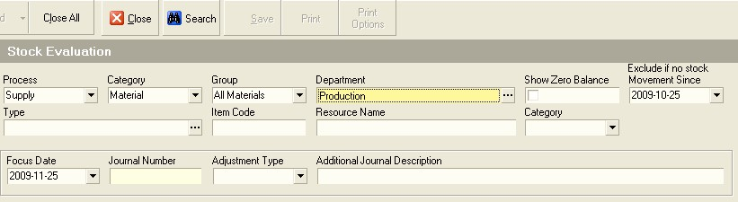
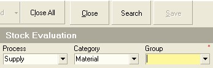
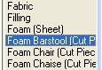
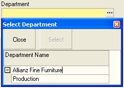
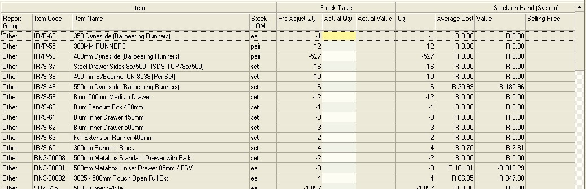
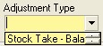
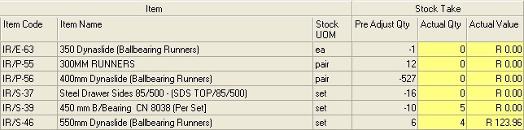

## Step-by-step Guideline
___  

1.  On the Main Menu select the **Inventory** function.  

2.  From the Drop-down Menu click **Stock Evaluation Report**.  
	
  

The system will display a form titled **Stock Evaluation Report**.  

This screen consists of a panel at the top called the **Search Criteria**
panel. The Search Criteria Panel enables you to enter information to
search for specific products and materials in order to reduce the
number of items you see displayed on the screen. This is useful
because Product and Material Catalogues often run into the thousands
and finding the specific Product you want to include on a Quote or
Order can be time consuming.  
	
  

### Printing Stock Take Worksheets  

To narrow the list of items displayed on the Stock Evaluation screen,
select a Process and a Resource Category. Usually this is either
Supply + Materials or Make + Products or any other combination that
applies in your business. In addition, to reduce the list further you
can select a Resource Group and if necessary a specific Resource Type.  

:::info
Remember that all resources in the company are arranged in a
hierarchy starting with **Category** at the top, then **Group**, then **Type** and
then the specific product or material, known as an **Instance**.  
:::
	
  

3.  If you wish to view the stock balances for the Raw Materials
    purchased by the company, change the process to **Supply**.  

4.  Then change the Category to **Material**.  

5.  You can also filter the list of stock items displayed in the screen
    even more by selecting a specific Material Group. To do this, select
    a **specific Group** from the drop down list in the **Group** field.  
	
  

6.  All stock balances are stored for a specific department within the
    company. Each department has its own list of balances. You need to
    select a specific department. To do this, click the **three-dot button**
    in the **Department** field.  

The system will open a screen titled select **Department**.  
	
  

7.  To select the department for which you wish to print a Stock
    Evaluation Report, click on the name of the department in the list
    and  

8.  Click the **Select** button on the form bar.  

The system will return to the Stock Evaluation Report and display the
name of the department you have selected in the Department field.  

9.  In addition, you can filter the list of items displayed by the
    system through using the **Item Code** to show only those items that
    match a specific code or by using the **% symbol** and
    **part of an item name**, to show those items that have a similar name
    to the one you enter in the Resource Name field.  

:::note  
When counting stock, and indeed when laying out your material
store, it is usually best to group similar items together and to
create sections in your store that match the Material Types that have
been defined in the system.  
:::

There are three additional filters you can use to control the list of
items on the Stock Evaluation Report.  

10. To eliminate unnecessary items from the list, the system
    automatically EXCLUDES all items that have a zero balance. If you
    wish to see zero balance items, you need to click the cursor on the
    **Show Zero Balance** field so that the checkbox is set on, (i.e. a tick
    is displayed) before you click the Search button.  

11. The system also excludes items from the list where no transactions
    have been captured after a certain date. You can set this date in
    the **Exclude No Movement** field. Usually it is a good idea to set this
    date to either one or two months in the past.  

12. The balances on the Stock Evaluation Report are always based on a
    specific date. You set this date in the **Focus Date** field. So, if the
    current date is the 2nd of July and you want to view stock
    balances at the end of June, set the focus date to the 30th of
    June.  

Normally, you there would be a two step process to using the Stock
Evaluation Report. The first is to PRINT STOCK COUNT SHEETS and the
second is then to CAPTURE STOCK BALANCES after the stock has been
counted.  

13. Once you have set all the search criteria you wish to use, click the
    Search button on the form bar.  

A Grid at the bottom lists all of the Products or Materials that match
the search criteria you have entered into Search fields at the top of
the screen.  
	
  

The Stock Evaluation Report will display all the items you have within
the company that match the search criteria you have entered. For each
item, the system will display the item code, the item name, the unit
of measure in which the item is stored in the system, the quantity on
hand, the average cost and the total cost for each item.  

*Often, companies both use and sell items. For this reason the system
displays the Selling Price for each item if it is sold, the total
Sales Value (that is the Quantity on Hand x the Selling Price per
unit) and the Gross Margin.*  

14. If you wish to print the Stock Evaluation Report, click the **Print**
    button on the form bar.  

15. Then, present the Stock Take Worksheets to the people accountable
    for counting the stock items on the list.  

### Entering Updated Actual Stock On Hand Quantities  

You should note too that it is much more effective to print the list
and count the stock for one or two material types every day, rather
than wait until the end of a month or quarter to check the stock.  

The reason this is important is that other functions in the company such
as the planning, purchasing and finance functions need to be able to
access accurate stock information throughout the day.  

Failure to be able to do so causes these functions to make mistakes which
causes orders to be late, the company to lose money and unnecessary stress
and disruption in the work flow.  

### Tips for Counting Stock  

First, it is ideal to lay your store out in a way that corresponds to
the way information is saved in the system. At a minimum, you should
create areas in the system that correspond to each Material or Product
Group.  

Second, within each area, you should set aside clearly marked areas
for each Material or Product Type.  

Third, within each Material or Product Type, you should label the
items with the Item Code used by the system.  

Finally, when counting stock, you should create groups of 10. It is
difficult for most people to count to 134 or 576, or any large number
without losing track of where they are because there are usually
simply too many distractions in most working environments.  

When counting items for a stock take, either create small piles of ten
and then once you have created all of the piles, count the number of
piles and multiply by ten. If the items you are counting are large,
you can use stickers or little flags (think of post-it notes) and tag
every ten items. This approach is useful when counting large items
such as sheets of chipboard.  

If items are not too heavy but are numerous, you should use a scale to
weigh an item and record its weight in the Sense-i system. Then when
counting stock it is ideal to use a small scale to weigh the container
first, record the weight of the container or reset the scale, and then
weight the container with all the stock items.  

Remember, REGULAR and ACCURATE stock counts are important for the
other members of the company because this information enables them to
make the right decisions.  

### Entering Updated Actual Stock On Hand Quantities  

The system allows you to alter the Quantity on Hand to cater for
situations where the results of a physical stock count do not correspond
with the Quantity in the Stock Evaluation Report.  

Once you receive the completed Stock Take Worksheets back from the
store, you can enter the actual stock count values in the system.  

To do so, repeat steps 1 to 13 above and use the same Search Criteria
that you have entered previously. ENSURE THAT THE FOCUS DATE IS THE
SAME.  

16. Before you can enter the actual stock quantities, you need to set
    the **Adjustment Type** to **Stock Take Balance**.  
	
  

17. And you need to enter an Adjustment Reason. The Adjustment Reason is
    saved in the Stock Ledger for future reference. You should ideally
    start with the comment Stock Count - and then the Date on which the
    stock was counted followed by a -- and then the first name and
    surname of the person who counted the stock. So, if John Leslie
    counted stock on the 30th of September, then the Adjustment Reason
    should read "Stock Count -- 2022-09-30 -- John Leslie."  

Using this format makes it easy for anyone who is auditing the stock
ledger to identify the reason for any adjustments made. You should
also file each of the Stock Count worksheets in a Stock Count file in
date order.  

To make it easy to enter the stock count, you should click the
**Item Code** column to sort all the records in the list in Item Code order.
You should make sure when you print the Stock Count Worksheets that
they are sorted in Item Code order too.  
	
  

18. The system displays the System Balance as it existed at the time the
    Stock Count Worksheets were printed in the Pre Adjust Quantity
    column. This is in effect the System Balance.  

To adjust the Quantity on hand, enter the correct stock quantity in
the **Actual Quantity** column. As you make these changes, the system will
mark the cell you have changed in yellow to help you easily identify
which items you have adjusted.  

19. To save the changes you have made to the stock balance, click the
    **Save** button on the form bar.  

The system will save the balances you have entered and remove the
yellow blocks.  

Depending on how your system has been configured, Adjustments entered
to stock are either Activated immediately, or they are saved in a
Provisional State and need to be approved by a user with the authority
to do so. Only Stock Adjustments that have been Activated change the
quantity and value in the system.  

The system enables you to view a list of all of the transactions that
have resulted in the Stock Balance reflected on the screen. This
report is called the **Stock Ledger**.  

20. To access the Stock Ledger, **right click** on any item in the Stock
    Evaluation Report and select the **Stock Ledger menu item**.  

The system will open a screen titled **Stock Ledger**.  

### Understanding the Stock Ledger  

The Stock Ledger report lists all of the transactions that both
increase and decrease stock on hand balances. This report then enables
you to identify the transactions that have been captured, and you can
then use this report as the starting point in an audit process to find
out exactly where the system has broken down.  

The Stock Ledger lists each of the transactions that contribute to
calculating the stock on hand quantity.  

The following transactions **increase** stock on hand;  

-   Purchase Order Receipts (also called Goods Received Vouchers);  

-   Process Orders Completed (also called Job Cards);  

-   Sales Order Returns (that is items returned by Customers to the
    company);  
    
-   Positive Stock Adjustments (though these should happen
    very infrequently, if at all).  

The following transactions **decrease** stock on hand.  

-   Process Order Issues (that is stock issued to Jobs in the factory);  

-   Purchase Order Returns (that is items returned by the factory to the
    supplier);  

-   Sales Delivery Notes (that is items sold and delivered by the
    company to its Customers);  

-   Negative Stock Adjustments (though these should happen very
    infrequently, if at all).  

If you find that the stock quantity is negative in the report, this
means that either stock transactions are occurring and not being
recorded in one of the following ways;  

-   The first way in which stock on hand balances reach negative totals
    occurs when Positive Stock Transactions, (that is stock transactions
    that increase stock on hand) occur in reality but are not correctly
    captured in the system.  

This would cause the physical stock to increase in the store, without
the increase being recorded on the system. If this happens, and the
Negative Stock Transactions, (that is stock that decreases stock on
hand) are recorded in the system, then the system stock will be
negative. This will happen because outgoing transactions are recorded,
while incoming transactions are not being recorded. As a result, the
stock on hand quantity will tend to drift to a negative balance.  

The problem is easily corrected. A physical stock take must be
conducted, the balance updated in the system and then effort must be
exerted by management to ensure that the transactions are captured in
the system as they occur in reality.  

-   The second way in which stock on hand balances reach negative totals
    in when the reverse happens. That is Negative Stock Transactions are
    captured in the system when in fact they have not occurred in
    reality. Either Material Issues are captured in the system when in
    reality material is not issued, or the quantity captured in the
    system as being issued is greater than the actual quantity issued
    out of the store.  

The way to correct these problems is the same as for the Positive
Stock Transactions above.  

### Reference Information

It is useful to review the following reference information around
control stock of resources.

1.  Organising Product Information in the Sense-i System.

2.  Organising Material Information in the Sense-i System.

3.  RIO-001 Understanding Stock Control  

The knowledge you will gain from this reference information will
enable you to better understand the functioning of a company as a
whole, how material information is managed and this will enable you to
find it that much easier to control the stock of materials in your
department.  

**This is the end of this procedure.**
