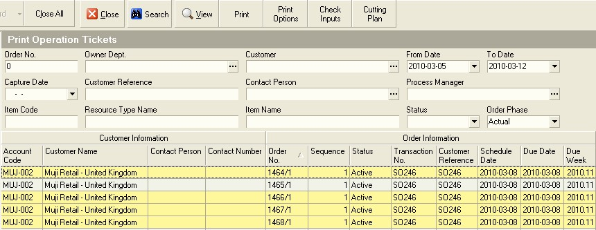

## Introduction
___  

### What does this procedure do?  

This procedure enables a Production Planner, a Manager or a Process
Order Planner to view the TOTAL QUANTITY required for each of the
Materials and Components required to complete one or more Process
Orders and evaluate this against current available stock and
outstanding supplier orders.  

The system uses the Input Quantity Per Output Unit for a Process Model
and multiplies this by the Quantity on Order to calculate the total
quantity required.  

### Why would you use this procedure?  

In order to achieve high levels of productivity and quality in any
process it is essential that all of the materials and components
required to successfully complete a Process Order are available in the
right quantity and quality at the time required. Too often in
organisation management and staff do not prepare the inputs required
in advance and as a result the organisation experiences high levels of
down-time. This lost time increases the pressure of management to make
quick decisions and to re-assign tasks to employees to :keep them
busy." Unfortunately, the result of all this last minute rushing often
contributes to poor quality, high levels of stress and low morale.  

This procedure provides an effective, easy and quick way to take
understand what materials are required in what quantities and at what
times. Through using this information the management and planning team
can effectively prepare the resources needed by the team to
successfully complete a process order for a specific Customer by the
required Due Date.  

### When would you use this procedure?  

It is necessary to perform this procedure whenever materials need to
be prepared for issue to a Process Order.  

### How long should it take to perform this procedure?  

When you are proficient this procedure should take you no longer than
30 seconds to generate the report from the system and then 5 to 10
minutes to check and prepare the materials required to complete the
process order, depending on how many items are required.  

---

## Step-by-step Guideline
  
1.  Select **Operation** on the Main Menu.  

2.  Click the **Print Operation Tickets** option on the drop-down menu.  
	
  

The system will open a screen titled **Print Operation Tickets**. This
screen lists all of the open Process Orders (i.e. Jobs) that have been
captured in the Sense-i system.  

You can search for specific Process Orders using the **Search Criteria**
at the top of the screen, or you can sort and filter the information
using the Auto-filter options available in the Column Labels.  
	
  

3.  Click on each row for which you wish to print Operation Tickets.  

You can hold down the control key on your keyboard while you do this
to select nonadjacent process orders or you can click on a specific
process order, hold down the shift key and then click a second process
order and the system will select both the first and second process
orders you have clicked on as well as every process order that appears
between these two.  

You will notice that as you click on a process order in the list the
system marks the row in yellow.  

4.  Once you have selected the process orders for which you wish to
    print Operation Tickets, click the **Print** button.  
	
  

5.  Click on the **Input Requirement Totals** option from the drop-down menu.    

The system will display the Input Requirement Total report for each of
the Process Orders you selected in step 3 above. This screen provides
the details list of all of the materials needed to complete a
Process Order.  
	
  

 The system will open the **Print options** dialog.  

6.  Then click the **OK** button on the Print dialog.  
	
  

The system will then print the Input Requirement Totals report.  

7.  Retrieve the report from the printer and hand these to the Storeman
    or Material Controllers who need to prepare the materials for issue
    to Production.  

**This is the end of the procedure**  
