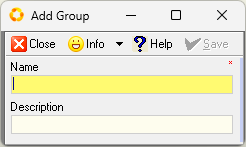
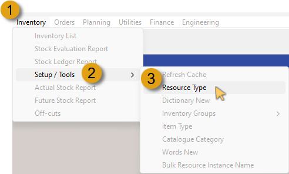
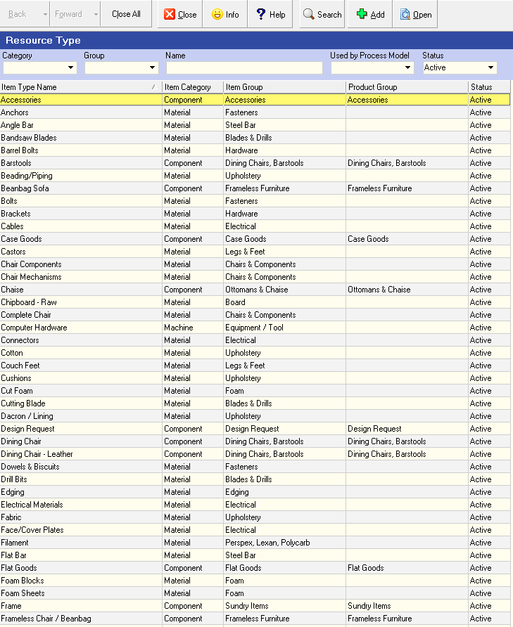
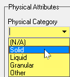
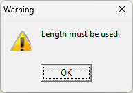
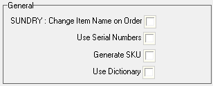

# Introduction    
___

Information about the Materials your company purchases from Suppliers is stored at three levels of detail in the system.  

These levels make it much easier for you to filter long lists of information to quickly find the exact material you need.  

  

At the highest level, Materials are arranged into **Groups**. Material Groups are then broken down into **Material Types** and finally Types consist of **Specific Instances**, also referred to as **Material Items**.  

  

The **Supplier Catalogue Grid** underneath the Search Criteria Panel consists of a set of columns that display specific information about each product, such as its **Code, Name, Unit of Measure, physical Dimensions, Cost Price, Supplier Name** and so on.  

:::important  
For detailed information on searching for existing **Specific Material Instances**, and adding **New Material Items** to the **Supplier Catalogue**, refer to the document titled **["Supplier Catalogue (Costing)"](https://sense-i.co/docs/PCP442)**.  
:::  

# Procedure Guideline  

In this procedure we will explain the process of defining, and adding **Material Groups**, and **Material Types** within the **Material Resource Category** using the Setup features in the Inventory function.  

## Add New Material Group  

The first step in the process would entail navigating to the Material Group grid list.

  

1.  Click the **Inventory** option on the Main Navigation menu.  

2.  Click **Setup / Tools** in the drop-down menu.  

3.  Click **Inventory Groups** in the slide-out menu.  

4.  Then click **Materials** in the side menu.  

:::tip  
If you hover your mouse cursor over any menu option that has a **right-arrow**, the next level slide- / side menu will automatically be displayed, negating the need to click on that option.  
:::  

The **Maintain Material Group** grid screen is displayed, listing all the **Material Groups** that have been defined in the system.  

  

5.  Click the **Add** button on the Action Bar.  

The **Add Group** screen is displayed.  

  

6.  Type the Name of the Group you would like to add in the **Name** field.  

7.  Type a short description in the **Description** field.  

8.  Then click the **Save** button on the form Action Bar.  

  

9.  Click the **Close** button to return to the **Maintain Material Group** screen.  

The new Material Group, with the details you entered above is displayed in the grid list.  

10. Click the **Activate** button to change the status of the Material Group from Provisional to Active.  

  

Repeat the steps above to add any further new Material Groups.  

11. Click the **Close** button to close the Maintain Material Group screen.  

## Material Types

Once the Material Groups have been defined, the next process involves adding **Material Types** associated with the appropriate Material Group.  

1.  Click the **Inventory** option on the Main Navigation Menu.  

2.  Click **Setup / Tools** in the drop-down menu.  

3.  Then click **Resource Type** in the slide-out menu.  

  

The **Resource Type** grid screen is displayed, listing all the **Item Types** that have been defined in the system.  

  

As we are working with Material Types, we should filter the grid list to display only those Item Types that fall under the **Material** section in the **Item Category**.

4.  Click the down-arrow button in the **Category** field.  

5.  Then click on the **Material** option in the drop-down menu list.

  

6.  Click the **Search** button on the Action Bar.  

The **Resource Type** grid list now displays all the **Item Types** that fall under the **Material** Category.  

  

7.  Click the down-arrow in the **Group** field.  

8.  Then (scroll down if needed), click on the Material Group option as defined previously.  

  

9.  Click the **Search** button on the Action Bar.  

The Resource Type grid list will be reloaded listing the Item Types previously defined for that Group.  

:::note  
If no Item Types have been defined, the grid will be displayed without any Item Types listed.  
:::  

## Add New Material Type

  

1. Click the **Add** button on the Action Bar.  

The **Add New Resource Type** screen is displayed.  

  

2. Type in the name of the Material Type you wish to add in the **Resource Type Name** field.  

3. Click on the down-arrow button in the **Resource Category** field, and select the **Material** option.  

:::important  
The **Resource Type Name** and the **Resource Category** fields are demarcated with a red asterisk, and MUST be completed/selected.  
:::  

4. Click on the three-dot button in the **Resource Group** field.  

The **Select Resource Group** screen is displayed.  

  

5. Click on the relevant row in the grid list, and then click the **Select** button on the form Action Bar.  

The system returns to the **Add New Resource Type** screen.  

  

6. Type a short description of the Material Type in the **Resource Type Description** field.  

### Material Type, Physical Attributes  

  

In this part of the process we will capture the Physical Attributes of the new Material Type being added.

1.  Click on the drop-down arrow in the **Physical Category** field, and then click on the appropriate option in the drop-down list.  

  

2.  If this Material Type will include different sized Material Items, click the **Enable Size Variations** check-box field.  

3.  Click the **Y - Length** check-box (under the **Use** column) to select and use the Length attribute.  

:::important  
The **Y - Length** attribute MUST be selected for any Material Type that is defined as a **Solid** within the Physical Category list.  

  

The system will display a Warning dialogue when attempting to Save the new Material Type without the **Y - Length** option checked.  
:::  

4.  Click the drop-down arrow in the **Preferred UOM** field if you wish to use a different _Unit of Measure_ to that of the Default UOM.  

5.  Type in the desired amount of decimal places in the relevant **Decimal Places** field.  

6.  If your company uses the SEMS Dictionary Module, click on the relevant **Display in name** check-box field if you require the Material Type and associated Materials to have the Length attribute included in the Material Type / Material Instance Name.  

7.  Click on the relevant **Variation Fixed Dimension** check-box field if you require the Length attribute to be a Fixed Dimension in any variations under this Product Type.  

8.  Repeat the steps above to define the **Width, Thickness** _(Height)_, **Diameter, Volume** and **Weight** attributes, as needed, for the Material Type being added.  

### General / SUNDRY  

  

1.  Click the **Change Item Name on Order** check-box to allow Procurement / Purchases Representatives to change the name of Materials when generating Purchase Orders.  

2.  Click the **Use Serial Numbers** check-box if your company uses sequential serial numbers on Material Items.  

3.  Click the **Generate SKU** _(Stock keeping unit)_ check-box to enable the manufacturing departments to generate unique alphanumeric codes that track material and price information.  

4.  Click the **Use Dictionary** check-box if your company subscribes to the SEMS Dictionary Module, and where Material Items & variants are uniquely defined using the descriptive features of this powerful module.  

### Save & Activate Material Type  

Once you are satisfied that all the Material Type **Profile** information has been entered correctly, the next step will be saving and activating the Material Type.  

1.  Click the **Save** button on the form Action Bar.  

:::note  
When the Material Type has been saved, the **Dictionary** TAB becomes available.  

For further information on Dictionaries, refer to the document titled **["SEMS Dictionary Module"](https://sense-i.co/docs/DICT001)**.  
:::  

2.  Click the **Activate** button.  

3.  Click the **Close** button.  

The system returns to the Resource Type screen with the newly added Material Type listed as a record row.  

Repeat the steps above to add other New Material Types.  

**This is the end of this procedure.**
