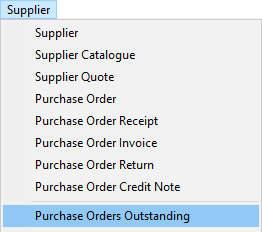
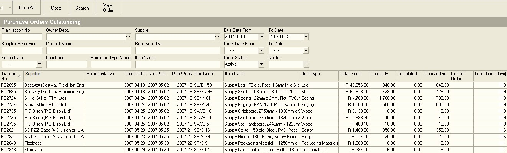
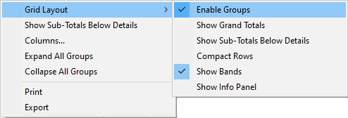
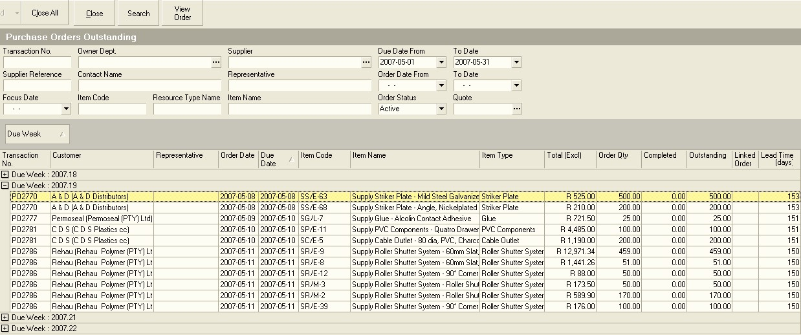
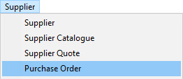
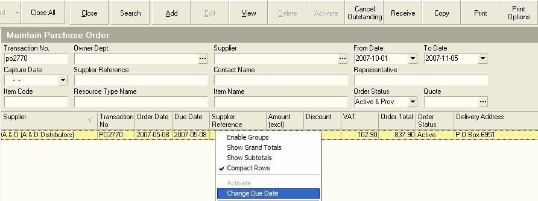
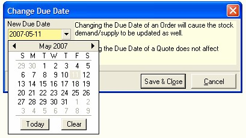

## Step-By-Step Guideline
___  

The key role of any person who has been appointed to handle
**Material Procurement** is to ensure that the correct materials are available in
the **correct quantity**, at the **correct quality** and the **correct cost** when
they are needed by the Production Team. If any of the first three
measures are not achieved then the Production Team will suffer
down-time, not be able to achieve their productivity targets and not
be able to complete orders on time. The losses suffered as a result of
a Purchase Order being delivered late from a supplier are large and
must be avoided at all times.  

One of the ways in which you can influence this outcome is to
**monitor outstanding Purchase Orders** and to **contact** each supplier to **remind**
them that they have one or more Purchase Orders they must deliver.

The Sense-i system automatically maintains a list of all items ordered
from Suppliers that have not yet been delivered. This list makes it
extremely easy for you to keep track of what items suppliers need to
deliver.  

1.  Select the **Supplier** option on the main menu.  

2.  Then click the **Purchase Orders Outstanding** option on the drop-down
    menu list.  
	
  

The system will display a screen titled **Purchase Orders Outstanding**.  

This screen lists all the materials and other items that have been
ordered from Suppliers that have not yet been received at the time of
opening the screen. This screen provides the most simple, direct and
fastest way of keeping track on what items have been ordered.  
	
  

The default search criteria are the From Date and To Date and the
system will display all Purchase Orders THAT ARE DUE TO BE DELIVERED
within the From and To Date range. You can change these dates and
enter any other information into the search fields to change the list
of transactions that are displayed on the screen.  

Any items in this list that has a Due Date earlier than today's date
is late. The system displays the lead time, that is the time taken
between when the order was placed and the current date in the Lead
Time column. If the Lead Time is negative, then the order is not yet
late. If on the other hand the lead time is positive, then the order
is late.  

In the system this could be late for one of two reasons. The first
might be that the supplier has actually delivered the item on time but
that the stores did not capture this supplier delivery in the system.
You should treat this as a serious problem because it means that the
stores personnel are not doing capturing transactions as they occur,
and this has a negative impact on you because you will be wasting your
time and the company's money by trying to find out what the status of
an order is manually, and it has a negative impact on Accounting
(because important information about money the company owes the
supplier is not captured, and so cash-flows will be inaccurate) and on
Production, because the stock information will not be correct. You
must make sure you resolve this issue. See guideline for "Not
Capturing Supplier Deliveries" for suggestions on how to handle this
problem.  

The second reason is that the supplier has not delivered the ordered
items when they are due and is late on fulfilling Purchase Orders.

3.  To make it easier to use the list, you can group the information in
    the list in various ways.  
    Right click with the mouse
    pointer floating over the grid and select **Grid Layout** and then click on **Enable Groups**.
	
  

4.  Then drag the **Due Week** column heading up into the grey bar and click
    the on the **Due Date** column to sort all items in the list from
    earliest to latest Due Date within each week.  

5.  It is also useful to drag the **Supplier Name** into the grey bar
    underneath the **Due Week** block to arrange the information about all
    Outstanding Purchase Orders first by Due Week and then by Supplier
    Name.  

6.  To view the details of the information in each group, simply click
    the **"+" sign** next to the group you wish to expand.  
    The system will
    then show all the rows underneath the group you have chosen to
    expand. Depending on how many groups or levels you have arranged in
    your report, you may need to click the **"+"** for several levels before
    you see the details of the actual order items that are still
    outstanding.  

Arranging the information in this way should enable you to easily keep
track of and follow-up on all the items that Suppliers must deliver in
each of the weeks. Ideally, you should be following up with Suppliers
for each item **a week in advance**.  
	
  

7.  Once you have established that the items on your list are in fact
    still outstanding, you need to contact the supplier for the first
    order listed on the screen and find out what the status of the order
    is.  

8.  You can also limit the list of information that is displayed by
    entering specific criteria in the **Search Criteria** panel.  
    If you want
    to find all Purchase Orders linked to a specific Job or
    **Process Order Number** and this number was entered into the Purchase Order
    Reference field, then type this number in this field and click the
    **Search** button on the form bar.  

9.  You can export all the information in the grid into a spreadsheet,
    simply right click the mouse on the grid and select the **"Export"**
    option.  

10. When you have completed reviewing the Outstanding Purchase Orders,
    click the **Close** button on the form bar.  

## How to change a Purchase Order Due Date    

When following up with Suppliers on Outstanding Purchase Orders, you
might find that you need to move a Purchase Order to a later date if
you have established that it will not be delivered on time.  

1.  Note the **Purchase Order Number** you need to move.  

2.  Then select **Supplier** on the main Navigation Menu and click on the **Purchase Order** option in the drop-down menu list.  
	
  

The system will open a screen titled **Maintain Purchase Order**.  

3.  Enter the number of the Purchase Order in the **Transaction No** field
    and  

4.  Click the **Search** button on the Form Bar.  

5.  **Right click** on the Purchase Order in the list and select the
    **Change Due Date** option.  
	
  

The system will pop up a small floating window called the **"Change Due Date"** window.
	
  

6.  Change the date to be the new date that the supplier has promised
    you.

7.  Click the **Save** and then the **Close** button on the window.

The system will change the due date on the Purchase Order.

**Repeat steps 1 to 7 above once for each Purchase Order in the list.**

If the supplier asks you to send them details of the Purchase Order go
to the Standard Operating Procedure titled "Print Purchase Orders."

## How to Follow-up Outstanding Items with Suppliers

There are several steps to effectively following up on outstanding
orders from Suppliers and the key is that the more detailed you are
the more likely Suppliers will deliver the items you have ordered on
time. This procedure lists these steps below and provides sample
questions you can ask the Supplier to gather the necessary
information. 

### A.  Provide Order Information.  

*Hello Irene, it is Paul from Allianz Furniture here.*

*How are you?*

*Irene, I am just following up on our Purchase Order Number 912. It
was due for delivery on the 3rd of February?*

### B.  Check if order has been despatched...

*Do you know if you have despatched this order?*

-   If yes =

*Can you tell me when it was despatched?*

*And can you tell me by whom?*

### C.  Get the way bill number if a third party shipping company...  

*Can you give me the waybill number?*

-   If yes = record the waybill number and go to **step D**.

-   If no...

*How soon can you give the waybill number to me*?

-   Record a time reminder and go to **step N** below.

### D. Check when order will be despatched...

*Can you tell me when you are planning to despatch the order?*

-   If **yes** = go to **step E** below...

-   If **no** = go to **step H** below...

### E. Check when order will be despatched...

*Will it still arrive on or before the Due Date?*

-   If **yes** = go to **step F** below...

-   If **no** = go to **step I** below...

### F. Check if the order is complete...

*Can you tell me if the order is complete?*

-   If **yes** = go to **step F** below...

-   If **no** = go to **step J** below...

### G. Take Action on the fact that they cannot tell you when the order will be despatched...  

*Irene, can you tell me if the order has
been completed by the factory?*

*Irene, can you tell me if you have the stock available to ship to
us?*

-   If **yes** = go to **step I** below...

-   If **no** = go to **step K** below...

*How soon can you give me an answer about when the stock will be
ready*?

-   Record a time reminder, mark the order with a note to tell your
    manager and go to **step I** below.

### H. Find out what is causing shipment to be delayed...

*Irene, if you have the stock available, but you cannot tell me when
you plan to ship it, can you at least tell me what is causing the
delay in shipping the order?*

-   If **no** = you have a serious problem! Go to **step M** below and
    **immediately refer this to your manager**.

-   If **yes** = go to **step L** below...

### I. Communicate your company's dissatisfaction with late delivery of the order...  

*When will it arrive?*

-   Record the expected delayed arrival time, amend the Purchase Order Due Date, set a time reminder, mark the order with a note to tell your manager.  
    
*Ok, I have made a note to follow-up with you on (Date of the reminder). I hope that you have been able  to sort the problem out by then because this is going to cause us
    down-time in the factory and probably cause us to deliver some of
    our customer's order late. It is a real problem. I hope you guys are
    going to compensate us for the losses we will incur with some
    additional discount.*

-   and go to **step N** below.

### J. Take action on the fact that they cannot tell you if the order is complete...  

Either they don't know or there is something they are trying to hide from you.  

*Irene, why can't you tell me if the order is complete or not? Is
there a problem you don't want to tell me about?*  

Obviously they are going to say "no" because no-one will admit to
wanting to hide information from you.  

-   If no =

*How soon can you give me an answer about whether the order is
complete*?

Record a time reminder, mark the order with a note to tell your
manager and go to **step N** below.

### K. Take action on the fact that they cannot tell you if they have the stock to ship the order...  

Either they don't know or there is something they are trying to hide
from you.  

*Irene, why can't you tell me if you have the stock to ship our order?
Is there a problem you don't want to tell me about?*  

Obviously they are going to say "no" because no-one will admit to
wanting to hide information from you.  

-   If no =

*How soon can you give me an answer about whether you have the stock
or not? Remember this order is or is going to be late*?  

-   Record a time reminder, mark the order with a note to tell your
    manager and go to **step N** below.

### L. Establish what is causing the delay...  

*What is causing the delay?*

*When do you expect to resolve this?*

-   Record the reason for the delay, set a time reminder, mark the order
    with a note to tell your manager and go to **step N** below.  

*Ok, I have made a note to follow-up with you on (Date of the
reminder). I hope that you have been able to sort the problem out by
then because this is going to cause us downtime in the factory and
probably cause us to deliver some of our customer's order late. It is
a real problem. I hope you guys are going to compensate us for the
losses we will incur with some additional discount.*  

### M.  Communicate the action your company will take on the situation...  

*Irene, if you guys are not able to fulfil our order on time, and you
cannot tell me what the problem is, AND you cannot even tell me when
you can resolve this situation, then obviously this raises serious
alarm bells on our side. It makes us immediately concerned about the
impact that this and any other orders we have placed with you will be
affected. This is going to cause us down-time in the factory and
probably cause us to deliver some of our customer's order late. It is
a real problem for us. I have to refer this to my Financial Manager
and my Production Director?*

Go to **step N** below

### N.  Say Goodbye...

*Say goodbye politely and professionally.*

**This is the end of this procedure.**
