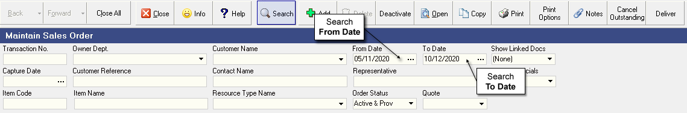
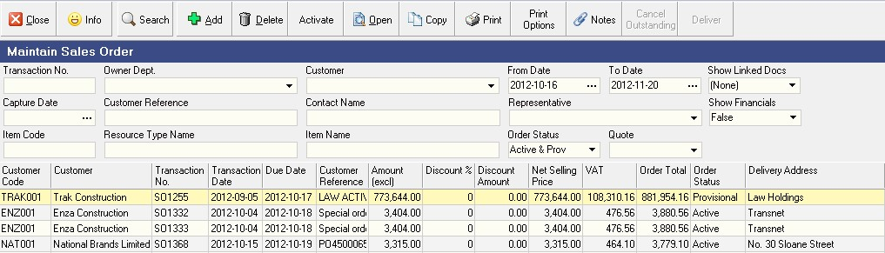
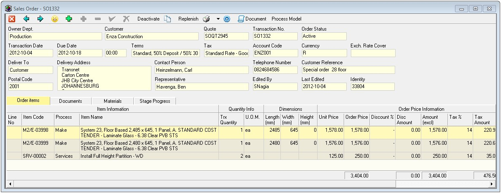
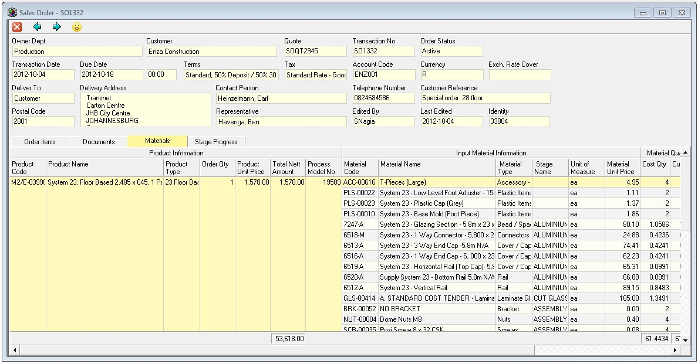
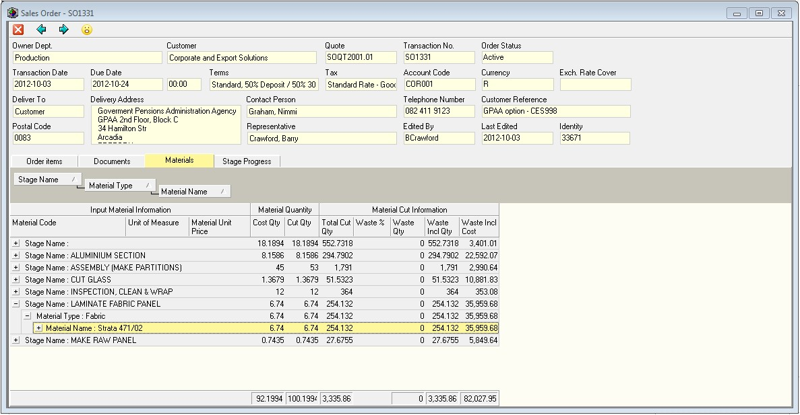

## Search

This screen lists all the Sales Orders that have already been captured in the system within the ***From Date*** and 
***To Date*** specified in the Search Criteria Panel.  

:::note  
You can change the information displayed in this list by changing the dates and other information in the Search Criteria Panel.  
:::  

3.  Click on the **Search** button on the Form Bar and the system will find
    all the Sales Orders that match the criteria you have entered in the
    various fields on the Search panel.  

  

4.  Click on the Sales Order in the list for which you wish to plan the
    Materials.  
    
    The row containing the selected Sales Order will go yellow.

5.  Then click the **Open** button on the form bar.

The system will open the **Sales Order form** and display all the details
of the order you have selected.  

## Review Materials Required  

6.  To view the Materials required for the order click the **Materials** tab.  

  

7.  Click on the name of the **department** you wish to use, (usually this
    is production).

The screen will display a list of all of the materials required for each item on the Sales Order.  

This list is generated from the **inputs** that have been defined for each product in the **Process Model**.  

  

8.  The most effective way to plan the Materials for an order is to
    arrange the list of materials as follows...  

9.  First, **right-click** the mouse in the list and select **Grid Layout**, then select **Enable Groups**.  

10. Click on the **Stage Name** column heading and drag this up into the
    grey bar for grouping information.  

11. Then click the **Material Type** column heading and drag this up into
    the grey grouping bar.  

12. Then click the **Material Name** column heading and drag this up into
    the grey grouping bar.  

The system will display all the material information for all the
products on that order that have process models defined in the
following layout.

  

13. To plan and order the materials required for the selected order
    begin by looking at the materials linked to the first stage in your
    production process.  
    
    Check the **Waste Included Qty.** and make sure that
    you have enough of the required material in stock and on order with
    your suppliers to be able to complete this Sales Order without
    interruption.  

14. If you need to, you can check the **Stock Evaluation Report** and
    **Outstanding Purchase Orders Report** to see that you will have enough
    material to complete the order.  

15. Then use the standard procedure for generating **Purchase Orders** to
    order the necessary materials.  

16. Repeat these steps until you are certain that you have ordered all
    of the materials required to complete this order.  

:::note  
When generating Purchase Orders it is a good idea to enter the
**Sales Order Number** as the **reference** on the Purchase Order.  

This will enable you to quickly and easily see what materials are
still due from suppliers by searching on the
**Purchase Order Reference number** in the Purchase Orders Outstanding Report.  
:::

**This is the end of this procedure.**
