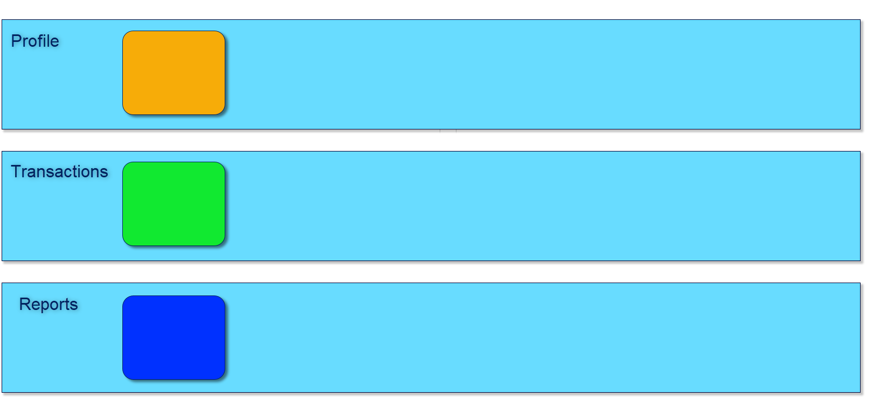

## Introduction & Overview  
___  

The Product Costing Process contains all the functions you need to define Process Models.  Process Models are a combination of all the definitions required to manufacture a product and provide a service and optionally can include the following information:  
- Process Model Inputs (also known as Bills-of-Material)  
- Process Model Tasks (also known as Task Routings or Work Breakdown Structures)  
- Part Lists  
- Costings  

There are additional functions such as being able to define:  
- Template Process Models (which allow you to easily create variations of products while using a single main Process Model),  
- Blueprints (which allow you to flag parts that are tracked in the Production Process and use these definitions to easily create variations),  
- Advanced Product Costing Formulae (which allow you to set different Mark-ups for different materials and calculate the cost and selling price of products using sophisticated formulae).  

The functions in the Product Costing module can be best described in the following flowchart.  

  

You can access the step-by-step guides and video demonstrations for each function from the list below.  

### Terms: Process & Module  

We use the term "**Process**" to describe the work that must be done in a specific area of your business and the term "**Module**" to refer to the set of functions in the Sense-i software that allows you to perform that work.  

### Background Information  

To better understand the flowchart please read the **Business PowerPoint, Levels of Work,** and **Understanding Function Types** documents. These documents provide essential background information to understanding how the work and information in your business and the Sense-i system is structured.  

:::note

There are several variations of this process, and within each, also several different ways a function or step in the process can be performed. Each industry has a unique set of rules and procedures that implement the best way to achieve a result. While the process flowchart above might look simple, the unique requirements for the industry and for each company are implemented in each of the functions in the Sense-i system.

:::
___
## Functions in the module  

The Product Costing module contains the following functions;

### Profile Functions

The profile functions enable you to store information about the company's people, departments, products, materials, machines, and so on, that are used in transactions.  

This information changes more frequently than setup information as new customers, products and employee's are added to the database.  

The profile functions are:  

- Company Departments (OSN-001)  

- **[Employees _(as Department Manager)_ (SAF-1204)](https://sense-i.co/docs/1204)**  

- Employee Email Information (EMP-002)  

- **[Product / Services Profiles (SAF-441)](https://sense-i.co/docs/441)**  

___
### Transactions

The transactions enable you to capture details about the products and services you sell to your customers.

The transactions in this module are:

- Process Model Inputs  
- Process Model Tasks  
- Part Lists  
- Costings  
- Template Process Models  
- Blueprints  
- Advanced Product Costing Formulae  

___
### Report Functions

The report functions in the system fall into two groups. Management
reports help with the daily workflow and focus on what transactions are
outstanding at any point in the **Order Admin and Management Process**,
while **Executive Reports** enable you to review the
financial performance in the business.  

___
### Management Reports

- Process Models to Cost Report   

___
### Executive Reports

- Process Models to Cost Report  

___
:::note Detailed Step-by-Step Procedures

Detailed Step-by-Step procedures and video guides exist for each of the
functions in this module that will explain every action you need to take
to successfully capture and work with the information in the system.

Simply click on any of the functions above to access the detailed
Step-by-Step instruction.

:::

___
## Setup Functions

To use the functions in the module, key information needs to be entered
into the system.  The setup functions allow you to enter this information
which changes very rarely. The setup functions are:

- Product Groups  
- Product Types  
- Product Catalogue  
- Material Groups  
- Material Types  
- Supplier Material Catalogue  
- Task Codes  
- Cost Sets for Costing Formulae  
- Costing Formulae  
- Labour Rates  

___
## Related Modules  

The Product Costing module works with the following modules:

- Product Catalogues  
- Replenishment  
- Material Planning & Purchasing  
- Material Issuing Control  
- Labour Cost Control  
- Task Management  
- Job Costing  

**This is the end of the module overview.**
