## Introduction
___  

The Sense-i Enterprise Management System (**SEMS**) is a **Client-Server system**:  
-   The **Phoenix** front-end **Program** _(Client)_ is installed on each user's **Personal Computer**, and  
-   The **information/data** is stored on, and accessed from a central computer _(Server)_, known as the **Database Server.**

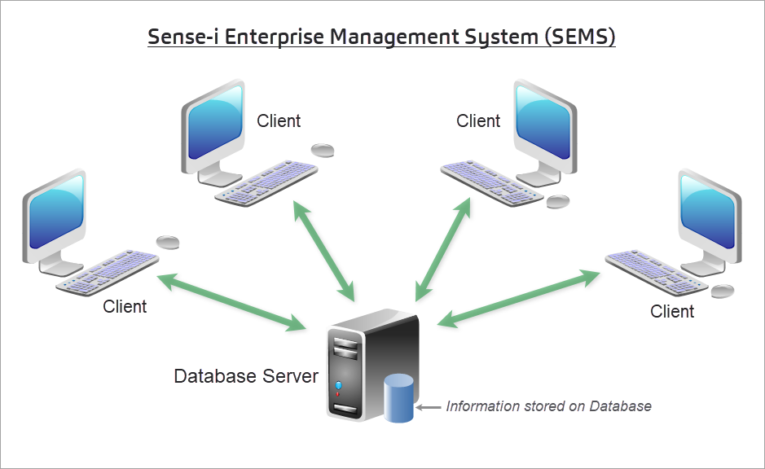   

Phoenix is an upgrade to the Sense-i Enterprise Management System **(SEMS)** front-end.  

   

The Phoenix front-end program allows you to view, update and add new information which is stored on the Database Server.  

Currently in _Beta_ form, Phoenix is being developed using the latest software technology.  

Some of the upgrade features of Phoenix include:
- A Modern and easy-to-use UI _(User Interface)_  
- Enhanced Navigation  
- Create and Save Custom Views  
- Custom "Skins" that change the graphical appearance of your interface  
- More information can be accessed and viewed simultaneously    
- Open screens on different monitors  
- Dock multiple screens next to each other to view related information
- Switch easily between screens and windows using a familiar interface  
- Bulk select and edit multiple records at the same time using Jobs  
- Import Data from external sources  

## Enhanced Navigation  

The Phoenix front-end system has 4 types of navigation:  

1.  **Menu Navigation**

2.  **Selection Panels**  

3.  **TAB Navigation**  

4.  **Search Panel** and **Action Bar**  

### Menu Navigation  

Menu Navigation icludes the following:  
- Main Navigation Menu  
- Drop-down Menus  
- Side Menus, and Slide-out Menus.  

The **Main Navigation Menu** is the list of functions that runs horizontally along the top of the screen.  

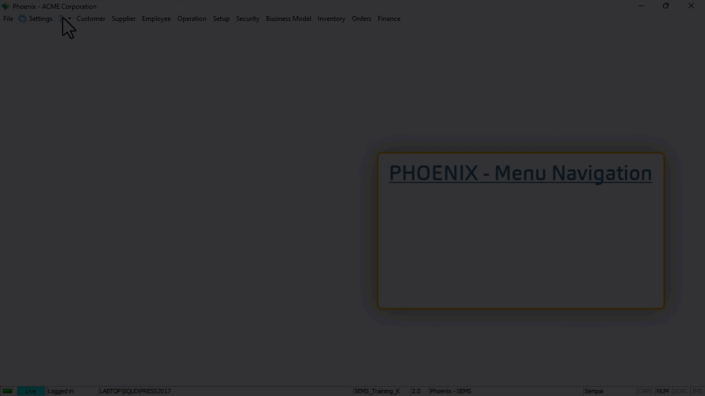   

The **Drop-down menu(s)** or Secondary Navigation Menus are accessed by clicking on any of the Main Navigation Menu options.  

The **Side Menus** and **Slide-out Menus** (third-tier navigation options) are available as further navigation from relevant drop-down menu options.  

When you click on a function, either in the Main Menu or on the Drop-down / Side Menu, the system will always first display a **List Screen**.  

The **List Screen** shows you what information has already been captured in the system.  

The List Screen lists all the information in the system for the function you have chosen.  

So, if you have clicked on the **Customer List** button, the system will open a form called Customer List and display all Customer records.  

### Selection Panels

#### Alphabetic Selection Panel  

The **Alphabetic Selection Panel** is available on all **Party List screens**.  

Use the **Alphabetic Selection Panel** _(Customer List, Supplier List, Employee List, etc.)_ to display only those parties whose names begin with the selected letter.  

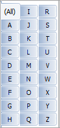   

Click on the **All** button in the Alphabetic Selection Panel to display **all parties** in the list.  

#### Tree-structure Navigation  

The Tree-structure Navigation and Selection Panel is available on all screens that list **Resource Items**.  

These include the following screens:
- **Item List** _(accessed by clicking **Inventory**, and then **Item List** using Menu Navigation)_
- **Product Catalogue** _(Products sold to Customers)_  
- **Supplier Catalogue** _(Materials procured from Suppliers)_  

Information about Resource Items is stored at four levels of detail in the Sense-i System.

At the top level, Resources are assigned to "**Categories**" such as Products, Materials, Machines, Facilities and so on.

Each Category is broken down into "**Groups**".

Each Group is further broken down into "**Types**".

Each Type consists of actual "**Item Profiles**" or **instances of specific Items**.

The Categories, Groups and Types are simply ways of arranging and storing information in the Sense-i database to make it easier to search for specific items from the entire list of everything that the company buys and sells.

The Tree-structure Navigation **Selection Panel** enables you to efficiently filter long lists of information to quickly find specific Resource Items.  

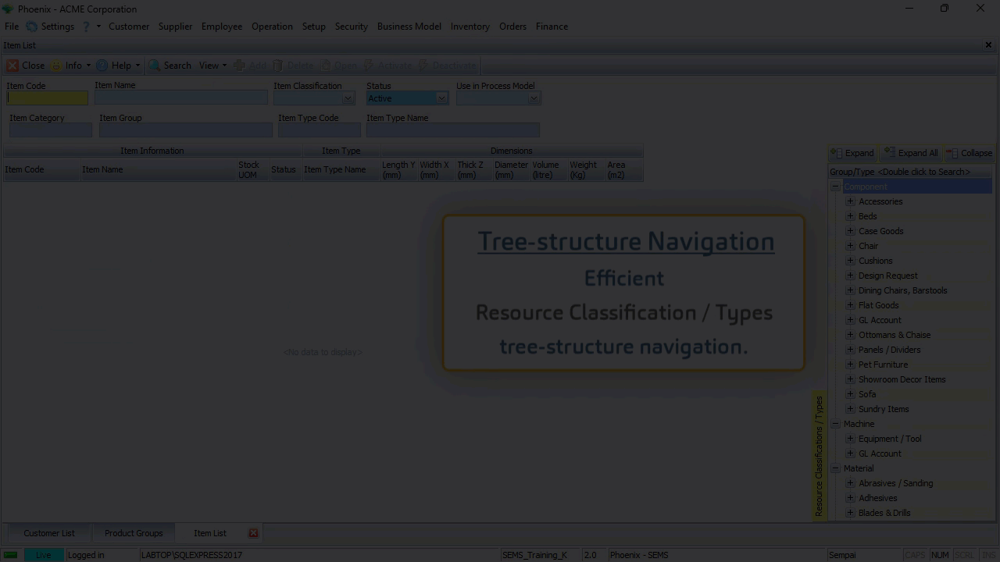   

The **TABs** at the top of the **Selection Panel** allow you to:  
- **Expand** the Categories and view the Groups within each Resource Category,  
- **Expand All** Groups to view the different Types listed under each Resource Group, or  
- **Collapse** the tree-structure to display only the Categories, enabling you to navigate to a specific Group and Resource Type.

### TAB Navigation  

As you click on a menu item, the system opens the **Form** associated with the function in the Main Form section of the screen.  

In the example below, the **Customer List** form, the **Customer Account Group** and the **Product Groups** forms were opened.  

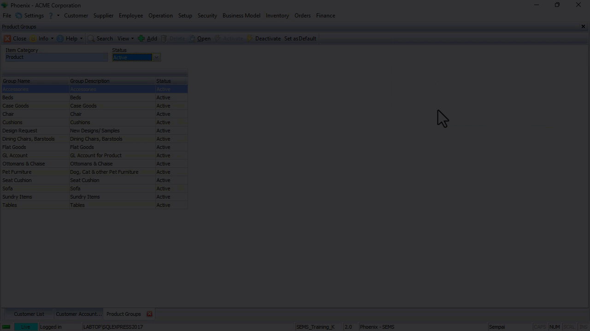   

By clicking on the different TABs located at the bottom of the screen, you are able to quickly navigate to each of the forms.  

Click the [X] button in any of the TABs to close that form.  

### Action Bar, Search Panel & List Grid  

Each **List Screen** consists of three different sections:  
1.  At the top of the screen, the system displays a series of buttons in the **Action Bar**.
2.  The **Search Panel** is located near the top section of each **List Screen**.  
3.  The **List Grid**, comprised of **columns** & **rows**, makes up the bulk of the screen/form.  

#### Action Bar  

The system displays a series of buttons in the **Action Bar** that are related to the form that you are using.  

   

This makes it easy to use the system because you have access to only those features that are relevant to the form you are using at the time.  

#### Search Panel  

The **Search Panel** displays several boxes called **Fields** where you can type in, or choose specific information _(e.g. type in a **Customer Name**, or select a **Representative** from the list of your Company's Representatives)_.  

:::important  
The **Fields** contain information and options that relate to the specific form or function you are using.  
:::  

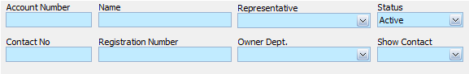   

Once you have entered words or options in the fields on the **Search Panel**, the **Search icon** becomes prominent.  

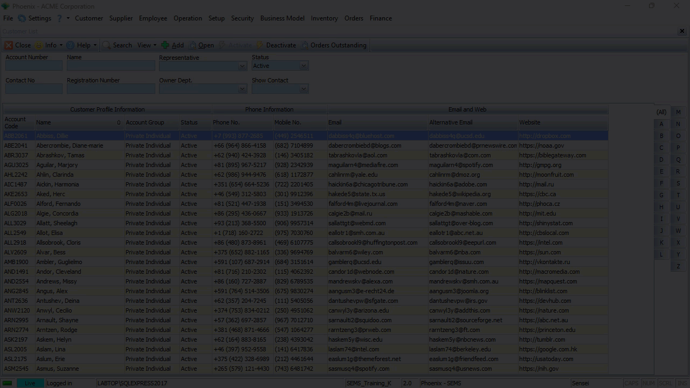   

Whe you click the **Search icon**, the SEMS program uses the words and/or options you have entered into the fields on the **Search Panel** to find all matching **Records** or **Transactions** that are stored on the Database Server, and then displays this information in the **Grid** on the **List Screen**.  

In the example above, the system updates the list of Customer Profiles on the screen to show only those Customers that match the name, or part of the name entered.  

#### The List Grid Section  

The List Screen allows you to view and update information in the system.  

The List Grid contains **Information Bands** that span over several **columns**.  

In this example, the **Customer Profile Information** band, spans over the Customer **Account Code**, Customer **Name**, **Account Group**, and **Status** columns.  

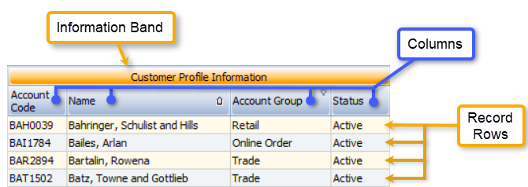   

Under the columns, the **Record Rows** displays all information related to each specific entity, in this case, each specific customer in the grid.

## Create and Save Custom Views  

As described above, List Grids are displayed with Information Bands, Columns & Record Rows.  

The **Custom Views** feature enables the Phoenix user to change the layout configuration of the list grid to suit his/her preference.  

This includes:  
- Hiding information bands and/or individual columns  
- Adjusting column width  
- Changing the column order  
- Grouping Information  

Once the Phoenix user is satisfied with the new layout & configuration of the grid, this can then be saved and accessed on subsequent logins.  

:::tip  
Different views can be saved, depending on various tasks that need to be performed.  
:::  

On the initial access of a List Grid, the Original default view is displayed.  

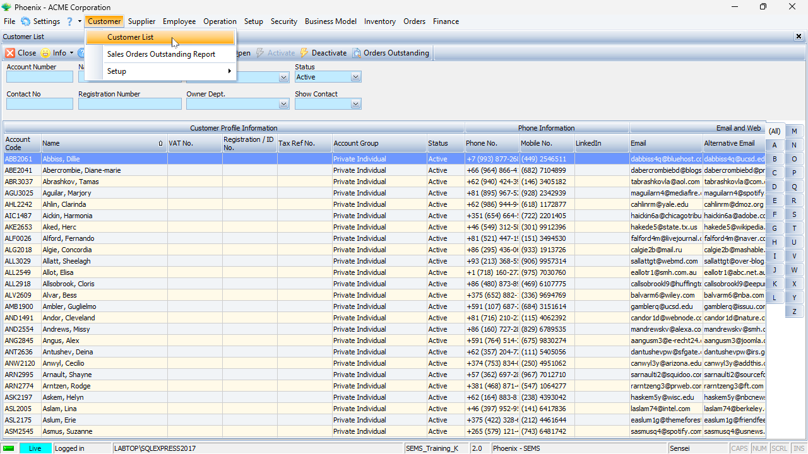   

The procedure below describes the typical step-by-step guideline to configure the List Grid for a customised display...  

### Hiding Non-relevant Information  

At times, some of the information on the screen is not relevant to the task that needs to be performed.

There are a number of ways to hide information that is not relevant to what needs to be displayed.  

1.  To hide a specific column, **right-click** on the **Column Heading** and choose **"Hide"**.  

   

If you don't need to see any of the information related to the entire band;  

2.  **Right-click** on the **Information Band** itself and choose **"Hide"**.

The system will then hide the band and all the columns related to that entity.  

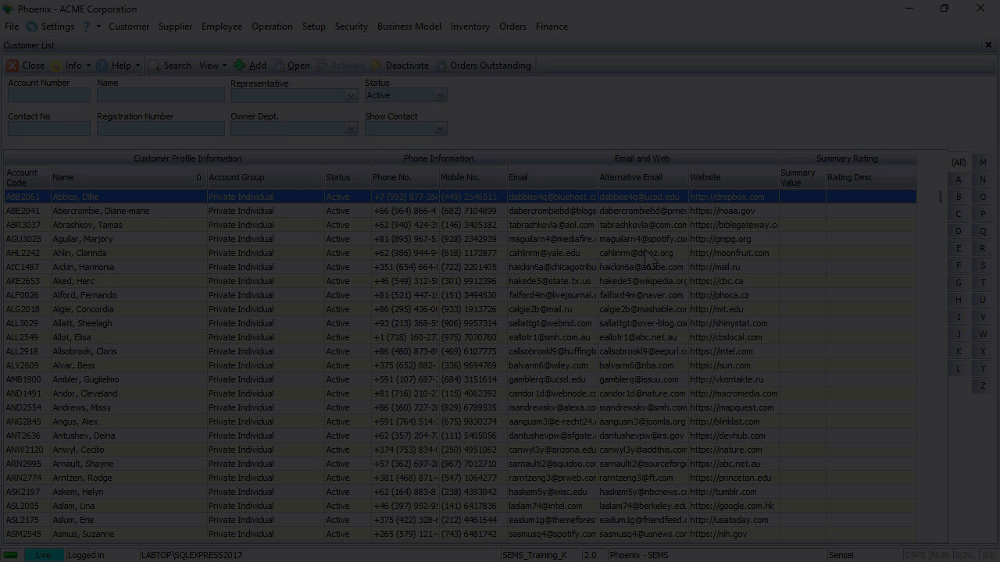   

In the example above, the **Email and Web**, and the **Summary Rating** Information Bands, and all columns underneath these bands were **hidden**.  

3.  Another way to do this, click **View** on the form Action Bar, then click on **Columns**.  

   

The program will display a screen that allows you to hide or (if they are already hidden) display specific bands & columns.  

   

:::tip  
An alternative way to access the Columns screen - **right-click anywhere in the Grid** and then choose **Columns** in the pop-up menu.  

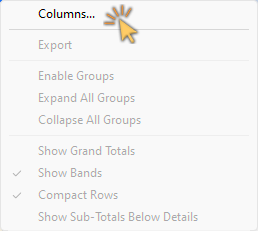   

:::  

### Adjusting Column Width

Individual Information Bands and Columns can be expanded or condensed to suit your display preferrence.  

To do this, simply hold down the mouse button on the edge of a column and then drag to extend / decrease the column width to the desired size.   

   

The "Size to Fit" feature is extremely useful if you would like to see all the information in all the fields under an Information Band and/or specific columns.  

To do this, **right-click** on any **Column heading**, and then choose the **"Size to Fit"** option.  

The system will automatically adjust the width of the column so that all information in all the fields under that column is displayed.  

   

The same principle applies to all columns under an Information Band - right-click on an Information Band, then choose **"Size to Fit"**.  All Columns under that Information Band will be automatically adjusted to the optimal width.  

### Changing the Column Order  

To change the order of the columns in a list grid, 
1.  Click and hold the mouse button on a column heading, then  
2.  Drag the column heading to the desired location.  
_The system will indicate the new position of the column heading with green arrows._  
3.  Release the mouse button when the column heading is in the correct slot.  

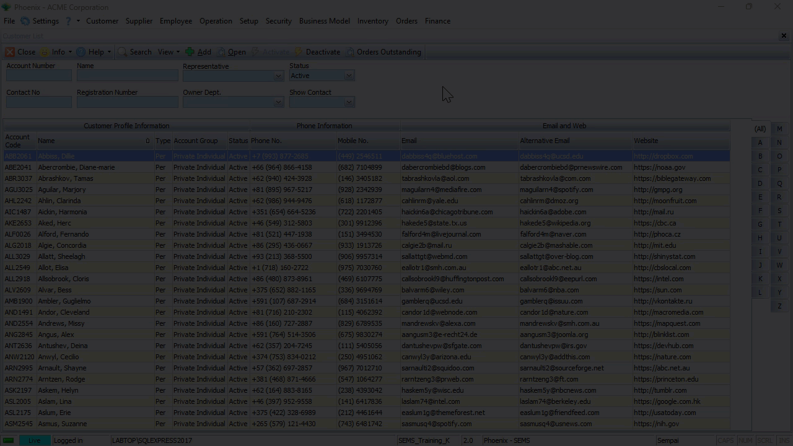   

### Changing the Information Band Order  

The same procedure as described above can be followed to change the order of Information Bands.  

1.  Click and hold the mouse button on an Information Band, then  
2.  Drag the Information Band to the desired location.  
_The system will indicate the new position of the Information Band with green arrows._  
3.  Release the mouse button when the Information Band is in the correct slot.  

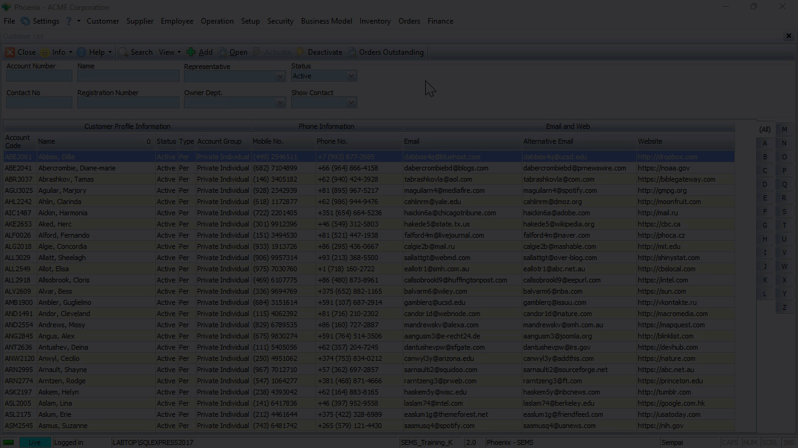   

:::important  
Once the Information Band has been positioned in the new slot, all the columns underneath the Information Band will also be displayed in the correct locations.  
:::  

### Grouping Information  

The Grouping function allows you to effectively sort the information in the grid so that you can concentrate and focus on dealing with what is most important.

The system allows you to quickly and easily find and group information using the **Enable Group** function.

To group information in the grid;
1.  **Right-click** anywhere in the grid content area to display a small pop-up menu.

2.  Click the **Enable Groups** option.

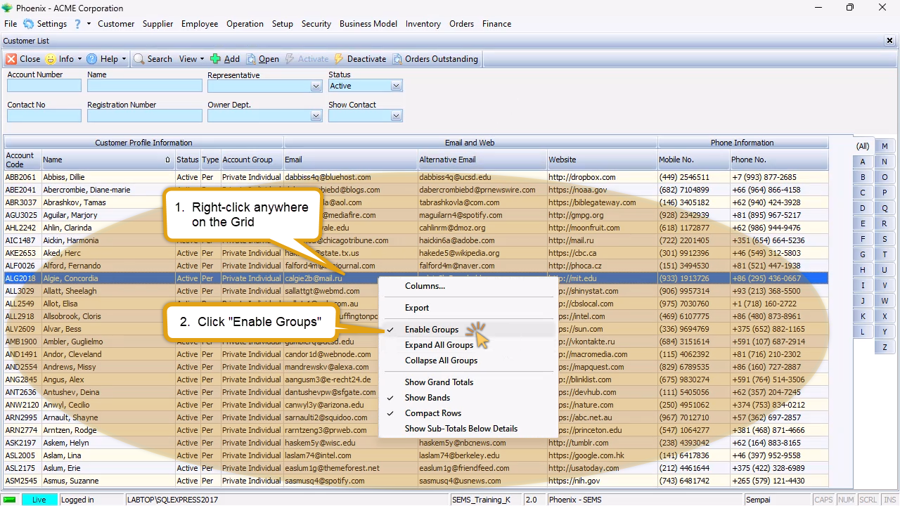   

The program will display a bar above the grid into which you can drag any column heading to arrange the information on your screen.  

In this example we will demonstrate how to group the Customer List, firstly by _Customer_ **Type**, then by **Account Group**.

To arrange the List Grid in this way, simply drag the **Type** column up into the Group Bar and then drag the **Account Group** column underneath it.

   

Click on the **"-" sign(s)** next to the **Account Group** and _Customer_ **Type** to collapse the detail lists.  

To expand the details you simply need to click the **"+" sign** next to a _Customer_ **Type**, and then click on the + sign next to an **Account Group**.  

You can then focus in on one set at a time.  

### Save Custom Views  
Once the grid layout has been configured to your preferrence, it can be saved for subsequent access to that List Grid.  

1.  Click the **View** button on the Action Bar, then  

2.  Click the **Columns** option.  

The system will display the **Columns...** screen.  

   

:::important  
If this is the first Custom View that is being been created, the **View Name** field will be displayed as **\<original\>**, and  
the **Published** checkbox will be ticked.  
:::  

3.  Click the **Add View** button on the form Action Bar.  

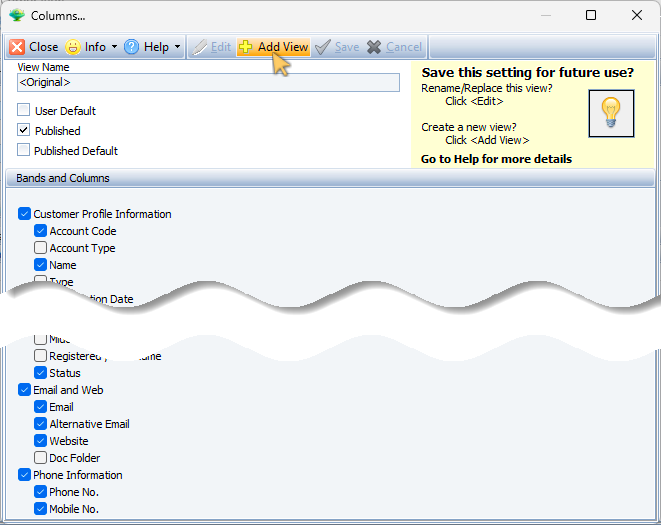   

4.  Type in a short descriptive name for the newly created layout configuration in the **View Name** field.  

5.  Click on one or more of the following check-boxes;  
- [x] User Default  
- [ ] Published  
- [ ] Published Default  

:::important  
[x] **User Default** - when choosing this option, the system will always display this layout configuration for the current login user in future access to the list grid.  

[x] **Published** - when checking this option, this layout configuration will be available for other Phoenix login users.  

[x] **Published Default** - when this option is checked, the system will automatically display this layout configuration for other Phoenix login users.  
:::  

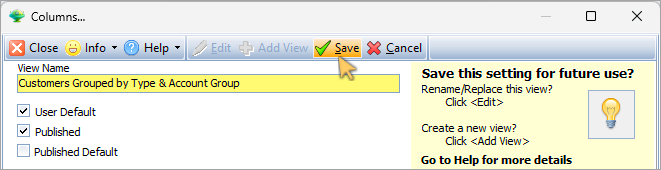   

6.  Click the **Save** button on the form Action Bar, then  

7.  Click the **Close** button.  

<!-- 
## "Skins"   -->

## Using The System  

These are the three main actions that you can do on the system:
1.  You can **ADD** new information.  
2.  You can change or **EDIT** existing information.  
3.  And you can **DELETE** existing information.  

### Add Information  

1.  Click on the **Add** button on the **Customer List Action Bar**.  

The system opens a **blank form** into which you can enter new information.  

This form contains different detail screens, accessed by clicking on the **TABs**.  

Each screen contains various **Fields** into which you can enter information.  

There are two ways to enter information:  
1.  You can **type information into a field** that allows this, or  
2.  **Choose** information from a **drop-down list** of options.   

Completing a form is simply a matter of working through each field on the different screens under the TABs, entering information using the two entry methods described above.  

### Edit existing information  

To edit or amend an existing record:
1.  Click on a record row, then  
2.  Click the **Open** button on the Action bar.  

The system opens the same form as above, but with information previously entered that you can **edit** or **update.**  

:::tip  
To edit/update information of an existing record, click the **Deactivate** option on the form Action bar.  

Once you have amended the relevant information, click the **Activate** button.  
:::  

###  Delete existing records  

To delete a specific record,  
1.  Click on the record row you wish to delete, then  
2.  Click the **Delete** button on the Action bar.  

The system will display a confirmation dialogue box asking you if you are sure you wish to delete the existing record from the database.  

3.  Click the **Yes** button.  

<!-- ## Screen Layout 

### Arrange Screens to View Supplementary Info  

### Dual/Multiple Monitors 

###  Docking - the Basics  

## Jobs - Bulk Select and Edit Multiple Records  

## Data Export & Import    -->
